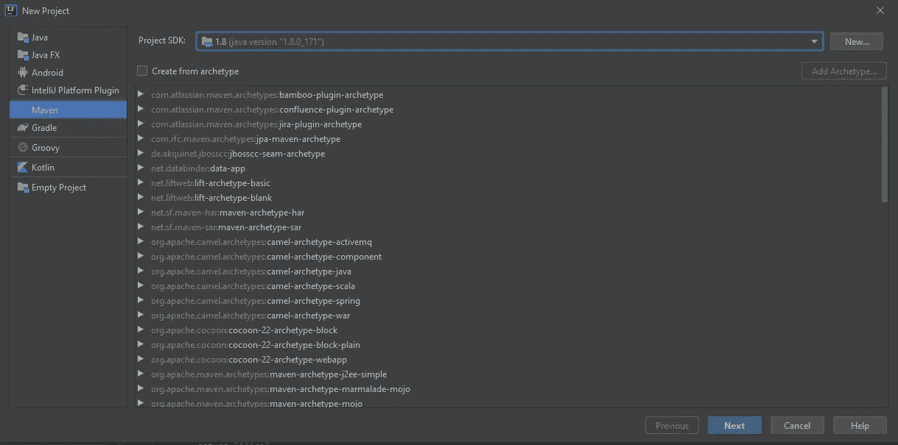
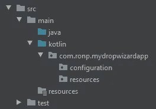
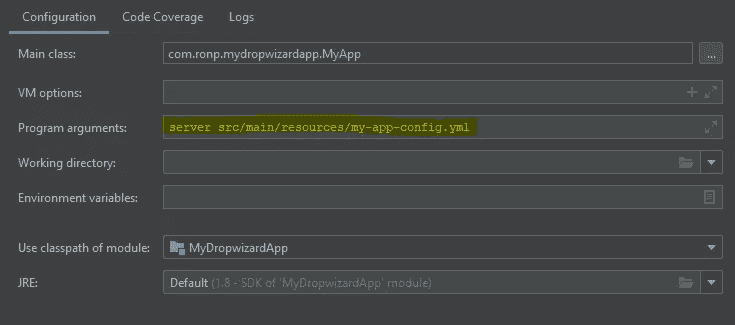
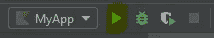
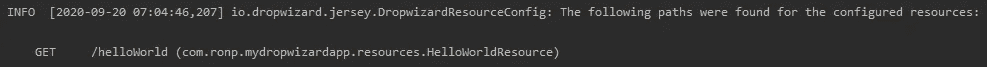
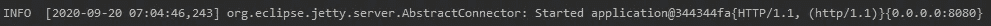
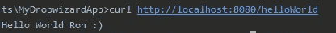

# 使用 Dropwizard、Maven 和 Kotlin 从头开始创建应用程序

> 原文：<https://levelup.gitconnected.com/create-an-app-with-dropwizard-maven-and-kotlin-24a6277b946c>


由[马克·赖歇尔](https://unsplash.com/@mreichelt?utm_source=unsplash&utm_medium=referral&utm_content=creditCopyText)在 [Unsplash](https://unsplash.com/s/photos/kotlin?utm_source=unsplash&utm_medium=referral&utm_content=creditCopyText) 上拍摄的照片

在这篇文章中，我将向你展示如何创建一个简单的 Dropwizard 应用程序。
代码是用 [Kotlin](https://kotlinlang.org/) 编写的，但是你也可以用 Java 做同样的事情。

在本教程结束时，您的应用程序将公开一个 RESTful API。

我先简单解释一下 Dropwizard 和 Maven。

## 下拉向导

Dropwizard 是一个用于构建 RESTful web 服务的轻量级 Java 框架。
Dropwizard 将 Jersey、Jackson 和 JDBI 等稳定的库收集到一个轻量级的包中。

## 专家

Maven 是一个用于 Java 的构建自动化和管理工具。
使用 Maven，很容易定义软件的构建和依赖关系。POM 是一个描述 Maven 项目及其依赖项的 XML 文件。

意第绪语中的 Maven 是“有悟性的人，专家”。这就是该工具名称的由来。

# 创建新项目

在本教程中，我将使用 IntelliJ Community Edition IDE。

点击文件–>新建–>项目–> Maven
,您将看到以下屏幕:



新 Maven 项目

点击“下一步”。现在您已经准备好定义 POM 文件了。

# 定义 POM 文件

正如我在开始时所描述的，我们必须在 POM.xml 文件中定义项目的依赖关系。让我们一起来做吧。

## 性能

在 properties 标签中，定义您想要使用的 Dropwizard 和 Kotlin 的版本。
你也可以通过属性定义 Kotlin 编译器配置。
在这种情况下，我定义了 languageVersion(您希望确保源代码与 Kotlin 的指定版本兼容)和 jvmTarget(生成的 JVM 字节码的目标版本)。

## 属国

为了编译、构建、运行和测试，您的项目需要依赖项。在 dependencies 标签中，我们将定义 drowizard-core 和 kotlin-stdlib-jdk8。

广义地说，dropwizard-core 模块包括:

*   Jetty — HTTP 服务器。
*   Jersey — RESTful web 框架。
*   用于 JVM 的 JSON 库。
*   度量——应用度量库。

## 汇编

首先，我们将在`<sourceDirectory>`和`<testSourceDirectory>`中指定源目录，以便编译源代码。
这个部分负责 Kotlin 插件的配置，以便编译我们的源代码。

# 项目结构和配置文件

这是我的项目结构，您可以创建相同的结构。



项目结构

我们可以在 YAML 配置文件中定义参数，该文件被反序列化为我们的配置类的实例。
让我们创建它们两个。在 src/main/resources 中创建 my-app-config.yml，并向该文件添加一个参数，如下所示:

```
configTest: Ron
```

现在，我们定义我们的配置类，它扩展了 Dropwizard 配置类。
在配置包中创建 MyAppConfig.kt。代码如下:

我们使用 JsonProperty 允许 Jackson 将属性(在我们的例子中是 configTest)从 YAML 文件反序列化到应用程序的配置实例中。

# 创建应用程序类

要运行 Dropwizard RESTful 服务器的实例，我们必须实现我们的应用程序类。
在 mydropwizardapp 中创建一个新的 MyApp 类，并实现如下:

# 创建和注册资源类

现在我们可以添加第一个端点了！
为此，我们需要创建一个新泽西 REST 资源。
在 mydropwizardapp/resources 中创建一个新类— HelloWorldResource.kt

正如您所看到的，一个资源与一个 URI 模板相关联，在我们的例子中是“/helloWorld”。@Path 注释告诉 Jersey 这个资源在 URI“/hello world”是可用的。

现在，我们已经准备好完成 MyApp 代码并将我们的资源注册到应用程序中。
在 run 方法中，编写以下代码来注册 HelloWorldResource。

请注意，我们正在使用配置 YAML 并将属性传递给资源(myAppConfig.configTest)。

# 运行应用程序

我们准备好运行我们的应用程序了！
为此，您应该编辑 MyApp 运行配置中的“程序参数”,如下所示:



配置

它告诉 Dropwizard 应用程序作为服务器运行，并指定配置文件的位置。

现在你可以点击运行:



您应该会在“运行”选项卡上看到以下信息消息:



这意味着我们的资源被正确地注册为/helloWorld 路径上的 GET 请求。



这意味着我们的应用程序运行在端口 8080 上。

为了调用和测试我们的资源，您可以编写:
`curl HTTP://localhost:8080/helloWorld`
，您应该会看到下面的预期输出:



另一个选择是打开浏览器，在地址栏中键入[http://localhost:8080/hello world](http://localhost:8080/helloWorld)。

如您所见，我们获得了所需的输出，包括 config 属性。**恭喜你！**