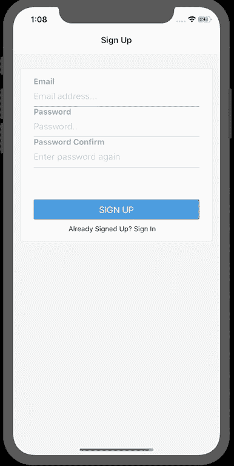
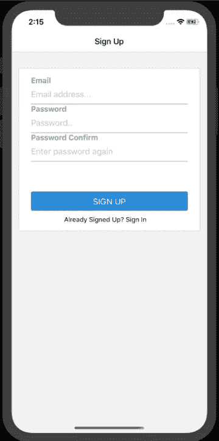
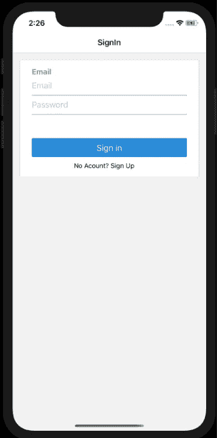
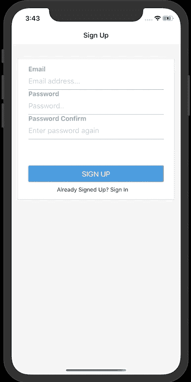

# 使用 React-Navigation 5.x 创建授权流

> 原文：<https://levelup.gitconnected.com/create-an-authorization-flow-with-react-navigation-5-x-10b84677806b>

# 概观

React 导航是帮助构建流畅的 react-native 屏幕的常用库之一。它易于设置，完全可定制。React-navigation 允许你构建不同类型的导航器，比如顶部和底部标签，以及侧边抽屉。React Navigation 5.0 为该库带来了许多新功能，如动态屏幕和对最新 React 功能(如钩子)的支持。

在本指南中，我们将介绍如何为您的 react-native 应用程序构建授权流程。

# 假设

我不会进行基本的 react-native 设置，我假设你有一个 hello-world 应用程序正在运行，并希望使用 react-navigation。

注意:我已经退出了 expo，但这不会影响到你。

# 设置

让我们首先将 react-navigation 5.0 核心依赖项安装到您的 react-native 应用程序中

接下来我们需要安装`indicative`和`react-native-elements`

确保您的 package.json 具有以下依赖项:

# 屏幕

`signUp` & `signIn`屏幕将使用`indicative`进行输入验证，使用`react-native-elements`构建屏幕。

屏幕利用`useContext`从`app.js` `createContext`获取状态，这将在我们的应用程序中传递数据，以决定用户应该在哪个屏幕上。

在被授权访问主屏幕之前，屏幕需要验证用户的电子邮件格式和密码长度。这是指示性的工作，这里是助手函数的一个片段。

# 注册屏幕

注册屏幕显示几个输入框和一个按钮，一旦用户点击注册按钮，它将调用助手函数`handleSignUp()`来验证用户的输入。如果用户打算访问登录屏幕，我们调用`singIn`上下文。

我们设置`useEffect`在出现错误时更新屏幕。

## 这里是完整的`signUpScreen.js`

# 登录屏幕

signInScreen 非常相似，不同之处在于如果用户还没有帐户，他们会看到注册的点击消息。我们使用上下文来调用`singUp`，向`app.js`中的 reducer 发送一个空的有效负载

## 这里是完整的`signInScreen.js`，

现在我们的屏幕已经完成，我们可以构建我们的主应用程序来在屏幕之间导航。

# App.js

`App.js`将利用一些 react 钩子特性。

`createContext`:在组件之间共享数据，无需我们传递数据。

`useEffect`:从存储器中取出令牌，如果找不到令牌，则显示注册屏幕。

用于记忆我们的上下文函数，以避免在每次渲染时调用它们。UseMemo 只会在其中一个输入改变时重新计算。

`useReducer`:处理我们复杂的状态逻辑，设置决定显示哪个屏幕的标志。

# 使用导航器

现在我们可以调用 react-navigator 来构建我们的屏幕

在 app.js 中导入导航器并初始化它们

# 主堆栈

主页将构建一个具有侧抽屉组件的堆栈。

我们的主屏幕导航堆栈将如下所示:

这是我们的侧抽屉导航器:

您需要构建屏幕组件(主屏幕、屏幕 1、屏幕 2、闪屏)并将它们导入到您的 app.js 中

这是一个屏幕的基本示例:

为了在`App.js`中呈现我们的导航器，我们需要在`NavigationContainer`中包装我们的屏幕，但是为了处理我们的数据共享，我们需要在`AuthContext`提供者中包装一切。

创建这两个助手函数是为了帮助我们指定在授权流中呈现哪个屏幕。

`stateConditionString()`:返回一个值，告诉我们的开关盒返回哪个堆栈屏幕。如果你看看我们的 useReducer，当从我们的一个页面调用 useContext 时，它将分派动作并更新状态。状态标志是我们决定导航到哪个页面的方式。

`chooseScreen()`:当我们这样定义屏幕时，React Navigation 只会看到有效的屏幕。这使得用户未登录时无法导航到主屏幕。

至此，我们已经具备了构建身份验证流所需的一切。我想指出我们没有使用真正的代币。在生产应用程序中，我们需要将数据发送到服务器并获得一个令牌。如果登录失败，您还需要处理错误。

# 包裹🎉

使用 react navigation 5.0 构建身份验证流可以直接利用 react hooks 的强大功能。我们可以根据条件定义不同的屏幕，并使用 react 导航的堆栈历史管理器来帮助我们防止未经授权的页面访问。

我也鼓励你签出指示，它有一些强大的功能来帮助验证和净化你的数据。

我希望本指南已经帮助您理解了如何使用 react 和 react-navigation 的最新特性在 react-native 中创建授权屏幕。我很乐意在下面的评论中听到你的经历。

如果你需要帮助，尽管开口。[不和](https://bit.ly/EN_server)

[GitHub 库](https://github.com/ICeZer0/NativeAuthApp)

[推特](https://twitter.com/EmbeddedNature) | [Instagram](https://www.instagram.com/embeddednature/)

*原载于 2020 年 4 月 11 日*[*https://embeddednature.com*](https://embeddednature.com/how-to/create-an-authorization-flow-with-react-navigation-5-x/)*。*