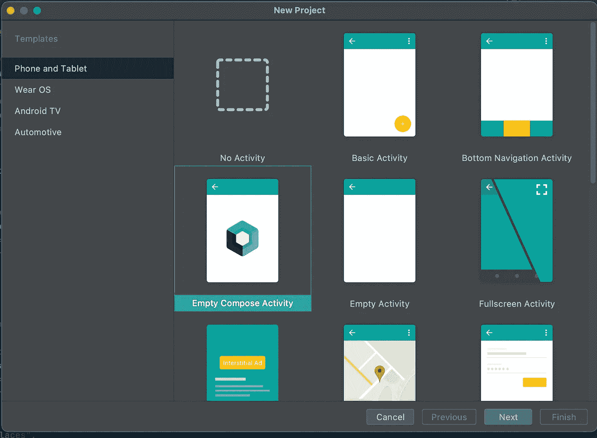
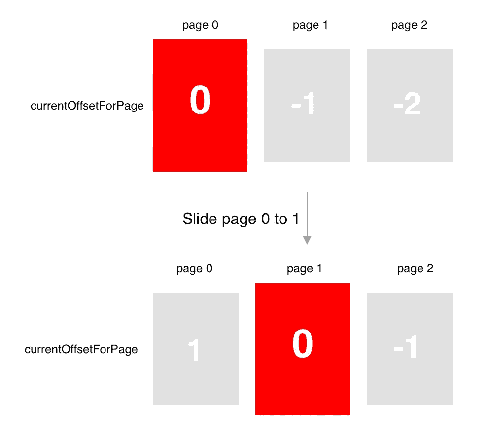

# 在 Android Jetpack Compose 中创建一个具有变形和 ken burns 效果的自动滚动 ViewPager

> 原文：<https://levelup.gitconnected.com/create-an-auto-scroll-viewpager-with-transformation-and-ken-burns-effect-in-android-jetpack-compose-efdf46f2e8ed>

## 如何在 Jetpack Compose 中实现一个带有 ken burns 效果的自动滚动的 ViewPager。


# 介绍

在这篇文章中，我们将学习自动滚动查看页面的实现，带有 Jetpack Compose 中的 ken burns 效果。本·伯恩斯效应为你的静态照片增加了平滑的*平移*和*缩放*。KenburnsView 是一个很棒的 Android 库，它为 ImageView 提供了本·伯恩斯效果。

假设您已经掌握了在 Jetpack Compose 中创建 ViewPager 的知识。如果没有，请看看下面的文章:

 [## 中等

### 编辑描述

medium.com](https://medium.com/@mr-umbrella/implement-tablayout-with-viewpager-in-jetpack-compose-d509fc6e2d8e) 

我们开始吧！🥰

# 编码部分

我将编码部分分为 7 个步骤，如下所示。

*   [项目设置。](#8949)
*   [创建虚拟数据。](#2160)
*   [创建一个页面状态。](#77dd)
*   [创建自动滚动查看页面。](#cc00)
*   [在一列中布局项目。](#df48)
*   [滑动卡片时创建缩放动画。](#e3c0)
*   [在卡片中创建内容。](#66cc)

# 步骤 1:项目设置

为了获得使用 Jetpack Compose 开发的最佳体验，您应该下载 Android Studio 北极狐的[最新版本，并选择**空合成活动。**](https://developer.android.com/studio/preview)



要在 compose 中使用 ken burns 效果和 ViewPager，您应该将依赖项添加到`app/build.gradle`文件中

```
implementation("com.flaviofaria:kenburnsview:1.0.7")implementation("com.google.accompanist:accompanist-pager:0.12.0")
```

要从互联网加载图像，您应该添加**线圈**依赖:

```
implementation("io.coil-kt:coil:1.2.2")
```

# 步骤 2:创建虚拟数据

让我们创建一些虚拟数据来填充到 ViewPager 中。

# 步骤 3:创建一个页面状态

现在添加以下代码。添加了一个`PagerState`来设置页数和离屏限制。对于离屏限制，将其设置为 2 以允许预加载图像。

# 步骤 4:创建自动滚动视图页

ViewPager 中的第一页一显示，页面就会自动滚动。为此，创建一个具有无限 while 循环的协程作用域，在滑动到下一页之前延迟 2s。

*   `LaunchedEffect(Unit)`:这是效果处理程序**之一。**更多了解请参考此[链接](https://jorgecastillo.dev/jetpack-compose-effect-handlers) **。**该调用创建一个用于创建作业的协同作用域。它用于加载可组合组件的初始状态。当键改变时，协程将被取消并重新启动效果。我们不希望在任何情况下重新启动协程，所以我们给它一个硬代码键，在本例中是`Unit`。
*   `yield()`:检查完成情况，如果任务完成，退出协程，这应该是 while 循环中调用的第一个函数。关于为什么使用`yield()` 的更多解释，请参考这篇[文章](https://medium.com/androiddevelopers/cancellation-in-coroutines-aa6b90163629)。
*   `pagerState.animateScrollToPage()` **:** 带动画滑动到下一页。
*   `animateSpec`:通过创建持续时间为 600 的补间动画来减缓幻灯片动画。

# 步骤 5:在列中布局项目

使用`[Column](https://developer.android.com/reference/kotlin/androidx/compose/foundation/layout/package-summary#Column(androidx.compose.ui.Modifier,androidx.compose.foundation.layout.Arrangement.Vertical,androidx.compose.ui.Alignment.Horizontal,kotlin.Function1)(androidx.compose.ui.Modifier,androidx.compose.foundation.layout.Arrangement.Vertical,androidx.compose.ui.Alignment.Horizontal,kotlin.Function1))`将项目垂直放置在屏幕上。它喜欢将`android:orientation`属性设置为`vertical`的`LinearLayout`。

默认情况下，项目的大小为换行。我们希望 ViewPager 扩展以填充父视图中任何剩余的空间，使用`*fillMaxSize()*` *。*

现在编译并运行 Android 应用程序。


# 步骤 6:滑动卡片时创建一个比例动画

第一件事是为页面创建一个简单的 CardView，在每个页面之间添加一些空格。

最重要的是翻页时的效果。我们将通过`graphicsLayer` 修改器在`GraphicsLayoutScope`内部处理它。

什么是 GraphicsLayoutScope？

> 可用于定义应用于内容的效果的范围，如缩放( [scaleX](https://developer.android.com/reference/kotlin/androidx/compose/ui/graphics/GraphicsLayerScope#scaleX()) 、 [scaleY](https://developer.android.com/reference/kotlin/androidx/compose/ui/graphics/GraphicsLayerScope#scaleY()) )、旋转( [rotationX](https://developer.android.com/reference/kotlin/androidx/compose/ui/graphics/GraphicsLayerScope#rotationX()) 、 [rotationY](https://developer.android.com/reference/kotlin/androidx/compose/ui/graphics/GraphicsLayerScope#rotationY()) 、 [rotationZ](https://developer.android.com/reference/kotlin/androidx/compose/ui/graphics/GraphicsLayerScope#rotationZ()) )、不透明( [alpha](https://developer.android.com/reference/kotlin/androidx/compose/ui/graphics/GraphicsLayerScope#alpha()) )、阴影( [shadowElevation](https://developer.android.com/reference/kotlin/androidx/compose/ui/graphics/GraphicsLayerScope#shadowElevation()) 、 [shape](https://developer.android.com/reference/kotlin/androidx/compose/ui/graphics/GraphicsLayerScope#shape()) )和剪辑( [clip](https://developer.android.com/reference/kotlin/androidx/compose/ui/graphics/GraphicsLayerScope#clip()) 、

让我们从在这个范围内添加一些缩放效果开始。

让我们来看看`calculateCurrentOffsetForPage()`的方法签名:

按照上面的计算，假设我们有 3 页(因为离屏是 2 页)，`currentPage` = 0，当从第 0 页滑动到第 1 页时，`currentPageOffset`从 0 变为 1，下面的图片会更清楚的描述 **currentOffsetForPage** (方法`calculateCurrentOffsetForPage()`的返回值)和**缩放**的变化:



为了计算缩放比例，我们需要 **currentOffsetForPage 的 absoluteValue。**

```
val pageOffset = *calculateCurrentOffsetForPage*(pageIndex).*absoluteValue*
```

我们注意到 **currentOffsetForPage** 增加了，但是缩放比例减小了，而第 0 页和第 1 页、第 2 页的 visa 仍然是隐藏的，所以我们应该保持它缩小。为什么我们会有这样的分数:

```
fraction = 1f - pageOffset.*coerceIn*(0f, 1f)
```

当从第 0 页滑动到第 1 页时，`coerceIn`将确保第 2 页的分数始终为 0。

让我们看看`lerp`的方法签名

这就是将 A 和 B 之间的`fraction` 转换为`start`和`stop` **之间的便捷函数。**

总的来说，我们需要从 0.85 到 1:

*   第 0 页:分数从 1 变为 0，因此比例从 1 变为 0.85。
*   第 1 页:分数从 0 变为 1，因此比例从 0.85 变为 1。
*   第 2 页:分数为 0，因此比例为 0.85。

在这里，我们最艰难的工作已经完成。让我们跳到最后一步。

# 步骤 7:在卡片中创建内容

首先，创建一个`RatingBar`。目前，RatingBar 没有任何官方的可组合功能，所以我们必须在 compose 中扩展传统的 android 视图。

为了实现这一点，我们可以使用`AndroidView`可组合函数，提供膨胀视图。

其次，创建一个`KenBurnsView`。像`RatingBar`一样，我们必须膨胀遗留视图。代码看起来会像这样:

其他观点是不言自明的。最后，这是创建卡片内容的完整代码:

如果您在执行代码片段时发现问题，请查看 GitHub repo [选项卡-Compose](https://github.com/PhongHuynh93/Tab-Compose) 获取帮助。

[](https://github.com/PhongHuynh93/Tab-Compose) [## phonghuynh 93/Tab-撰写

### 通过 jetpack compose 实现带有寻呼机的选项卡。创建一个帐户，为 PhongHuynh93/Tab-Compose 开发做贡献…

github.com](https://github.com/PhongHuynh93/Tab-Compose) 

在这篇文章中，我们已经从 Jetpack Compose 中快速了解了 ViewPager 组件的转换。非常感谢你阅读我的文章。*如果你喜欢这个故事，请* ***点击*** 👏 ***按钮，分享*** *它来帮助别人！*关注我[中](https://mr-umbrella.medium.com/)获取更多牛逼安卓小技巧。你也可以在 [LinkedIn](https://www.linkedin.com/in/huynh-phong-3649a7131/) 上找到我。祝您愉快！😄

# 参考

[在 Jetpack Compose 中实现 tab layout](/implement-android-tablayout-in-jetpack-compose-e61c113add79)

[在 Jetpack Compose 中用 ViewPager 实现 TabLayout】](/implement-tablayout-with-viewpager-in-android-jetpack-compose-d509fc6e2d8e)

# 继续读 Android 的东西

[如何在 Android 中创建类似按钮的动画](/how-to-create-like-button-animation-in-android-part-1-f99e2792143d)

[在 Android 中使用 MaterialContainerTransform 共享元素](/shared-element-using-materialcontainertransform-in-android-6d420e74b122)

[安卓按钮变形动画](/android-button-morphing-animation-bc3bed740501)

[运动布局——折叠工具栏](/motionlayout-collapsing-toolbar-d0ce8dd874b6)

# Jetpack 撰写

[在 Jetpack Compose 中实现 snack bar](/implement-android-snackbar-in-jetpack-compose-d83df5ff5b47)