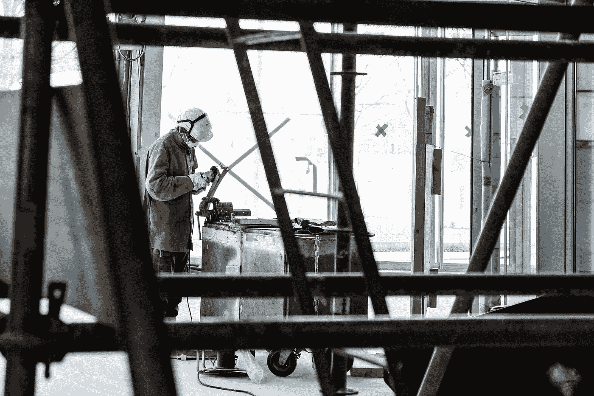

# 用 HTML，CSS 和 JavaScript 创建一个图像滑块

> 原文：<https://levelup.gitconnected.com/create-an-image-slider-with-html-css-and-javascript-3bf2c3e84060>

照片由[阿德里安·德维尔特](https://unsplash.com/@adrian_deweerdt?utm_source=medium&utm_medium=referral)在 [Unsplash](https://unsplash.com?utm_source=medium&utm_medium=referral) 拍摄

我目前正在学习 OdinProject 课程中的 web 开发。有一个任务是*创建一个简单的图像轮播。它应该在每一边都包含箭头来向前或向后移动图像。它应该每 5 秒钟自动向前移动一次。它应该在底部包含小的导航圆圈，指示您在哪个幻灯片上(它们应该可以点击前进到特定的幻灯片)。*

# 利润

首先，让我们创建一个名为 index.html 的 html 文件。

在 html 文件中，我们有一个容器作为每张幻灯片的框架，每张幻灯片包含一个图像。

# 式样

让我们添加样式。我假设你有 CSS 的基本知识，你想建立一个图像滑块。我会尽量让造型简单明了。

幻灯片显示属性被设置为`none` ，这使得它们现在不可见。幻灯片容器和标题也居中。我们将在 JavaScript 中添加功能，使幻灯片可见。

现在，让我们来设计下一个和上一个按钮以及导航点的样式。此外，添加一个活动类来为当前显示的幻灯片设置点的样式。

我们现在显示的只有标题、下一个和上一个按钮以及四个点。

# 功能

是时候添加功能了。创建一个名为 index.js 的文件。

我们创建了一个名为`**currentSlide**` 的变量来存储当前幻灯片的索引，以确定当前幻灯片。

我们还创建了一个名为`**slides**`的变量来将每张幻灯片存储到一个数组中，这样我们就可以对它们进行迭代，我们还创建了另一个名为`**dots**`的变量来将所有的点存储到一个数组中。

然后我们创建了一个名为`**init**`的函数，它接受一个参数`**n**`。该参数将被`**currentSlide**`传递给它。在函数内部，我们遍历了`**slides**`，并将每个`**slide’**`的显示属性设置为 none。在遍历幻灯片的同时，我们还遍历了`**dots**`，并从每个 do 中删除了活动的类。当完成将每个幻灯片的显示属性设置为 none 并从每个点中移除活动类时，我们然后根据`**currentSlide**`设置当前索引的显示，使用`**currentSlide**`变量阻止并添加活动类到当前索引的点。

最后，我们向窗口添加一个事件，以便在 HTML 内容加载完成时运行`**init**()`函数。

# 下一个和上一个功能

我们将它添加到 index.js 文件中。

我们创建了一个名为`**next**`的函数来将当前幻灯片切换到下一张幻灯片。这里，我使用了[三元运算符](https://developer.mozilla.org/en-US/docs/Web/JavaScript/Reference/Operators/Conditional_Operator)来代替 if-else 语句。在函数内部，我们检查了`**currentSlide**`是否大于或等于数组`**slides**` (4 -1 = 3)的最后一个索引。如果为真，我们将`**currentSlide**`重置为 0，否则我们递增`**currentSlide**`变量，并使用`**currentSlide**`值运行`**init()**`函数。

对于`**prev()**`函数，我们检查`**currentSlide**`变量是否小于或等于零。如果为真，我们将`currentSlide`设置为`**slides**`的最后一个索引(4 -1 = 3)，否则我们递减`**currentSlide**`。

最后，我们在下一个和上一个按钮上添加点击事件。当你点击下一个按钮时，它运行`**next()**`功能，当你点击上一个按钮时，它运行`**prev()**`功能。

# 幻灯片放映功能

为了自动更换幻灯片，我们设置了一个计时器，每 5 秒钟运行一次`**next()**`功能。将此添加到`**index.js**`

# 导航用圆点

我们还想让这些点可以点击，以进入下一张幻灯片。把这个加到`**index.js**`

这里，我们遍历`**dots**`变量，对于每个点，我们添加一个点击事件并运行`**init()**`函数，将被点击的点的索引作为参数传递，并将`**currentSlide**`设置为该索引。

是的，就这些。我们现在有一个工作图像滑块。

图像滑块

这是我的第一篇文章。请留言回复，让我知道你的想法。

感谢您的阅读。