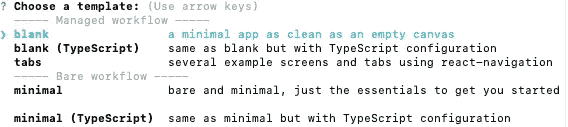
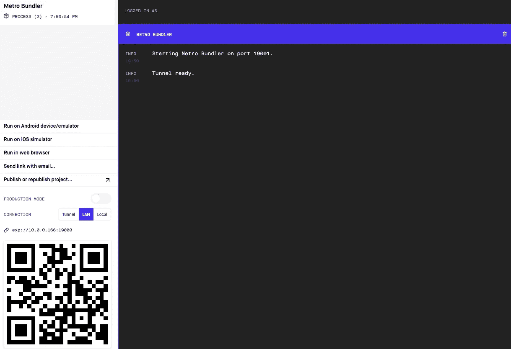
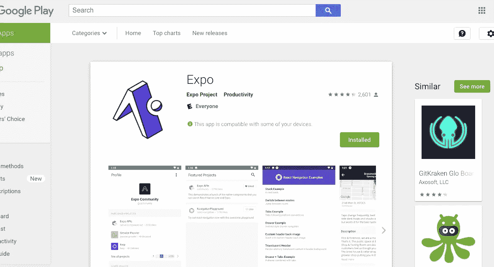

# 在 5 分钟内创建一个 IOS 和 Android 应用程序！

> 原文：<https://levelup.gitconnected.com/create-an-ios-and-android-app-in-under-5-minutes-5e3fd70582ee>


# 介绍

React Native 是一个用于构建跨平台移动应用的 JavaScript 框架。在本教程中，我将向您展示如何快速设置 React 原生项目，并在您的实际设备上运行您的应用程序！本教程的代码可以在我的 [**GitHub**](https://github.com/bjcarlson42/blog-post-code/tree/master/Quickstart%20React%20Native/ExampleProject) 上找到。

# 世博会

在本教程中，我们将使用 expo 和 React Native。Expo 充当 React Native 框架周围的容器，与使用基本的 React Native 相比，它允许我们更快、更容易地开发应用程序。我们需要做的第一件事是安装 Expo CLI 命令行实用程序。打开您的终端并运行以下命令:

```
npm install -g expo-cli
```

现在我们可以创建一个新的 React 本地项目。我将把我的项目命名为 ExampleProject，但是您可以随意命名。

```
expo init ExampleProject
```

Expo 将提示您以下信息:



对于本教程，我将选择空白，但我鼓励你做一些研究，并为你的项目选择最佳选项。

# 运行我们的应用

信不信由你，我们的应用程序已经可以运行了！要启动我们的应用程序，我们必须进入包含我们的应用程序的文件夹，然后运行启动命令。

```
cd AwesomeProjectnpm start
```

当您运行“npm start”时，将在您的本地主机上打开一个新的浏览器窗口。你会注意到左下角有一个条形码。



我们可以在 expo 应用程序中扫描这个条形码，在设备上运行我们的应用程序。去苹果应用商店或谷歌 Play 商店搜索“世博客户端”。见下图。



一旦你下载并打开应用程序，你会看到一个“扫描二维码”的选项。点击这个，扫描你的代码。JavaScript 加载后，您应该能够在设备上看到该应用程序。如果您看到“打开 App.js 开始使用您的应用程序！”你做得对。

# 结论

现在出去开始构建你梦想中的应用吧！如果你想要我在本教程中使用的确切代码，可以在我的 [**GitHub**](https://github.com/bjcarlson42/blog-website-code/tree/master/Quickstart%20React%20Native/ExampleProject) 上找到，这篇文章和更多内容可以在我的[网站](https://benjamincarlson.net/blog/)上找到。编码快乐！