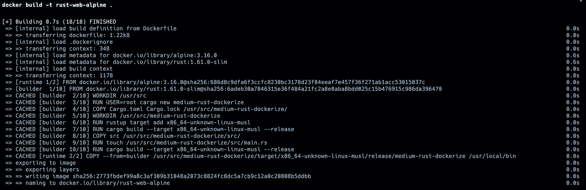
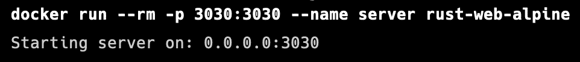
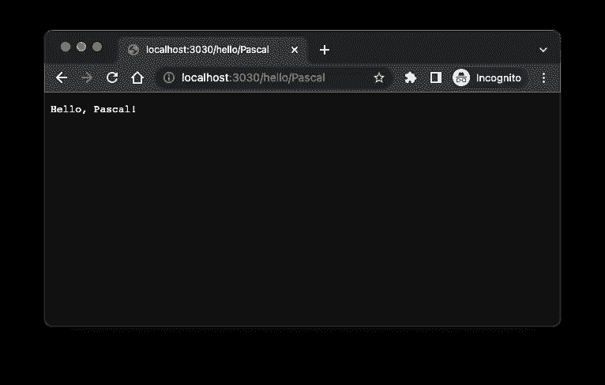
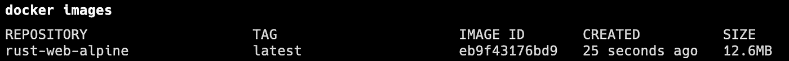

# 创建优化的 Rust Alpine Docker 图像

> 原文：<https://levelup.gitconnected.com/create-an-optimized-rust-alpine-docker-image-1940db638a6c>

在 Alpine Docker 映像上运行 Rust 应用程序并不简单。但是不用担心。我将向您展示如何基于 Alpine Linux 创建一个优化的小型 Rust Docker 映像。


Rust 编程语言

## GitHub 知识库

如果您对整个应用程序感兴趣，并且想要查看使用的代码，请查看我为本文创建的这个 [GitHub 资源库](https://github.com/mr-pascal/medium-rust-dockerize)。

[](https://github.com/mr-pascal/medium-rust-dockerize) [## GitHub-Mr-Pascal/medium-rust-dockerize

### 此时您不能执行该操作。您已使用另一个标签页或窗口登录。您已在另一个选项卡中注销，或者…

github.com](https://github.com/mr-pascal/medium-rust-dockerize) 

对于这个演示，我使用`warp`和`tokio`机箱建立了一个简单的 web 服务器，并且只暴露了一个返回字符串`Hello, :text!`的`GET /hello/:text`端点。

使用这个小的 web 服务器，我们可以在文章的结尾验证 Docker 映像已经构建并正确运行。

## 为什么不能简单地使用 Alpine 作为运行时

如果您以“正常”的方式构建 Docker 映像，那么在 Alpine 上运行 Rust 应用程序时会遇到错误，即使您的 Docker 构建成功了。

它崩溃是因为 Alpine 上缺少特定的库，而许多 Rust 应用程序都需要运行这些库。为什么我说“很多”？因为看起来一个简单的“Hello World”程序似乎工作得很好，但是当你把板条箱`tokio`包含到你的应用程序中时，它就会崩溃。

这里的解决方案是[交叉编译](https://rust-lang.github.io/rustup/cross-compilation.html)。

使用交叉编译，我们可以告诉`cargo`用目标`x86_64-unknown-linux-musl`编译我们的应用程序，使我们的应用程序与 Alpine 一起工作。

## 文档文件

但是现在，让我们检查一下实际的 docker 文件，不要担心，我将在后面描述为什么我们应该包括其中的一些步骤。

在上面的 Dockerfile 文件中，您可以看到以下内容:

在最开始，我们只将`Cargo.toml`和`Cargo.lock`复制到 Docker 映像。我们这样做是为了编译已经存在于 Docker 缓存层中的应用程序依赖项。因此，当只有应用程序发生变化，而依赖关系没有变化时，我们不必重新编译它们，因为它们没有发生任何变化。

另外，您可以看到我们通过`rustup target add x86_64-unknown-linux-musl`添加了一个编译目标。这是稍后在`cargo build`命令中使用`--target x86_64-unknown-linux-musl`的先决条件。这就是交叉编译的魔力。我们没有使用默认目标，而是定义了另一个平台来构建应用程序。

随后，我们将`src`文件夹中的实际源代码复制到 Docker 镜像中，并再次运行`cargo build`，我们的依赖项已经在上面构建了几行代码和新目标。

最后但并非最不重要的一点是，必须提到您通常使用的构建应用程序的路径已经改变。因此，如果您已经有一个 Dockerfile，并且只是用这里概述的步骤替换了构建步骤，那么当试图将创建的二进制文件从`builder`复制到`runtime`阶段时，由于路径改变，构建步骤将会中断。

如果您运行`cargo build`命令而不运行修改后的`--target`命令，那么构建的二进制路径如下:

```
/usr/src/medium-rust-dockerize/target/release/medium-rust-dockerize
```

即使通过使用非默认的构建目标，路径也会变为:

```
/usr/src/medium-rust-dockerize/target/x86_64-unknown-linux-musl/release/medium-rust-dockerize
```

所以在`target`和`release`部分之间增加了一个额外的`x86_64-unknown-linux-musl`。

## 验证 docker 文件是否有效

我建议你克隆我的 [GitHub 库](https://github.com/mr-pascal/medium-rust-dockerize)来验证一切都工作正常。

克隆完成后，您可以运行以下命令来验证 Docker 映像是否成功创建，以及容器是否能够顺利启动应用程序。

```
# Build the Docker image
docker build -t rust-web-alpine .# Run the Docker container
docker run --rm -p 3030:3030 --name server rust-web-alpine
```



(缓存的)Docker 版本



启动容器

容器成功启动后，您可以通过到达`localhost:3030/hello/<someString>`来检查它是否在工作，如下图所示。



chrome:localhost:3030/hello/Pascal

最后但同样重要的是，让我们使用`docker images`命令检查创建的 Docker 图像的大小。

如下图所示，Rust web 服务器只有 **12.6MB 的图像大小。**



docker 图像

## 你想联系吗？

如果你想联系我，请在 LinkedIn 上给我打电话。

此外，请随意查看我的书籍推荐📚。

[](https://mr-pascal.medium.com/my-book-recommendations-4b9f73bf961b) [## 我的书籍推荐

### 在接下来的章节中，你可以找到我对所有日常生活话题的书籍推荐，它们对我帮助很大。

mr-pascal.medium.com](https://mr-pascal.medium.com/my-book-recommendations-4b9f73bf961b) [](https://mr-pascal.medium.com/membership) [## 通过我的推荐链接加入 Medium—Pascal Zwikirsch

### 作为一个媒体会员，你的会员费的一部分会给你阅读的作家，你可以完全接触到每一个故事…

mr-pascal.medium.com](https://mr-pascal.medium.com/membership)