# 在 MS Azure 中创建一个 SFTP 服务器——简单的方法

> 原文：<https://levelup.gitconnected.com/create-an-sftp-server-in-ms-azure-the-easy-way-ceac015f94eb>

经过多年的等待，现在终于可以在 MS Azure 中设置一个 SFTP 服务器，只需点击几下鼠标。

Microsoft Azure 平台支持几种类型的 blob 存储选项。利用传统分层文件系统(说白了就是使用可能嵌套在其他文件夹中的文件和文件夹)的 Azure Data Lake Storage Gen2 现在支持 SSH 文件传输协议(SFTP)。因此，我们可以创建一个文件存储帐户，并通过 SFTP 端点安全地连接到该帐户，以进行文件访问、文件传输和文件管理。这在处理不支持其他数据连接方式的系统时特别有用，比如 REST APIs 或 NFS。

在这篇文章中，我将描述如何创建存储帐户，配置它，并通过 SFTP 协议一步一步地连接到它。

[Growtika 开发商营销机构](https://unsplash.com/@growtika?utm_source=medium&utm_medium=referral)在 [Unsplash](https://unsplash.com?utm_source=medium&utm_medium=referral) 上拍摄的照片

# 先决条件

整个过程非常简单，不会超过 10 分钟。我希望如果你正在阅读这篇文章，你已经有了:

*   MS Azure 订阅
*   Azure 资源组
*   配置 Azure 资源的一般知识

# 调配存储帐户

让我们从创建新的存储帐户开始。导航到 Azure 门户，打开计划部署服务器的资源组。

点击**创建**按钮打开 Azure marketplace。

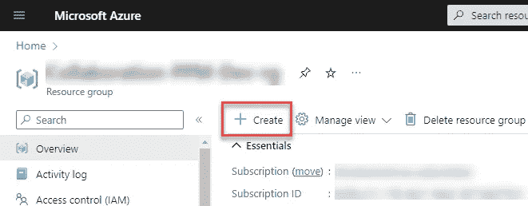

来源:图片由作者提供

搜索**存储账户**，找到微软提供的选项，然后点击**创建→存储账户**。

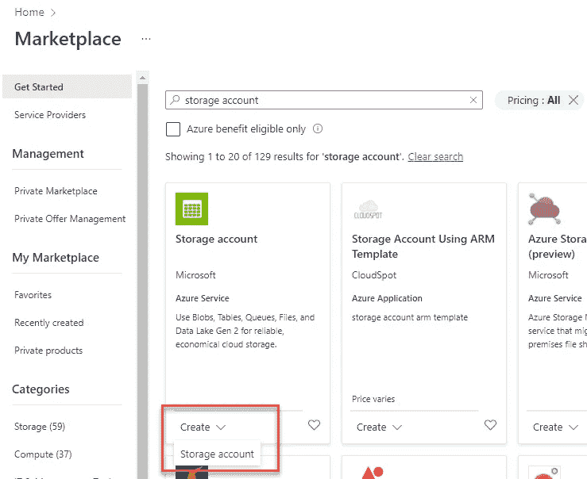

来源:图片由作者提供

我们会看到一个表单，提供一些关于存储帐户的一般信息，以及它的配置细节。

在**基础**页面，验证**订阅**和**资源组**详细信息选择正确。为存储帐户选择一个**名称**—它将用于标识我们资源组中的资源，但更重要的是，该名称也将是我们将与用户共享的连接字符串的一部分。选择一个离我们服务器用户最近的**区域**。可选地，我们可以改变**性能**和**冗余**配置。标准性能和本地冗余存储(LRS)是最便宜的选择，至少在开始时应该足够了。

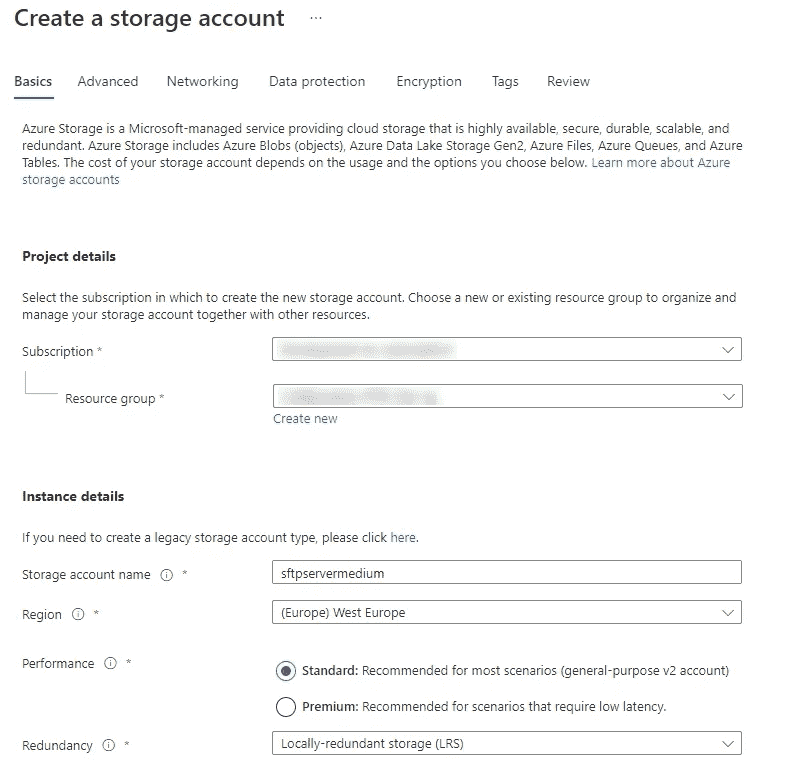

来源:图片由作者提供

在**高级**页面，我们需要更改两个设置。首先，单击**启用分层名称空间**，将我们的存储帐户类型更改为 Data Lake Storage Gen2。这意味着存储将支持文件夹结构，它还将允许我们选择**启用 SFTP** 选项，这是我们试图实现的核心目标。

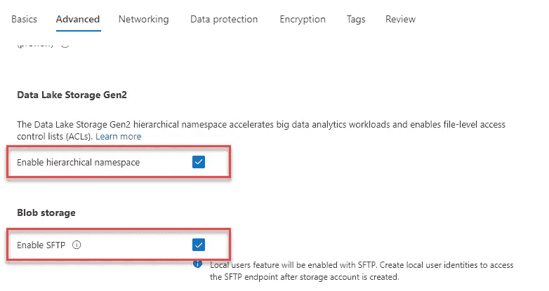

来源:图片由作者提供

如果您有特定的偏好，您可以在“网络”、“数据保护”、“加密”和“标签”页面上更改配置。如果您不确定可用选项的含义，您可以保留默认设置，并在将来需要时随时更改它们。

完成配置后，切换到页面**查看**。

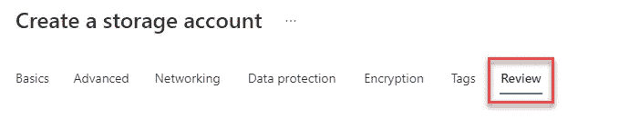

来源:图片由作者提供

在这里，您将看到配置的概述。Azure 还将验证整个配置，并在订阅策略出现任何问题或冲突时显示错误(例如，如果您无权在所选资源组或区域中创建资源)。

如果您没有看到任何错误，您可以单击页面底部的 **Create** 按钮来配置资源。

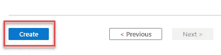

来源:图片由作者提供

几秒钟后，您应该会被重定向到新创建的资源。

在存储帐户的概述中，您应该看到 SFTP 已启用。

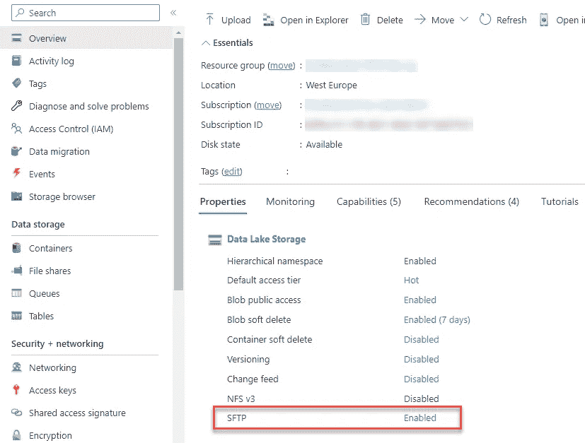

来源:图片由作者提供

点击**启用**链接打开 SFTP 设置。或者，您可以通过左侧导航菜单中的 **SFTP** 选项打开它。

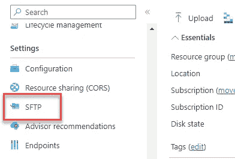

来源:图片由作者提供

# 打开和关闭 SFTP

可以在 SFTP 设置中启用或禁用 SFTP 端点。在某些用例中，当您不需要 SFTP 时，禁用它可能是有意义的，因为保持它的启用有每小时的成本。我们将在本文的定价部分详细介绍这一点。

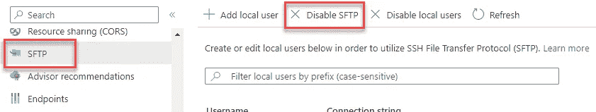

来源:图片由作者提供

# 创建本地用户和处理权限

到目前为止，我们已经调配了存储帐户，并了解了如何启用或禁用 SFTP 端点。为了能够通过 SFTP 连接到文件服务器，我们需要添加至少一个本地用户帐户，并为其生成凭据。

在 SFTP 设置中，点击**添加本地用户**按钮。

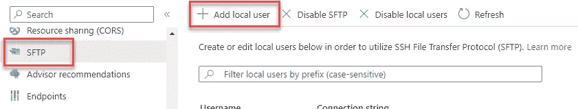

来源:图片由作者提供

将打开一个弹出窗口，提示我们为该用户选择用户名和身份验证方法。在本文中，我们选择 **SSH 密码**作为认证方法。

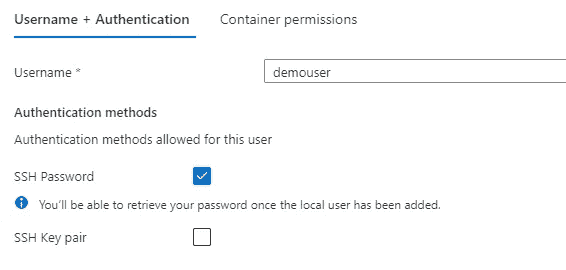

来源:图片由作者提供

点击**下一步**继续。

现在我们必须设置本地用户帐户的权限。权限是在存储容器级别上授予的。您可以将容器视为存储帐户中文件夹和文件层次结构顶部的“第一个文件夹”。因为我们还没有在帐户中创建任何容器，我们可以点击**创建新的**链接，为容器提供名称和公共访问级别设置，并通过点击 **OK** 按钮进行确认。

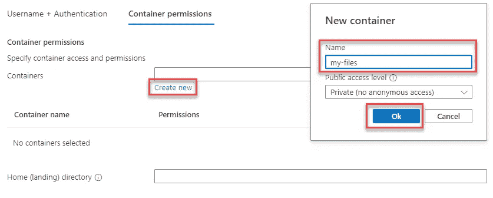

来源:图片由作者提供

您可以创建和选择任意数量的容器，并为每个容器配置不同的权限。

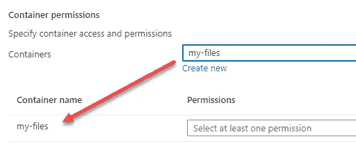

来源:图片由作者提供

可以从每个容器旁边的下拉菜单中选择权限级别。

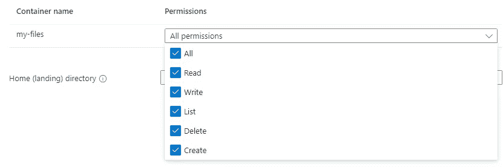

来源:图片由作者提供

我们可以为这个本地用户提供一个默认的登录目录。这是用户连接到服务器时将打开的目录。因为我们的容器中还没有任何文件夹，所以我们将传递容器的名称作为默认目录。

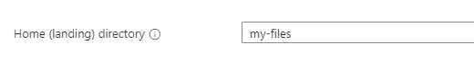

来源:图片由作者提供

最后，点击**添加**按钮保存这个新的用户设置。

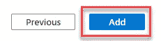

来源:图片由作者提供

几秒钟后，将创建本地用户帐户，我们将看到一个弹出窗口，显示为用户生成的密码。复制密码并将其安全存储非常重要，因为我们将无法再次访问它，只能在将来生成新密码。

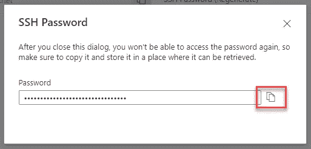

来源:图片由作者提供

复制密码后，您可以关闭弹出窗口。您将在 SFTP 设置中看到新创建的用户。

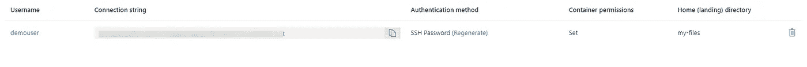

来源:图片由作者提供

# 测试连接

现在一切都设置好了，我们可以使用本地用户凭证连接到服务器。为此，我们需要:

*   **服务器(主机)名称** —您会发现它是“@”字符后面的连接字符串的最后一部分。在我们的示例中，它是“sftpservermedium . blob . core . windows . net”(根据您为存储帐户输入的名称，它会有所不同)。
*   **端口号** — 22(默认值)。
*   **用户名**——格式为{存储帐户名}。{用户名}。在我们的例子中，它是“sftpservermedium.demouser”。
*   **密码** —保存本地用户账号时生成。
*   **具有 SFTP 支持的客户端** —例如 WinSCP 或类似产品。

打开 SFTP 客户端并开始新的会话。输入连接详细信息并尝试登录。以下是它在 WinSCP 中的外观示例。

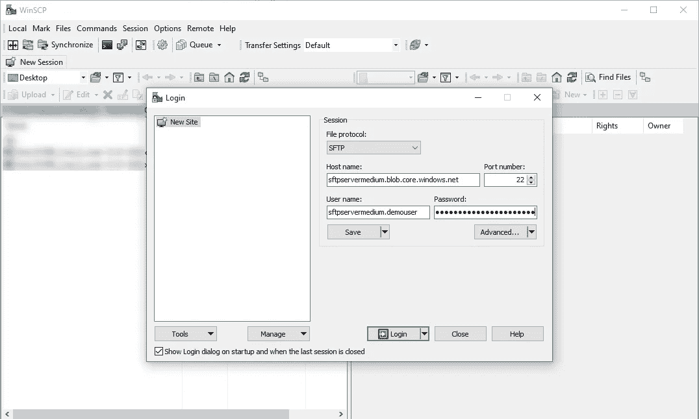

来源:图片由作者提供

就这样，我们成功登录了服务器。

到目前为止，服务器中没有任何文件，所以让我们上传一个文件来验证连接是否真的有效。

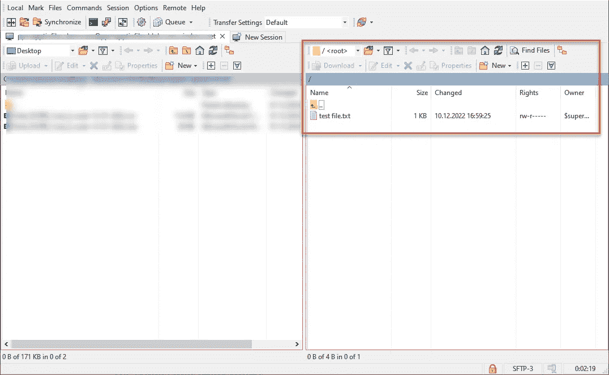

来源:图片由作者提供

现在在浏览器中切换回 Azure 门户，点击左侧导航菜单中的**容器**，打开我们上传测试文件的容器。

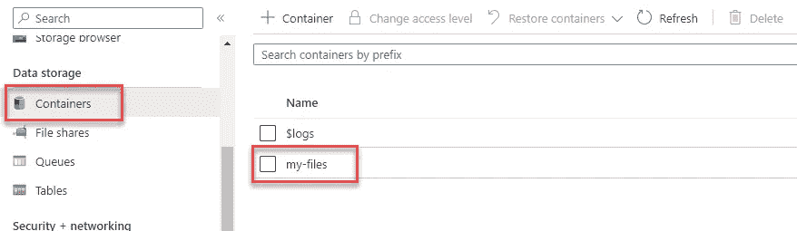

来源:图片由作者提供

文件就在那里，所以连接正常工作。

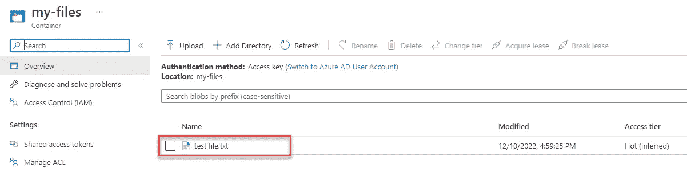

来源:图片由作者提供

# 定价

让我们来回答一下在尝试 Azure 新功能时我们都会问自己的两个问题。

## 要花多少钱？

在 Azure 中运行支持 SFTP 的存储帐户的成本分为两部分。

首先是存储帐户本身的**价格**。这一成本与您在服务器上存储的数据量以及您执行的操作(例如读/写等)数量成正比。你可以使用 [Azure 价格计算器](https://azure.microsoft.com/en-us/pricing/calculator/)来估算你的服务器配置成本。

在将能力和操作设置为最小允许值后，您可以看到每月成本低于 1 美元。实际上，如果您利用的服务器容量和操作较少，成本可能会更低。

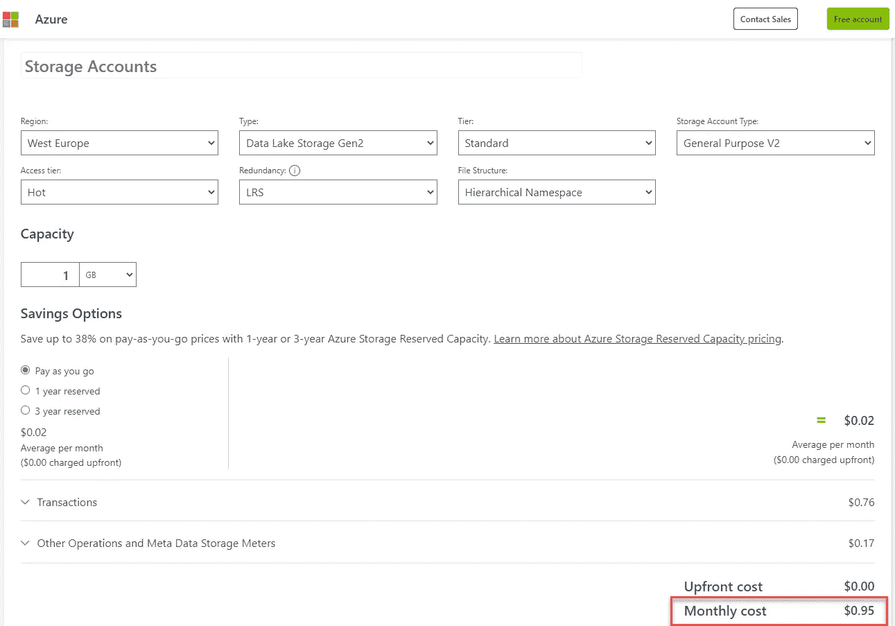

来源:图片由作者提供

成本的第二部分是启用 SFTP 的价格。启用 SFTP 端点需要按小时付费，将从 2023 年 1 月 1 日起生效。在写这篇文章的时候，确切的每小时价格还不知道，尽管传言说它将在每小时 0.30 美元左右。全天候启用 SFTP 端点每月大约花费 220 美元。

## 如何降低成本？

你可能会认为每月支付 200 多美元购买一台 SFTP 服务器有点太贵了。你说的没错，确实有更便宜的选择，比如创建一个 Linux 虚拟机，我们可以在那里托管服务器。然而，这将需要更深入的技术知识和更多的初始设置和后期维护时间。

在我看来，在 MS Azure 中支持 SFTP 的存储帐户的主要卖点就是在未来以最小的维护需求设置它是多么容易和快速。

毕竟，降低成本有一个显而易见的方法— **在不需要使用 SFTP 端点时将其禁用**。如果你知道你只在周一到周五的工作时间(每天 8 小时)使用这个连接，你可以在不使用的时候禁用 SFTP，这样可以节省大约 170 美元，这样每月的总成本大约是 50 美元。如果您只需要在集成运行的晚上连接几个小时，您可以进一步降低成本，您会明白的。

还可以使用 Azure Automation**按照计划**自动启用和禁用 SFTP 端点。在以后的文章中会有更多的介绍。

# 结论

MS Azure 资源家族的这一新成员使得设置具有 SFTP 连接的文件服务器变得非常容易。我个人在从仍然依赖 SFTP 协议的应用程序导入文件时，在我的数据分析工作流程中使用它。

我希望这个教程对你有用。请在评论中告诉我你对 SFTP 服务器有哪些使用案例，并关注我，获取更多关于所有数据的文章。

阅读关于此主题的更多信息:[SFTP 对 Azure Blob 存储的支持|微软学习](https://learn.microsoft.com/en-us/azure/storage/blobs/secure-file-transfer-protocol-support)