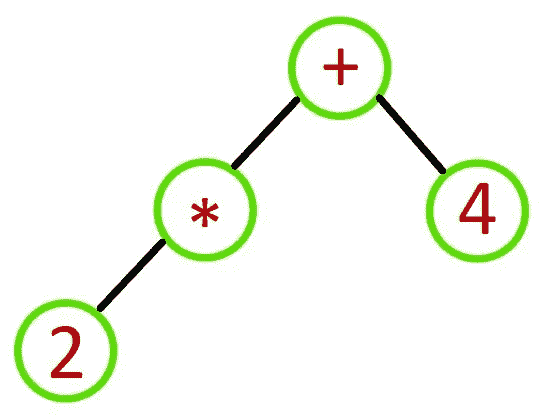
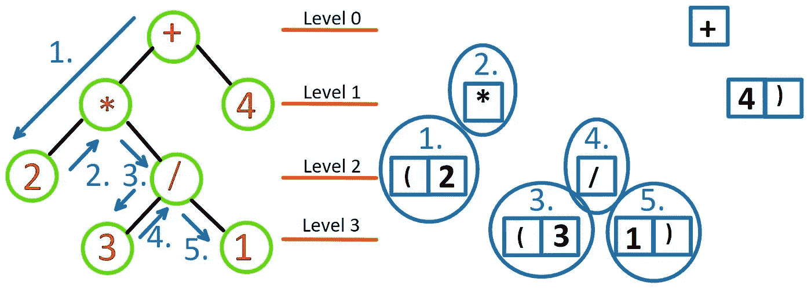

# 以面向对象的方式在 Python 中创建和评估简单的表达式树

> 原文：<https://levelup.gitconnected.com/create-and-evaluate-simple-expression-tree-in-python-in-object-oriented-style-5eb27b6376c8>


表达式树插图[1]

# 什么是表达式树？

在本文中，我将向您展示如何创建一个表达式树来存储二进制算术表达式的令牌。

表达式树是一种二叉树，具有以下属性:

1.  每片叶子都是一个操作数。
2.  根节点和内部节点是*操作符*。
3.  子树是子表达式，根是一个*操作符*。

[](https://www.eduelk.com/) [## 教育

### 通过我们的练习题为您的下一次技术认证考试树立信心。我们提供课程来加速…

www.eduelk.com](https://www.eduelk.com/) [](https://www.eduelk.com/about-us) [## 关于我们——教育

### 在爱德克教育，我们相信熟能生巧。我们知道准备参加技术认证是…

www.eduelk.com](https://www.eduelk.com/about-us) [](https://www.eduelk.com/shop-for-practice-questions) [## 通过我们负担得起的练习题获得自信——教育

### 编辑描述

www.eduelk.com](https://www.eduelk.com/shop-for-practice-questions) [](https://www.eduelk.com/book-a-lesson) [## 联系方式 1——教育

### 编辑描述

www.eduelk.com](https://www.eduelk.com/book-a-lesson) 

# 什么是算术表达式？

算术表达式是遵循规定规则的符号序列。令牌可以是操作数，也可以是运算符。

使用标准算术运算符**加法(+)、减法(-)、乘法(*)、除法(/**)的二进制算术运算可以是操作数-运算符-操作数的形式。

比如 **2 + 3** ，其中 **2** 和 **3** 是*操作数*， **+** 是加法*运算符。*

# 先决条件

在阅读本文之前，您应该了解一些先决条件。您需要对以下内容有一个基本的了解:

*   面向对象编程
*   堆栈数据结构
*   功能
*   条件语句
*   环
*   链表

# 程序

现在，程序的方式是基于一种实现表达式树的方式。

以下是我将在本文中主要讲述的步骤列表:

1.  节点类
2.  ExpressionTree 构造函数
3.  ExpressionTree 运算符检查函数
4.  ExpressionTree 插入节点函数
5.  ExpressionTree 显示功能
6.  ExpressionTree 中缀函数
7.  ExpressionTree 评估函数

好吧！让我们开始编码吧！

# 节点类

```
**class** Node:
 **def** __init__(self, left_child_index):
  self.DataValue = ""
  self.LeftChild = left_child_index
  self.RightChild = -1
```

这是构建链表的基础。这是为左指针指向另一个节点的下一个索引而设计的。

# ExpressionTree 类

## 构造器

```
**class** ExpressionTree:
 **def** __init__(self):
  self.Tree = list()
  for index in range(1, 21):
   self.Tree.append(Node(index))
  self.Fringe = list()
  self.Root = 0
  self.NextFreeChild = 0
```

我们的 ExpressionTree 类有一个带有以下类属性的构造函数:

*   树
*   边缘
*   根
*   NextFreeChild

这个程序实现中的 Tree 属性保存一个节点对象数组。每个节点对象都有一个指向下一个节点的 LeftChild。


节点的链接列表

## 检查字符是否是运算符

```
**def** IsOperator(self, s):
 if '+' in s:
  return True
 if '-' in s:
  return True
 if '*' in s:
  return True
 if /' in s:
  return True
 return False
```

这个函数将检查字符是否是一个操作符。

## 在二叉树中插入一个节点

```
**def** Insert(self, NewToken):
 if self.NextFreeChild == -1: **# check if tree is full**
  return “Tree is Full” **# tree is not full, safe to insert new token**
 if self.NextFreeChild == 0:
  self.Tree[self.Root].DataValue = NewToken
  self.NextFreeChild = self.Tree[self.Root].LeftChild
  self.Tree[self.Root].LeftChild = -1
 else:
  **# insert into tree with existing nodes**
  **# starting with Root**
  Current = 0 **# index of the current node**
  Previous = -1 **# index of previous node**
  NewNode = self.Tree[self.NextFreeChild] **# declare new node**
  NewNode.DataValue = NewToken **# Finding the node at which the NewNode can be inserted**
  while Current != -1:
   CurrNode = self.Tree[Current]
   **# check if CurrNode contains an operator**
   if self.IsOperator(CurrNode.DataValue):
    **# if LeftChild is empty, insert here**
    if CurrNode.LeftChild == -1:
     CurrNode.LeftChild = self.NextFreeChild
     self.NextFreeChild = NewNode.LeftChild
     NewNode.LeftChild = -1
     Current = -1
    **# if RightChild is empty, insert here**
    elif CurrNode.RightChild == -1:
     CurrNode.RightChild = self.NextFreeChild
     self.NextFreeChild = NewNode.LeftChild
     NewNode.LeftChild = -1
     Current = -1
    **# if LeftChild is an operator**
    **# traverse LeftChild subtree**
    elif self.IsOperator(self.Tree[CurrNode.LeftChild].DataValue):
     Previous = Current
     Current = CurrNode.LeftChild
     self.Fringe.append(Previous)
    **# if RightChild is an operator**
    **# traverse RightChild subtree**
    elif self.IsOperator(self.Tree[CurrNode.RightChild].DataValue):
     Previous = Current
     Current = CurrNode.RightChild
     self.Fringe.append(Previous)
    **# traverse right subtree**
    else:
     Previous = self.Fringe.pop(-1)
     Current = self.Tree[Previous].RightChild
   **# no place to insert**
   else:
    return “Cannot be inserted”
```

一个示例给出了以下令牌序列:

1.  +
2.  *
3.  4
4.  2
5.  /
6.  3
7.  1

这个函数在表达式二叉树中插入一个新的节点。


第 0 层的根节点

由于表达式二叉树中没有任何节点，所以添加了一个根节点。

```
Index: 0 DataValue: + LeftChild: -1 RightChild: -1
```


在第 1 层左侧插入节点

因为**根**节点的**左子节点**是索引-1，所以新节点被插入到树的左侧。**根**节点的**左子**被**更新为 **1** 。**

```
Index: 0 DataValue: + LeftChild: 1 RightChild: -1
Index: 1 DataValue: * LeftChild: -1 RightChild: -1
```


在第 1 层的右侧插入节点

由于**根**节点的**左子节点**指向一个**已有节点**并且**右子节点**指向索引 **-1** ，新节点被插入到**根**节点的**右子节点**上。**根**节点的**子节点**被**更新为**2。

```
Index: 0 DataValue: + LeftChild: 1 RightChild: 2
Index: 1 DataValue: * LeftChild: -1 RightChild: -1
Index: 2 DataValue: 4 LeftChild: -1 RightChild: -1
```



在第 2 层左侧插入节点

由于* 节点的**左子节点**是 index -1，所以新节点被插入到 ***** 节点的左侧。* 节点的**左子节点**被**更新**为索引 **3。**

```
Index: 0 DataValue: + LeftChild: 1 RightChild: 2
Index: 1 DataValue: * LeftChild: 3 RightChild: -1
Index: 2 DataValue: 4 LeftChild: -1 RightChild: -1
Index: 3 DataValue: 2 LeftChild: -1 RightChild: -1
```


在第 2 层右侧插入节点

由于* 节点的**左子节点**指向一个现有节点，而**右子节点**指向索引 **-1** ，新节点被插入到 ***** 节点的**右子节点**上。 ***** 节点的**右子节点**被**更新**为索引 **4** 。

```
Index: 0 DataValue: + LeftChild: 1 RightChild: 2
Index: 1 DataValue: * LeftChild: 3 RightChild: 4
Index: 2 DataValue: 4 LeftChild: -1 RightChild: -1
Index: 3 DataValue: 2 LeftChild: -1 RightChild: -1
Index: 4 DataValue: / LeftChild: -1 RightChild: -1
```


在第 3 层左侧插入节点

由于 **/** 节点的**左子节点**是索引 **-1** 并且为空，所以新节点被插入到 **/** 节点的左侧。/ 节点的**左子**被**更新**到索引 **5。**

```
Index: 0 DataValue: + LeftChild: 1 RightChild: 2
Index: 1 DataValue: * LeftChild: 3 RightChild: 4
Index: 2 DataValue: 4 LeftChild: -1 RightChild: -1
Index: 3 DataValue: 2 LeftChild: -1 RightChild: -1
Index: 4 DataValue: / LeftChild: 5 RightChild: -1
Index: 5 DataValue: 3 LeftChild: -1 RightChild: -1
```


在第 3 层右侧插入节点

由于/ 节点的**左子节点**指向一个现有节点，而**右子节点**指向索引 **-1** ，所以新节点被插入到 **/** 节点的**右子节点**上。 **/** 节点的**右子节点**被**更新**到索引 **6。**

```
Index: 0 DataValue: + LeftChild: 1 RightChild: 2
Index: 1 DataValue: * LeftChild: 3 RightChild: 4
Index: 2 DataValue: 4 LeftChild: -1 RightChild: -1
Index: 3 DataValue: 2 LeftChild: -1 RightChild: -1
Index: 4 DataValue: / LeftChild: 5 RightChild: 6
Index: 5 DataValue: 3 LeftChild: -1 RightChild: -1
Index: 6 DataValue: 1 LeftChild: -1 RightChild: -1
```

这是在二叉树中插入一个节点的方法之一。

## 显示

```
**def** Display(self):
 for index in range(len(self.Tree)):
  print("Index: ", index, "DataValue: ",self.Tree[index].DataValue)
```

这个函数遍历整个树型数组，并显示每个数组元素的索引和元素中节点的值。

## 测试

```
expressionTree = ExpressionTree()
expressionTree.Insert('+')
expressionTree.Insert('*')
expressionTree.Insert('4')
expressionTree.Insert('2')
expressionTree.Insert('/')
expressionTree.Insert('3')
expressionTree.Insert('1')
expressionTree.Display()
```


## 中缀(按顺序遍历)

这个算法是基于[https://en.wikipedia.org/wiki/Tree_traversal#In-order](https://en.wikipedia.org/wiki/Tree_traversal#In-order)的。

```
**def** Infix(self, root, arr):
 if root.DataValue != "":
  if self.IsOperator(root.DataValue):
   arr.append('(') self.Infix(self.Tree[root.LeftChild], arr)
  arr.append(root.DataValue)
  self.Infix(self.Tree[root.RightChild], arr) if self.IsOperator(root.DataValue):
   arr.append(')')
```

给定下面的二叉树:


表达式树

下面是根据给定的二叉树在顺序遍历中做**的步骤:**


遍历左边的子树

从根节点开始，遍历左边的子树，直到叶节点结束。


访问左子树的根

在左边的子树中，查看子树的根。


遍历右边的子树，然后遍历左边的下一个子树

遍历左边子树的右边，然后遍历子树的左边，它位于整个树的第 3 层。


访问子树的根

接下来，访问第 2 层子树的根节点。



遍历右边的子树

遍历到第 3 层子树的右边节点。


访问整个子树的根

然后，返回到第 0 层的整个树的根节点。


遍历右边的子树

最后，从根节点开始，遍历右边的子树，直到叶子节点结束。

## 测试

```
arr = []
expressionTree.Infix(expressionTree.Tree[0], arr)
expression_string = ''.join(arr[1:-1])
print(expression_string)
```

下面是表达式树中顺序遍历的**的结果，(2*(3/1))+4**

# 计算表达式

```
**def** calculate(self, expression):
 **def** processing(left, stack):
  right = stack.pop() # get right number
  right = int(right)
  operator = stack.pop() # get operator
  left = stack.pop() # get left number
  left = int(left) # calculating depending on operator
  if '+' in operator:
   left += right
  elif '-' in operator:
   left -= right
  elif '*' in operator:
   left *= right
  elif '/' in operator:
   left /= right return left, stack stack = []
 count = 0
 left = 0 for char in expression:
  stack.append(char) if char == ')': stack.pop()
   left, stack = processing(left, stack)
   stack.pop()
   stack.append(left) if count == len(expression)-1: # last char of expression string left, stack = processing(left, stack) count += 1 return left
```

这个函数根据给定的数学表达式计算一个数。该函数仅限于加法(+)、减法(-)、乘法(*)和除法(/)

给定以下数学表达式:

> (2*(3/1))+4

下面是函数中的计算:


堆栈中的数学表达式计算

该函数执行以下步骤:

1.  对于每个字符，将该字符压入堆栈
2.  检查字符是否为 **)** ，然后从堆栈中弹出一个字符
3.  在步骤 2 中，从堆栈中弹出一个字符，并将该字符指定为正确的数字
4.  在步骤 2 中，从堆栈中弹出一个字符，并将该字符指定为运算符
5.  在步骤 2 中，从堆栈中弹出一个字符，并将该字符指定为左边的数字
6.  在步骤 2 中，根据左边的数字、运算符和右边的数字计算一个数字。然后将该数字分配给左边的数字。
7.  在步骤 2 中，从堆栈中弹出一个字符
8.  在步骤 2 中，将左边的数字字符压入堆栈
9.  重复步骤 1 至 8，直到表达式的最后一个字符，然后执行步骤 3 至 6

## 测试

```
import re
regex_expression = "[\/\+\-\*\(\)]|[0–9][0–9][0–9]|[0–9][0–9]|[0–9]"
txt_list = re.findall(regex_expression, "(2*(3/1))+4")
print(expressionTree.calculate(txt_list))
txt_list = re.findall(regex_expression, "2+4")
print(expressionTree.calculate(txt_list))
txt_list = re.findall(regex_expression, "(2+4)-1")
print(expressionTree.calculate(txt_list))
txt_list = re.findall(regex_expression, "(10-(2+4)")
print(expressionTree.calculate(txt_list))
```

这里的正则表达式考虑了以下因素:

1.  数学运算符，如加法(+)、减法(-)、乘法(*)和除法(/)
2.  数字 0 到 9
3.  多少位数字(在本例中为 1 至 3 位数字)

这个正则表达式有助于将字符串转换成可用的数组。

## 例子

> 给定这个数学表达式， **(2*(3/1))+4** ，输出:

```
['(', '2', '*', '(', '3', '/', '1', ')', ')', '+', '4']
```

> 给定这个数学表达式， **100-(20+4)** ，输出:

```
['100', '-', '(', '20', '+', '4', ')']
```

## 结果


节目到此结束。编写完这个程序后，我将继续我的想法。

# 思想

希望这篇文章有助于更新或介绍计算概念，如链表、栈数据结构、类、对象以及二叉树。如果这是有用的，并且能唤起你在大学攻读计算机科学学位时的回忆，请鼓掌。和平✌️

[](https://www.eduelk.com/) [## 教育

### 通过我们的练习题为您的下一次技术认证考试树立信心。我们提供课程来加速…

www.eduelk.com](https://www.eduelk.com/) [](https://www.eduelk.com/about-us) [## 关于我们——教育

### 在爱德克教育，我们相信熟能生巧。我们知道准备参加技术认证是…

www.eduelk.com](https://www.eduelk.com/about-us) [](https://www.eduelk.com/shop-for-practice-questions) [## 通过我们负担得起的练习题获得自信——教育

### 编辑描述

www.eduelk.com](https://www.eduelk.com/shop-for-practice-questions) [](https://www.eduelk.com/book-a-lesson) [## 联系方式 1——教育

### 编辑描述

www.eduelk.com](https://www.eduelk.com/book-a-lesson) 

# 参考

1.  文件:Exp-tree-ex-12 . SVG(2014 年 2 月 14 日)。2020 年 5 月 18 日从[https://en.wikipedia.org/wiki/File:Exp-tree-ex-12.svg](https://en.wikipedia.org/wiki/File:Exp-tree-ex-12.svg)检索