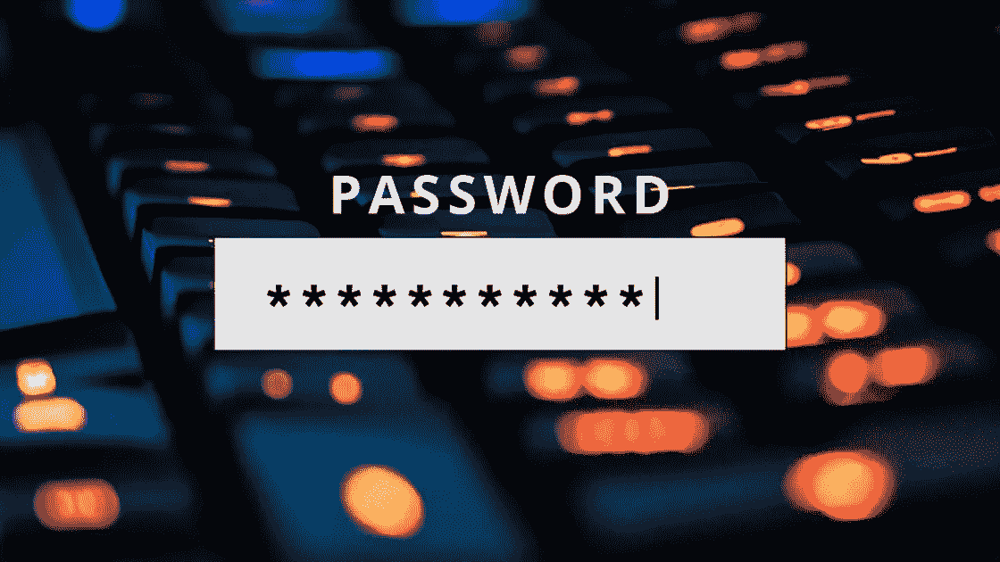

# 使用 CloudFormation 模板创建带有安全主密码的 AWS RDS MySQL 实例

> 原文：<https://levelup.gitconnected.com/create-aws-rds-mysql-instance-with-a-secured-master-password-using-cloudformation-template-c3a767062972>



最近，我正在用 CloudFormation 模板创建一个 MySQL RDS 实例。尽管有大量来自 AWS 官员或社区的文档在讨论这个问题，但我觉得没有多少文档深入探讨如何确保主用户密码的安全。

当创建 MySQL 实例时，RDS 将创建一个“主用户”,拥有管理数据库所需的所有权限。不考虑[云信息引用](https://docs.aws.amazon.com/AWSCloudFormation/latest/UserGuide/aws-properties-rds-database-instance.html#cfn-rds-dbinstance-masterusername)所说的 *MasterUsername* 和 *MasterUserPassword* ，它们需要创建一个 MySQL RDS 实例。如果模板中没有提供它们，您将得到一个错误“*属性 MasterUserPassword 不能为空*”。将明文密码放在临时模板中可能没问题，但如果我要将模板提交给任何源代码控制系统，我一定是疯了。此外，我希望将密码安全地存储在比便利贴更好的地方。

问题来了:如何指定一个 *MasterUserPassword* 不是明文，可以存储在 AWS 上？答案是另一项 AWS 服务——Secrets Manager。

我不打算写已经在秘密经理的官方文件中的东西。相反，让我们得出结论，我们将需要 Secrets Manager 中的一个秘密、KMS 中用于加密和解密该秘密的 CMK，以及在创建 RDS 实例时使用该秘密的方法。

这是云层模板:

```
---
Parameters:
  MySQLMasterUserName:
    Type: String
    Default: admin
    Description: Database admin user name for MySQLResources:
  MySQLSecretKey:
    Type: AWS::KMS::Key
    Properties:
      KeyPolicy:
        Statement:
          - Sid: "Enable IAM User Permissions"
            Effect: "Allow"
            Principal:
              AWS: !Sub arn:aws:iam::${AWS::AccountId}:root
            Action: "kms:*"
            Resource: "*"

  MySQLSecret:
    Type: AWS::SecretsManager::Secret
    Properties:
      KmsKeyId: !Ref MySQLSecretKey
      GenerateSecretString:
        SecretStringTemplate: !Join [ '', [ '{"username": "', !Ref MySQLMasterUserName, '"}' ] ]
        GenerateStringKey: 'password'
        PasswordLength: 16
        ExcludeCharacters: '"@/\'

  MySQLInstance:
    Type: AWS::RDS::DBInstance
    Properties:
      DBInstanceClass: !Ref MySQLDBInstanceClass
      DBName: !Ref MySQLDBName
      Engine: "MySQL"
      EngineVersion: "8.0.20"
      MasterUsername: !Ref MySQLMasterUserName
      MasterUserPassword: !Join [ '', [ '{{resolve:secretsmanager:', !Ref MySQLSecret, ':SecretString:password}}' ] ]
      StorageType: gp2
      AllocatedStorage: 20
  AvailabilityZone: !GetAtt PrivateSubnet1.AvailabilityZone
      MultiAZ: False
      Port: !Ref MySQLPort
      DBSubnetGroupName: !Ref MySQLSubnetGroup
      PubliclyAccessible: True
      VPCSecurityGroups:
        - !Ref MySQLSecurityGroup
```

我想在此模板中进一步解释一些元素:

1.  这个秘密将被生成为类似 *{"username": "admin "，" password": "super_secure"}* 的 JSON 字符串。RDS 还会将一些其他信息放入这个秘密中，比如 RDS 实例的主机名、DB 名称等。我可以在 AWS 控制台中检索密码，或者通过调用 API [GetSecretValue](https://docs.aws.amazon.com/secretsmanager/latest/apireference/API_GetSecretValue.html) 以编程方式进行检索。但是因为这是主用户凭证，所以我不会在应用程序中的任何地方使用它，它应该只在我需要管理 DB 实例时使用。
2.  在 MySQL 实例的模板中，用*{ { resolve:Secrets Manager:SECRET _ ARN:SECRET string:password } }*引用 Secrets Manager 中的秘密是神奇的成分。请参考此[文档](https://docs.aws.amazon.com/AWSCloudFormation/latest/UserGuide/dynamic-references.html#dynamic-references-secretsmanager)以获得更多解释。

围绕这个模板还有一些其他的主题，比如将它与 VPC 的一个安全组相关联，自动循环这个秘密，等等。我想我会在以后的文章中提到它们。希望这篇文章能对你有点帮助！