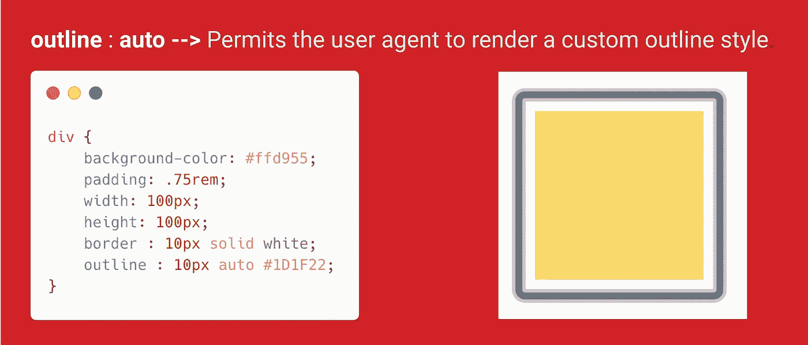
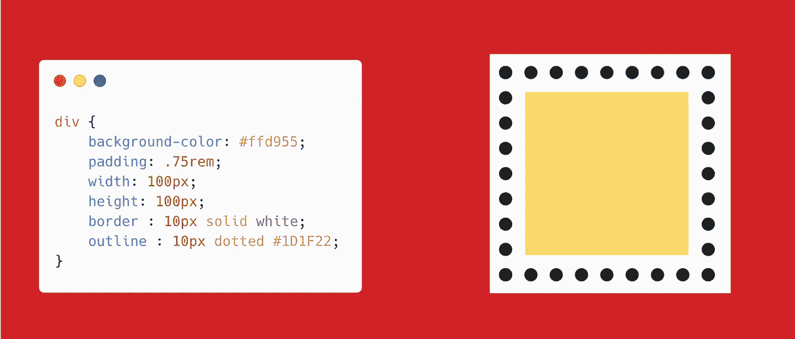
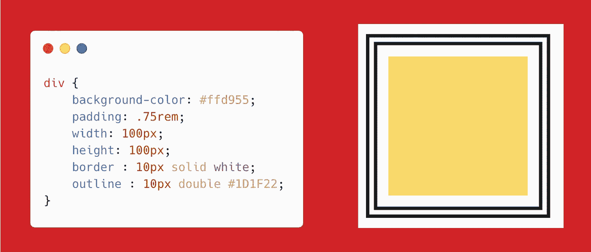
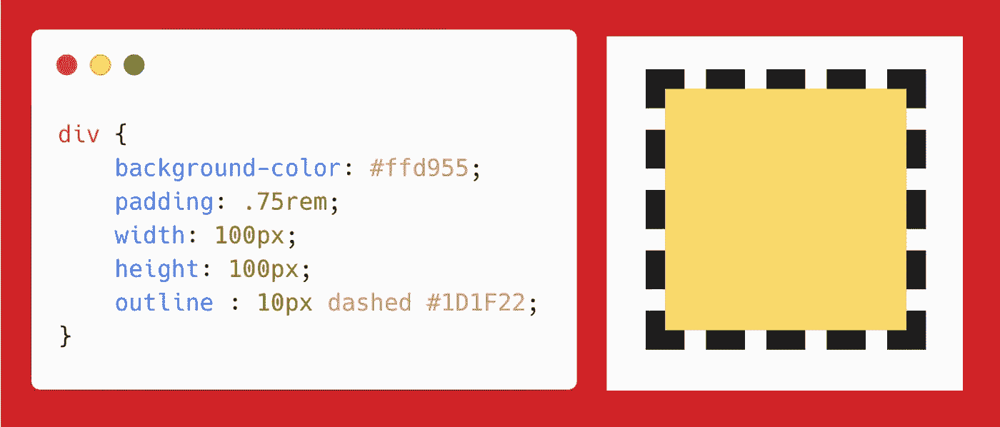
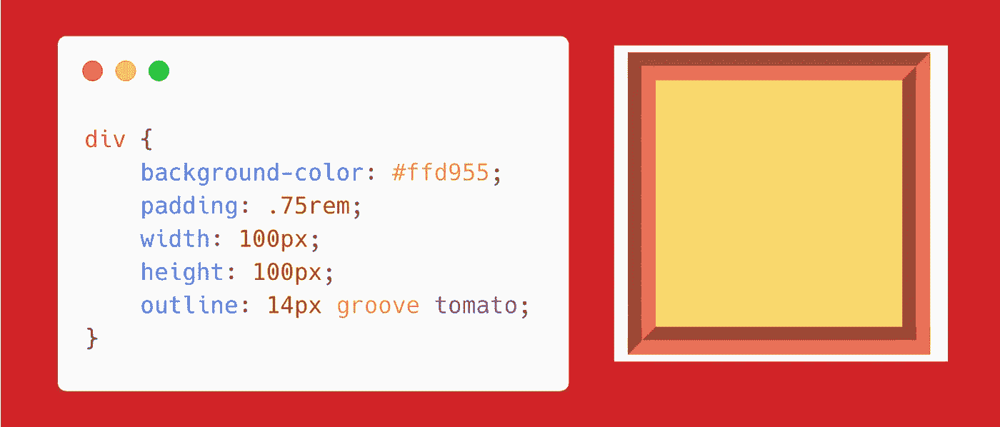
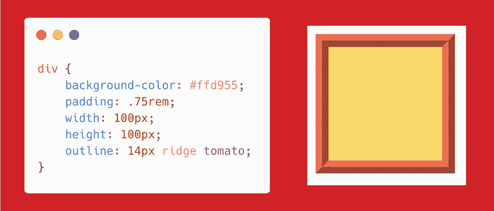
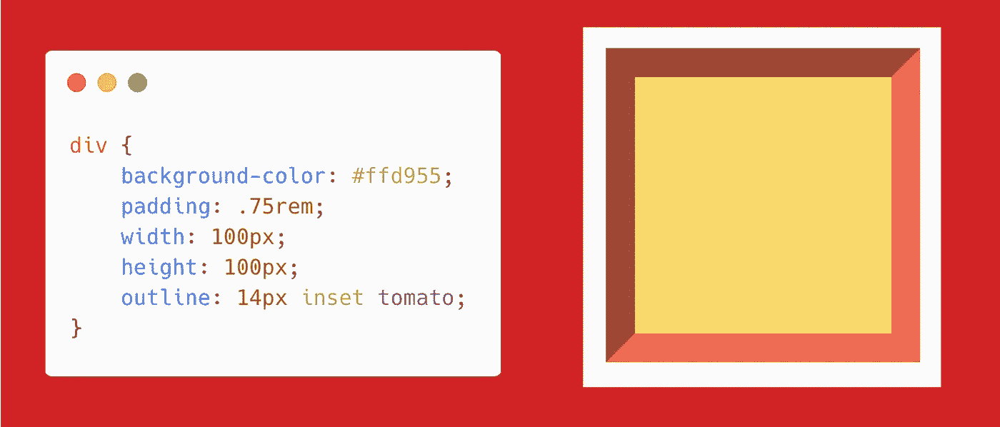
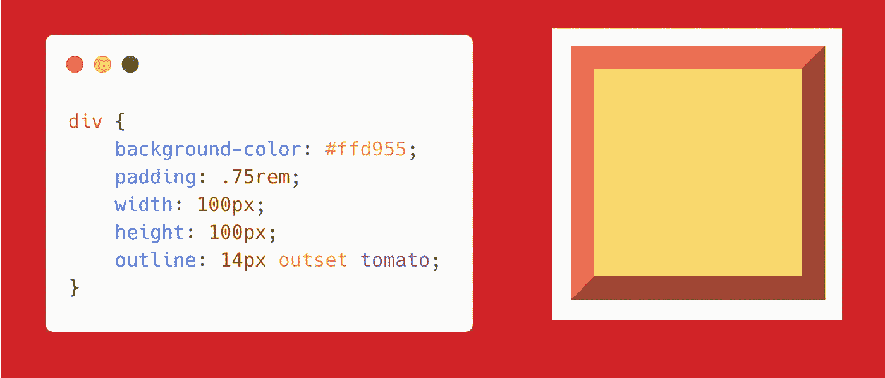

# 使用轮廓 CSS 属性创建漂亮的框

> 原文：<https://levelup.gitconnected.com/create-beautiful-boxes-using-outline-css-property-3ea20975d9a6>

`outline`是容器边框外的一条线。让我们创建一个简单的矩形，并应用一个轮廓，看看有多酷😎确实是。

我们产品线的 syntx 是`**outline: size type color;**`

上面的代码将创建一个漂亮的🖼框架。

可用的值有

`**outline: auto**` **→** 允许用户代理渲染自定义轮廓样式。

`**outline: dotted**` **→** 轮廓是一系列的点而不是实线。

`**outline: double**` **→** 轮廓是两条单线。`outline-width`是两条线和它们之间的空间的总和。

我们也可以使用`**outline-offset**` 属性设置轮廓的偏移量。

`**outline: dashed**` **→** 轮廓是一系列短线段。

`**outline: groove**` **→** 这个轮廓看起来就像是刻在书页上的。

`**outline: ridge**`**→**`groove`的反面。轮廓看起来好像是从页面中挤出来的。

`groove`和`ridge`的区别。

`**outline: inset**` **→** 轮廓使方框看起来好像嵌入在页面中。

`**outline: outset**` →与`inset`相反。轮廓使盒子看起来像是从页面中出来的。

您可以将`outline`设置为`none`，这样它就没有轮廓了。

如果你发现这个有用的惊喜🎁我这里****。****

****开心就分享😃 😆 🙂。****

****跟随** [**Javascript 吉普🚙**](https://medium.com/u/f9ffc26e7e69?source=post_page---------------------------) **如果你觉得值得。****

** [## 学习 CSS -最佳 CSS 教程(2019) | gitconnected

### 43 个顶级 CSS 教程-免费学习 CSS。课程由开发者提交并投票，使您能够找到…

gitconnected.com](https://gitconnected.com/learn/css)**