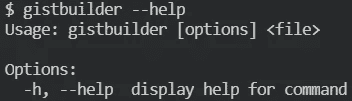
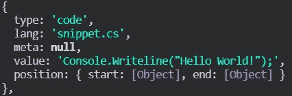
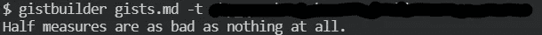
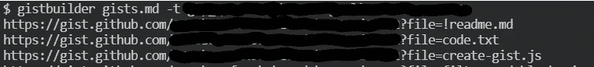
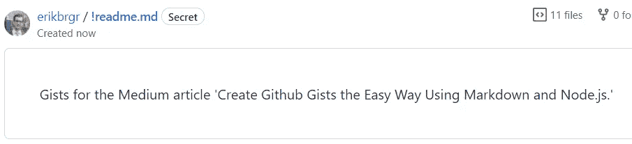

# 创建漂亮的嵌入式代码，没有创建 GitHub Gists 的麻烦。

> 原文：<https://levelup.gitconnected.com/create-beautiful-embedded-code-without-the-hassle-of-creating-github-gists-fe6ce2fa0109>

## 使用 Markdown 和 Node.js 快速简单地创建 GitHub gists。


[李奇伟](https://unsplash.com/@richygreat?utm_source=unsplash&utm_medium=referral&utm_content=creditCopyText)在 [Unsplash](https://unsplash.com/s/photos/github?utm_source=unsplash&utm_medium=referral&utm_content=creditCopyText) 上的照片

GitHub gists 是一种保存和分享代码片段的超级简单的方法。如果你经常写技术文章，GitHub gists 会让你的文章看起来专业得多。

几乎所有与编程相关的出版物，像 [Level Up Coding](https://levelup.gitconnected.com/) 和 [Better Programming](https://betterprogramming.pub/) ，都要求(或者至少高度建议)你使用 GitHub gists。而且理由很充分。

让我们比较一下向 Medium 添加代码片段的不同方法。

首先，使用介质代码块。您可以通过键入 3 个反勾号来创建其中一个，就像这样`````。然后键入或复制粘贴您的代码:

```
Console.Writeline("Hello World!");
```

它有点干净，但是很难看，而且很快就变得难以阅读。您真的只想将这些用于内联代码，使用一个反勾号```，或者可能是一行程序。

添加代码片段的第二种方法是使用屏幕截图:


代码截图。咩。

它看起来很漂亮(特别是如果你使用一个很酷的 VSCode 主题，比如 [Panda Syntax](https://marketplace.visualstudio.com/items?itemName=tinkertrain.theme-panda) )。可读性很强。但它是一个图像，所以复制粘贴代码是不可能的。此外，如果你需要做些改变，你也需要更新你所有的图片。

IMHO，在介质或任何其他地方包含代码片段的绝对最佳方式是使用 GitHub gists:

GitHub Gist ❤️

很干净。它看起来很漂亮。它是可读的。最棒的是，它是可访问的(阅读:可复制-粘贴),无论何时你需要改变什么，你只需前往 GitHub，随心所欲地编辑。

多档 gists 更好。它们允许你将文章的所有片段放在一个地方。然而，在培养基上使用它们是乏味的。我在我的文章[中写了在媒体中使用多文件 GitHub Gists](https://erikbrgr.medium.com/using-multi-file-github-gists-in-medium-f4e40bb9e283)。

虽然创建 gists 很容易，但我发现它把我的注意力从写作上转移开了。还有，我懒。

我大部分写作都是用 Markdown。我喜欢这样的方式，我可以不需要担心格式或样式就能大量生产内容。Markdown 会帮我处理的。所以很自然地，我对我的代码片段使用 Markdown。基本语法实际上与在 Medium 中创建代码块相同。

如何在 Markdown 中创建代码块？

所以我的问题变成了:我如何从 Markdown 代码块创建 GitHub gists？

答案？创建 CLI！

## gistbuilder 简介

我们的 CLI 将非常简单。我想读入一个 Markdown 文件，收集所有代码块，然后调用 GitHub api 来创建一个要点。

因为我们将使用 Node.js，所以让我们从使用`npm init`创建一个`package.json`开始，并将其更改如下:

为了把它变成一个命令行界面，我们将使用`[commander](https://github.com/tj/commander.js/)`包。使用`npm install --save commander`安装。

然后，我们将创建`gistbuilder.js`，它将成为我们 CLI 的入口点。

运行`npm install -g`将我们的包作为 CLI 安装。我们甚至可以免费获得一个`--help`选项！



## 解析降价

样板代码出来后，是时候处理第一步了:解析 Markdown 文件。幸运的是，在正确的软件包的帮助下，这是非常容易的。

首先，从我为本文创建的 [GitHub repo](https://github.com/erikbrgr/gistbuilder) 中获取`[gists.md](https://github.com/erikbrgr/gistbuilder/blob/main/gists.md)`文件。显然，您可以自己制作，但是使用这个将确保您的输出至少与我的相似。`Gist.md`包含我为本文创建的所有片段。

我们为此需要的包是`[unified](https://unifiedjs.com/)`和`[remark-parse](https://remark.js.org/)`，所以让我们使用`npm install --save unified remark-parse`来安装它们。

然后我们需要添加一些`imports`并改变`processFile`功能

运行`gistbuilder gists.md`会将`gists.md`解析后的内容转储到控制台。代码块将如下所示:



注意到`type: 'code'`部分了吗？我们将使用它来过滤出代码块，以创建我们的 gists:

`lang: 'snippet.cs'`实际上是从第一组倒勾号后面的任何东西中抽出来的，就像这样````snippet.cs`。我们将用它来为我们的 gists 创建文件名。

它负责解析 Markdown 并获取我们的代码块。

## 连接到 GitHub

现在我们差不多准备好创建我们的第一个要点了。不过，首先，我们需要从 CLI 登录 GitHub 帐户。最简单的方法是使用个人访问令牌。要创建一个，请在此处填写表格。出于我们的目的，我们只需要选择`gist`范围。

我们还需要将 PAT 传递到 CLI 中。为此，我们使用由`commander`提供的`requiredOption`方法。

为了连接到 GitHub，我们将使用 GitHub 官方支持的`[octokit](https://octokit.github.io/rest.js/v18)`包。一如既往地使用`npm install --save @octokit/rest`进行安装。

为了测试到 GitHub 的连接，我们将调用 GitHub 端点的 Zen:

下面是我们运行`gistbuilder`时的输出:



现在我们已经连接好了，我们可以(最终)创建我们的第一个要点了！将对`getZen`的调用替换为:

再次运行`gistbuilder`将会导致如下结果:



现在，你需要做的就是将这些网址复制粘贴到你的文章中。任务完成。

注意:本文中的所有代码片段都是使用`gistbuilder`创建的。

## 一些附加的想法

在我写这篇文章的时候，我很快发现了上面代码的一个小警告；每次我跑`gistbuilder`，都会产生一个全新的主旨！你可以想象，我的账户里很快就有了几十个相同的要点。不漂亮。

在本文的源代码中，我添加了一个额外的(可选的)选项，`--gist`，它接受一个现有要点的 id(您可以从`gistbuilder`打印的 URL 中获得)。如果提供，`gistbuilder`将在现有要点内更新文件。它留下的文件你可能会删除，但我相信你可以修复，如果你想的话。

出于显而易见的原因，我还添加了一个`--description`选项。

最后，我运用了一个巧妙的技巧来保持你的要点有条理和可识别性。当你查看你的 gist 列表时，你会注意到 GitHub 显示了你的 gist 中的第一个文件。通过添加一个名称以感叹号开头的代码块，就像这个````!readme.md`，你可以很容易地为你的要点添加一个更好的描述。



给你的要点添加一个更好的描述。

因为它是减价的，你可以想怎么花就怎么花！

## 最后

我们从这篇文章中学到了很多:

*   嵌入代码片段的不同方式。
*   如何使用`commander`创建一个非常简单的 CLI？
*   如何使用`unified`和`remark-parse`解析降价文件？
*   如何使用`octokit`创建和更新 GitHub gists？

感谢阅读，希望这篇文章对你有用。你显然可以在 GitHub [的](https://github.com/erikbrgr/gistbuilder)这里找到`gistbuilder`的源代码。

编码快乐！

如果您喜欢这篇文章，您可能会发现这两篇文章也很有用。

 [## 在媒体中使用多文件 Github Gists

### 当一个要点不行的时候。

erikbrgr.medium.com](https://erikbrgr.medium.com/using-multi-file-github-gists-in-medium-f4e40bb9e283) [](https://javascript.plainenglish.io/essential-extensions-for-visual-studio-code-32eaec6c6054) [## Visual Studio 代码的基本扩展

### 专注于你的代码，别无他求。

javascript.plainenglish.io](https://javascript.plainenglish.io/essential-extensions-for-visual-studio-code-32eaec6c6054)