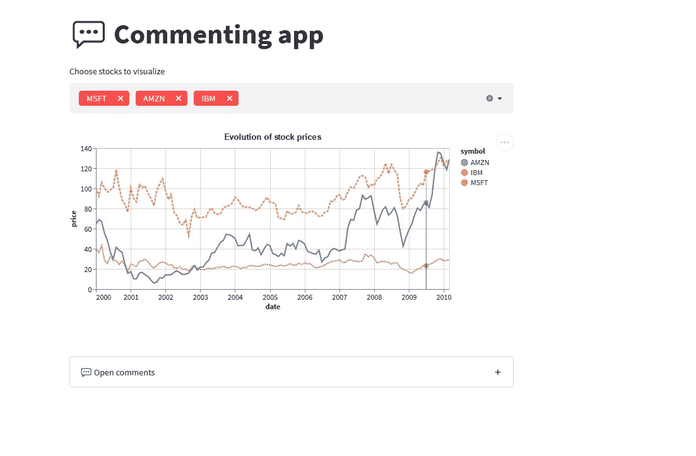
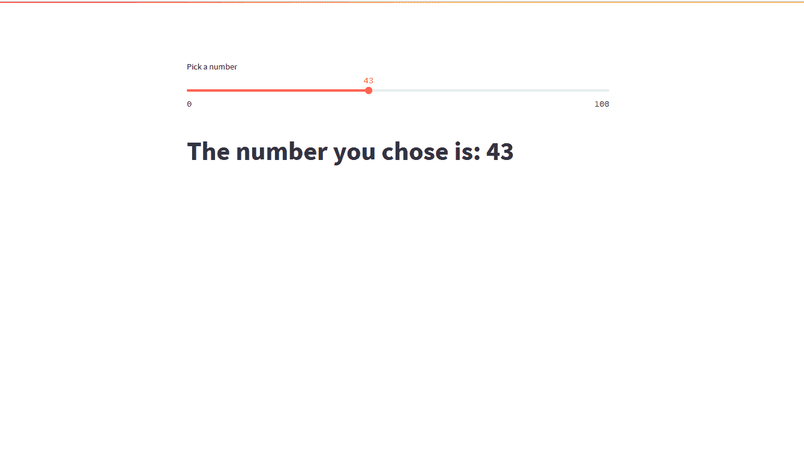
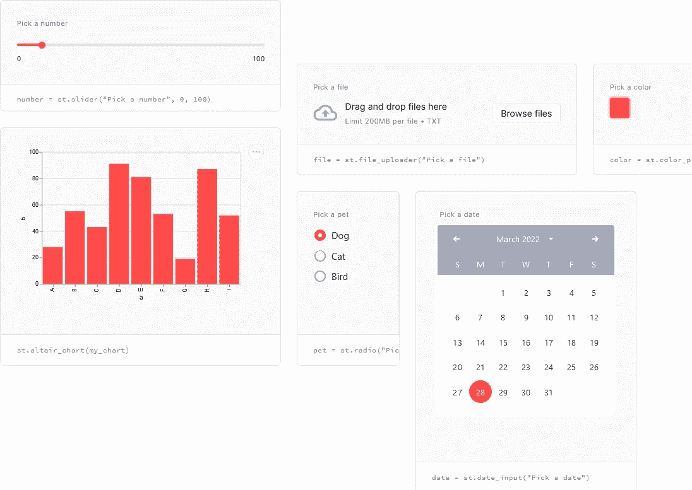
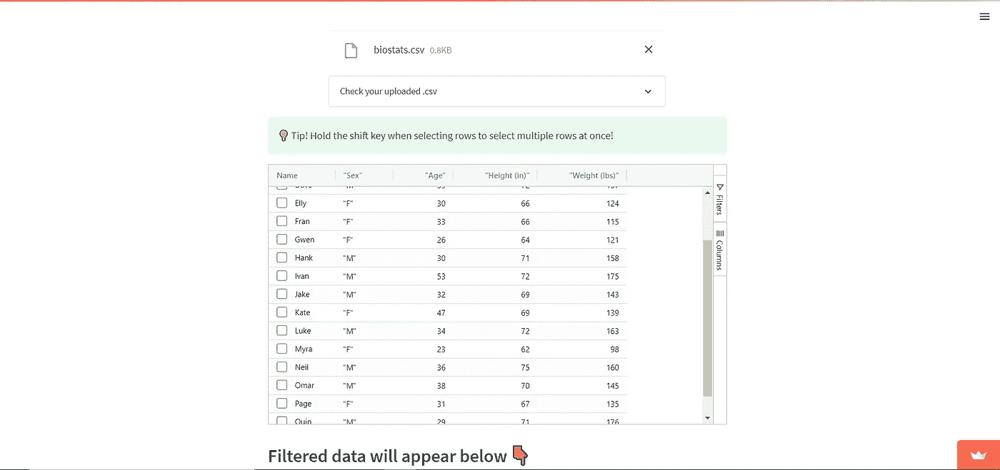
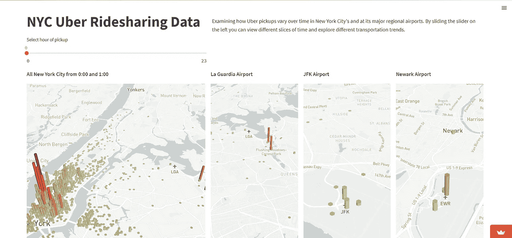

# 无需前端代码即可创建漂亮的 Web 应用程序

> 原文：<https://levelup.gitconnected.com/create-beautiful-web-apps-with-no-front-end-code-3b4ae3e30462>


潘卡杰·帕特尔在 [Unsplash](https://unsplash.com?utm_source=medium&utm_medium=referral) 上的照片

当你第一次学习计算机科学时，你的大部分 I/O 被限制在一个终端或控制台上，在那里你输入你最喜欢的书的名字或你最好朋友的生日。你正在学习这门语言的逻辑，你可能会担心让所有的东西看起来都很遥远。

在一个全栈 web 应用程序主宰市场的世界里，能够在一个真实、可用的例子上运行演示来实时查看您的代码会更加有用。

但是制作一个 web 应用程序并不是一件简单的事情。当然，你有像 Django 和 Flask 这样的超级开发的框架来帮助你，但是它们仍然需要一些概念，这些概念可能需要花费额外的时间来学习，然后你才能构建一个工作的 web 应用程序。

这就是 Streamlit 的用武之地，它是一个 Python 包，可以将几乎任何脚本转换成漂亮的 web 应用程序，而无需接触专用的后端框架。

[](https://streamlit.io/) [## Streamlit *构建和共享数据应用的最快方式

### 用我们神奇简单的 API，用几行代码构建一个应用程序。然后看到它随着你的迭代自动更新…

streamlit.io](https://streamlit.io/) 

# 为什么要简化

网络应用无处不在:从 YouTube 到网上银行门户，几乎每个大公司都涉足全栈开发。学习如何创建和管理它们对于大多数软件工程师，甚至是习惯性的程序员来说几乎是不可避免的。例如，如果你曾经参加过黑客马拉松比赛，那么项目通常都有可以通过 Streamlit 简化的 web 界面。

> Streamlit 可以在几分钟内将数据脚本转化为可共享的 web 应用程序。全是纯 Python。不需要前端经验。
> 
> — [Streamlit 官网](https://medium.com/blogging-guide/medium-block-quotes-and-pull-quotes-cad22620423c)

然而，将现有程序集成到 web 框架中往好了说可能是乏味的，往坏了说可能是灾难性的，尤其是在时间紧迫的情况下。Streamlit 旨在制作漂亮的 web 应用程序，而不必处理 web 开发带来的复杂性。



一个不到 70 行代码的评论应用程序。[来源](https://streamlit.io/)

# Streamlit 的工作原理

## 安装 Streamlit

首先，Streamlit 是用 **Python** 编写的。如果你还没有，通过官方安装程序安装 Python。

[](https://www.python.org/downloads/) [## 下载 Python

### 关于特定端口的信息、开发人员信息来源和二进制可执行文件由发布经理或……

www.python.org](https://www.python.org/downloads/) 

然后，您需要通过 *pip 安装 Streamlit。*在终端中运行以下命令:

```
python3 -m pip install streamlit
```

安装软件包。让我们测试一下它是否安装正确。在 python 文件中键入以下内容:

```
import streamlit as stnumber = st.slider("Pick a number", 0, 100)
st.write("""
# The number you chose is: {}
""".format(number))
```

和类型

```
streamlit run test.py # REPLACE TEST.PY WITH YOUR FILENAME
```

您应该会看到以下屏幕:



Streamlit 在行动！

## 使用细流

Streamlit 内置了许多小部件，可以满足大多数使用情况。您也可以制作自己的[并找到社区制作的组件来满足您的需求](https://docs.streamlit.io/library/components/create)。



简化组件。https://streamlit.io/

你可以把这些连接在一起，做一些看起来很酷的网站！



不到 200 行的 CSV 浏览器。来源:https://streamlit.io/gallery



streamlit 的更复杂的使用，具有交互式 3D 绘图。来源:[https://streamlit.io/gallery](https://streamlit.io/gallery)

你也可以在这里找到更多的例子:

[](https://streamlit.io/gallery) [## 画廊* Streamlit

### Streamlit 是一个面向机器学习和数据科学团队的开源应用框架。在…中创建漂亮的 web 应用程序

streamlit.io](https://streamlit.io/gallery) 

使用 Streamlit，您可以做很多事情，而且非常容易上手。如果您正在寻找一种快速的方法来制作一个漂亮的 web 应用程序，而没有 web 开发带来的所有复杂性，请尝试 Streamlit！

# 最后的想法

Web 开发可能是一项令人望而生畏的任务，但也不尽然。Streamlit 是一个非常棒的工具，适合任何想要快速创建一个漂亮的 web 应用程序的人。你以前用过 Streamlit 吗？请在下面的评论中告诉我！

随时在 [LinkedIn](https://www.linkedin.com/in/saleguas/) 上和我联系！