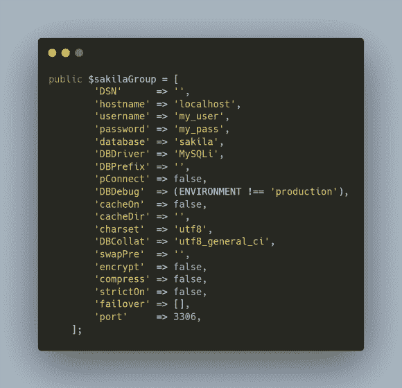

# 使用命令行生成器创建 CodeIgniter 4 模型

> 原文：<https://levelup.gitconnected.com/create-codeigniter-4-models-with-command-line-generators-efdbaa3aeb2f>

我在编码项目中尽可能地节省时间。在 CodeIgniter 4 中，有一些方便的命令您可以使用，并在设置基础文件搭建时节省大量时间:[命令行生成器](https://codeigniter4.github.io/CodeIgniter4/cli/cli_generators.html) (CLG)。我最近探索了将 clg 用于模型搭建，并对节省的时间印象深刻。


当您[订阅 ***OpenLampTech*** 时事通讯](http://openlamptech.substack.com)时，会收到一本我的电子书*《给每个人的 10 个 MySQL 技巧】*。

我最近在开发一个 CodeIgniter 4 应用程序，它与不同的数据库有不同的连接。

## CodeIgniter 4: php spark 命令

在 CodeIgniter 4 中，用 CLG 来搭建你的基础模型非常简单。您可以在项目的根文件夹中运行`php spark`命令，并生成代码。

如果我想制作一个带有`Model`后缀的名为`Important`的模型，这个命令可以做到:

```
php spark make:model Important --suffix
```


## CodeIgniter 4:多个数据库连接

我们可以在一个项目中拥有不同的数据库连接，并在`app/Config/Database.php`文件中创建额外的*连接组*数组。如果我需要单独连接到 Sakila 数据库，我可以用连接信息创建下面的`$sakilaGroup`数组:



## CodeIgniter 4: -dbgroup 标志

如果您希望您的模型有一个特定的数据库连接组而不是`$defaultGroup`，您可以在创建模型时在 CLG 命令中为该组命名为`-dbgroup`标志。

```
php spark make:model Important2 --dbgroup sakilaGroup --suffix
```


`-dbgroup`标志设置模型中受保护的`$DBGroup`类属性，如上面的屏幕截图所示。

在您的下一个项目中尝试 CodeIgniter 4 命令行生成器，并在模型、控制器、实体和其他几个类的基础代码搭建上节省时间。

## CodeIgniter 4 附加阅读

*   [CodeIgniter 4 查询参数绑定与 MySQL 中的例子](https://joshuaotwell.com/codeigniter-4-query-parameter-binding-with-examples-in-mysql/)
*   [CodeIgniter 4 查询构建器 join()方法讲解](https://joshuaotwell.com/codeigniter-4-query-builder-join-method-explained/)
*   [OpenLampTech 第 15 期— CodeIgniter 4 select()方法深度](https://joshuaotwell.com/openlamptech-issue-15-codeigniter-4-select-methods-in-depth/)

感谢你阅读这篇文章。请与同样喜欢它的人分享。

[Josh Otwell](https://joshuaotwell.com/about/) 作为一名 PHP 开发人员、SQL 专家和技术博客/作家，他有着成长的激情。

免责声明:本帖中的大多数示例都是在个人发展/学习工作站环境中执行的， ***不应被视为生产质量或就绪*** 。您的特定目标和需求可能会有所不同。像往常一样，**你能做某件事并不意味着你应该做**。我的观点是我自己的。

***我能帮助的更多方面***

*   开博客？我用 WordPress 来写数字猫头鹰的散文博客。让我们都在提供的计划上省钱。
*   通过在[***OpenLampTech***时事通讯](http://openlamptech.substack.com/)中投放价格合理的分类广告，让你的品牌、产品或服务得到应有的关注。
*   需要托管你的下一个网络应用程序或 WordPress 网站吗？我强烈推荐 [Hostinger](https://www.hostg.xyz/aff_c?offer_id=6&aff_id=94641) ，用它们来托管[我的小众鲈鱼钓鱼网站](http://louisianabassnation.com/)。该服务是首屈一指的，他们提供免费的 SSL。
*   作为一名自学成才的开发人员，我逐渐认识到的 5 个事实

***披露*** :本帖部分服务和产品链接为附属链接。在没有额外费用给你，你应该通过点击其中一个购买，我会收到佣金。

当你[订阅 ***OpenLampTech*** 时事通讯](http://openlamptech.substack.com)时，就可以收到一本我的电子书*《给每个人的 10 个 MySQL 技巧】*。

📰通过在 ***OpenLampTech*** 时事通讯中投放价格合理的分类广告，让您的品牌、产品或服务获得所需的关注[。谢谢大家的支持！](https://ko-fi.com/s/7dfe9ce108)

*原载于 2022 年 10 月 26 日 https://joshuaotwell.com**[*。*](https://joshuaotwell.com/codeigniter-4-models-with-command-line-generators/)*