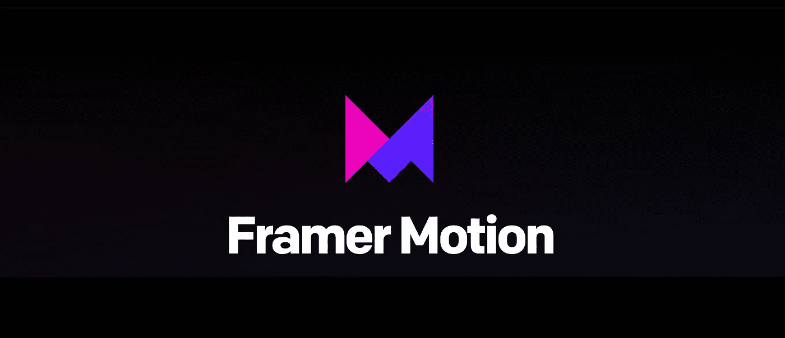
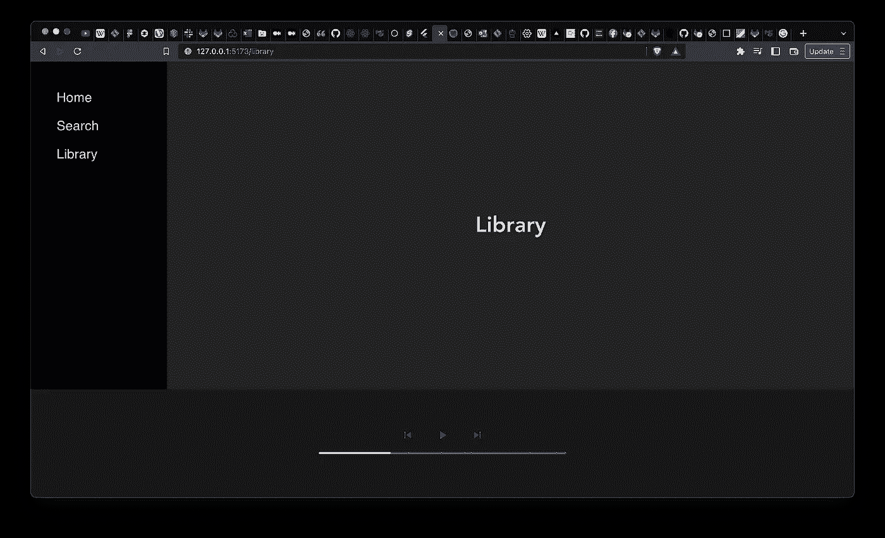
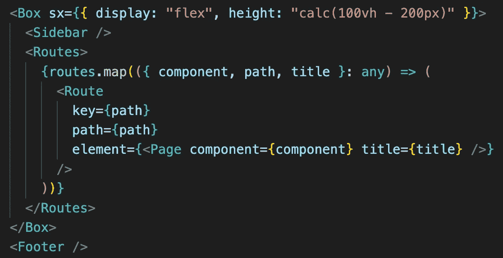
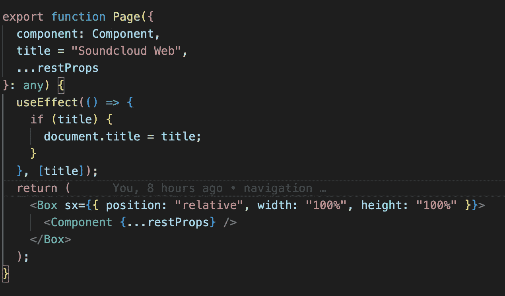
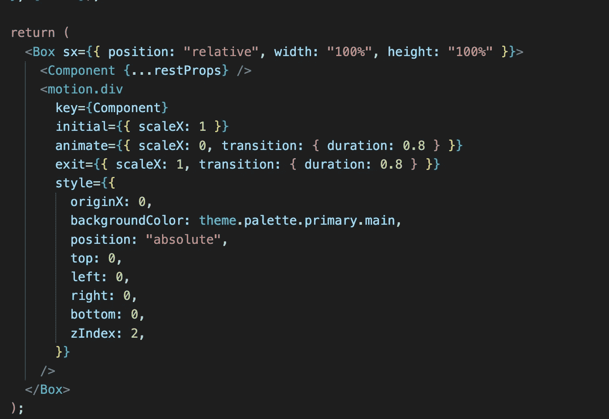
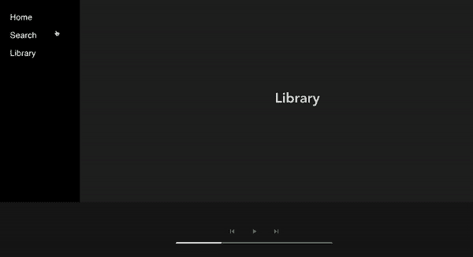

# 创建冷静的页面导航动画反应与帧运动

> 原文：<https://levelup.gitconnected.com/create-cool-page-navigation-animation-in-react-with-framer-motion-c08ed58d2b94>



最近我试图克隆 Spotify 的基础作为一个研究项目。我认为 Spotify 的导航部分很棒，但它对我来说缺少一些东西，它是一个动画。作为一个游戏爱好者，我喜欢动画效果，所以我试着在克隆页面时添加一些动画

成帧器运动是 React 的一个生产就绪的运动库。它简单而强大，允许您用健壮的语义标记来表达复杂的用户交互。

首先，让我们看看布局



我在右边有一个侧边栏，在底部有一个页脚，在页面的左边有一个主页，代码是这样的:



目前，点击侧边栏上的任何重定向只是一个简单的重定向。所以现在我要用`Page`组件在每个页面上实现动画，现在让我们看看`Page`组件



成帧器 motion 有很多组件，但是要用 Motion 做一个简单的动画，我们只需要`motion`组件，所以让我们导入它

```
import { motion } from "framer-motion";
```

每个 HTML 和 SVG 元素都有一个`motion`组件，例如`motion.div`、`motion.circle`等。

这些工具的工作方式与静态工具完全一样，但是提供了一些支持，允许您:

*   通过一个简单的道具制作动画。
*   添加拖动、平移、悬停和点击手势。
*   用动画回应手势。
*   通过变体在整个反应树中进行深度动画制作。

在这个例子中，我只想在浏览站点时做一个简单的滑入动画，所以实现如下:



你可以看到它们都是 CSS 属性，`scaleX`用 transition 属性来控制元素的水平缩放。

`initial`属性用于设置`initial`动画属性，这里是`scaleX`。

然后我们通过将`scaleX`设置为 0 来`animate`组件。这将是结果:



如果你发现任何令人困惑的事情，在下面提出问题，或者在这里跟随我的[源代码](https://github.com/leduc1901/spotify-web)

# 遗言

虽然我的内容对每个人都是免费的，但是如果你觉得这篇文章有帮助，[你可以在这里给我买杯咖啡](https://www.buymeacoffee.com/kylele19)