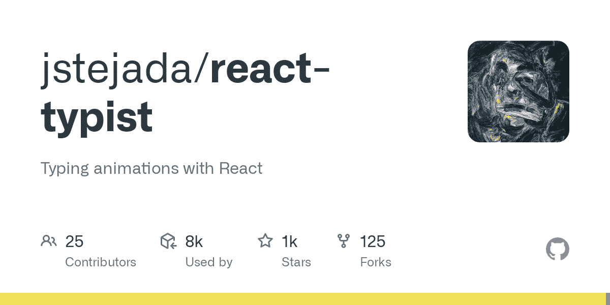
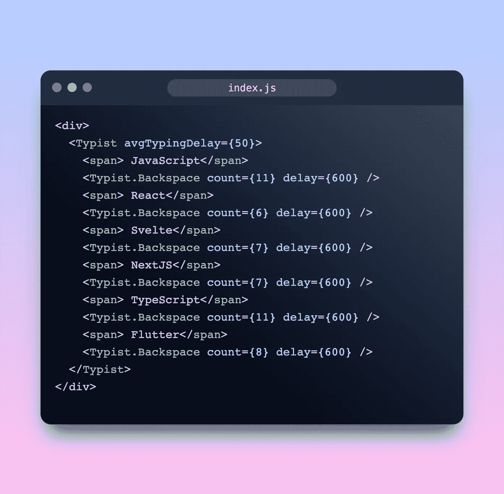
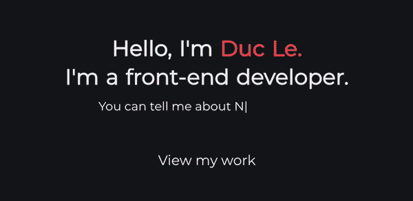

# 在 React 中创建酷打字动画

> 原文：<https://levelup.gitconnected.com/create-cool-typing-animation-in-react-with-reacttypist-325ead12f282>



# 反应打字员

React 打字员是一个非常容易使用的打字动画库。

我们先来看看:

```
yarn add react-typist
```

然后将库导入我们的应用程序:

```
import Typist from 'react-typist';
```



我们用`Typist`包装我们想要添加动画的组件。
我们可以配置`avgTypingDelay`来设置每种类型之间的平均延迟时间。

最后，`Backspace`完成了它的工作，这是最终产品:



**如果你喜欢，你可以给我一个掌声和一个跟随，感谢阅读！**

# 遗言

虽然我的内容对每个人都是免费的，但是如果你觉得这篇文章有帮助，[你可以在这里给我买杯咖啡](https://www.buymeacoffee.com/kylele19)