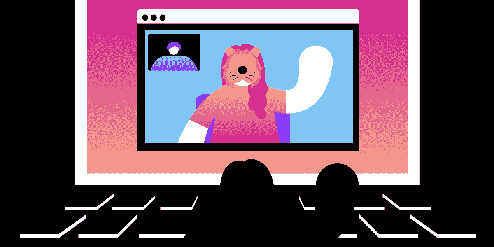
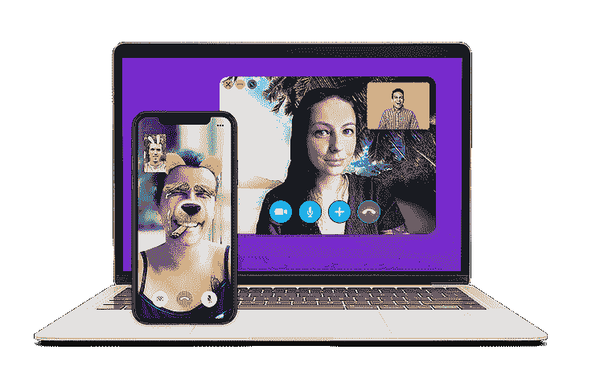
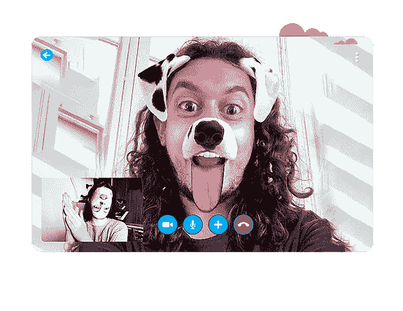
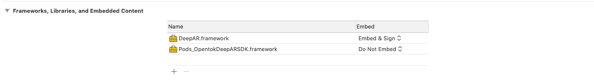
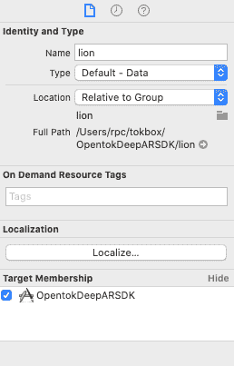
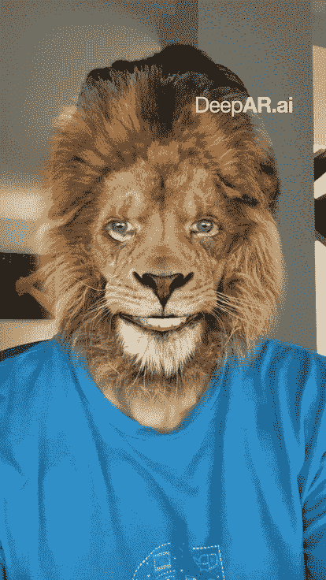

# 使用 Vonage Video API 和 DeepAR 创建自定义 AR 滤镜

> 原文：<https://levelup.gitconnected.com/create-custom-ar-filters-with-vonage-video-api-and-deepar-5f38ed3a43bf>

使用人工智能的增强是视频通话的未来。它将帮助我们打破(虚拟)坚冰，帮助导航互动视频中的新兴用例，如购物和远程协助，并创造全新的体验。这些体验的未来发明者可能正“坐”在虚拟教室里，由虚拟视频塑造，前无古人。

作为 Vonage 视频 API 开发人员，您可以将我们的视频 API 与 [DeepAR SDK](https://www.deepar.ai/) 集成，以丰富您用户的视频参与体验。

您可以通过抽象背景(替换、模糊、像素化对象)来使视频通话更加专业，或者通过改善照明和微妙的肤色效果来改善用户体验。

或者从 DeepAR 的各种动画滤镜中获得更多乐趣。

# 我们日常生活中的增强现实

你很有可能已经参加过一次视频会议，无论是工作会议、医生会诊还是家庭聚会。

在这种新的以视频为中心的会议模式中，许多新的应用可以增加视频通信的价值。让我们回顾一下增强被用来改善用户体验和帮助我们更有效地进行远程交互的几种常见方式:

## 背景抽象

视频通信的改进之一是通过简单的背景模糊、像素化或替换功能来抽象用户背景中的一切。好处包括:

*   启用呼叫者隐私
*   通过消除干扰来促进观众参与
*   创造品牌体验

## 扬声器增强

另一个通过 AR 将视频通话提升到更高水平的例子是对前景扬声器应用过滤器。实施这些类型的过滤器可以让您的用户:

*   借助光线、肤色和美颜滤镜，轻松进行视频通话
*   用有趣的敌意来取悦和娱乐
*   与 3D 对象甚至虚拟人脸绘画进行实时交互

Vonage 视频 API 的灵活性使其在与 DeepAR 等 AR 合作伙伴集成时成为可能。在这篇博文中，我们将展示如何结合使用这两种 API 来实现上述用例。

# DeepAR 是什么？

DeepAR 是一个移动和 HTML5 优化的 AR 引擎，用于增强现实、人脸过滤器、背景分割、化妆、美容过滤器和 animoji。

[DeepAR SDK](https://www.deepar.ai/augmented-reality-sdk) 让开发者可以访问 DeepAR 引擎，管理跨设备支持，并附带一个 DeepAR Studio 工具来帮助你创建 AR 资产。

## 使用 DeepAR

要将 DeepAR SDK 框架添加到您的 iOS 应用程序中，您需要从他们的网站[https://developer.deepar.ai/](https://developer.deepar.ai/)下载 zip 文件。一旦有了 zip 文件，就需要解压缩它，并将框架文件拖到 Xcode 项目中。

不要忘记将框架的`embed`设置为“嵌入&符号”，否则应用程序在运行时可能找不到库。

一旦你有了这个设置，下一步就是去[https://developer.deepar.ai/](https://developer.deepar.ai/)创建一个项目来获得你以后需要的应用密钥。

# 将狮子添加到捕获的视频输入中

在这篇博文中，我们将创建一个 UIView，你可以在其中显示前置摄像头的内容，当检测到你的脸部时，会用一只很酷的狮子来增强。

如果你想在一个地方看到这篇文章的所有代码，你可以在 [DeepAR GitHub](https://github.com/DeepARSDK/vonage-ios-swift) 上找到。

在代码中，你需要处理两个类；一个是 DeepAR SDK 的 CameraController，这个类负责访问设备摄像头并从中获取图像。一旦它有了视频提要，它就把它们发送给 ARView 实例，这是另一个你必须实例化的类。

ARView 负责显示应用了 AR 滤镜的相机的内容。ARView 是一个常规的 UIView 子视图，因此您需要将它添加到应用程序视图层次结构中的任何父视图中。

了解了这一点，代码可能如下所示:

在上面的代码中，首先创建 CameraController，然后创建 ARView 实例，使用它作为全屏的框架，因为我们将显示它占据整个屏幕。

请注意，我们将`self`指定为 ARViewDelegate，因此您需要实现/遵守 ARView delegate 协议。我们以后会需要它。

一旦有了这两个实例，就将 CameraController 实例的 ARView 属性分配给我们的视图，并将其插入到我们的`parentView`中。

剩下的唯一一件事就是通过调用`startCamera`初始化视图并从摄像机中捕获视频。

如果您运行您的代码，您会注意到没有🦁因为我们还没有激活这个效果。

为此，您需要实现`didInitialize`，ARViewDelegate 的一个方法，一旦 ARView 完成初始化，我们将调用它，然后我们可以激活 lion 过滤器。

为此，您需要在项目中添加一个名为“lion”的文件。你可以在 https://developer.deepar.ai/downloads 得到的免费过滤包中找到它。下载完成后，您需要将文件“lion”拖到 Xcode 项目的根文件夹中，并检查它是否以您的应用程序为目标，因此它是与它捆绑在一起的。

如果您此时运行该应用程序，您应该会看到您的面部有一个很酷的狮子覆盖图，它会跟随您的所有动作和手势。

# OpenTok 和自定义视频驱动程序

大多数开发人员与 Vonage 视频 API 交互的方式是通过 OpenTok SDK。SDK 最激动人心的功能之一是可以创建视频驱动程序，将任何类型的视频内容发送到您的发布者所连接的 OpenTok 会话。

视频驱动程序可以分为两个不同的部分:

*   一方面，我们有视频捕获器，顾名思义，它必须从任何来源捕获视频(或以某种方式生成自己的视频)，并向 SDK 提供将要发送的视频帧。
*   另一方面，我们有视频渲染器，您可能已经猜到了，它负责渲染通过订阅者从 OpenTok 会话远程传来的视频帧。

如果您使用过 OpenTok SDK，您可能会注意到，在典型的场景中，您不需要处理这些类。这是因为 OpenTok SDK 附带了默认的捕获器和渲染器，可以从默认的系统摄像头捕获视频，并使用每个平台的图形技术(无论是 Metal、OpenGL 还是 DirectX)渲染远程视频帧。

视频驱动非常强大。您可以创建视频驱动程序来发送任何视频内容。例如，您可以捕获任何游戏引擎的输出，并将这些视频帧发送到 OpenTok SDK，并且您可以将游戏内容流式传输给 OpenTok 会话的任何参与者。您还可以应用任何渲染过滤器，如 B&W 或边缘检测，使任何订户看起来都不一样。

# 创建 OpenTok 自定义视频捕获器

虽然创建一个自定义的视频捕获器看起来是一项复杂的任务，但它可能比您所能想象的更简单。

根据您选择的语言和平台，您只需要实现一个接口、扩展一个类或者符合一个协议。虽然，正如你在上面看到的，我们在这篇文章的源代码示例中使用了 swift 和 iOS。

在该类中，您需要实现或覆盖一些控制捕获器生命周期的基本方法。您需要实现`init`、`startCapture`、`stopCapture`、`isCaptureStarted`方法，以及一个指定捕获器设置的方法，包括指定捕获器将要发送的视频帧的高度、宽度、帧速率和像素格式。

实现这些方法后，您需要向捕获器提供帧。根据平台的不同，可能会有所不同，但通常情况下，您只需要用视频帧数据调用一个方法。

让我们看看最初的实现是什么样子的，

以上是自定义捕获器的必要代码。正如您所看到的，您需要实现 OTVideoCapture 协议，该协议具有在需要初始化、启动或停止视频捕获器时调用的方法。有一个内部标志来知道捕获开始的时间是很常见的，这就是我们在这个基本实现中所做的。我们将在开始和停止方法中更新该标志。

你会注意到这个类继承自`NSObject`，因为这在 swift 类中并不常见，swift 类只是继承自 Object。背后的原因是 OTVideoCapture 协议继承了 NSObject 协议，主要是因为 OpenTok SDK 代码库大多是 Objective-C 而在这种语言中，所有的东西都继承了 NSObject。

一旦有了这样的类，下一步就是告诉发布者，不要使用默认的捕获器，它需要使用我们的类。代码看起来像这样:

我们在上面的代码片段中构建的捕获器还没有发送任何东西，因为它只包含初始化代码。如果你尝试使用我们现在拥有的，它应该工作，但你将只发布黑色框架。下一步是知道如何发送帧。

但是我们将延迟这一部分，直到我们有一些帧要发送，那些帧将是我们 DeepAR 视图的输出。

# 集成 DeepAR 和 OpenTok

我们已经到了博文的最后一部分，在第一部分我们看到了如何构建一个基本的视频捕捉器，在第二部分，我们看到了如何用一个狮子的 AR 滤镜代替你的脸。我们的定制视频捕获器中唯一缺少的是发送视频帧，所以看起来我们已经为最后一步做好了一切准备。

在这一步，我们将把两个世界连接在一起；我们需要做几件事。首先，我们需要获得 ARView 正在制作的视频帧，其次，我们需要使用我们构建的视频捕获器发送它们。

第一步包括从视图中获取图像。这可以通过设置 ARView 委托或侦听器来快速完成。当框架可用时，实现侦听器接口的委托或类将收到对其方法的调用。一旦发生这种情况，我们需要将该帧发送到 OpenTok 世界。

如果你还记得，我们已经设置了 ARView 的委托，并且在它的`didInitialize`方法中我们启用了 lion 过滤器，现在我们需要告诉 ARView 我们想要获取它的视频帧。这是使用下面的代码完成的:

第一行是我们在博文的第一部分中看到的，第二行是我们请求 ARView 用 AR 视图的内容调用另一个委托方法。

做完这些之后，我们需要实现`frameAvailable`方法，每次视频帧准备好的时候都会调用这个方法。在该方法中，我们将把它的内容发送给 OpenTok capturer。

你可能已经注意到了最后一行中的`pushFrame`方法，这个方法是我们连接 DeepAR 视图和 OpenTok 视频捕获器的地方，如果你还记得的话，deepARCapturer 是我们使用的自定义视频捕获器的名字。

这可能是博文中最复杂的部分。我们正在处理 CoreImage 和 CoreVideo iOS 框架，以获取帧的 RGB 信息。

为了让一切正常工作，我们需要在 DeepARVideoCapturer 中实现 pushFrame，它看起来像这样:

让我们一步一步来理解这个方法。正如你所看到的，我们把它分成了三个部分。

在第 1 部分(上面用//1 标记)，我们构建了一个新的`OTVideoFrame`实例。这个`OTVideoFrame`类充当视频帧信息的容器，我们将在稍后将该帧提供给 OpenTok SDK 时使用它。典型地，视频帧将包含其格式信息(RGB、YUV 等。)、尺寸、视频帧中的一行所占的字节数，显然还有视频帧信息。

您可能想知道为什么我们需要行字节大小，视频帧格式解释起来很复杂，并且有不同的格式，但通常，它有助于了解视频帧信息缓冲区有多大。你可以用每行的字节数乘以图像高度，你就有了。有时，行的大小不是通过将像素的大小乘以图像的宽度来计算的，因为有时会添加额外的空像素作为填充。

如果这最后一段让你感到困惑，不要担心，你不知道在那里放什么，因为 CoreVideo functions 会为你返回它。

回到我们的核心，如你所见，我们将在每一帧中重用“容器”,考虑到这个函数每秒将被调用 30 次。

在创建了 OTVideoFrame 的一个实例并用所有视频帧中不变的信息填充它之后，我们可以移到第 2 部分(// 2)。

在本节中，在做任何事情之前，我们锁定视频帧的内容，以防止任何其他线程在我们访问它时可以更改或删除它，我们可以通过调用`CVPixelBufferLockBaseAddress`来做到这一点，之后，我们通过调用 CVPixelBufferGetBaseAddress 来获得指向帧信息的指针，最后，我们将该信息添加到我们的 OTVideoFrame 实例中。

如前所述，有不同类型的视频帧格式。这里我们将使用 ARGB，它通常被称为像素图像格式。这意味着缓冲区由一系列用四个值编码的像素信息组成，一个值用于 Alpha 通道，其他值用于 R、G 和 b。

还有其他格式，如 YUV422，它被称为平面图像格式，这是因为图像被分成不同的平面。

我们解释这个是为了理解`frame.planes?.addPointer()`调用，因为我们使用的是 ARGB，它有一个平面，这就是我们如何用帧数据填充 OTVideoFrame 实例。

最后，有了包含视频帧信息和内容的完整 OTVideoFrame 实例，我们只需将其发送到 OpenTok SDK，以便通过网络发送给其余的会话参与者。你可以在第 3 部分用`videoCaptureConsumer?.consumeFrame(frame)`调用来实现。

`videoCaptureConsumer`是 OTVideoCapture 协议的成员，该成员是在 OpenTok SDK 初始化`OTVideoCapturer`时设置的，每当你想向会话发送一个视频帧时，就需要调用这个方法。

在所有这些步骤之后，您已经为构建一个 Publisher 做好了一切准备，该 Publisher 将把 DeepAR magic 的内容发送到 OpenTok 会话，并以您狮子般的外观给每个人留下深刻印象。

# 刚刚开始

Vonage Video API 团队致力于在 AR 产品功能和合作伙伴关系方面进行投资，以确保我们的客户在构建和改善交互式视频体验时能够获得最佳的技术和专业知识。

随着 Vonage 发展我们的视频 API，我们看到了对合作伙伴提供的服务的需求增加。我们很高兴能与全球优秀的技术、应用和集成公司合作。有了 Vonage，您可以充分利用我们的通信 API，获得更大的份额。

您可能还喜欢:

*   教程:[在带有 Vonage 视频的 Javascript 中使用绿色屏幕](https://www.nexmo.com/blog/2020/06/24/use-a-green-screen-in-javascript-with-vonage-video)
*   教程:[用 Vue.js 和 Flask](https://www.nexmo.com/blog/2020/06/25/create-a-photobooth-with-vue-js-and-flask-part-1-dr) 创建一个照相亭
*   寻找合作伙伴:[通信 API 合作伙伴](https://www.vonage.com/partners/find-partner/#c=communications-apis&g=1)

*最初发布于*[*https://www . NEX mo . com/blog/2020/09/01/create-custom-ar-filters-with-vonage-video-API-and-deepar*](https://www.nexmo.com/blog/2020/09/01/create-custom-ar-filters-with-vonage-video-api-and-deepar)