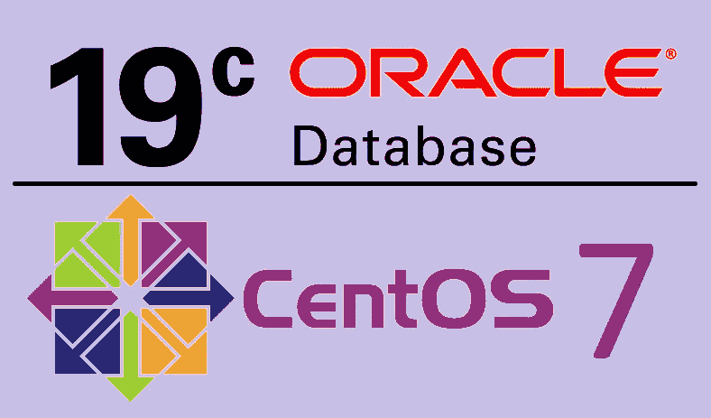

# Oracle 数据库-创建自定义监听程序，并将其注册到 Oracle 数据库 19.3c 中的 PDB

> 原文：<https://levelup.gitconnected.com/create-custom-listener-and-register-it-to-a-pdb-f6c709d23054>

在前面的故事中，我们已经介绍了如何创建 CDB 和 pdb。

1.  *第 1 部分* — **在 CentOS 7 上安装 Oracle 数据库 19.3 c-:**[https://kalanaejayasuriya . medium . com/Install-Oracle-Database-19-3c-on-CentOS-7-52036876436](https://kalanaejayasuriya.medium.com/install-oracle-database-19-3c-on-centos-7-52036876436)
2.  *第二部分* — **Oracle 数据库 19.3c —多租户架构，创建 CDB 和 PDB-:**[https://kalanaejayasuriya . medium . com/Oracle-Database-multi tenant-Architecture-Create-CDB-and-PD b-4a 9bb 954803 b](https://kalanaejayasuriya.medium.com/oracle-database-multitenant-architecture-create-cdb-and-pdb-4a9bb954803b)

在这一部分，我将谈论监听器，以及我们如何向监听器注册 PDB。在我们开始之前，让我们谈谈听众。

# **甲骨文里的监听器是什么？**

如果我们简单的解释，监听器是用户和服务器之间的中间件。

如果我们提前讨论，监听器是一个服务器端进程，它可以监听来自客户端的传入请求，并管理到数据库的流量。

如果没有监听器，客户机就无法与服务器通信。

此外，一个监听器可以监听一个或多个数据库，一个数据库可以监听一个或多个数据库。

收听者的功能

使用侦听器建立连接；听众需要完成以下要求。

1.  Host -:监听器运行的位置。
2.  端口-:监听程序正在使用此端口进行监视。
3.  协议-:监听程序使用的方法。
4.  服务名-:监听器正在处理的位置。

通过以上学习，我想你已经对听者有了一些了解。我们不讨论如何在 Oracle 数据库中手动创建监听器。在上一部分中，我们没有创建侦听器，因为稍后可能会出现多个错误。

**步骤 1 -:** 导航到**“数据库/bin”**，有一个名为**“netca”**的文件。通过执行它，我们可以打开网络向导。

**步骤 2 -:** 要执行**“netca”**，我们必须使用终端。研究下图片。单击下一步

下一步，我们必须给我们的监听器取一个名字。就我而言，我把它命名为“听众 _TST”。

现在我们必须为我们的监听器设置一个端口号。我们可以设置默认端口号为 1521。但是在这种情况下，让我们尝试一个自定义端口号。因此选择**“使用另一个端口号:”**并输入**“1522”**作为自定义端口号。

**步骤 5 -:** 现在监听器创建任务结束了。然后我们可以试试监听器是否工作。因此，打开终端，键入**“lsnrctl start LISTENER _ TST”。**该命令将启动您的定制监听器。您将看到图像的结尾“监听器不支持任何服务”。发生这种情况是因为我们没有向我们的侦听器注册 ani PDB。

**步骤 6 -:** 要停止监听器，请键入**“lsnrctl stop LISTENER _ TST”。**

现在我们配置了我们的定制监听器。下一步是向我们的听众注册我们的 PDB。除非客户端无法与服务器建立连接。

# **向听众注册 PDB**

首先，我们必须启动我们的实例。键入**“sqlplus/as SYSDBA”。**

**步骤 2 -:** 打开您在 dbca 向导中创建的名为**“pdb test”的 PDB。**

**步骤 3 -:** 现在定义我们的定制监听器并注册到实例。我们的定制听众是**“听众 _TST”。**

您可以看到，我在主机下面加了下划线，因为每个系统中的主机都不相同。因此，您必须找到自己的主机名。为此，打开另一个终端并尝试这些命令。

1.  **主机名**
2.  **主机名 ctl**
3.  **cat/proc/sys/kernel/hostname**

现在你已经向监听器注册了你的 PDB。但是，要应用更改，您必须关闭 PDB，然后再打开它。之后，您可以从 sqlplus 中退出。请记住不要关闭您的实例。

**第 5 步-:** 现在您可以通过键入**“lsnrctl start LISTENER _ TST”再次启动您的监听器。**

**步骤 6 -:** 现在检查监听器的状态，以确保我们的 PDB 是否已注册。检查状态类型**“lsnrctl 状态监听器 _TST”。**

您可以看到我们的 **PDBTEST** 已注册。同样，从教程 1 到教程 3，您可以随时创建多个 pdb、监听器。我希望我的教程能对你的学习有所帮助。我很快会看到你的另一个教程。谢谢大家！