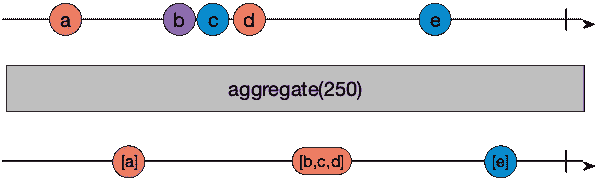
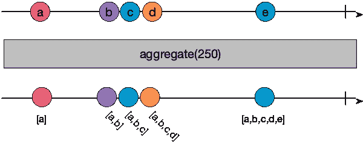

# 创建自定义 Rx.js 运算符:聚合一段时间内的事件

> 原文：<https://levelup.gitconnected.com/create-custom-rx-js-operator-aggregating-events-for-a-length-of-time-eda8da889c51>

Rx.js 提供了很多现成的操作符，但有时候，你只能自己动手。

当我需要通过键盘命令在 Angular 应用程序中处理[导航的功能时，我就遇到了这种情况。具体来说，我需要听多键命令，比如`rev`，例如，它们应该*反转*表格中的顺序。当前实现的 Rx 链的相关部分如下所示:](https://torsten-muller.dev/angular/navigation-in-an-angular-application-using-keyboard-shortcuts/)

```
this.obsRef = this.keyPressObservable
  .pipe(
    filter(this.permitKey),
    map(this.convertToString)
  )
  .subscribe(
    this.reactToKeyPress.bind(this),
  );
```

简而言之，它监听按键事件，过滤掉不需要的按键，然后将有关该按键的信息(即`KeypressEvent`)转换为唯一的字符串标识符。它为每一次按键执行这些动作。

一段时间内事件的预期聚合介于`[scan()](https://rxjs-dev.firebaseapp.com/api/operators/scan)`操作符和`[debounceTime()](https://rxjs-dev.firebaseapp.com/api/operators/debounceTime)`操作符的功能之间，前者不断聚合事件，后者抑制在开发人员指定的时间间隔内相继发生的事件。在大理石图中，`aggregate`的功能如下所示:



# 设置运营商基础设施

为了开始我们的实现，我们可以使用下面的 shell:

```
export function aggregate<T>(stopAggregationIn: number) {
  return function(source: Observable<T>): Observable<T[]> {
    return new Observable( (subscriber: Subscriber<T[]>) => {
      // Functionality here
    });
  };
}
```

我们定义了一个新的操作符`aggregate()`，它接受一个`number`作为参数，类似于`debounceTime()`操作符，它只传递一个事件，如果它发生在事件之间经过了指定的时间量之后([Rx documentation for de bounce time()](https://rxjs-dev.firebaseapp.com/api/operators/debounceTime))。

`aggregate()`是一个可扩展的函数，它返回一个接受源可观察值并返回一个不同类型的可观察值的函数，这里是一个包含聚合 Rx 事件的数组，位于第 3 行。这是*不变性*的一个例子，因为可观察对象不仅仅改变源可观察对象的值，而是创建一个新的可观察对象，它将包含我们操作的结果。

有了这个基本的实现，我们就可以开始实现的核心部分了。

# 聚合值

第一步，我将重新实现 scan 操作符的功能，在某种程度上，传入的每个事件都将无限期地聚合到一个数组中。有了这个功能，我们的自定义操作符可能如下所示:

```
export function aggregate<T>(stopAggregationIn: number) { let aggregatedEventValues: T[] = []; return function(source: Observable<T>): Observable<T[]> {
    return new Observable( (subscriber: Subscriber<T[]>) => {
      source.subscribe({
        next(value) {
          if (value !== undefined && value !== null) {
            aggregatedEventValues.push(value);
            subscriber.next(aggregatedEventValues);
          }
        },
        error(error) {
          subscriber.error(error);
        },
        complete() {
          subscriber.complete();
        }
      });
    });
  };
}
```

新功能在第 3 行和第 7–20 行。在第 3 行，我们定义了一个类型为`T`的数组，当聚集的事件进来时，它将成为这些事件的家。

真正的实现从第 7 行开始，我们用 Rx.js 提供的三个操作函数的对象订阅了`source`可观察对象。`onError`和`onCompleted()`事件只是修补到链中的下一个可观察对象(或者订阅，如果我们是管道中的最后一个操作符)。

在`onNext`方法中，我们确定我们有一个有效值，如果我们有，我们将它添加到`agggregatedEventValues`属性中，并传递给第 11 行的下一个可观察对象。

概括一下:到目前为止我们的实现

1.  监听事件
2.  推送(聚合)数组中的事件
3.  将包含新值的扩充数组传递给 Rx 链中的下一个操作符。
4.  传递任何错误或完成事件

# 集合一段时间内的值

按照现在的状态实现，我们将永远聚集在一起，并总是传递更大的事件数组，如下图所示:



为了限制我们聚合事件的时间，我们需要重构实现来使用一个定时器，在经过之后，它将聚合值(事件数组)发送给下一个观察者，并清除聚合数组。

有了这些额外的部分，我们的最终操作符如下所示:

```
export function aggregate<T>(stopAggregationIn: number) { let aggregatedEventValues: T[] = [];
  let timerRef = null; const handleTimeout = (subscriber: Subscriber<T[]>) => {
    return (): void => {
      const keyEventsCopy = aggregatedEventValues.slice(0);
      aggregatedEventValues = [];
      subscriber.next(keyEventsCopy);
    };
  }; return function(source: Observable<T>): Observable<T[]> {
    return new Observable( (subscriber: Subscriber<T[]>) => {
      source.subscribe({
        next(value) {
          if (value !== undefined && value !== null) {
            if (timerRef) clearTimeout(timerRef);
            timerRef = setTimeout(
                 handleTimeout(subscriber), 
                 stopAggregationIn); aggregatedEventValues.push(value);
          }
        },
        error(error) {
          subscriber.error(error);
        },
        complete() {
          subscriber.complete();
        }
      });
    });
  };
}
```

超时功能在第 19 行和第 20 行的`onNext`方法中实现。在第 4 行，我们定义了一个属性`timerRef`，它将保存对当前活动计时器实例的引用。在调用`setTimeout()`之前，我们首先检查定时器是否存在，并使用 JavaScript `clearTimeout()`函数停止它。

在清除之后，我们立即重启一个新的计时器，其持续时间传递给`aggregate()`操作器。作为当时要调用的方法，我们在第 6-12 行定义了一个新函数`handleTimeout`。这也是一个定制函数，它接受一个类型为`Subscriber<T[]>`的订户实例，并返回一个

1.  复制包含所有先前事件的数组(第 8 行)
2.  清空原始列表，以便我们为另一组按键重置操作符(第 9 行),最后，
3.  将收集的事件副本作为当前可观察对象(第 10 行)上的`onNext()`事件提供给其订户。

与实现的前一个状态相比，这一个将对`onNext()`的调用从直接在向事件数组添加一个新项目后移到一个在计时器到期后被调用的方法中。因此，我们为这个操作符实现了一个异步机制，因为它接受输入，并在未来的某个时刻触发一个事件——当用户停止输入`stopAggregationIn`毫秒时，我们操作符的参数。

# 使用运算符

这一切都是因为我需要为 Angular app [实现一个机制，允许使用快捷键](https://torsten-muller.dev/angular/navigation-in-an-angular-application-using-keyboard-shortcuts/)来导航和执行命令。在该实现中，我使用了这样一个 Rx 链:

```
public ngOnInit() {
    this.obsRef = this.keyServiceRef.keyEventObs
      .pipe(
        filter(this.permitKey),
        map(this.convertToString.bind(this)),
      )
      .subscribe(
        this.reactToKeyPress.bind(this),
      );
  }
```

简而言之，它过滤掉不需要的键，然后构建一个自定义标识符，用于组件中触发操作。这对于单键指令/命令很有效，但现在我要扩展它，让用户可以盲目地键入组合键，并让该组合键触发某种动作。

所以我需要在管道中添加新的`aggregate()`操作符(第 3 行),两次击键之间的收集超时为 300 毫秒，很像`debounceTime()`操作符:

```
.pipe(
    filter(this.permitKey),
    aggregate(300),
    map(this.convertToString.bind(this)),
  )
```

并修改`convertToString()`方法，现在接受一个`KeyboardEvent`的数组，而不是单个事件。现在实现如下所示:

```
public convertToString(keyEventList: KeyboardEvent[]): string {
    if (keyEventList.length > 1) {
      return this.generateMultiKeyString(keyEventList);
    } else {
      const modifiers = this.modifierKeysToString(keyEventList[0]);
      return `${ modifiers }-${ keyEventList[0].code }`;
    }
  } public generateMultiKeyString(keyEventList: KeyboardEvent[]) {
    const prefix = this.modifierKeysToString(keyEventList[0], 's-');
    let keySequence = '';
    for (const event of keyEventList) {
      keySequence += event.key.toLowerCase();
    }
    return `${prefix}-${keySequence}`;
  } private modifierKeysToString(keypress, prefix = 'k-'): string {
    const modifierKeys = ['altKey', 'ctrlKey', 'shiftKey'];
    let keyCode = prefix;
    for (const code of modifierKeys) {
      if (keypress[code]) keyCode += code.substr(0, 1);
    }
    return keyCode;
  }
```

你可能已经注意到了`pipe()`中的`this.convertToString.bind(this)`调用。`bind()`将传递给`map()`的函数的执行上下文更改为包含第二个清单中调用的方法`generateMultiKeyStrokeString()`和`modifierKeysToString()`的类。如果没有这个`bind()`，前面清单中的`this`引用将不起作用。

这一功能很快得到解释:

1.  `convertToString()`方法现在区分了多键命令和单键命令，其中多指的是按顺序的多个键，而不是像 Ctrl 那样同时按下的键。
2.  当在`generateMultiKeystrokeString()`中生成 ID 字符串时，我们用`s-`作为结果字符串的前缀，然后继续解析修改键并构建一个已经使用的键的字符串。
3.  `modifierKeysToString()`方法与它先前的化身没有改变。

在该实现中，值得注意的是，假设第一次按键时的特殊键对于所有后续事件也有效，如该行(11)所示:

`const prefix = this.modifierKeysToString(keyEventList[0], 's-');`

它只传递数组中的第一个事件来分析特殊键，并传递前缀`s-`。

最后一个清单中的其余代码应该是不言自明的。

# 摘要

在这篇文章中，我展示了如何实现一个异步 Rx.js 操作符，它将 Rx 链中的事件聚合到一个具有指定超时的数组中，然后释放一个包含一个数组的事件，该数组包含一个`onNext()`事件中的所有缓冲事件。

我已经展示了如何在之前基于 Rx.js 的实现中使用该操作符[将按键事件转换成唯一的字符串](https://torsten-muller.dev/angular/navigation-in-an-angular-application-using-keyboard-shortcuts/)。

这个实现的代码可以在 bitbucket 上找到[。](https://bitbucket.org/tmuller/keypress-navigation/src/master/)