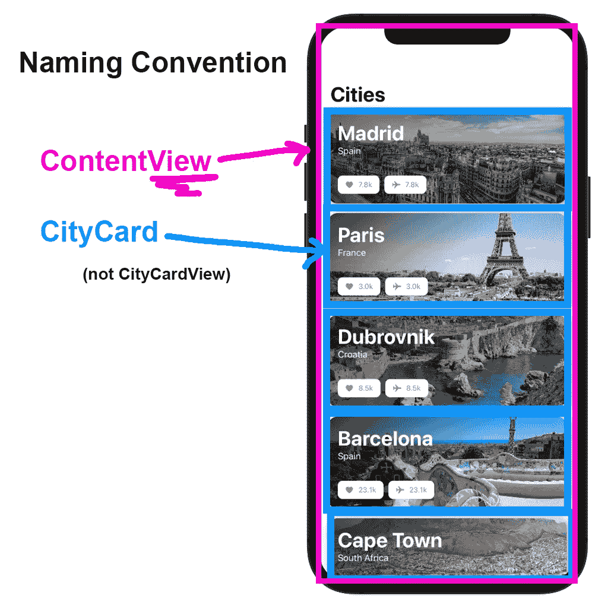
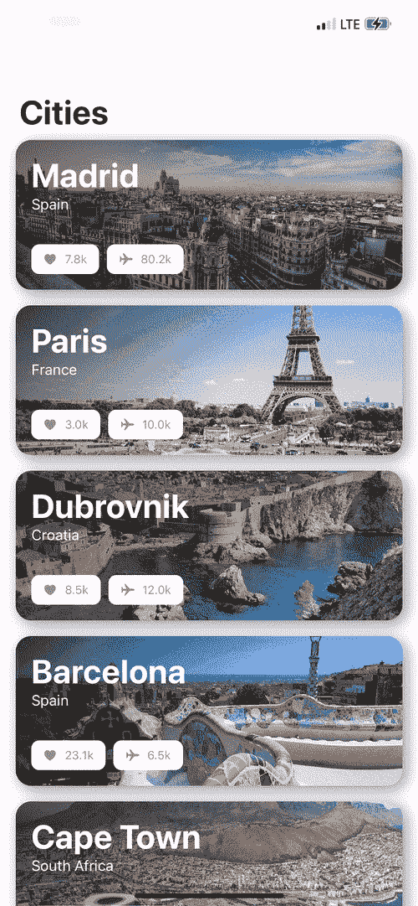

# 在 SwiftUI 中创建自定义视图组件

> 原文：<https://levelup.gitconnected.com/create-custom-view-components-in-swiftui-845b65e8ba94>

## 具有结构、计算属性和函数

如果您想要可维护的项目，并且不喜欢多次键入相同的代码，那么创建定制组件是**必须的**。在 SwiftUI 中有大量不同的方法来制作可重用组件；您可以创建[自定义样式](https://betterprogramming.pub/create-custom-button-styles-in-swiftui-f3778f695266)、[自定义修改器](https://medium.com/better-programming/create-custom-view-modifiers-in-swiftui-79d73d1691b)或**自定义视图**。

在这个简短的教程中，我们将探索为您的 SwiftUI 应用创建**自定义视图组件**的一些方法。

# 设置(可跳过)

我将使用下面的`City`模型来填充演示所需的数据。

`City`型号

我创建了一个模型 CityAPI 来获取测试数据:

获取城市数组的模拟 API

这是`ContentView`最初的样子:

初始内容视图

这是不那么漂亮的初步预览:

初始内容视图的预览

# 组件作为结构

我们将要学习的创建**定制视图组件**的第一种方法是创建一个符合`View`协议的`struct`。

当创建一个新的 SwiftUI 项目时，您看到的最初的`ContentView`使用了相同的方法(事实上，还有许多 SwiftUI 组件)。

为了创建一个**自定义视图，**我们将简单地创建一个新的 **SwiftUI 视图**文件。

我想为我们城市中的每一行创建一个**自定义卡片视图**。我准备命名为`CityCard`。

尝试采用苹果使用的**命名约定**。我们用的是`VStack,`而不是`VStackView`。

尽管`ContentView`和`CityCard`本质上都是视图(它们符合视图协议)，但它们服务于不同的目的。

`CityCard`是在`ContentView`内部(或其他地方)使用的组件。这就是我们避免使用“…视图”后缀的主要原因。

创建一个新的 **SwiftUI 视图**文件非常好，因为我们已经准备好了所有的设置样板代码！然而，了解这些代码来自哪里是很重要的。

创建新的 SwiftUI 视图时的样板文件

*   `CityCard`符合`View`协议。
*   `View`协议声明需要存在一个返回`some View`的名为`body`的**计算属性**。
*   `some View`可以是任何其他的`View`。答`Text`、`VStack`、`Button`等。

简而言之，我们在`body`中构建我们的**定制视图**。

好吧，我们从简单的开始。我们将通过传递一个`City`作为初始化式来复制我们已经在`ContentView`中拥有的东西。

您现在可以返回到`ContentView.swift`并将`Text()`视图更新为`CityCard(city: city)`

我们并没有创建一个自定义视图，而是一个文本在里面！

让我们详细阐述我们的观点。

添加此代码:

组件作为**结构**的完整示例

城市卡预览

# 组件作为计算属性

创建**定制视图组件**的另一种方式是使用**计算属性**。这对于封装您的视图和提高代码的可读性非常有用

我们将添加一个**背景图片**，上面有一个暗渐变，这样文本更容易阅读。

我喜欢添加我的组件作为它们所属视图的扩展。

在预览下添加以下代码。

作为**计算属性**示例的组件

将`.background(.cyan)`更新为`.background(backgroundImage)`

带有`backgroundImage`的城市卡预览

# 作为功能的组件

类似于我们可以用计算的属性创建**定制** **视图组件**，用**函数**，我们有为同一个视图模板传递参数的好处。

让我们为收藏和旅行计数创建一个自定义视图。

作为**功能**示例的组件

为两个指标更新`HStack`的内容

来自:`Label(city.favoriteCount.formatted(), systemImage: “heart.fill”)`

致:`metricsLabel(count: city.favoriteCount, systemImage: “heart.fill”)`

带有公制标签的城市卡预览

# 包裹

这些是您可以用来在 SwiftUI 应用程序中创建自定义视图组件的一些不同方法。当你需要构建一个大而复杂的视图时，使用**结构**，当你需要在结构中封装更小的组件时，使用**计算属性**和**函数**。

=最终产品的演示

如果你有兴趣看一下源代码，可以在这里找到 Github repo [。](https://github.com/ricardomongza99/Cities.git)

感谢阅读！如果你喜欢这篇文章，请务必关注。

# 分级编码

感谢您成为我们社区的一员！在你离开之前:

*   👏为故事鼓掌，跟着作者走👉
*   📰查看[升级编码出版物](https://levelup.gitconnected.com/?utm_source=pub&utm_medium=post)中的更多内容
*   🔔关注我们:[Twitter](https://twitter.com/gitconnected)|[LinkedIn](https://www.linkedin.com/company/gitconnected)|[时事通讯](https://newsletter.levelup.dev)

🚀👉 [**加入升级人才集体，找到一份神奇的工作**](https://jobs.levelup.dev/talent/welcome?referral=true)