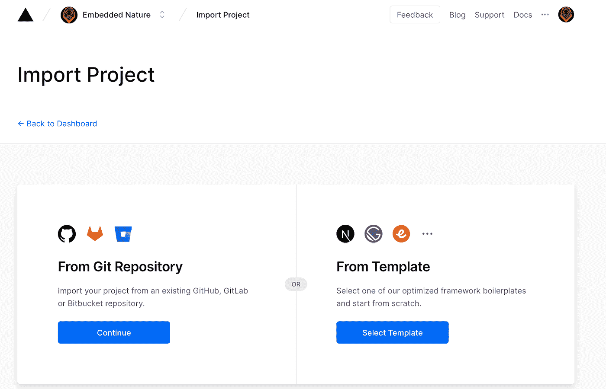
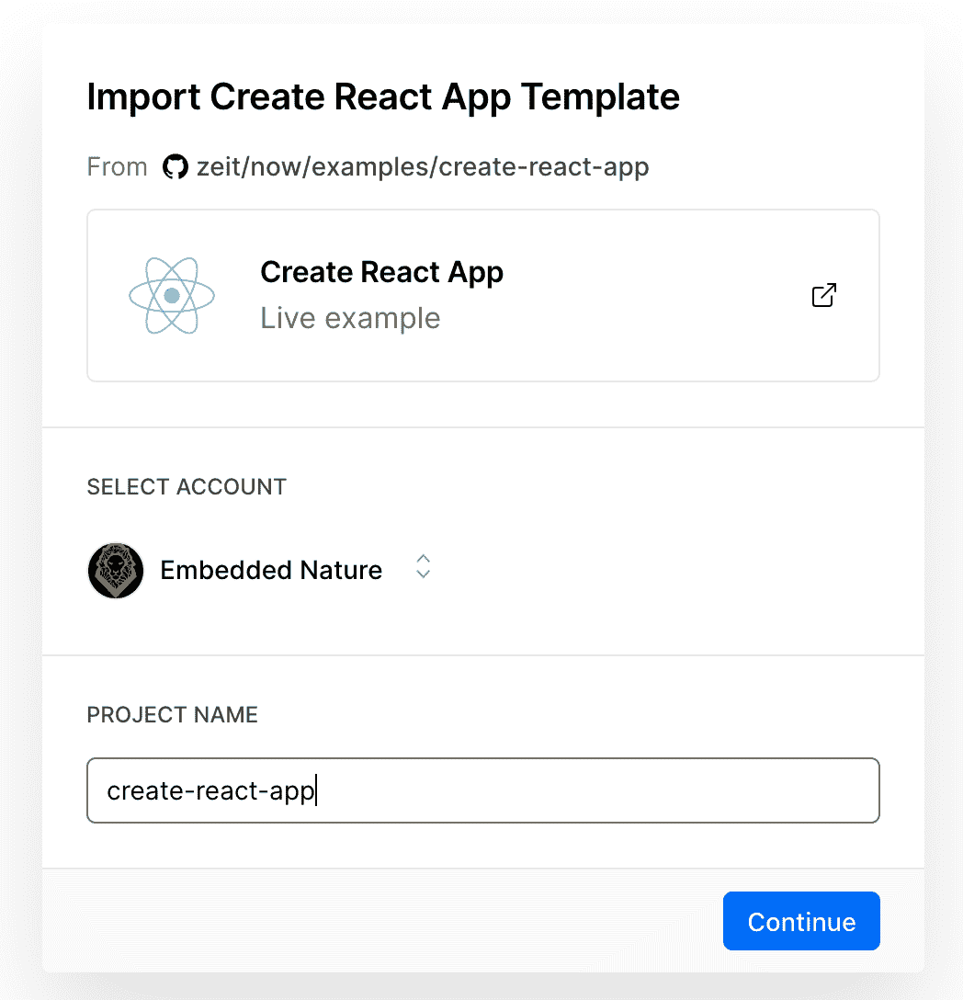
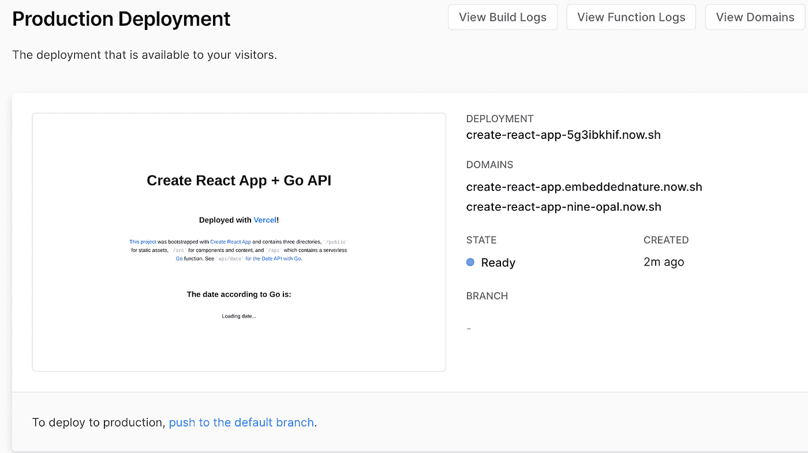
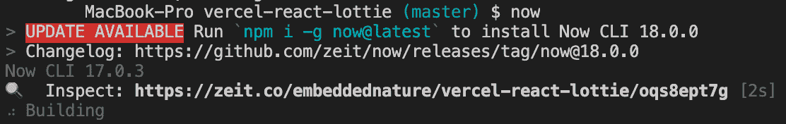
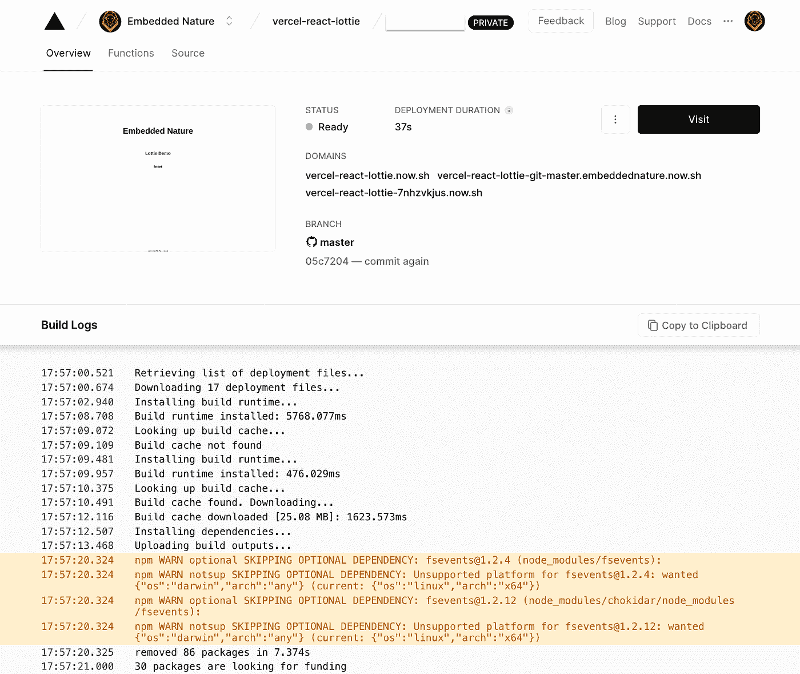

# 使用 Vercel 创建和部署 Lottie 动画反应应用程序

> 原文：<https://levelup.gitconnected.com/create-deploy-a-lottie-animation-react-app-using-vercel-d3c6f142a7d6>

# **概述**

使用 Vercel (Zeit ),您可以在几分钟内快速部署您的静态网站，无需任何配置。只需选择您的模板，推送至 Git，您的网站就上线了！在本指南中，我将带您了解使用 Vercel 部署 react 应用程序的过程。我们的 React 应用程序将使用 AirBnb 的 Lottie 动画来展示向您的应用程序添加动画内容是多么容易。

# **假设**

你对 React 和 Git 有基本的了解。

# **设置**

首先，在 [Vercel](https://vercel.com/) 网站上创建一个与你的 GitHub、GitLab 或 BitBucket 账户关联的账户。

登录后，从存储库中导入一个项目，或者使用 Vercel 的一个优化框架模板。

导入项目或选择模板

我将使用 Create React 应用程序模板。一旦你选择了你的模板，命名你的项目。

命名您的项目资源库

Vercel 会自动为您创建一个 Git 存储库。一旦部署完毕，Vercel 将启动您的新应用程序，一旦构建完成，您就可以访问您的网站。

注意，Vercel 为我们提供了一个开发、准备和生产域。

随着你的网站的建立和运行，现在是时候关闭你的库并创建一些洛蒂动画了。

Vercel 为您创建的存储库。在您的本地项目目录中安装 react 的 Lottie 动画视图。`npm i react-lottie`

# **洛蒂动画**

洛蒂动画(Lottie animations)是 Airbnb 建立的一个库，可以轻松地将高质量的动画添加到任何原生应用程序中。该库实时渲染 Adobe After Effect 动画，因此使用动画就像静态图像一样简单。

`react-lottie`将帮助抽象一些`Lottie-web`需要的调用。

在你的`app.js`导入`react-lottie`中选择一个你想要加载到应用程序中的动画。

`react-lottie` 使用一个传入 Lottie options 属性的`defaultOptions`对象。这将设置动画数据和附加参数，如`looping`和`autoplay`。

`defaultOptions`既可以使用`path:`变量从域中加载动画，也可以使用`animationData:`从项目中导入`.json`动画文件。

显示洛蒂动画很简单:

示例洛蒂组件

找到洛蒂动画的最好地方是使用[洛蒂文件](https://lottiefiles.com/)。他们有 100 多种动画可供选择，你可以用一个免费账户下载动画或者简单地在你的项目中引用它们。

下面是一个使用 react 挂钩的 Lottie 组件示例:

洛蒂反应组分

# **部署您的应用**

您可以使用一个简单的命令`now`部署您的应用程序。

`Now`是 Vercel 的命令行界面(CLI ),支持即时云部署。

现在安装:`npm i -g now`。

安装完成后，在您的终端中运行命令`now`。这将使您的构建在服务器上排队。

如果您前往 Vercel 仪表板，您将看到构建日志。完成后，请访问该网站查看您的更改。

# **部署到生产**

使用 Vercel 很容易将您的构建推向生产。只需将您当前的分支合并到主分支中，这将触发一个发布构建。

# **总结起来🎉**

就这样，我开发了一个 create react 应用程序，并展示了 Lottie 动画在 iOS、Web 和 Android 应用程序中的强大功能。Vercel 使动态创建概念证明变得容易，不仅如此，它还使开发人员能够构建一个应用程序，在较低的环境中捕捉反馈，然后推向生产。

Vercel 有许多模板可供选择，并包括许多其他功能，我鼓励你去看看。

我希望这个指南对你有所帮助，你将如何使用 Vercel 来加速你的开发过程？

# 参考

洛蒂文件:[https://airbnb.io/lottie/#/web](https://airbnb.io/lottie/#/web)

我的回购:[https://github.com/ICeZer0/vercel-react-lottie.git](https://github.com/ICeZer0/vercel-react-lottie.git)

YouTube 视频示例:[https://youtu.be/3K0sfRJgAjI](https://youtu.be/3K0sfRJgAjI)

[推特](https://twitter.com/EmbeddedNature) | [Instagram](https://www.instagram.com/embeddednature/)