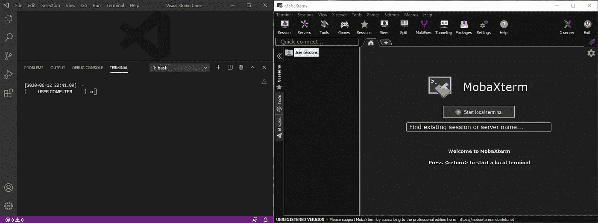
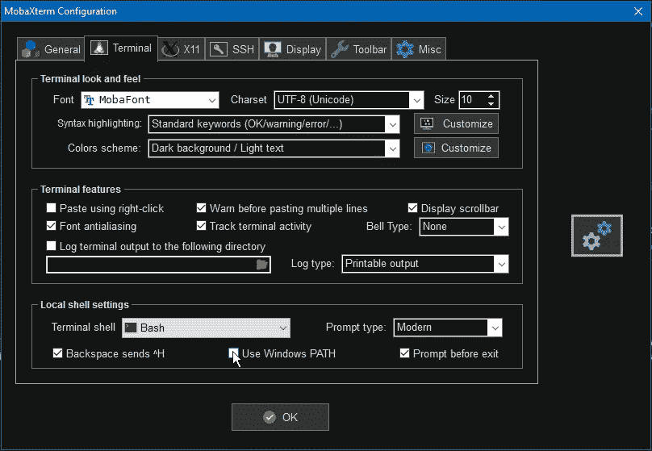
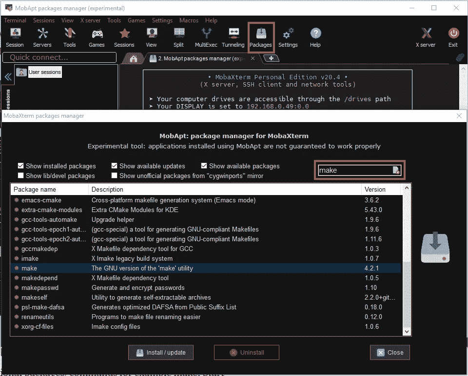

# 用 VS 代码创建一个 Python 开发环境

> 原文：<https://levelup.gitconnected.com/create-development-environment-with-vs-code-fe66f3892159>

*在 Windows 下用 Linux 终端开发*



VS 代码中的 MobaXterm Teminal 和 MobaXterm

在这篇文章中，让我们看看如何使用 Visual Studio 代码在 Windows 中建立一个干净的环境。

首先，我们需要从[官方网站](https://code.visualstudio.com/#alt-downloads)下载 VS 代码安装程序。因为我更喜欢以非管理员用户的身份尝试一切，所以下载 64 位用户安装程序 1.46.0 版本。运行下载的“VSCodeUserSetup-x64–1 . 46 . 0 . exe”，用这些选项安装:位置-“C:\ Users \**用户名** \Apps\VSCode”，无开始菜单文件夹，选择所有附加任务。启动 VS 代码，我们有一个很好的，干净的编辑器用于我们的开发。

如果您不想将您的所有数据使用情况和错误共享给微软，请打开设置**文件** > **首选项** > **设置**，搜索`telemetry`，取消选中**遥测:启用遥测**设置。

当你打开 VS 代码时，你会看到欢迎标签。在自定义部分点击安装 Python 支持，这将安装 VS 代码的 Python 扩展。

当您打开新终端(**终端** > **新终端)**时，根据您的系统，我们可以看到 Windows Power Shell 或命令提示符。我更喜欢使用 Linux 命令，而不是 Windows 命令。让我们看看如何更改默认终端。

# MobaXterm

有许多[选项](https://www.puttygen.com/windows-terminal-emulators)可用于在 Windows 中获得 Linux 终端，如 PuTTY、Git Bash、WSL、MobaXterm、Cygwin。MobaXterm 是强大的，它提供了其他很酷的功能，如文件浏览器，终端，sftp，X 服务器等等。下载便携版 [MobaXterm 家庭版 v20.4](https://mobaxterm.mobatek.net/download-home-edition.html) 。将下载的 zip 文件解压到自己喜欢的位置:“C:\ Users**\ UserName**\ Apps \ mobax term”。您可以选择任何文件夹，但要确保路径中没有空格，因为 Unix/Linux 文件系统不喜欢路径中有空格。在这个文件夹中，创建另一个名为“slash”的空文件夹。打开 MobaXterm 可执行文件。我们需要更新一些设置，以便在每次重启 MobaXterm 时保留我们的首选项/应用程序。打开配置(**设置>配置>通用**，选择“斜杠”文件夹为根目录，选择“C:\Users **\UserName** 为主目录。然后它会要求重启应用程序。单击“启动本地终端”可以看到熟悉的 bash 终端。

# 将 Windows 路径添加到 MobaXterm

如果要从 MobaXterm 打开 Windows 应用，在 MobaXterm **设置>终端中选择“使用 Windows 路径”。**



# 安装附加软件包

默认情况下，MobaXterm 包含了大多数常用命令。如果您需要任何额外的包/命令，我们可以很容易地添加到它。你可以访问他们的插件页面，下载“. mxt3”文件，并将它们移动到 MobaXterm_ 所在的安装文件夹中。exe 存在，请重新启动终端以使命令生效。您也可以安装其他命令，例如 make，启动 MobaXterm，单击“软件包”按钮，搜索您需要的软件包，然后单击安装/更新按钮。这将下载必要的库和其他依赖项，并安装软件包。一旦安装完成，关闭 MobaXterm 并在 VS 代码中打开一个新的终端，现在你可以检查像“make -v”这样的命令。



# 在 VS 代码中更新终端

现在是最后也是最重要的部分，在 VS 代码中指定默认终端。首先，我们需要在上面创建的“slash”文件夹中找到 bash.exe。应该是“slash\bin\bash.exe”。打开 VS 代码设置(**文件** > **首选项** > **设置**)，点击右上角的“打开设置(JSON)”按钮。它将打开“settings.json”文件，添加下面的行并保存该文件，以定义用于 windows 的集成 shell(将完整路径写入“slash”文件夹)和 shellArgs，从而使 bash 能够作为登录 shell 运行。

```
// MobaXterm Bash
"terminal.integrated.shell.windows": "C:\\Users\\**UserName**\\Apps\\MobaXterm\\slash\\bin\\bash.exe",
"terminal.integrated.shellArgs.windows": ["--login"],
```

保存设置 JSON 文件，重启 VS 代码，查看 VS 代码中的 MobaXterm 终端。

我们还可以使用 VS 代码设置在 MobaXterm 终端中定义环境变量。

```
// Define Environment Variables
"terminal.integrated.env.windows": {
   "dev_dir": "C:\\Users\\UserName\\Development"
},
```

*shell* 、 *shellArgs* 、 *env* 和 *cmd* 终端设置都支持解析[变量](https://code.visualstudio.com/docs/editor/variables-reference)。

```
// Open the terminal in the currently opened file's directory
"terminal.integrated.cwd": "${fileDirname}"
```

# 安装 Python

为了在 Windows 中获得 Python，我建议安装 Anaconda 个人版，而不是安装 Python 软件。Anaconda 个人版是一个免费的、易于安装的包管理器、环境管理器和 Python 发行版，包含 1500 多个开源包，并有免费的社区支持。Anaconda 是平台无关的，所以无论您是在 Windows、macOS 还是 Linux 上都可以使用它。

安装 Anaconda 个人版是如此简单，你[下载](https://www.anaconda.com/download/#windows)安装程序(Anaconda 3–2020.07-Windows-x86 _ 64 . exe)和[按照指示](https://docs.anaconda.com/anaconda/install/windows/)。如果您按照指示进行操作，Anaconda3 不会添加到 Path 环境变量中。

如果您想在 MobaXterm 中使用 anaconda/conda/python 命令，您需要向 Path 环境变量添加几个路径。这些路径是(**而不是文件夹 Anaconda3，可能是 Anaconda2，这取决于 Windows PC 上的 Anaconda 版本**):

```
C:\Users\UserName\Apps\Anaconda3
C:\Users\UserName\Apps\Anaconda3\Scripts
C:\Users\UserName\Apps\Anaconda3\Library\bin
```

如果在安装 Anaconda 时已经将它们添加到 Windows 路径中，那么可以忽略这些命令。为了将这些添加到 Path 环境变量中，在 VSCode 中打开 Terminal(**Terminal**>**New Terminal)**并输入以下命令:根据您的 Anaconda 安装路径更新路径。这将创建/编辑您的”。bash_profile”放在$HOME 文件夹中。

```
echo "export PATH=\"/home/UserName/Apps/Anaconda3:/home/UserName/Apps/Anaconda3/Scripts:/home/UserName/Apps/Anaconda3/Library/bin:$PATH\"" >> .bash_profile
```

关闭终端并重新打开，使用以下命令检查 conda/python 版本。如果这些命令有效，您就可以在终端中使用 Python 了。

```
conda --version
python.exe --version# Update conda
conda update -n base -c defaults conda
```

# 康达环境

对不同版本的 Python 和/或包使用不同的 conda 环境总是明智的。您可以通过运行以下命令为想要使用的每个 Python 版本创建一个单独的 conda 环境:

```
conda create --name mypy37env python=3.7
```

有关创建和管理 conda 环境的更多详细信息，请查看本[用户指南](https://docs.conda.io/projects/conda/en/latest/user-guide/tasks/manage-environments.html)。

# 激活康达环境

由于 Windows 和 MobaXterm 中的文件夹路径不同，以及 DOS 和 Unix 中的新行字符不同，您可能会在使用 conda 命令(如 activate/deactivate)时遇到一些问题。如果您遇到这些问题，请在终端中运行以下命令(替换环境名称)，为每个新环境创建一个脚本文件:

```
conda shell.posix activate **mypy37env** > /home/**UserName**/**mypy37env**.sh
dos2unix /home/**UserName**/**mypy37env**.sh
. /home/**UserName**/**mypy37env**.sh
```

上面的前两个命令只需要一次，所以下次当您想要切换环境时，只需运行最后一个命令。如果您想每次都使用这个环境，您可以将它添加到您的 **bash_profile** 文件中，如下所示。

```
echo ". /home/**UserName**/**mypy37env**.sh" >> ~/.bash_profile
```

在将它添加到 bash_profile 文件之后，您需要关闭终端并重新打开，以查看您的终端在这个环境中启动的情况。您可以使用“conda info”命令进行确认。

# 选择 Python 解释器

我们需要告诉 VS 代码对任何打开的 python 文件使用哪个 Python 解释器。让我们使用 File->New File 创建一个空文件，并输入简单的 python print 语句，如下所示:

```
print("Welcome to Python in VS Code!")
```

当您将这个文件保存为 fileName.py 时，VS 代码会显示一个选择解释器的警告。当您点击“选择 Python 解释器”按钮时，它将显示所有可用的 Python 解释器，包括您在命令面板中创建的 conda 环境。为此选择“mypy37env”。选择将显示在 VS 代码窗口的左下角。然后你会看到另一个安装“ [pylint](http://pylint.pycqa.org/en/latest/) 的警告，这是一个检查代码错误的工具，帮助你遵循编码标准。点击安装并选择“使用 conda 安装”，它将打开一个终端并在所选的 Conda 环境中安装必要的软件包。

现在，我们需要告诉 VS 代码当一个新的终端打开时不要激活 conda 环境，因为我们已经在上面的 **bash_profile** 文件中添加了激活脚本。

```
// Disable activating conda environment in new terminal
"python.terminal.activateEnvironment": false,
```

# Git 版本控制设置

完成开发环境设置的最后也是最重要的一步是 Git 设置。VS 代码包括对 Git 和源代码控制的支持。MobaXterm 安装了 Git，所以我们只需要告诉 VS 代码使用它进行版本控制。打开 VS Code settings.json 文件，添加下面几行来定义 git 路径并保存文件。关于在 VS 代码中使用版本控制的更多细节在[这里](https://code.visualstudio.com/docs/editor/versioncontrol)。

```
// MobaXterm Git
"git.path": "C:\\Users\\**UserName**\\Apps\\MobaXterm\\slash\\bin\\git.exe",
```

我们可以[使用 SSH](http://git config --global credential.helper wincred) 连接到 GitHub，将所有的存储库从我们的计算机推到远程。这将有助于我们在每次访问 GitHub 时无需提供您的用户名和个人访问令牌。我们将使用 MobaXterm 终端来运行所有这些命令。

这就完成了为 Python 开发设置 VS 代码的过程。

# 结论

VS 代码和 MobaXterm 本身就是非常强大的工具。将两者结合在一个环境中给了我们许多在单一开发环境中工作的机会。

下一篇文章:[使用 VS 代码进行远程开发](https://medium.com/@nsanka/use-vs-code-for-remote-development-366bdc217977)