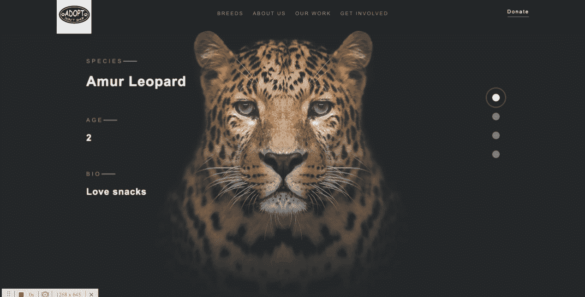
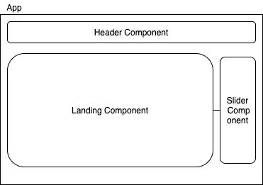

# 使用三个 JS + React + GSAP 在图像中创建扭曲效果

> 原文：<https://levelup.gitconnected.com/create-distortion-effect-in-images-using-threejs-react-gsap-97ca92959351>

对我来说，这是一篇很难写的文章，因为我在这个主题上没有太多的专业知识，但我发现这是非常必要的，因为我在网上看到的所有关于三个 j 和图像应用效果的东西都没有透露代码，或者你必须知道一点 GLSL (OpenGL 着色语言)才能在你的图像上创建一些漂亮的效果。

首先，我只想指出，我在 [Codepen](https://codepen.io/ashthornton/pen/KRQbMO) 中改编了一个现有的项目，并集成到一个 React 应用程序中。但是别担心，我会带你走完这个项目的每一步。



项目演示

为了更好地理解我构建了什么，让我们来看看我的 React 应用程序架构。



React 组件架构

分解结构，我们有:

*   Header 组件——将保存标题元素，对于这个项目来说，它就是要做的所有事情。
*   Slider 组件— Sider 元素，它接收要显示的项目数。除了元素数量之外，还接收一个包含父元素上下文的方法，该方法将更新图像的选定索引。
*   着陆组件—渲染 ThreeJS 动画，创建先前应用于图像的纹理阵列。将从滑块组件接收事件以更新选定的图像(使用纹理数组)。

正如您所理解的，因为这篇文章都是关于 ThreeJS 和图像动画的，所以让我们把注意力集中在这个登陆组件上(您可以查看完整的源代码来更好地理解其他组件是如何构建的)。

在着陆组件中，我们做的第一件事是在图像数组(包含原始图像的链接)到达时，我们必须使用 ThreeJS 来生成我们的纹理。因此，在我的例子中，我使用了 React 钩子，因此我使用了 useEffect 来创建我的纹理数组。

```
useEffect(() => {
  const parent = document.querySelector('.landing') as HTMLElement;
  const images = document.querySelectorAll('.landing__image'); if (parent && images) {
    const effects = SliderEffect({
      parent,
      images: Array.from(images)
    });
    setEffects(effects);
  }
}, []);
```

这将得到所有渲染在屏幕上的图像(虽然只有一个是可见的)，并将调用我的效果模块来生成纹理效果。让我们调查一下。

```
export const SliderEffect = (opts: {
  parent: HTMLElement,
  images: Element[]
  }): {
        material: ShaderMaterial;
        images: Texture[];
      }
```

查看方法签名(我明确地添加了接口，只是为了让您更好地理解),我们可以看到该方法将接收父元素，该父元素将保存由 ThreeJS 生成的 canvas 元素和一组 HTML 图像元素。着陆组件将接收着色器材质对象和纹理数组。

这个 SliderEffect 方法做的第一件事是为 ShaderMaterial 定义顶点和片段。你可能会问，这个阴影物质是什么？这是一个带有自定义着色器(顶点和片段)的材质渲染器，这些着色器是使用 GLSL ( [手动](https://www.khronos.org/files/opengles_shading_language.pdf))编写的。顶点将用于定义图像的位置和大小，而碎片将负责我们看到的酷效果(模糊失真)。该片段将始终在顶点着色器之后运行(这是 GPU 渲染中一个众所周知的话题)。

在我们定义了我们的顶点和片段之后，我们必须创建一个画布区域来保存我们的图像纹理。为此，让我们为画布区域创建宽度和高度，这将是我们的窗口大小我们的图像大小(我们选择哪个更大)以保证我们在窗口中显示完整的图像。下一步是创建一个 WebGL 渲染器，设置我们的背景颜色、大小并将其添加到 DOM 中。

```
let renderer = new THREE.WebGLRenderer({
  antialias: false,
});renderer.setClearColor( 0x23272A, 1.0 );
renderer.setSize( renderW, renderH );
parent.appendChild( renderer.domElement );
```

现在我们已经创建了画布，剩下要做的就是为图像创建纹理。

```
let loader = new THREE.TextureLoader();
images.forEach((img: Element) => {
  image = loader.load(
      img.getAttribute( 'src' ) + '?v=' + Date.now()
  );
image.magFilter = image.minFilter = THREE.LinearFilter;
image.anisotropy = renderer.capabilities.getMaxAnisotropy();sliderImages.push( image );});
```

我们创建一个包含已加载图像的纹理，并在图像中设置默认过滤器。这里，选择了线性过滤器，它定义了在场景中应用效果后纹理像素的行为。

最后的步骤是创建一个场景和摄像机视角，最后是着色器材质，它将使用我们的顶点和片段代码(并设置初始图像)。

```
let scene = new THREE.Scene();
scene.background = new THREE.Color( 0x23272A );
let camera = new THREE.OrthographicCamera(
  renderWidth / -2,
  renderWidth / 2,
  renderHeight / 2,
  renderHeight / -2,
  1,
  1000
);
camera.position.z = 2;let mat = new THREE.ShaderMaterial({
  uniforms: {
    dispFactor: { value: 0.0 },
    currentImage: { value: sliderImages[0] },
    nextImage: { value: sliderImages[1] },
  },
  vertexShader: vertex,
  fragmentShader: fragment,
  transparent: true,
  opacity: 1.0
});let geometry = new THREE.PlaneBufferGeometry(
  parent.offsetWidth,
  parent.offsetHeight,
  1
);let object = new THREE.Mesh(geometry, mat);
object.position.set(0, 0, 0);
scene.add(object);
```

关于着陆组件逻辑，我所做的是让一个 useEffect 监听我们所选项目中的变化，当滑块被单击时，它将执行代码来执行动画。这个动画是使用 TweenLite 和我们的着色器材质创建的。

```
effects.material.uniforms.nextImage.value = effects.images[item];TweenLite.to(effects.material.uniforms.dispFactor, 1, {
 value: 1,
 ease: 'Expo.easeOut',
 onComplete: () => {
  effects.material.uniforms.currentImage.value =
    effects.images[item];
  effects.material.uniforms.dispFactor.value = 0.0;
 }
});
```

这将使用我们的色散值将从 1 到 0，并将导致我们看到的失真效果。此外，如果您注意到了，我创建了一个关键帧动画来在我们的文本元素中创建一些效果(在最初的示例中使用了 TweenLite)。

仓库代码: [Github](https://github.com/thealmarques/react-threejs-distorion-effect)

这就是你要的，希望你喜欢，希望很快见到你。