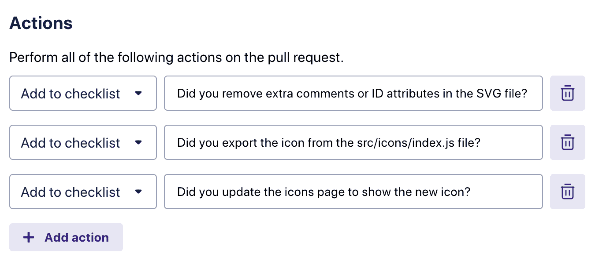
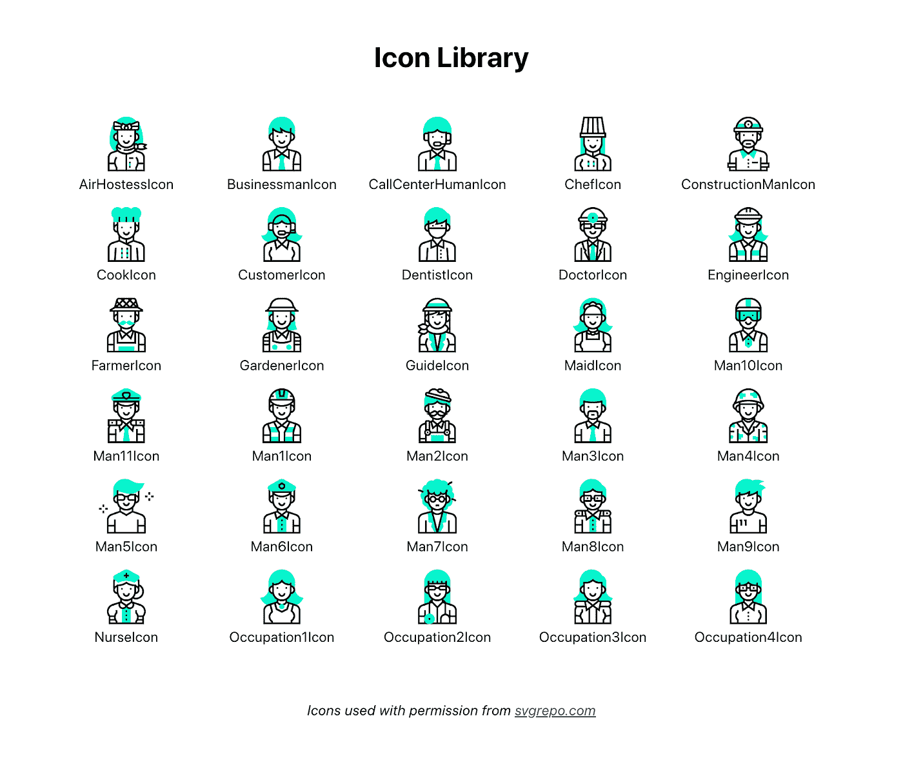
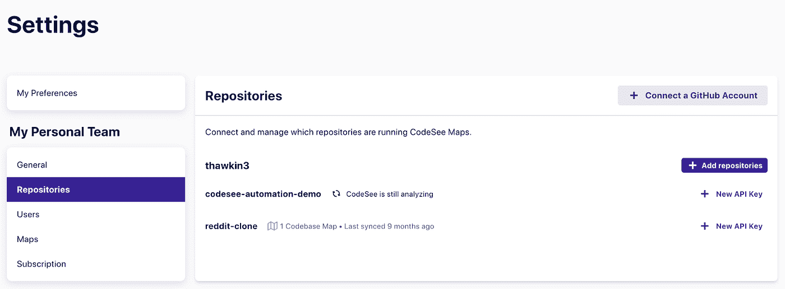
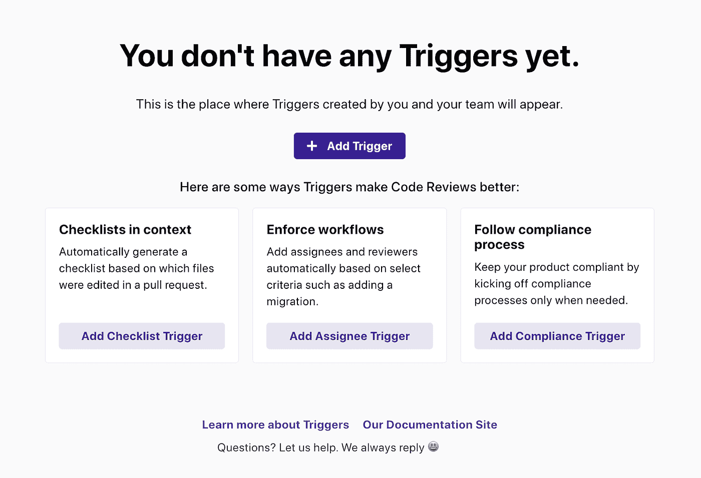
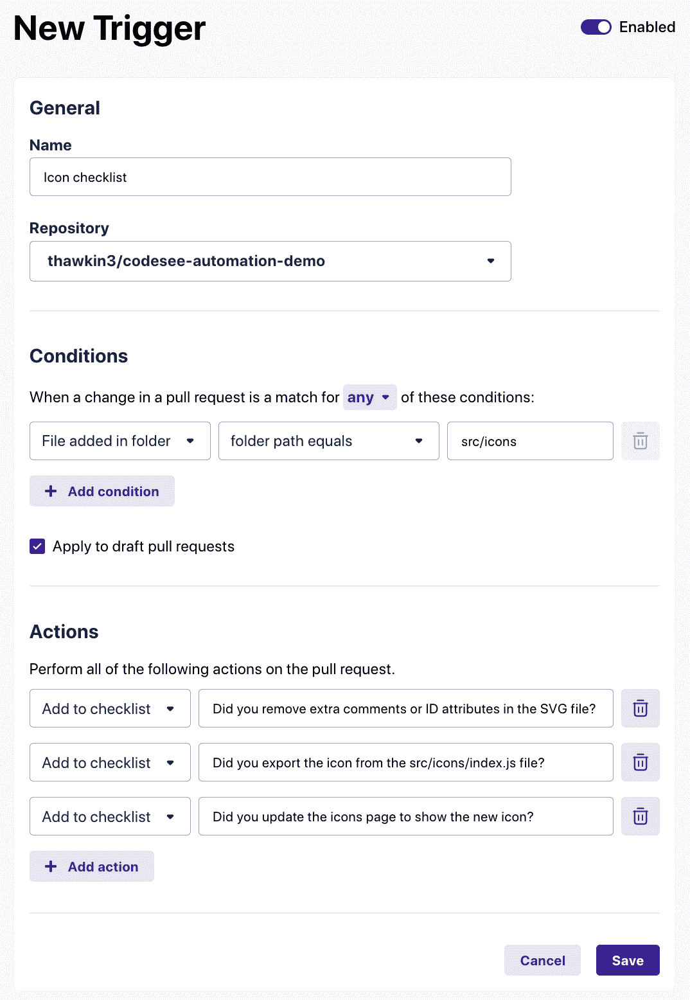
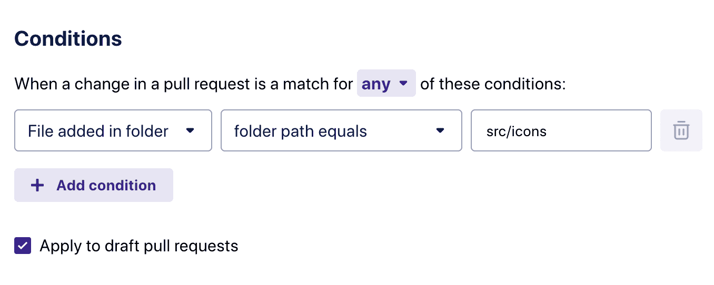
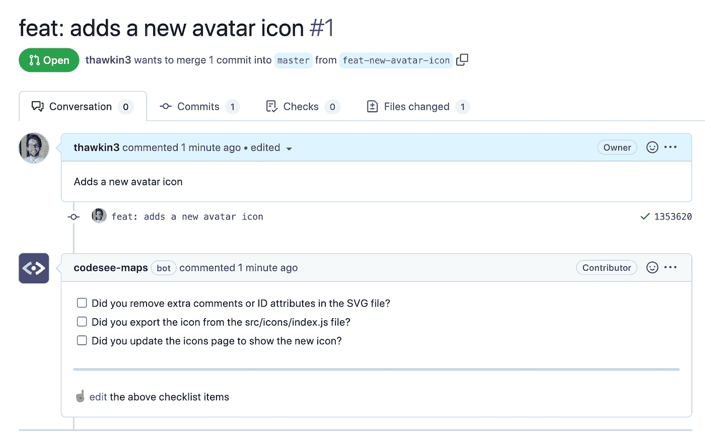

# 使用 CodeSee 代码自动化创建动态代码审查清单

> 原文：<https://levelup.gitconnected.com/create-dynamic-code-review-checklists-with-codesee-code-automation-ac045326067c>

CodeSee 代码自动化触发器

我一直是[拉请求模板](/managing-complexity-through-merge-request-templates-9a00cc9a5fb1)的拥护者。这些模板允许您向在您的 repos 中创建 pull 请求的开发人员提供指导，以便提醒他们包括您需要的所有相关信息，以正确审查他们的代码。拉动式请求模板是将[清单](https://betterprogramming.pub/a-checklist-manifesto-3f686ed135f8)作为额外提醒的绝佳位置。这些可能包括要做的事情，比如记得写单元测试，自我检查你的代码，或者进行安全审计。

但是有时候，这些清单会变得很长。您可能有太多重要的项目，以至于开发人员开始忽略它们。或者，也许清单中的某些项目仅在特定情况下或某些文件发生更改时才相关。虽然每一项都很重要，但它们并不总是适用的。

**如果你的拉取请求清单可以是动态的，并且只显示相关的提醒，那不是很好吗？**

CodeSee 代码自动化可以帮助你做到这一点！通过代码自动化，您可以配置基于规则的触发器，以便在满足某些条件时自动向拉请求添加清单注释。

在本文中，我们将查看 CodeSee 的一些代码自动化模板，并展示如何将其中一个模板合并到我们自己的代码库中。准备好开始了吗？

# 自动化模板

CodeSee 网站上有几个不同的[自动化模板](https://www.codesee.io/code-automation)，我们可以用它们作为灵感。例如，有用于[添加图标](https://www.codesee.io/automation-templates/icon-checklist)、[创建迁移](https://www.codesee.io/automation-templates/create-a-migration)、[添加新的 npm 包](https://www.codesee.io/automation-templates/adding-a-new-package)或[创建新的 API 端点](https://www.codesee.io/automation-templates/endpoint-checklist)的清单。

对于我们的演示，我们将探索图标清单，并修改它以满足我们的需要。

# 我们虚构的图标回购

我们的演示图标库截图

让我们想象一下，我们公司有一个包含数百个开发人员图标的 repo 。当开发人员需要一个在我们的图标库中找不到的新图标时，他们与设计人员交谈，设计人员为开发人员创建一个 SVG 文件。然后，开发人员获取 SVG 文件，并将其添加到代码库中。

很简单，对吧？问题是来自设计器的 SVG 文件经常是杂乱的。通常这些文件会包含随机 ID 属性。文件中可能有多余的注释或不必要的代码。文件名可能不会遵循与其他图标文件相同的模式。此外，除了提交新的 SVG 文件之外，可能还需要额外的代码设置。开发人员可能需要更新图标导出的主列表，或者更新一些文档或故事书示例。

一些开发人员可能只是添加 SVG 文件，而没有考虑这些额外的步骤。

那么，解决方案就是有一个清单，提醒开发者在添加新图标时需要做什么。该清单可以存在于自述文件或拉式请求模板中，我强烈建议您同时做这两件事。

但即便如此，开发人员有时也不会阅读文档。他们无视指示，盲目向前推进。

为了解决这个问题，让我们添加一个代码自动化触发器，这样当开发人员创建他们的 pull 请求时，就可以用清单注释来提醒他们。

# 添加图标核对清单自动化模板

首先，我们需要让 CodeSee 从设置页面访问我们的 GitHub repo。

将 CodeSee 连接到您的 GitHub repo

一旦添加了我们的 repo，我们就可以导航到 Automate 页面来创建我们的第一个触发器。

添加您的第一个触发器

我们将点击**添加触发器**按钮来访问新触发器页面。

新触发器页面

在此页面上，我们可以向触发器添加名称和 repo，然后指定条件和操作。在我们的例子中，我们希望条件是每当一个新文件被添加到“src/icons”目录时。

为您的触发器添加条件

当满足该条件时，我们希望 CodeSee 自动用一些检查表项对 pull 请求进行注释。我们在这里添加了三个项目，但是您可以根据需要添加任意多个项目。

为您的触发器添加操作

完成编辑后，我们可以单击 Save 按钮保存我们的更改。至此，我们已经创建了第一个动态清单！让我们来看看这种自动化是如何运作的。

在我们的代码报告中，让我们向“src/icons”目录添加一个新的 SVG 文件。然后，让我们创建一个新的分支，并提交一个拉请求，将我们的分支合并到主分支中。

一旦创建了我们的拉请求，您会注意到 CodeSee bot 会自动用一个提醒清单对我们的拉请求进行注释。也是好事，因为我们忘记做这些事了！

CodeSee bot 在 pull 请求上添加了注释

# 结论

就是这样！在短短的几分钟内，我们添加了一个清单，以帮助我们的开发人员在添加图标时有更好的体验。我们已经明确了代码期望，并强调了开发人员可能遗漏的项目。

最棒的是，我们已经动态地添加了这些注释，只在实际需要时才显示它们。如果开发人员对这个回购做出了不同的贡献，不涉及添加新图标，他们根本看不到这些评论。

有趣的是，这仅仅是个开始。我们可以将各种其他自动化模板添加到我们的 repo 中。而且，这些触发器不仅仅可以添加清单注释。它们还允许您在需要某些开发人员或团队的专业知识时，自动将审阅者分配给拉请求。

借助 CodeSee 代码自动化，我们可以毫不费力地实施最佳实践和分享知识。