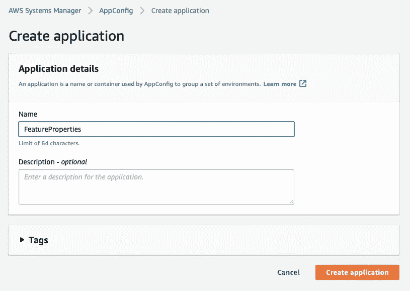
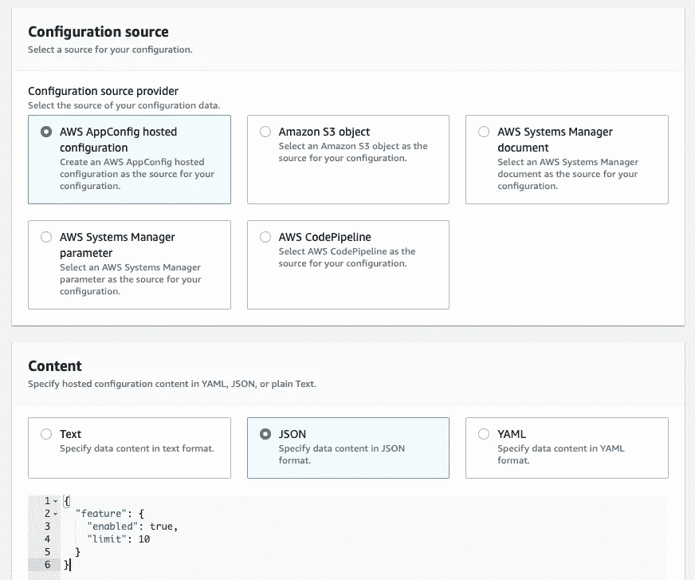
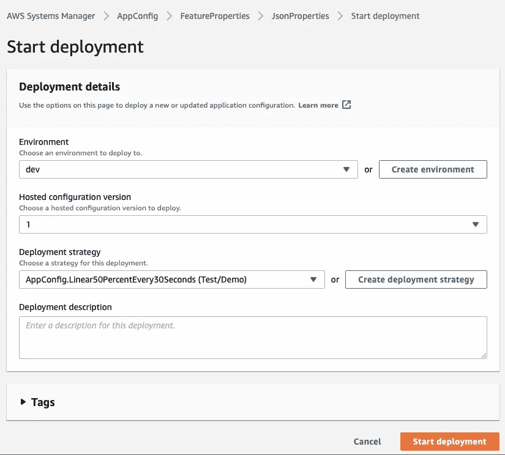
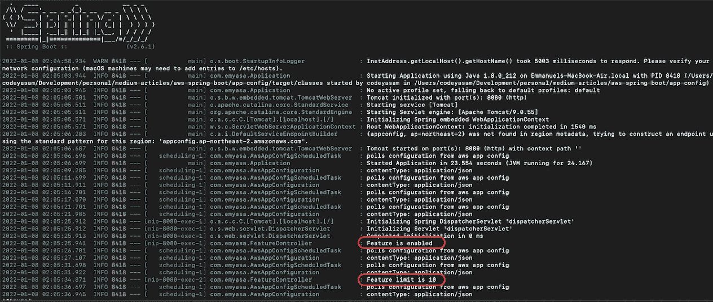

# 在 Spring Boot 使用 AWS AppConfig 创建要素切换

> 原文：<https://levelup.gitconnected.com/create-features-toggles-using-aws-appconfig-in-spring-boot-7454b122bf91>

无需重新启动服务器即可更改配置。

帕特里克·托马索在 [Unsplash](https://unsplash.com?utm_source=medium&utm_medium=referral) 上的照片

## **简介**

在本教程中，让我们创建简单但外部化的功能切换；此外，以高可用性和可维护性的方式。鉴于通常的 spring boot 项目使用应用程序属性进行配置，我们将使用 AWS AppConfig 外部化一些属性值。

然而，在做任何事情之前，让我们先看看这个 AWS AppConfig 的快速介绍。

## 什么是 AWS AppConfig？

听起来很有希望？让我们前往 *AWS 管理控制台*并快速创建一个！

首先，创建*应用程序*:

接下来，创建自由形式的配置。为简单起见，让我们选择 *AWS AppConfig 托管配置*选项:

最后，让我们开始部署。出于演示目的，让我们创建并使用一个*开发环境*:

现在，让我们看看我们简单的 Spring Boot 项目。

## 一个简单的 Spring Boot 项目

在 Spring Boot 项目中，假设我们在应用程序属性文件中有这些配置，我们希望将其外部化:

此外，以下是保存这些属性的 POJO:

有了这些，让我们创建一个 rest 控制器，这样我们可以稍后在运行时模拟检查属性值:

## **有趣的部分:Spring Boot 的 AWS AppConfig 集成**

首先，让我们确保在 pom.xml 中有这样的依赖关系:

接下来，让我们为自己的 *AWS AppConfig 客户端*创建一个简单的配置类:

最后，让我们创建一个*调度任务*，它从 *AWS AppConfig* 轮询配置:

让我们运行并测试这个应用程序吧！

当应用程序运行时，让我们尝试对两个可用的端点执行 curl 请求:

正如我们从日志中看到的，我们现在已经成功地将特性属性的配置外部化到 AWS AppConfig 中。除此之外，由于我们实现了一个轮询应用配置的计划任务，我们将能够在不中断任何服务的情况下更新功能属性。

和往常一样，这个演示的源代码可以在 [Github](https://github.com/emyasa/medium-articles/tree/master/aws-spring-boot/app-config) 上获得。