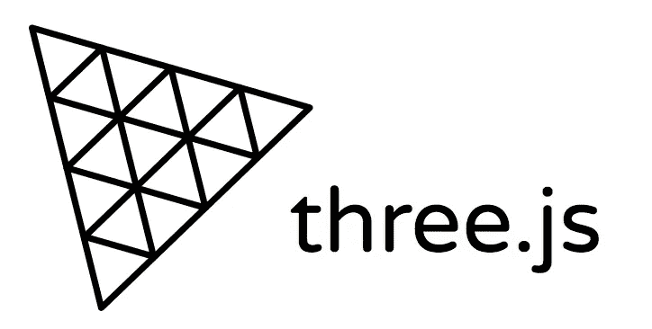
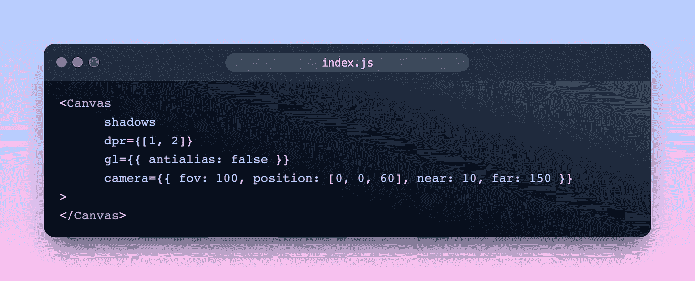
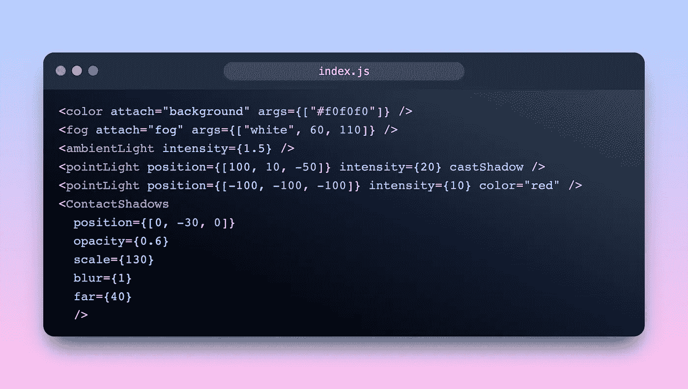
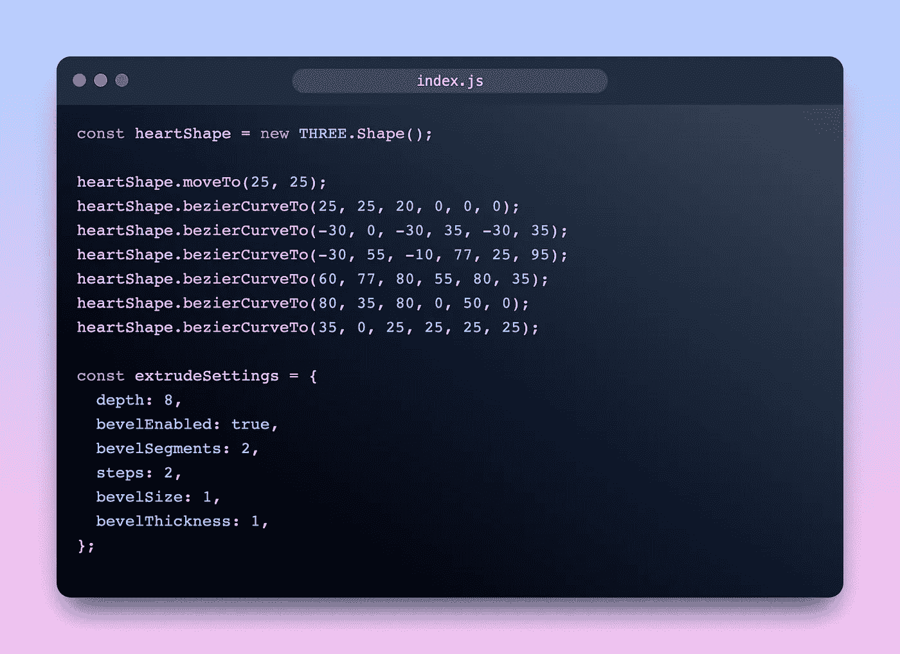
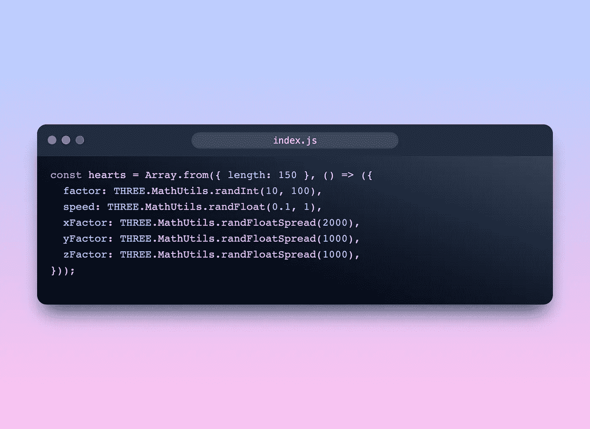
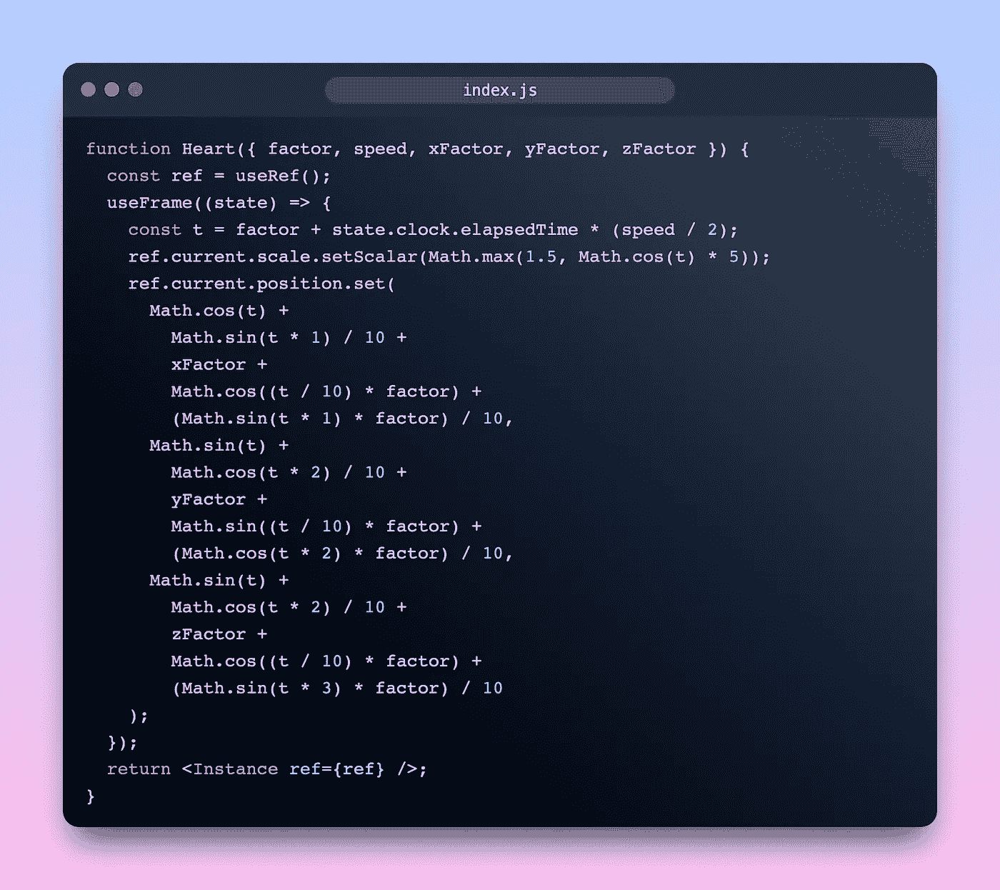
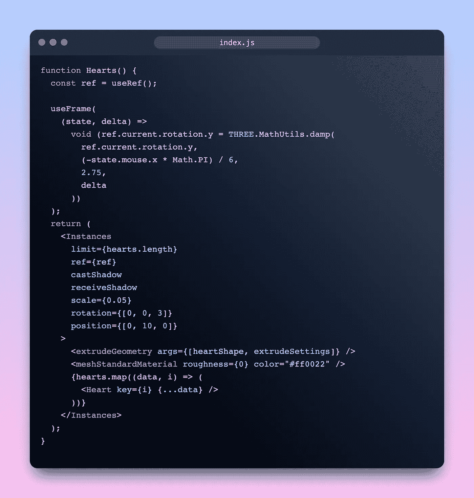
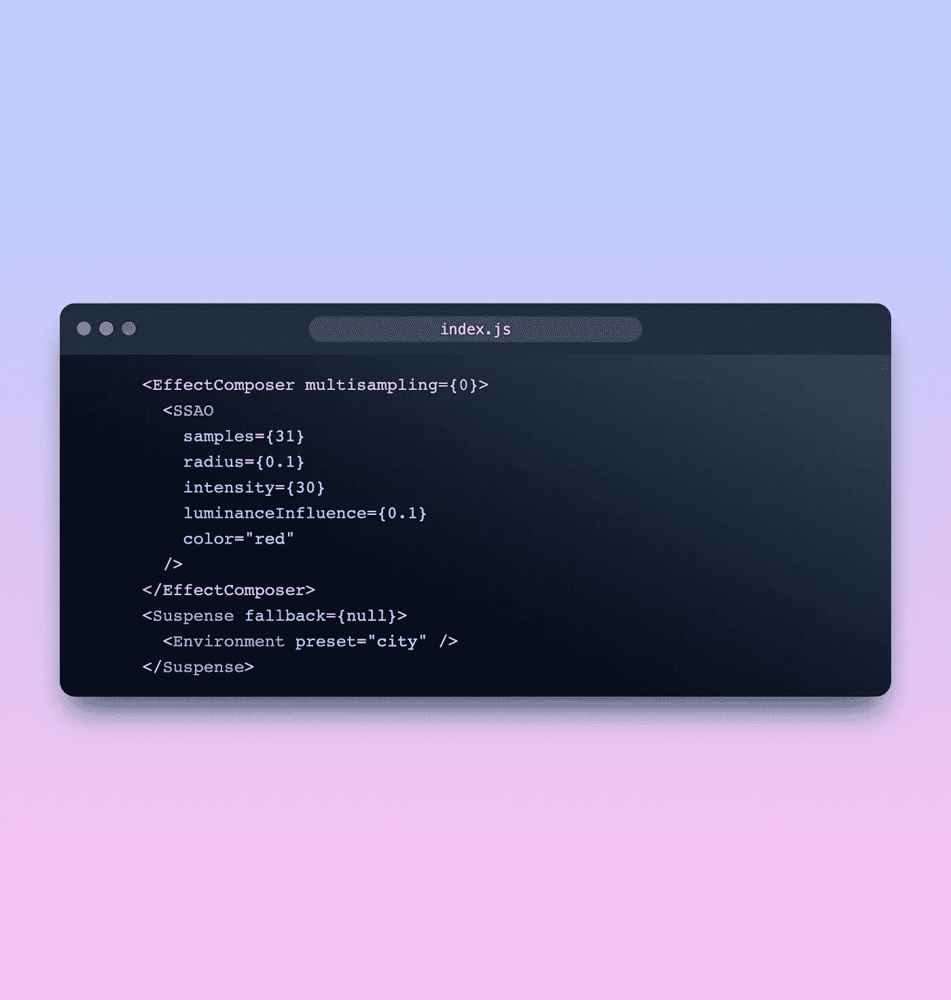
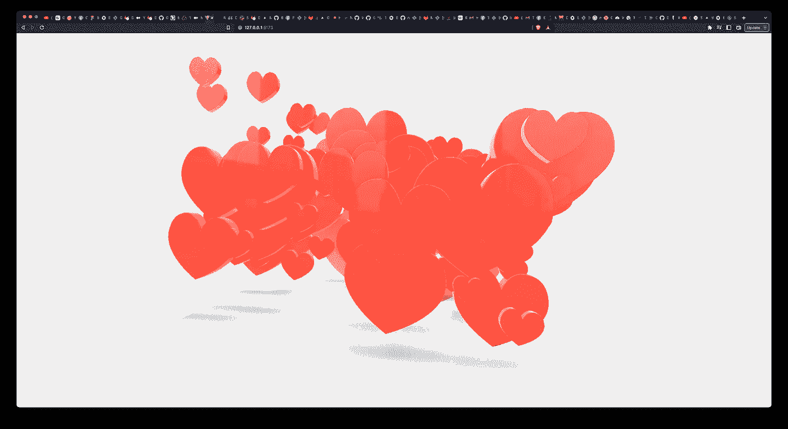

# 创建浮动的心三维模型在三。JS 和 React 三种纤维

> 原文：<https://levelup.gitconnected.com/create-floating-hearts-3d-model-in-three-js-and-react-three-fiber-cab27f84fb50>



# 三是什么？JS？

三个。JS 是一个跨浏览器的 JavaScript 库和 API，用于在 Web 浏览器中创建和显示动画 3D 图形。

三个。JS 允许使用 JavaScript 语言创建 GPU 加速的 3D 动画，而不依赖于插件

# 什么是反应三纤维？

react-three-fiber 是一个 [React 渲染器](https://reactjs.org/docs/codebase-overview.html#renderers)用于三个。没有额外开销的 JS。组件参与 React 之外的统一渲染循环。它胜过三个。由于 React 的调度能力，JS 的规模很大。

# 建立

这有很多依赖因素:

```
yarn add three @react-three/fiber @react-three/drei @react-three/postprocressing
```

# 搭建画布

`Canvas`对象是您开始定义 React 三纤维场景的地方。



在上面的代码中，我刚刚创建了一个配置了相机和阴影的画布

# 灯光和阴影

在画布内部，我们需要灯光和阴影，这样我们的模型就会有阴影，看起来很亮



# 创造心脏

首先，我们必须创建心形:



然后乘以不同的因子和速度:



因为我们希望我们的心浮动，所以我们要用`useFrame`来设置它们的位置



最后，我们将用`Instances`铸造红心，并把它放到上面的`Canvas`中



最后，我们需要一些效果



# 结论

结果呢



现场演示:[https://threejs-floating-hearts.vercel.app/](https://threejs-floating-hearts.vercel.app/)

源代码:[https://github.com/leduc1901/threejs-floating-hearts](https://github.com/leduc1901/threejs-floating-hearts)

# 遗言

虽然我的内容对每个人都是免费的，但是如果你觉得这篇文章有帮助，[你可以在这里给我买杯咖啡](https://www.buymeacoffee.com/kylele19)