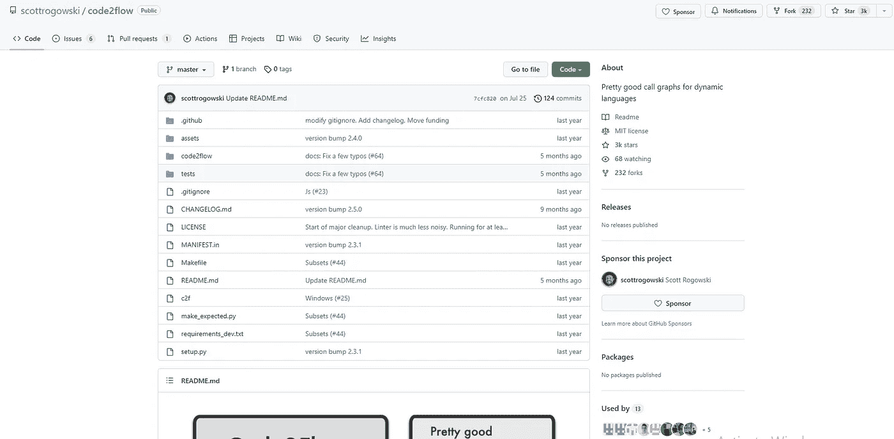
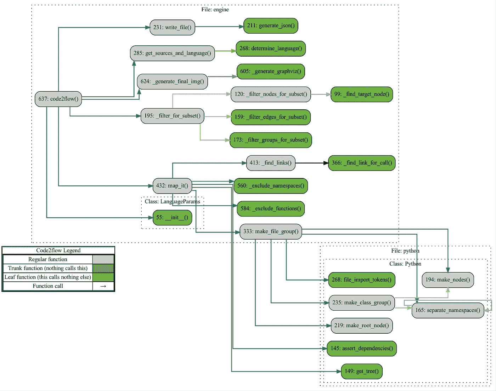

# 使用 Code2flow 从代码创建流程图

> 原文：<https://levelup.gitconnected.com/create-flowcharts-from-code-using-code2flow-81b4ad2fe171>

流程图是可视化和记录复杂系统的强大工具，在使用软件时尤其有用。无论您是试图理解他人的代码还是记录您自己的代码，从代码创建流程图都是获得洞察力和提高您对系统的理解的好方法。


由[卡洛斯·穆扎](https://unsplash.com/@kmuza?utm_source=medium&utm_medium=referral)在 [Unsplash](https://unsplash.com?utm_source=medium&utm_medium=referral) 上拍摄的照片

在本文中，我们将向您介绍一个 python 库 **Code2flow** ，它为动态编程语言生成调用图。Code2flow 支持 Python、JavaScript、Ruby 和 PHP。


我们还将向您展示如何使用 Code2flow 从您的代码中创建流程图，并且我们将讨论使用流程图来理解和记录软件系统的一些好处。因此，如果您准备好将您的代码理解提升到一个新的水平，请继续阅读！



代码 2 流存储库

Code2flow 适用于:

*   解开意大利面条代码。
*   识别孤立函数。
*   让新开发人员跟上速度。

可以使用以下命令安装它。

```
!pip install code2flow 
```

一旦安装了 Code2flow，就可以通过运行类似`code2flow mypythonfile.py`的命令来生成流程图。这将创建一个点文件，然后您可以使用 Graphviz 之类的工具查看它。

下面是一个样例存储库的输出，code2flow 为它生成了一个图表。



代码 2 如何流动

这是通过一个简单的算法实现的:

1.  **将源文件翻译成抽象语法树(ASTs)。**
    AST 是一段代码结构的树状表示，树中的每个节点代表代码中的一个构造(如函数定义或循环)。
2.  **在 ASTs 中找到所有的函数定义。**
    函数定义是定义代码块的构造，可以通过名字调用来执行。

3.**确定在哪里调用这些函数。**
当一个函数被调用时，程序的控制流跳转到函数的开头，然后跟随函数内部的代码，直到到达结尾。

4.**把这些点连接起来。**
Code2flow 使用关于函数定义和函数调用的信息创建一个流程图，显示代码的控制流。它通过将 AST 中的函数定义节点连接到调用函数的节点来实现这一点，从而创建代码流动方式的可视化表示。

通过遵循这种算法，Code2flow 能够生成显示代码结构和逻辑的流程图，从而更容易理解和记录复杂的软件系统。

这里有一个 Code2flow GitHub 库的链接。
[https://github.com/scottrogowski/code2flow](https://github.com/scottrogowski/code2flow)

需要注意的是，Code2flow 并不是从代码生成流程图的完美解决方案。由于一些编程语言的动态特性，任何算法都不可能生成完美的调用图。然而，Code2flow 为您的项目结构提供了一个很好的评估，它可以成为理解和记录复杂软件系统的一个有价值的工具。所以，试试 Code2flow，看看它如何帮助你可视化和理解你的代码！

> 不要错过——今天就加入 Medium，成为人工智能革命的一部分。这是你做过的最好的决定。
> **今日订阅中** **使用本** [**链接**](https://medium.com/@arjungullbadhar/membership) **。**