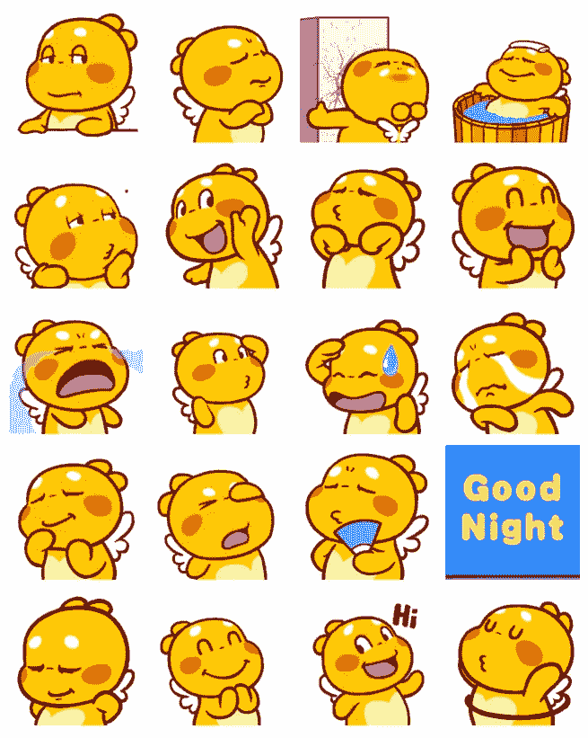
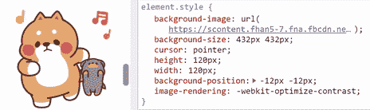
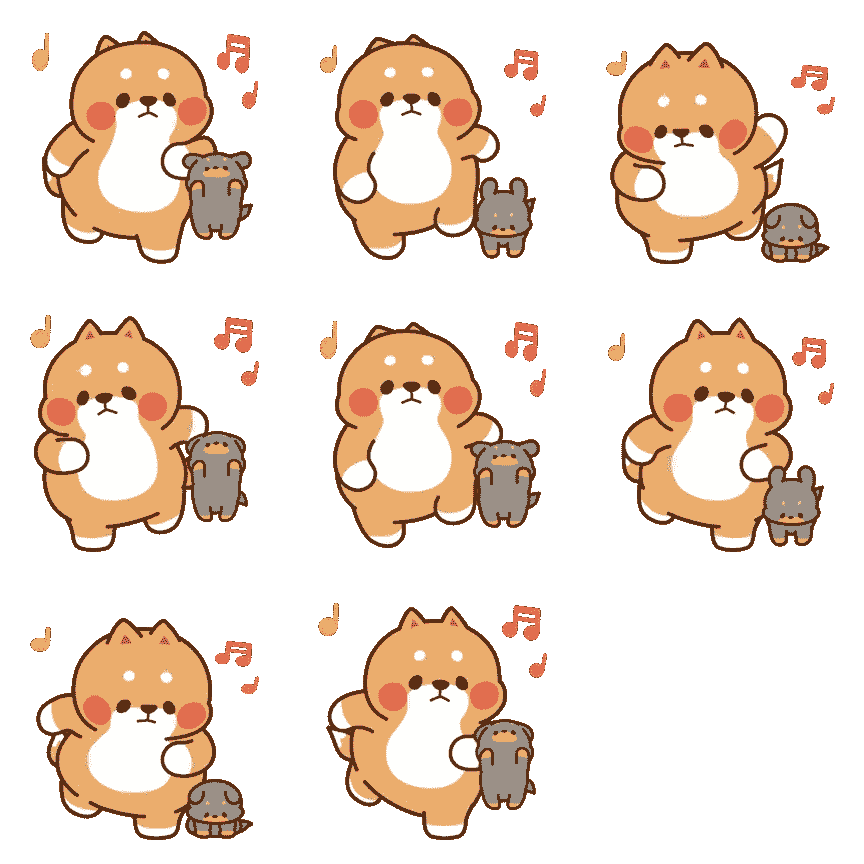
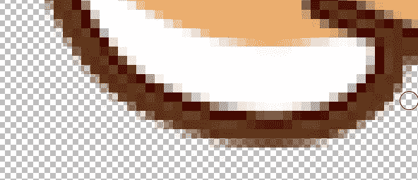

# 用 JavaScript 从脸书贴纸创建 GIF

> 原文：<https://levelup.gitconnected.com/create-gif-from-facebook-stickers-with-javascript-52de5824c415>

## 来自脸书的有趣的东西



虽然脸书和信使应用程序很糟糕，但它们有非常可爱的贴纸。我试过下载，但是没有办法下载成 gif 文件。检查该元素，我们将看到它作为一个 sprite 表出现，设置为`background-image`并使用`background-position`来改变框架。



这是 spritesheet。



所以现在我们会这样做:

*   从 sprite 工作表中获取帧
*   合并成 gif 文件

# 从 sprite 工作表中分割帧

看上面的精灵图片，你可以看到它有 8 帧，每帧的大小是`288px * 288px`。任何 app 都可以手动裁剪。要不我们就写个剧本剪掉。我们将使用 Canvas API 来渲染 sprite 表中的帧。

假设我们在这样的页面上加载了一个 sprite 工作表

```

```

为了剪切出每一帧，我们将创建一个大小为`288px * 288px`的画布，并将 sprite 表单上的相应部分渲染到该画布上。例如，要剪切第一帧，我们这样做:

你应该看到第一帧像这样


drawImage 的第二个和第三个参数将是框架在 spritesheet 上的位置。文档详情[此处](https://developer.mozilla.org/en-US/docs/Web/API/CanvasRenderingContext2D/drawImage)。

为了剪切所有的帧，我们做了一个循环

您会注意到，我们有一个额外的空帧，因此我们必须添加一个检查，以查看我们刚刚剪切的帧在添加到数组帧之前是否有数据。只需检查它的所有像素是否都有数据。

```
const isEmpty = ctx.getImageData(0, 0, canvasWidth, canvasHeight).data.every(channel => channel === 0);
```

# 将框架合并到 GIF 图像中

如果我有框架，我可以把它们缝在一起。我将使用 gif.js 包来创建 gif 图像。从框架创建图像就是这么简单。

只需添加帧和帧之间的延迟，然后渲染。为了便于计算，我们使用帧速率的概念，脸书贴纸的帧速率通常在 8-12 fps 之间。结果将是原始数据，所以我们使用`URL.createObjectURL`来创建一个临时 URL


还行，除了黑色背景。这是因为我们的图像是部分透明的。如果像这样添加对 gif.js 透明的选项

```
const gif = new GIF({
    workers: 2,
    quality: 1,
    transparent: 'rgba(0, 0, 0, 0)',
});
```

然后…


有透明背景但是边框不好。这是由于 GIF 格式的限制。通常，对于像 PNG 这样的透明图像，从图像到透明位置的过渡将会是许多透明度降低的像素，以使图像的边界平滑。



但是用 GIF 格式，每个 px 只能是彩色或者全透明，不能像 PNG 一样半透明。所以轮廓看起来像低质量的锯齿状图案。因此，透明背景的 gif 通常会有一个小的白色边框(或者与人们打算放 gif 的背景重叠的东西)，使边框看起来更平滑。为了简单起见，我也将给出白色背景。

```
ctx.fillStyle = '#fff';
ctx.fillRect(0, 0, canvasWidth, canvasHeight);
```

记得在`drawImage`之前上色，否则会覆盖图像。


需要的话 Codepen 链接:[https://codepen.io/itchishikicomm/pen/dyYaxJr](https://codepen.io/itchishikicomm/pen/dyYaxJr)

# 奖金

关于脸书是如何工作的，为什么不使用 GIF 图片而使用 spritesheet。这样做也有一些好处。

*   更好的照片，GIF 图片有 256 种颜色而不是像 PNG 那样的 1600 万色。
*   我上面提到的透明不再有问题了。
*   不怕抄袭

但肯定也有一些是无益的

*   不调整大小。因为使用`background-image`和`background-position`，贴纸的大小是固定的
*   用 CPU 消耗 RAM🙄