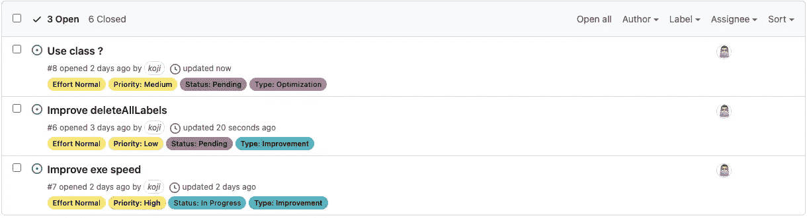

# 从终端创建 GitHub 标签

> 原文：<https://levelup.gitconnected.com/create-github-labels-from-terminal-158d4868fab>

发行委员会

最近我读了一些关于 GitHub 标签的文章。我建议你去看看。(不好意思其中一个只有日本人)

 [## 我们如何组织 GitHub 问题:简单的标签样式指南

### 对于做软件的人来说，互联网不缺 Git Flow 这样的工作流组织的最佳实践…

robinpowered.com](https://robinpowered.com/blog/best-practice-system-for-organizing-and-tagging-github-issues)  [## Sane GitHub 标签

medium.com](https://medium.com/@dave_lunny/sane-github-labels-c5d2e6004b63)  [## GitHub 的标签是有逻辑的、丰富多彩的和明智的

### 默认的 GitHub 标签是...不理想。这个已经描述过很多次了:有很多非常好的例子…

seantrane.com](https://seantrane.com/posts/logical-colorful-github-labels-18230/)  [## GitHub Issuesのラベルを作り直す+Projectのかんばんを自動化 - Qiita

### GitHub Issuesにはデフォルトで9つのラベルが存在しますが、微妙に使いづらい... そこで、このラベルを作り直してみました。 ラベルは5 種類に分けました。…

qiita.com](https://qiita.com/willow-micro/items/51eeb3efe5b4192a4abd) 

我想当你使用 GitHub 问题时，可能很多人需要添加/更改标签。实际上，默认标签很好，但是对于管理项目来说，标签的粒度很粗。一般来说，我会在推送初始提交后手动添加一些新标签。这意味着我去发行版添加一个标签。

看完文章我以为准备文章提到的标签会↓

我检查了 GitHub API 来创建标签。幸运的是，有一个标签 API。

 [## 问题

### application/vnd . github . version . raw+JSON application/vnd . github . version . text+JSON…

docs.github.com](https://docs.github.com/en/rest/reference/issues#labels) 

标签 API 的用法非常简单。我们只需要传递几个参数，并使用 GitHub 个人令牌创建一个实例，因为有一个 JS 库“octokit”允许我们轻松地使用 API。

 [## GitHub-octo kit/core . js:GitHub 的 REST 和 GraphQL APIs 的可扩展客户端

### GitHub 的 REST 和 GraphQL APIs 的可扩展客户端，如果您需要一个极简的库来利用 GitHub 的 REST API 和…

github.com](https://github.com/octokit/core.js#readme) 

我用 Nodejs 和 Typescript 编写了一个简单的应用程序。为了节省安装时间，我使用了一个 typescript-starter。typescript-starter 是有用的，但它有点太多了，因为 ESlint 配置帮助我检测问题，但同时防止快速运行脚本。

 [## GitHub-bit JSON/typescript-starter:快速创建和配置新的库或 Node.js 项目

### 运行一个简单的命令来安装和使用交互式项目生成器。您将需要 Node v10 或更高版本。的…

github.com](https://github.com/bitjson/typescript-starter) 

剧本的回购在这里。

 [## GitHub-koji/GitHub-label-manager:使用 GitHub Labels API 创建/删除标签的简单 CLI 工具

### 使用 GitHub 标签 API 创建/删除标签的简单 CLI 工具。https://docs.github.com/en/rest/reference/issues#labels…

github.com](https://github.com/koji/github-label-manager) 

这个 Nodejs 脚本最初会问你 3 个问题。GitHub 个人令牌(不会“放在任何地方”)、GitHub id 和目标回购名称。

它将为您设置的回购提供 4 个简单的功能。

*   创建标签
    您将需要传递一个新的标签名称、标签颜色(十六进制代码，不带#)和标签描述作为参数。然后在你的回购上创建一个新标签。
*   创建标签
    该功能将创建 29 个标签，在此设置为常量
    如果你改变常量，你可以很容易地更新标签。
*   删除标签
    这个功能会从你的回购协议中删除一个标签。它需要一个标签名作为参数。(在未来，这应该得到标签列表，并允许通过多选选择一个/多个标签)
*   删除所有标签
    这将从您的仓库中删除所有标签。首先，从 repo 中获取所有标签的名称，并将它们作为参数传递。该过程与“删除标签”相同

[Demo]
这是剧本的视频