# 使用 ipywidgets 和 Python for EDA 创建交互式仪表盘

> 原文：<https://levelup.gitconnected.com/create-interactive-and-beautiful-dashboards-with-python-dfb760b416e6>

## 我们将研究如何使用 ipywidgets 交互式可视化数据框和绘图。


在 [Unsplash](https://unsplash.com?utm_source=medium&utm_medium=referral) 上由 [Carlos Muza](https://unsplash.com/@kmuza?utm_source=medium&utm_medium=referral) 拍摄的照片

在[找到代码创建互动和美丽的情节(ipywidgets) | Kaggle](https://www.kaggle.com/rudrasing/create-interactive-and-beautiful-plots-ipywidgets)

## 1.ipywidgets 交互

## 1.1.隐式交互

1.  在最基本的层面上，interact 自动为函数参数生成 UI 控件，然后在您交互操作控件时用这些参数调用函数。
2.  或者简单地说，交互需要函数和函数的参数来创建一个交互图，这个图可以通过改变函数参数的值来操纵。让我们看一个例子:

```
import pandas as pd 
import numpy as np 
import seaborn as sns 
import matplotlib.pyplot as plt 
from ipywidgets import interact, interactive, fixed, interact_manual
import ipywidgets as widgets
```

## 互动介绍隐式部件。

当我们传递特定的数据结构来与那些显示基于那些输入的不同部件交互时。

```
def simple_function(x):
    return x
```

## 1.1.1.传递一个整数，我们得到一个整数滑块

```
_ = interact(simple_function,x = (10,20))interactive(children=(IntSlider(value=15, description='x', max=20, min=10), Output()), _dom_classes=('widget-i…
```

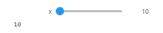

## 1.1.2.传递一个布尔值，我们得到布尔单选按钮

```
_ = interact(simple_function,x = True)interactive(children=(Checkbox(value=True, description='x'), Output()), 
_dom_classes=('widget-interact',))
```

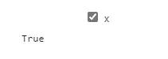

## 1.1.3.传递一个字符串，我们得到一个文本框

```
_ = interact(simple_function, x = 'hello')interactive(children=(Text(value='hello', description='x'), Output()), _dom_classes=('widget-interact',))
```

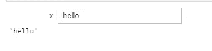

## 1.1.4 传递一个浮动，我们得到一个浮动滑块

```
_ = interact(simple_function, x = (0.0,10.0))interactive(children=(FloatSlider(value=5.0, description='x', max=10.0), Output()), _dom_classes=('widget-inte…
```

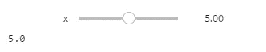

## 1.2.交互显式小部件

```
# consider this sample form a normal distribution
values = np.random.standard_normal(size = 1000)
cat_values = np.random.choice(a = ['one','two','three'],size = 1000)
cat_values2 = np.random.choice(a = ['alpha','beta','gamma'],size = 1000)
sample_df = pd.DataFrame({'values': values,
                          'categories': cat_values,
                          'other categories': cat_values2
                         })
sample_df.head(5)
```


考虑这个直方图，让我们把它转换成一个函数，它接受直方图的参数并绘制直方图。

```
# consider this histogram, lets convert this into a function which takes arguments 
# of histogram and plots a histogram
plt.figure(dpi = 120)
sns.histplot(data = sample_df, x = 'values',palette='BuPu')<AxesSubplot:xlabel='values', ylabel='Count'>
```

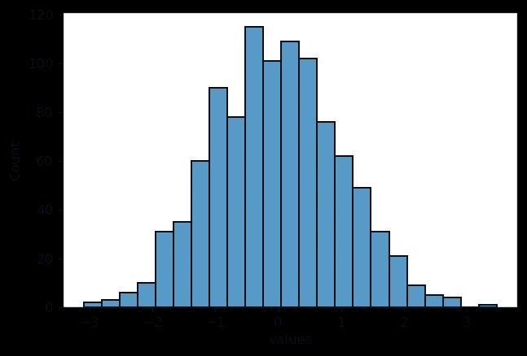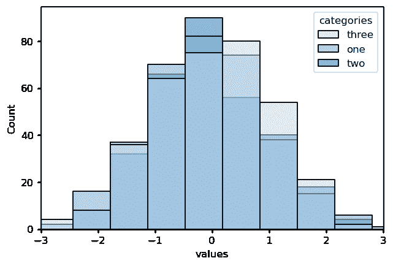

## 1.2.1 IntSlider

1.  滑块以指定的初始值显示。下限和上限由最小值和最大值定义，该值可以根据步长参数递增。
2.  plot_histogram 的第一个参数是可以用 int 滑块改变的条。其他值将被设置为如上所述的默认值。

```
_ = interact(plot_histogram,
         bins = widgets.IntSlider(
             value = 10,
             min = 5,
             max = 200,
             step = 10
         )
        )interactive(children=(IntSlider(value=10, description='bins', max=200, min=5, step=10), Text(value='categories…
```

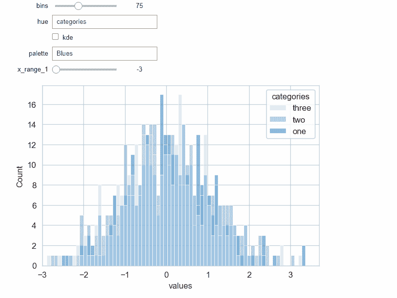

## 浮动滑道

1.  假设我们想要将最小值形成为最大值，在这种情况下设置 x 限制，我们可以利用浮动滑块的力量。

```
_ = interact(plot_histogram,
        x_range_1 = widgets.FloatRangeSlider(
            value = [-3,3], 
            min = -5,
            max = 5,
            step = 0.2,
            readout_format='.1f',
        )
        )interactive(children=(IntSlider(value=10, description='bins', max=30, min=-10), Text(value='categories', descr…
```

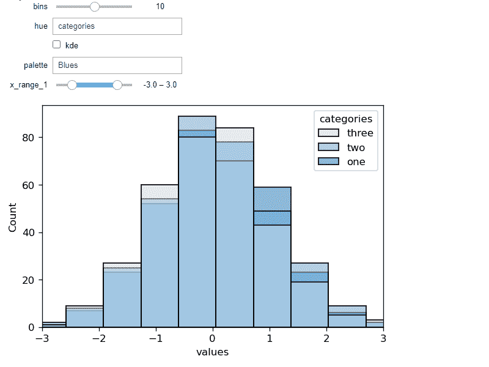

## 切换按钮

1.  假设我们想可视化一些分类功能，我们希望像小部件，切换按钮小部件可以利用按钮。
2.  在这个例子中，我们需要一个用于色调参数的按钮。

```
_ = interact(plot_histogram,
        hue = widgets.ToggleButtons(
            options = ['categories','other categories'],
            tooltip = ['categories','other categories'],
            disabled=False,
            button_style = 'success') )interactive(children=(IntSlider(value=10, description='bins', max=30, min=-10), ToggleButtons(button_style='su…
```

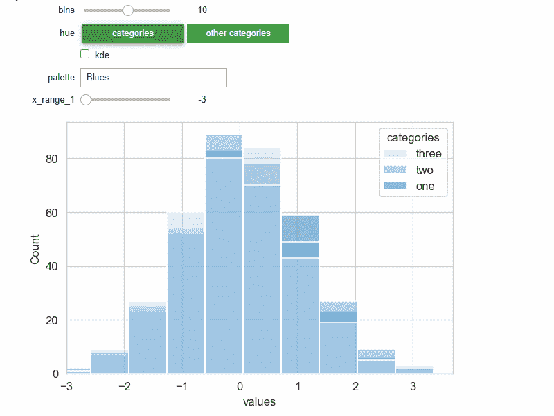

## 1.2.4 单选按钮

1.  让我们创建单选按钮来可视化直方图的 KDE 图:

```
_ = interact(plot_histogram,
             kde = widgets.RadioButtons(
                 options = [True,False],
                 disabled = False)
            )interactive(children=(IntSlider(value=10, description='bins', max=30, min=-10), Text(value='categories', descr…
```

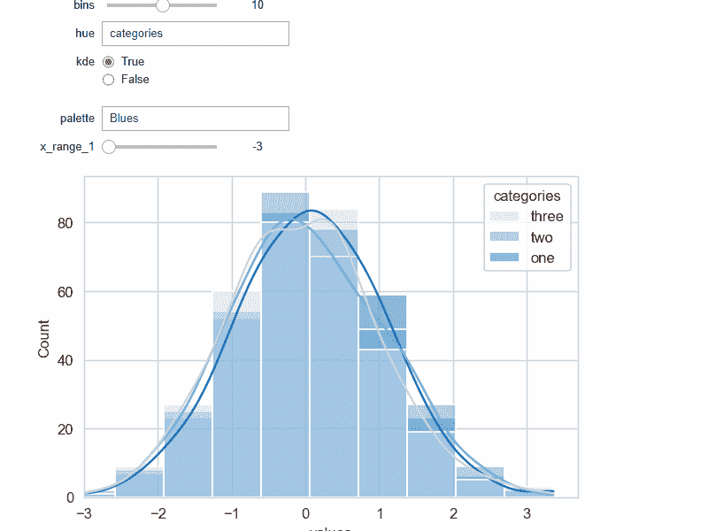

## 下拉列表

1.  dropdown 小部件可以用来获得一个下拉列表。在我们的例子中，我们将改变我们的绘图调色板，以可视化各种配色方案。

```
_ = interact(plot_histogram,
             palette = widgets.Dropdown(
                 options = ['pastel','husl','Set2','flare','crest','magma','icefire']
             )
            )interactive(children=(IntSlider(value=10, description='bins', max=30, min=-10), Text(value='categories', descr…
```

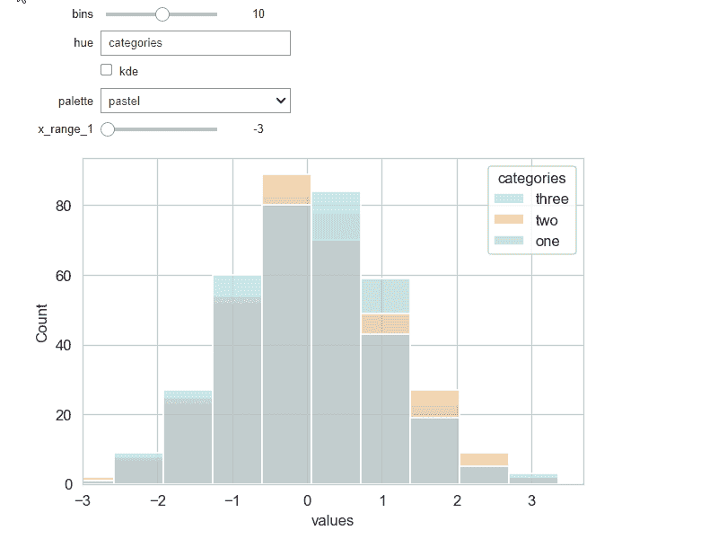

## 1.2.6 可视化所有部件

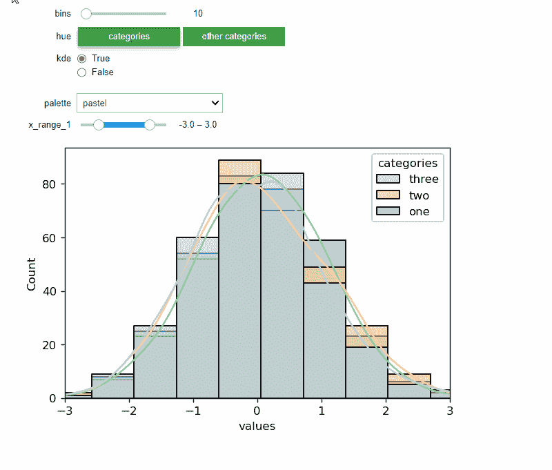

## 1.2.7 假设我们想要水平或垂直排列我们的小部件，我们可以使用 HBox 和 VBox 来实现

```
b1 = widgets.Button(description='button 1')
b2 = widgets.Button(description='button 2')
b3 = widgets.Button(description='button 3')
b4 = widgets.Button(description='button 4')
b5 = widgets.Button(description='button 5')
b6 = widgets.Button(description='button 6')
# arrange (b1 b2) (b3 b4) (b5 b5) horizontally and 
# all this groups vertically 

hbox1 = widgets.HBox([b1,b2])
hbox2 = widgets.HBox([b3,b4])
hbox3 = widgets.HBox([b5,b6]) widgets.VBox([hbox1,hbox2, hbox3])VBox(children=(HBox(children=(Button(description='button 1', style=ButtonStyle()), Button(description='button …
```

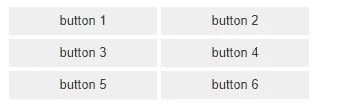

## 2.现在让我们来看看带有股票数据的熊猫表样式。

```
companies = pd.read_csv('https://raw.githubusercontent.com/kshirsagarsiddharth/ipywidgets_data/main/stocks.csv', index_col='Date', parse_dates=True)
# resampling daily data to annual data in this case BY means business start year 
companies = companies.resample('BY').mean()
companies.head()
```

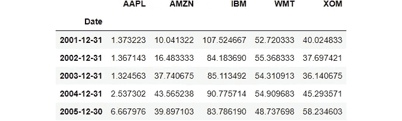

## 2.1.使用背景梯度函数可视化数据帧的热图

```
***background_gradient(
    cmap='PuBu',
    low: 'float' = 0,
    high: 'float' = 0,
    axis: 'Axis | None' = 0,
    subset: 'Subset | None' = None,
    text_color_threshold: 'float' = 0.408,
    vmin: 'float | None' = None,
    vmax: 'float | None' = None,
    gmap: 'Sequence | None' = None,
) -> 'Styler'
Docstring:
Color the background in a gradient style.

The background color is determined according
to the data in each column, row or frame, or by a given
gradient map. Requires matplotlib.***companies.style.background_gradient()
```

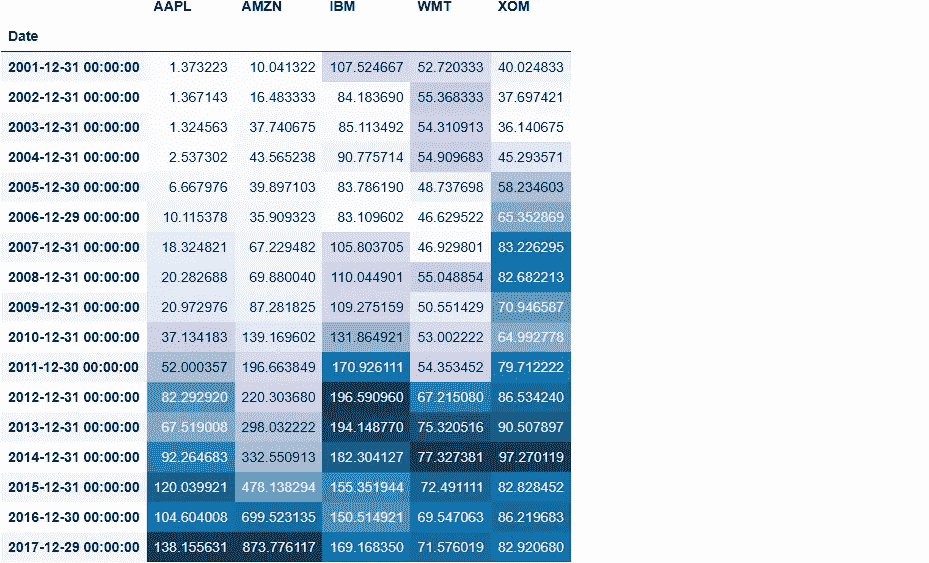

使用海运的调色板[https://seaborn.pydata.org/tutorial/color_palettes.html](https://seaborn.pydata.org/tutorial/color_palettes.html)

```
color_palette = sns.cubehelix_palette(start=.5, rot=-.5, as_cmap=True)
companies.style.background_gradient(color_palette)
```

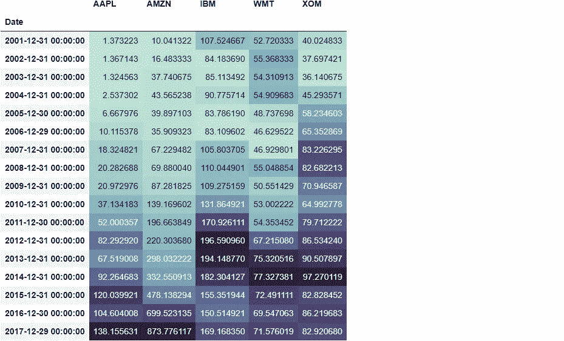

```
color_palette = sns.color_palette("vlag", as_cmap=True)
companies.style.background_gradient(color_palette)
```

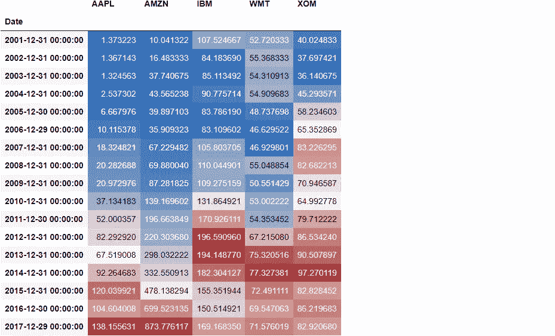

```
color_palette = sns.color_palette("coolwarm", as_cmap=True)
companies.style.background_gradient(color_palette)
```

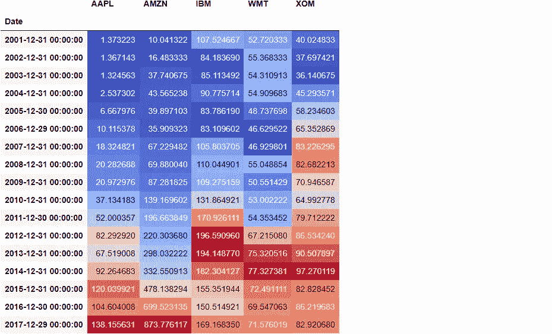

## 2.2.突出显示最小值和最大值

```
***highlight_min(
    subset: 'Subset | None' = None,
    color: 'str' = 'yellow',
    axis: 'Axis | None' = 0,
    props: 'str | None' = None,
) -> 'Styler'
Docstring:
Highlight the minimum with a style.***# highlighting minimum
# this understandable given 2002 tech bubble
companies.style.highlight_min(color = '#ff8a8a')
```

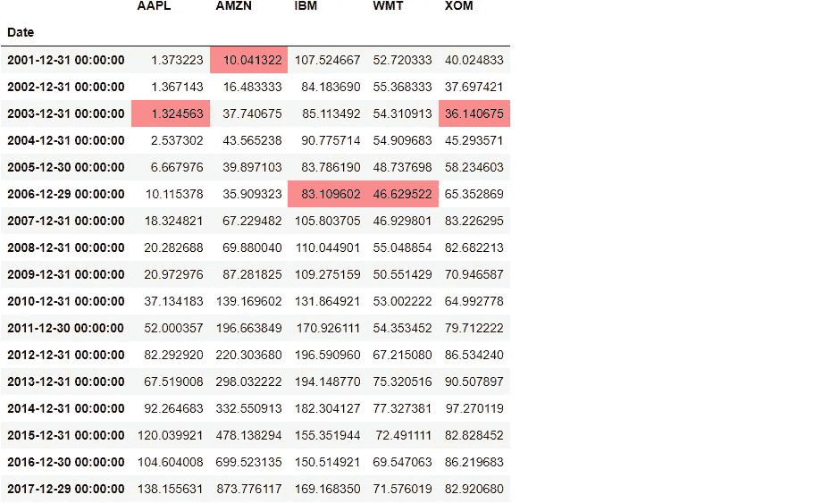

```
# highliting maximum 
companies.style.highlight_max(color = '#4fc277')
```

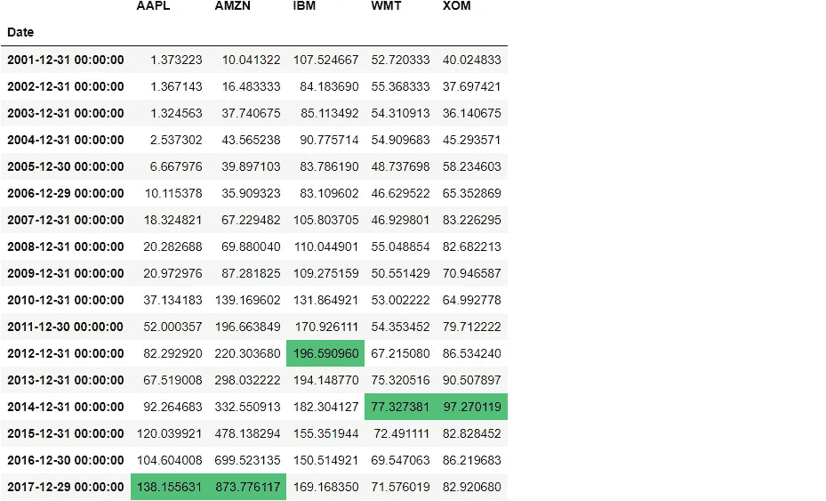

## 2.3.使用应用贴图

1.  该函数将第一个参数作为函数，第二个参数作为标签，类似于数组:

```
***applymap(
    func: 'Callable',
    subset: 'Subset | None' = None,
    **kwargs,
) -> 'Styler'
Docstring:
Apply a CSS-styling function elementwise.

Updates the HTML representation with the result.***
```

## 让我们考虑下面计算股票回报的数据框架

1.  退货(https://www . investopedia . com/terms/r/return . ASP)
2.  回报是资产、投资或项目的价格随时间的变化，可以用价格变化或百分比变化来表示。
3.  正回报代表利润，而负回报标志着亏损

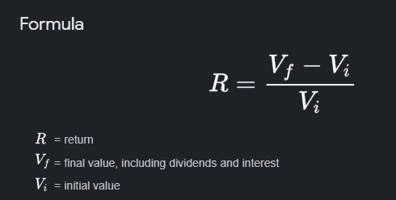

```
companies_returns = companies.pct_change().dropna()
companies_returns.head()
```

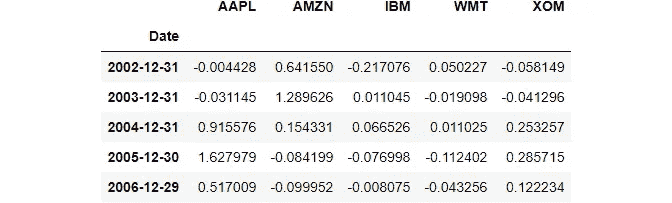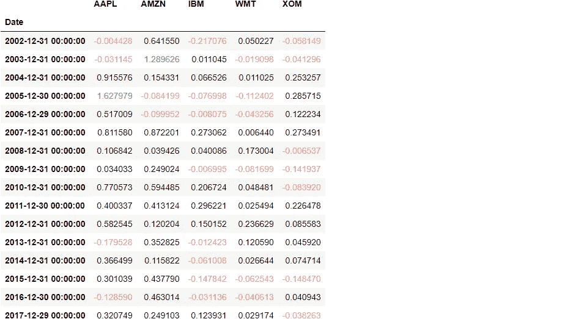

## 假设我们想要增加文本的大小并添加一些背景颜色

```
companies_returns.style.applymap(lambda x: 'font-size:23.2px; background-color: #d9e0ff')
```

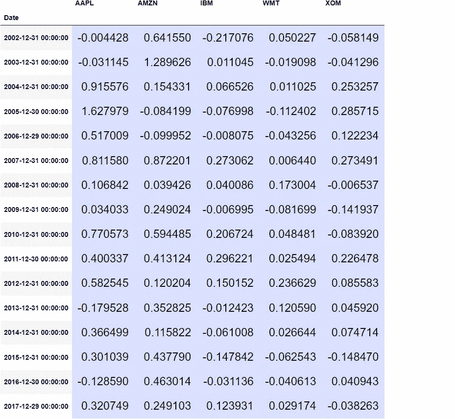

## 使用利润损失和字体和背景功能在一起

```
companies_returns.style.applymap(color_negative_values).applymap(lambda x: 'font-size:23.2px; background-color: #d9e0ff')
```

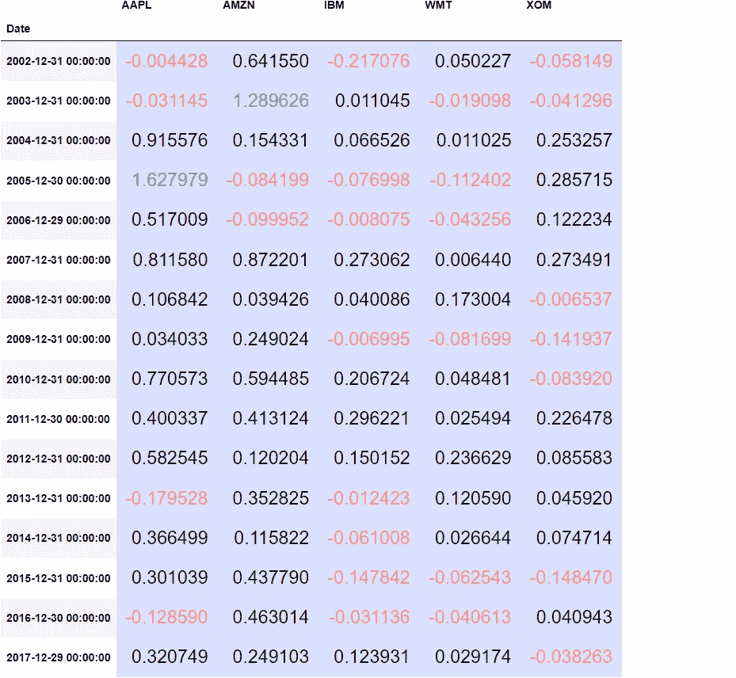

```
# using the subset argument
companies.style.applymap(lambda x: 'font-size:23.2px; background-color: #ccd8ff', subset=['IBM','WMT'])
```

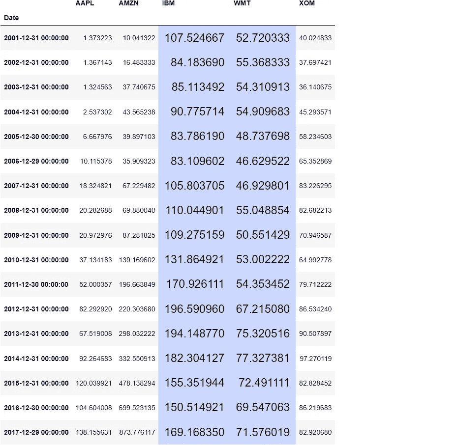

## 2.4.应用:假设我们想要找到一行中的最大值和最小值，即在给定的一天中哪个资产表现最好和最差，我们可以使用应用函数来实现。该方法采用我们想要应用函数的函数和轴

```
***apply(
    func: 'Callable[..., Styler]',
    axis: 'Axis | None' = 0,
    subset: 'Subset | None' = None,
    **kwargs,
) -> 'Styler'
Docstring:
Apply a CSS-styling function column-wise, row-wise, or table-wise.

Updates the HTML representation with the result.***def find_max(values):
    return np.where(values == np.max(values),'color: red; font-size:20.2px','font-size:20.2px')

def find_min(values):
    return np.where(values == np.min(values),'color: green; font-size:20.2px','font-size:20.2px')

# the function of apply should take a series and should return an object of same length
companies_returns.style.apply(find_max, axis = 1).apply(find_min, axis = 1)
```

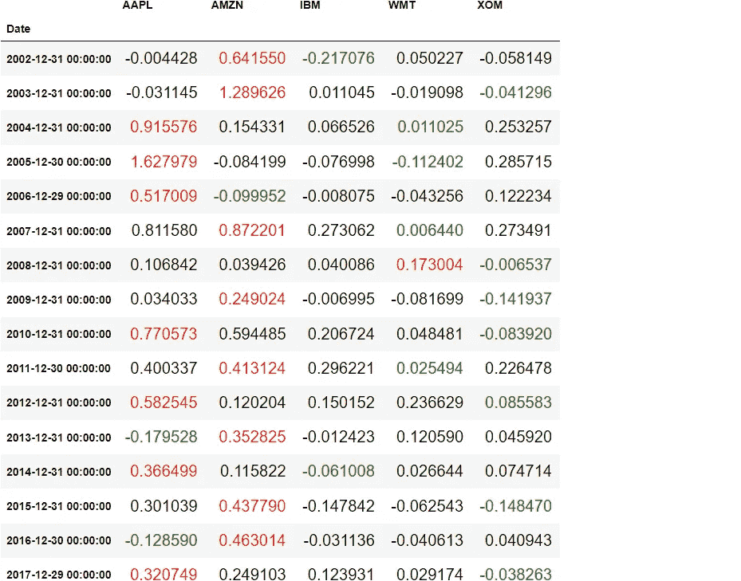

```
# give border if the value in columns lie betwen 0.5 and 1 
companies_returns.style.apply(lambda x : ['color:#66de70; border-style: inset;font-size:20.2px' if (val > 0.5 and val < 1) else None for val in x], axis = 1)
```

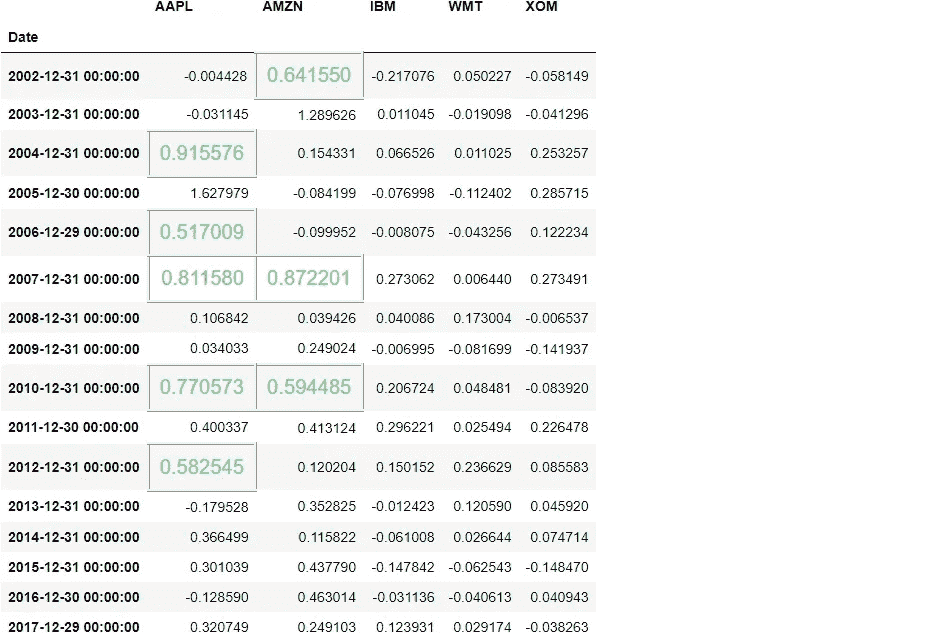

```
# give border color if the value is greater than 1 
companies_returns.style.apply(lambda x : ['color:#87a9ff; border-style: ridge; border-width:7px;font-size:20.2px' if (val > 1) else 'opacity:0.2;' for val in x], axis = 0)
```

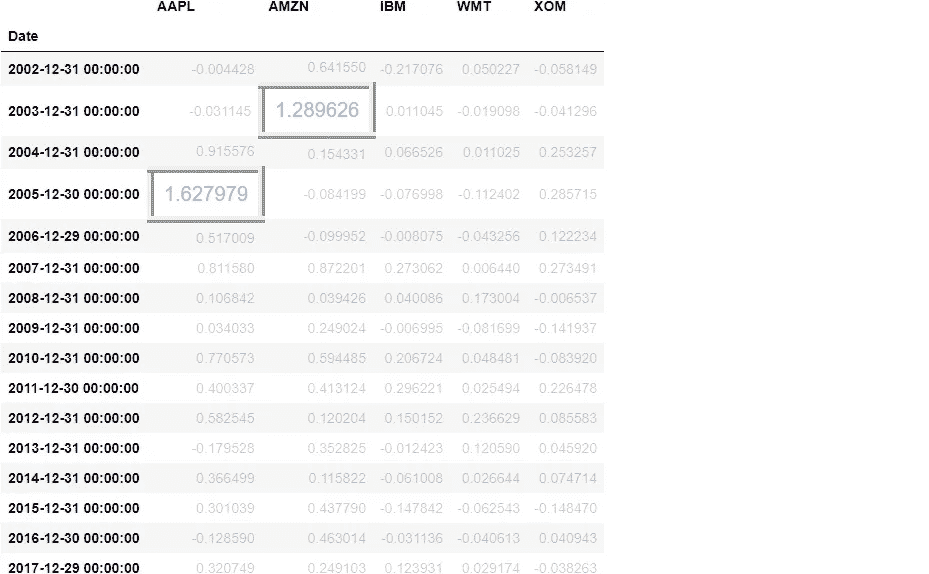

## 2.5.bar:假设我们只对两种资产感兴趣，我们想并排比较这两种资产每年的表现。我们可以利用熊猫式的杠法。

```
bar(
    subset: 'Subset | None' = None,
    axis: 'Axis | None' = 0,
    color='#d65f5f',
    width: 'float' = 100,
    align: 'str' = 'left',
    vmin: 'float | None' = None,
    vmax: 'float | None' = None,
) -> 'Styler'companies_returns.style.bar(subset = ['AMZN','IBM'], color = ['#d65f5f', '#5fba7d'], align = 'mid')
```

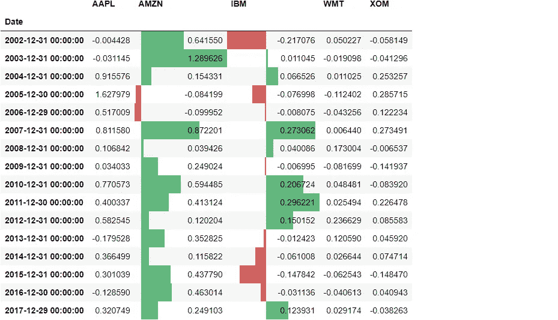

## 2.6.使用文本渐变突出显示文本

```
***text_gradient(
    cmap='PuBu',
    low: 'float' = 0,
    high: 'float' = 0,
    axis: 'Axis | None' = 0,
    subset: 'Subset | None' = None,
    vmin: 'float | None' = None,
    vmax: 'float | None' = None,
    gmap: 'Sequence | None' = None,
) -> 'Styler'
Docstring:
Color the text in a gradient style.

The text color is determined according
to the data in each column, row or frame, or by a given
gradient map. Requires matplotlib.***companies_returns.style.text_gradient(subset = ['AAPL','AMZN'], cmap = 'icefire').applymap(lambda x : 'font-size:22.2px; font-weight:bold')
```

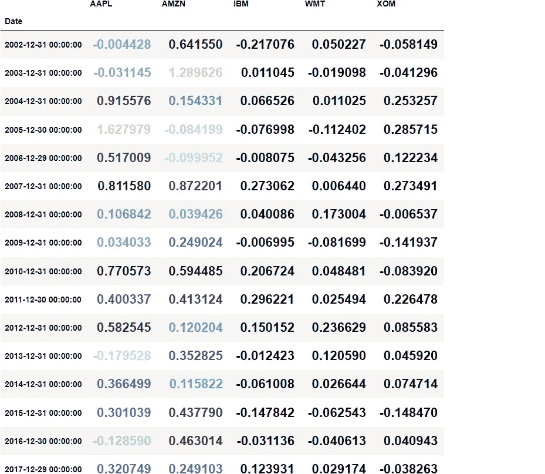

## 3.应用 ipywidgets 和 pandas styler 执行贷款违约分析。

```
df = pd.read_csv('https://raw.githubusercontent.com/kshirsagarsiddharth/ipywidgets_data/main/loan_data_raw.csv')
```

## 3.1.处理空值

```
df.isnull().sum()*person_age                       0
person_income                    0
person_home_ownership            0
person_emp_length              895
loan_intent                      0
loan_grade                       0
loan_amnt                        0
loan_int_rate                 3116
loan_status                      0
loan_percent_income              0
cb_person_default_on_file        0
cb_person_cred_hist_length       0
dtype: int64*
```

少于 10%的数据是空的，因此我们可以用中位数来代替。不建议这样做，但是为了简单起见，我们可以这样做。

```
df['loan_int_rate'].isnull().sum() * 100 / df.shape[0]9.563856235229121df['loan_int_rate'] = df['loan_int_rate'].fillna(df['loan_int_rate'].median())
```

让我们用中间值填充人员雇佣长度数据框

```
df['person_emp_length'] = df['person_emp_length'].fillna(df['person_emp_length'].median())
```

## 现在我们摆脱了空值。

```
df.isnull().sum()*person_age                    0
person_income                 0
person_home_ownership         0
person_emp_length             0
loan_intent                   0
loan_grade                    0
loan_amnt                     0
loan_int_rate                 0
loan_status                   0
loan_percent_income           0
cb_person_default_on_file     0
cb_person_cred_hist_length    0
dtype: int64*
```

## 3.2 异常值检测和去除

通常，异常值存在于定量数据中，因此我们希望对所有定量变量进行交互式可视化。

```
df.select_dtypes(include = 'number').columnsIndex(['person_age', 'person_income', 'person_emp_length', 'loan_amnt',
       'loan_int_rate', 'loan_status', 'loan_percent_income',
       'cb_person_cred_hist_length'],
      dtype='object')numeric_cols = ['person_age', 'person_income', 'person_emp_length', 'loan_amnt','loan_int_rate','loan_percent_income','cb_person_cred_hist_length'] def scatter_plot_int(x = 'person_age',y = 'person_income'):
    plt.figure(dpi = 120)
    sns.set_style('whitegrid')
    return sns.scatterplot(data = df, x = x,y = y, alpha = 0.6)scatter_plot_int()
```

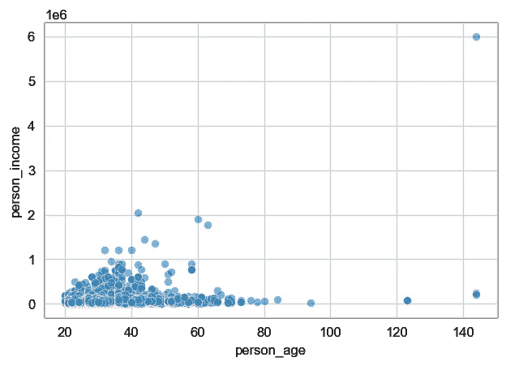

```
_ = interact(scatter_plot_int,
             x = widgets.Dropdown(
                 options = ['person_age','person_income','person_emp_length','loan_amnt','loan_int_rate','loan_percent_income','cb_person_cred_hist_length']
                 ),
             y = widgets.Dropdown(
                 options = ['person_age','person_income','person_emp_length','loan_amnt','loan_int_rate','loan_percent_income','cb_person_cred_hist_length']
                 )
            )interactive(children=(Dropdown(description='x', options=('person_age', 'person_income', 'person_emp_length', '…
```

## 在使用上面的交互图后，我发现了这些异常值:

1.  年龄> 80 岁的异常值
2.  个人收入> 5 个异常值
3.  人员雇佣长度> 60 个异常值

```
df = df[~(df['person_age'] > 80)]
#df = df[~(df['person_income'] > 5)]
#df = df[~(df['person_emp_length'] > 70)]
```

## 3.3 可视化 2 个定量变量之间的关系

[https://gist . github . com/kshirsagarsiddharth/daf 0c 24 a 9062 DC 74 b 8586 FB 82d 02749 f](https://gist.github.com/kshirsagarsiddharth/daf0c24a9062dc74b8586fb82d02749f)

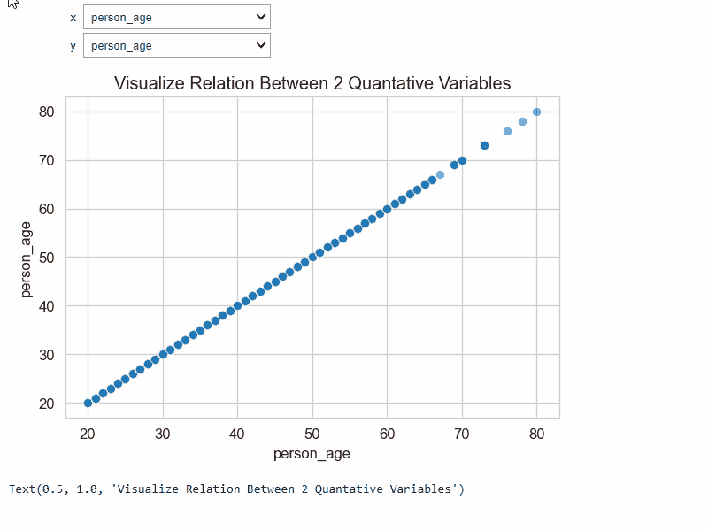

## 3.4 用色调可视化 2 个定量变量之间的关系

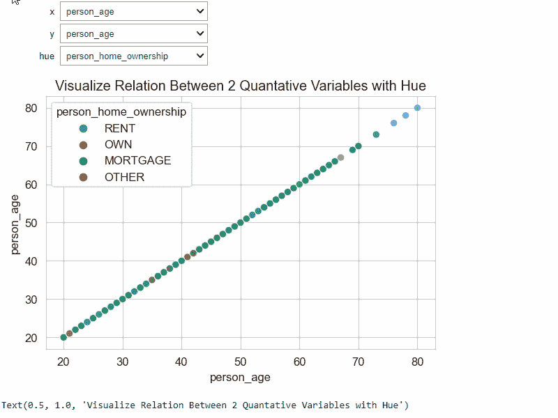

## 3.5 量化变量的单变量可视化

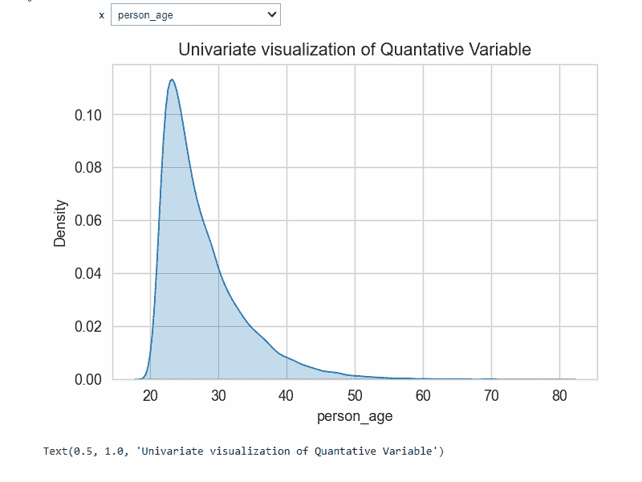

## 3.6 具有色调的定量变量的单变量可视化

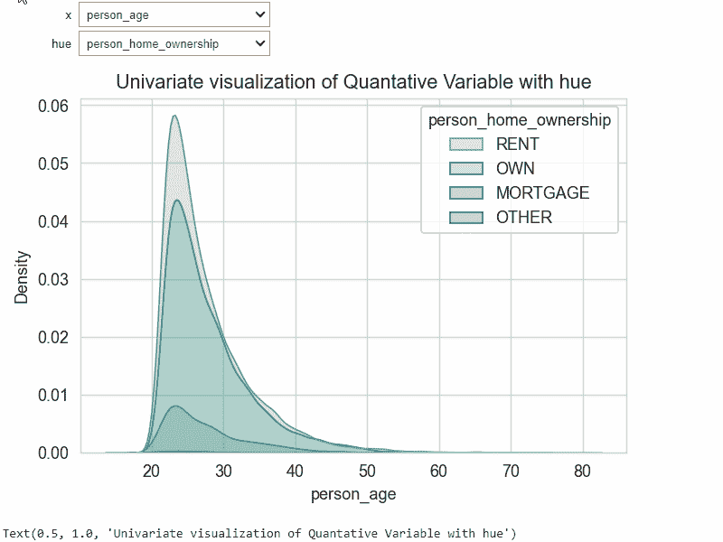

## 3.7 旋转

假设您想要对索引和列中的分类数据执行一些旋转操作，而值是数字数据，这可以使用数据透视表来完成。简单地说，我们想要执行一些旋转。

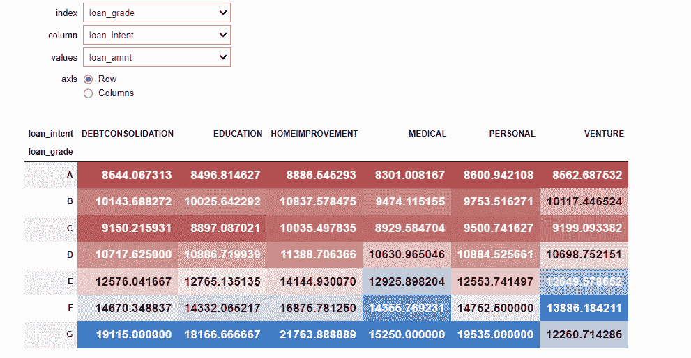

## 3.8 分析两个分类变量之间的数据。

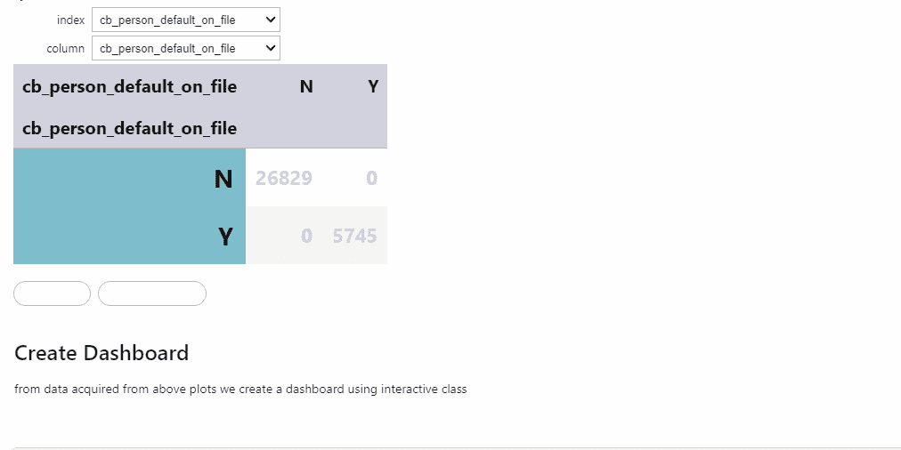

## 3.9 创建仪表板

根据从上述图中获取的数据，我们使用交互类创建了一个仪表板:

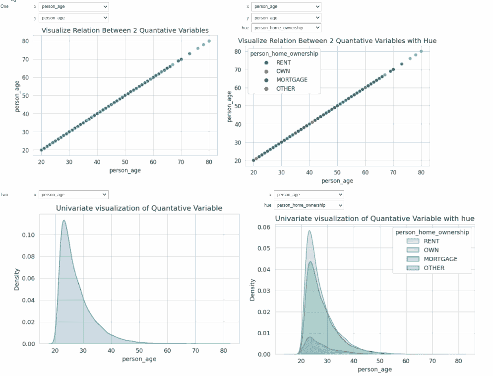

代码可在以下网址找到:

[创造互动美好的剧情(ipywidgets) | Kaggle](https://www.kaggle.com/rudrasing/create-interactive-and-beautiful-plots-ipywidgets)

## 模型构建(待续...)

*更多内容看* [*说白了。报名参加我们的*](http://plainenglish.io/) [*免费每周简讯*](http://newsletter.plainenglish.io/) *。在我们的* [*社区*](https://discord.gg/GtDtUAvyhW) *获得独家写作机会和建议。*