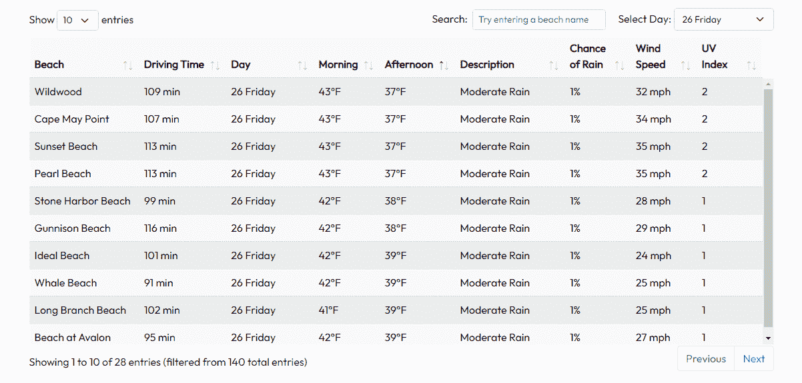
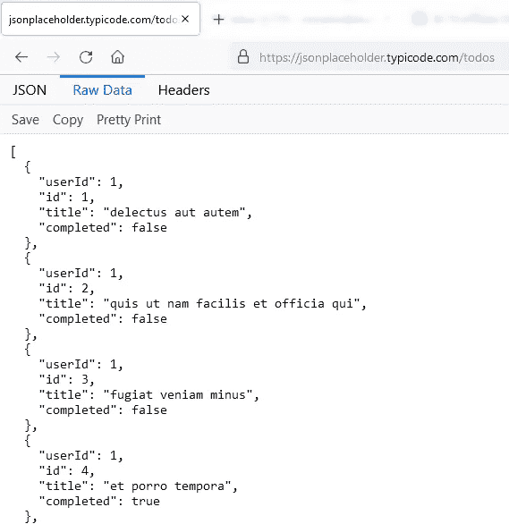
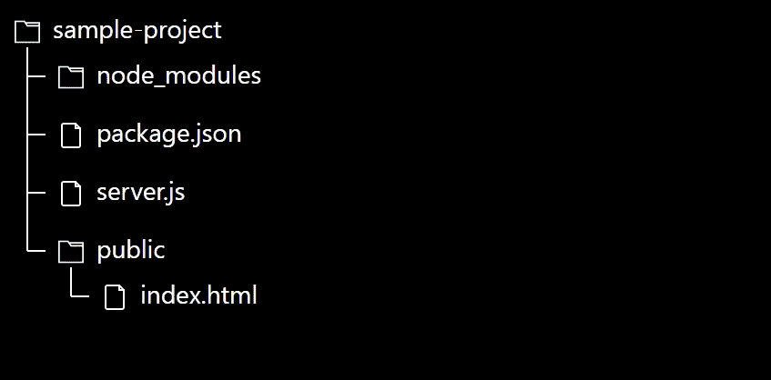
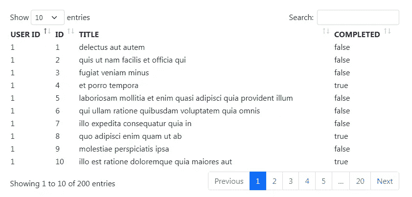
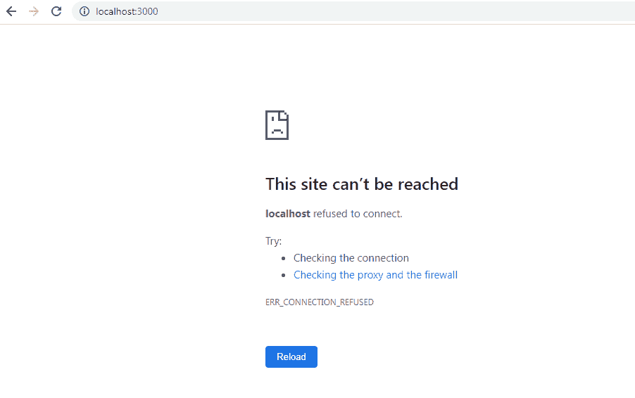

# 创建用应用编程接口数据填充的交互式超文本标记语言表

> 原文：<https://levelup.gitconnected.com/create-interactive-html-tables-populated-with-api-data-dd5c467b0851>


[Quaid Lagan](https://unsplash.com/photos/GVZZSxjblsY) 在 [Unsplash](https://unsplash.com/) 上的图像

## 概观

我最近建立的一个网站需要一个动态表，其中填充了来自 API 调用的实时数据。简单的超文本标记语言是*而不是*来切割它。

所以我转向了 [jQuery DataTables](https://datatables.net/) ，这是一个免费的库，可以很容易地为任何 HTML 表添加用户友好的特性。

我的表格显示了新泽西州几十个热门海滩的天气预报(以及驾驶距离)。这是最后的结果。



作者的 GIF。在 [GitHub](https://github.com/misha345a/NJ_Beach_Tracker) 上查看整个项目

然而，要做到这一点相当令人头痛——尤其是对于那些在服务器端使用 JavaScript 的人来说，可用的文档数量很少。

**在本文中，我将介绍将 HTML 表的数据馈送连接到 JS 服务器端脚本所需的基本结构。**

## 计划

让我们从一个示例项目开始。

通常，我们的数据不会被硬编码。它很可能是从 API 中检索到的。我们的目标是用来自这个[在线 REST API](https://jsonplaceholder.typicode.com/) 的假数据填充目录(这是免费的，不需要 API 密钥)。



作者的形象。来自[的样本数据，此处为](https://jsonplaceholder.typicode.com/todos/)

## 项目文件夹

在根项目文件夹中保持适当的文件结构很重要。

我的是这样的:



作者的形象

为了测试，我将使用 Node.js 在本地启动 web 服务器。示例项目文件和所需的包可以在 GitHub [上找到，这里是](https://github.com/misha345a/DataTables_Sample_Project)。

## 表格 HTML

首先，我们需要包含必要的源文件。将此代码块复制并粘贴到您的 HTML 文件中。它将导入 JQuery 库、DataTables Javascript 以及 CSS 文件，我个人更喜欢这些文件，而不是默认的表格样式。

```
<link rel="stylesheet" type="text/css" href="[https://cdnjs.cloudflare.com/ajax/libs/twitter-bootstrap/5.0.1/css/bootstrap.min.css](https://cdnjs.cloudflare.com/ajax/libs/twitter-bootstrap/5.0.1/css/bootstrap.min.css)"><link rel="stylesheet" type="text/css" href="[https://cdn.datatables.net/1.11.1/css/dataTables.bootstrap5.min.css](https://cdn.datatables.net/1.11.1/css/dataTables.bootstrap5.min.css)"><script type="text/javascript" language="javascript" src="[https://code.jquery.com/jquery-3.5.1.js](https://code.jquery.com/jquery-3.5.1.js)"></script><script type="text/javascript" language="javascript" 
src="[https://cdn.datatables.net/1.11.1/js/jquery.dataTables.min.js](https://cdn.datatables.net/1.11.1/js/jquery.dataTables.min.js)"></script><script type="text/javascript" language="javascript" src="[https://cdn.datatables.net/1.11.1/js/dataTables.bootstrap5.min.js](https://cdn.datatables.net/1.11.1/js/dataTables.bootstrap5.min.js)"></script>
```

然后，创建一个 HTML 表，并给它适当的列名。

> 为了使数据表能够增强 HTML 表，该表必须是有效的、格式良好的 HTML，具有一个标题( **thead** )和一个正文( **tbody** )。也可以使用可选的页脚( **tfoot** )。
> - [数据表文档](https://datatables.net/manual/installation)

```
<div class="container" style="width:60%;">
  <table id="example">
      <thead>
          <tr>
              <th scope="col">USER ID</th>
              <th scope="col">ID</th>
              <th scope="col">TITLE</th>
              <th scope="col">COMPLETED</th>
          </tr>
      </thead>
  </table>
</div>
```

## 正在初始化数据表

现在，让我们初始化 HTML 文件中的数据表。在这个代码块中，我们告诉 DataTables 用 *id="example"* 选择我们的 HTML 表，并在文档完全准备好之后加载数据。

```
<script type="text/javascript" class="init">$(document).ready(function() {
  // Create a new DataTable object
  table = $('#example').DataTable({
       ajax: {
         url: '/exampleData',
       },
       columns: [
           { data: 'userId' },
           { data: 'id' },
           { data: 'title' },
           { data: 'completed' }
         ]
       })
});</script>
```

ajax。URL()方法用于定义表格的 Ajax 数据源。在这种情况下，数据表将试图从 */exampleData* 获取数据；我们将在下一步实现一个 app.get()请求函数来处理这个问题。

**本质上，DataTables 通过 Ajax 向服务器端发送 GET 请求，同时期待 JSON 数据的返回。**

在加载表之前，有许多方法可以处理和操纵 JSON 响应。请参考文档的第页。

在我们的例子中，JSON 响应是一个伪 todo 项的数组，其中每个项都是表中的一行。 *columns* 参数提供了关于项目的每个数据点在表格上的位置的更多细节。例如，响应数组中的第一项是:

```
[ {
 “userId”: 1,
 “id”: 1,
 “title”: “delectus aut autem”,
 “completed”: false
 },
…
]
```

因此 *{ data: 'userId' }* 指定表的第一列将接收与“userId”键配对的数据。如果你有嵌套数据，那么*列*方法将帮助你通过使用点对象符号来访问它。

## 服务器端 API 请求

在服务器端，我们可以使用 Express 包为 HTTP GET 请求定义一个路由处理程序。

```
app.get("/exampleData", function (req, res) {const url = '[https://jsonplaceholder.typicode.com/todos'](https://jsonplaceholder.typicode.com/todos');// Make a request
  axios.get(url)
    .then(response => {
      // send the collected data back to the client-side DataTable
      res.json({
        "data": response.data
      })
    })
    .catch(function (error) {
       // handle error
       res.json({"error": error});
    })
});
```

所以现在，每次 DataTables 向 url *exampleData* 发送 GET 请求，都会在这里收到。一旦发生这种情况，我们从 API 中检索数据，然后将其发送到客户端的数据表。发送到数据表的数据是以 JSON 有效负载的形式，随后填充到表中。

*数据*参数在响应中是必需的，表示数据表要使用的数据。当触发时，*错误*参数可用于在用户页面上显示错误消息。

此时，每次加载或刷新页面时，该表都会填充数据。



图片由作者提供。来自本地主机的快照:3000

## 定制选项

初始化数据表后，库自动为我们的表添加了响应搜索、排序和分页功能！但是我通常喜欢包括几个其他的配置参数。它们在 DataTable()函数中指定。

```
table = $('#example').DataTable({
       "lengthMenu": [ [15, 50, 100, -1], [15, 50, 100, "All"] ],
       "pagingType": "simple",
       scrollY: 400,
       scrollCollapse: true,
       order: [[ 0, 'asc' ], [3, 'desc' ]],ajax{...},
       columns: ...
})
```

概括地说，我定制了表可以显示多少条目的选项，以及分页特性的样式。我还添加了 *scrollY* ,这样表格将有一个固定标题的可滚动主体。最后，我定义了数据加载后用户 ID 和完成列的顺序。

这是桌子现在的样子。



作者 GIF。示例项目表

## 结论

我们已经成功地实现了使我们的 HTML 表具有响应性、交互性和链接到服务器的核心元素。然而，这只是一个基础，更多的复杂性现在可以叠加在上面。

感谢您的阅读！

同样，样本项目文件在 [GitHub](https://github.com/misha345a/DataTables_Sample_Project) 上。