# 在 Swift 中创建 iOS 漫游屏幕

> 原文：<https://levelup.gitconnected.com/create-ios-walkthrough-screens-in-swift-1318aeba61de>

# 介绍

本文将介绍如何为您的 iOS 应用程序创建漫游屏幕。

演练屏幕如图 1 所示。每个屏幕将显示一个图像和一些文本，用户可以跳过或移动到下一个屏幕，一个页面控件将突出显示当前页面。

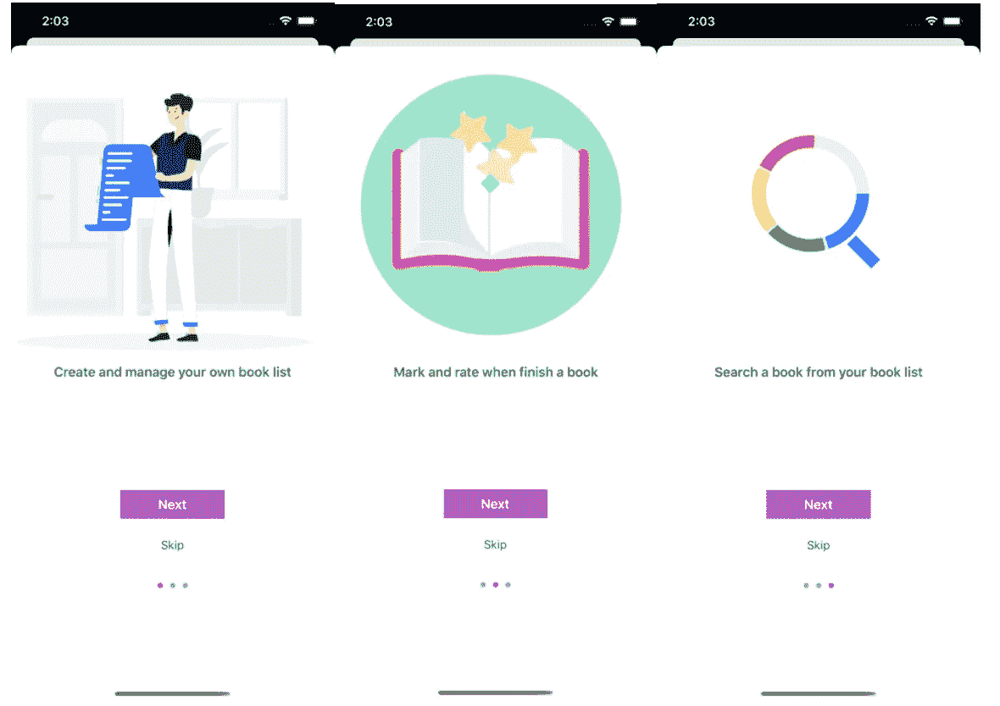

*图 1 预排屏幕演示*

# 先决条件

对对象库、布局约束有基本的了解，知道如何通过 segue 在控制器之间传递数据。

# 开始

## **第一部分:故事板中的 UI 设计**

**第一步:添加一个新的故事板**

为演练屏幕创建新的故事板为了更好地组织应用程序 UI，将故事板文件命名为*演练*

**第二步:添加一个*UIPageViewController*** 拖动一个页面视图控制器到故事板。转到属性检查器，将过渡样式设置为漫游页面滚动

**第三步:添加一个*ui view controller*** 从图 1 中我们可以看出，预排画面可以分为两个部分:

*   上半部分用于显示包括图像和标签的内容，上半部分内容在每个屏幕中变化
*   下半部分用于显示按钮和页面控制，下半部分在三个屏幕中保持不变

**为了保存这两个部分，我们需要添加一个 *UIViewController:***

1.  向故事板添加一个 *UIViewController* 来保存这两个部分。
2.  将一个*容器视图*拖至 *UIViewController* 以固定住上部。上面的部分会在每个页面上改变，容器视图可以创建一个所有视图控制器都可以共享的可重用组件。就像可重用的表格视图单元格一样！
3.  控制拖动*容器视图*到*页面视图控制器*，选择*嵌入*选项。现在容器视图通过*嵌入*序列与页面视图控制器连接。
4.  将*视图*添加到 *UIViewController* 中以固定下部。下部对象在每个屏幕上都保持不变，所以一个*视图*就足够了。

现在故事板应该如图 2 所示:

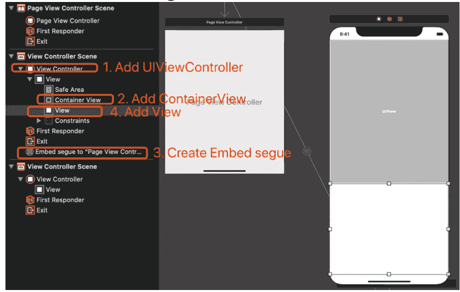

*图 2 创建视图控制器并添加视图*

**接下来，我们可以在视图中添加下一页和跳过按钮以及页面指示器:**

1.  拖动*按钮*到*视图*，命名为“下一步”
2.  拖动*按钮*到*视图*下一个按钮，命名为“跳过”
3.  拖动*页面控件*对象到*视图*跳转按钮下，设置页数为 3，设置色调颜色和当前页面

现在*视图*应该如图 3 所示:

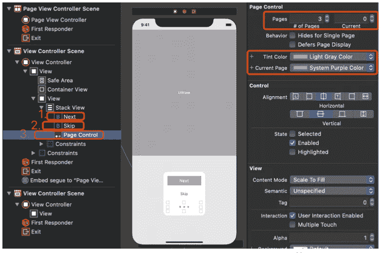

*图 3 视图控制器中的设计视图*

**现在，我们可以将内容添加到*容器视图*** 1 中。将*图像视图*拖动到*容器视图* 2 中。将一个*标签*对象拖到图像视图下的*容器视图*

现在*容器视图*应该如图 4 所示:

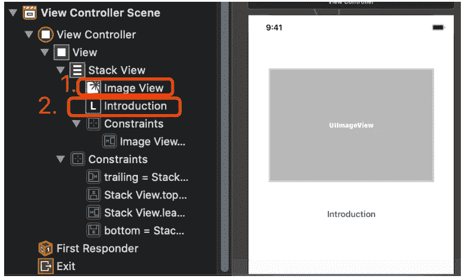

*图 4 视图控制器中的设计容器视图*

目前，我们已经完成了 UI 设计部分。接下来，我们可以创建控制器类来与视图控制器配对。

## 第 2 部分:设计视图控制器类

**第一步:创建*walk throughcontentviewcontroller***

1.  添加一个新的 *Cocoa Touch 类*文件，命名为*walk through contentviewcontroller*，设置为 *UIViewController* 的子类。
2.  声明两个 outlet *imageView* 和 *introLabel* ，用 UI 对象连接它们。**现在将容器 ViewController 的故事板 id 和自定义类设置为 walk throughcontentviewcontroller。**

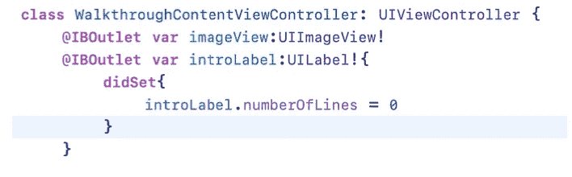

申报两个网点

3.声明三个实例变量，*索引变量*用于标识屏幕， *intro* 和 *imageFile 变量*用于 introLabel 文本和 imageView 图像名称。

**第二步:创建页面视图控制器** 在这一步中，我们将把内容视图控制器添加到页面视图控制器中，以允许用户在它们之间导航。

1.  添加一个新的 *Cocoa Touch 类*文件，命名为*walk through pageviewcontroller*，设置为 *UIPageViewController* 的子类。**现在将故事板 id 和 PageViewController 的自定义类设置为 walk through pageview controller**
2.  采用*uipageviewcontrolerdatasource*协议。和 *UITableView* 中一样，我们需要数据源为页面视图提供数据

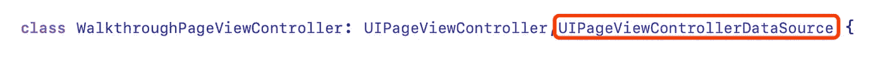

3.声明 *pageIntro* 和 *pageImages* 变量，为页面视图准备数据。并将 3 个图像添加到 Assets.xcassets，将它们命名为“图像 1”、“图像 2”和“图像 3”

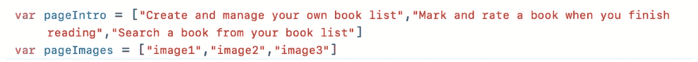

4.创建一个方法 *contentViewController* ，它根据索引返回相应的页面内容控制器。

*   首先，创建一个名为“walkthrough”的 storyboard 实例
*   接下来，根据故事板 id 调用*instantiate viewcontroller*方法，该方法将返回*walk through content viewcontroller*
*   最后，根据*索引*将特定数据分配给*walk through content viewcontroller*

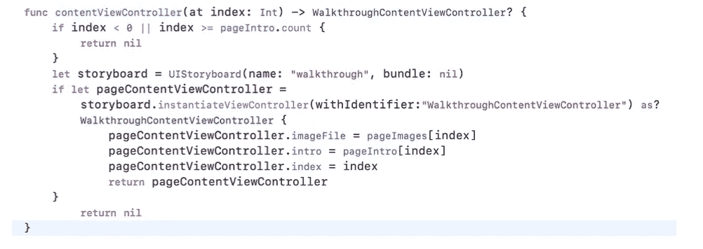

*内容视图控制器方法*

5.实现*uipageviewcontrolerdatasource*协议的两个必需方法。在这两种方法中，我们可以得到给定视图控制器的当前页面*索引*。然后增加/减少*指数*并返回*视图控制器*显示。

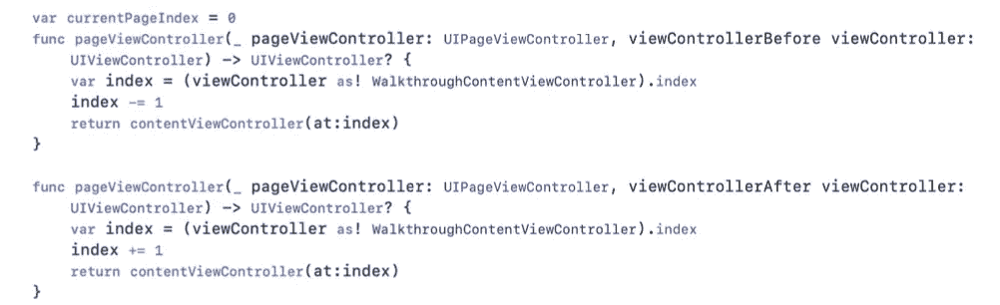

6.更新 *viewDidLoad* 方法
设置 *UIPageViewController* 的数据源，并在视图加载时创建第一个 *ContentViewController* 。

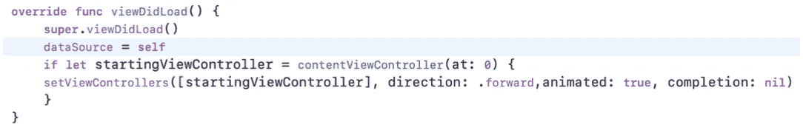

**第三步:创建*walk through view controller*和**

1.  创建一个新的 *Cocoa Touch 类*文件，将其命名为 *WalkthroughViewController，*并将其子类设置为 *UIViewController。* ***别忘了将故事板 id 和 ViewController 的自定义类设置为 WalkthroughViewController！***
2.  为*下一页/跳过按钮*和*页面控件*声明出口，连接 UI 对象

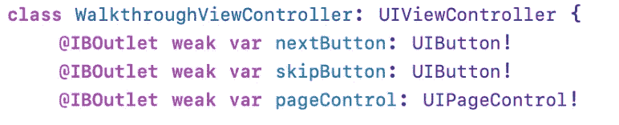

*下一页/跳过按钮*和*页面控制*的插座

3.为*跳过按钮* 创建动作当*跳过按钮*被点击时，*漫游视图控制器*应该被解除

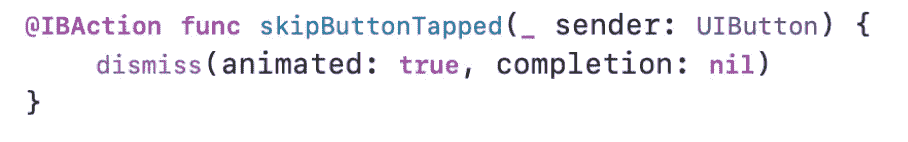

*跳过按钮动作*

4.为*下一步按钮
下一步按钮*创建动作当点击*下一步按钮*时，应用程序应显示下一个预排屏幕。

*   为了显示页面视图控制器的下一个屏幕，我们需要在*中设计 walk through pageviewcontroller*。在 *nextPage()* 方法中，调用内置的 *setViewControllers()* 方法导航到下一个视图控制器。

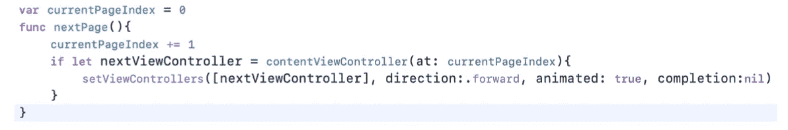

导航到下一个视图控制器

*   现在我们可以在*walk through view controller*中依次传递*walk through pageview controller*

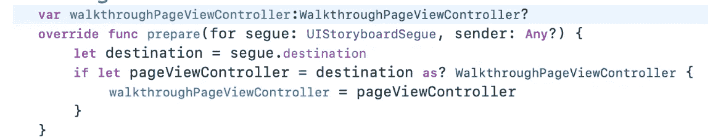

按顺序传递*walk through pageviewcontroller*

*   最后，在*walk through view controller*中为 nextButton 创建动作。轻触*下一步按钮*时，如果屏幕*索引*为 0 或 1，将显示下一个屏幕；当进入最后一个屏幕时，屏幕将被关闭。

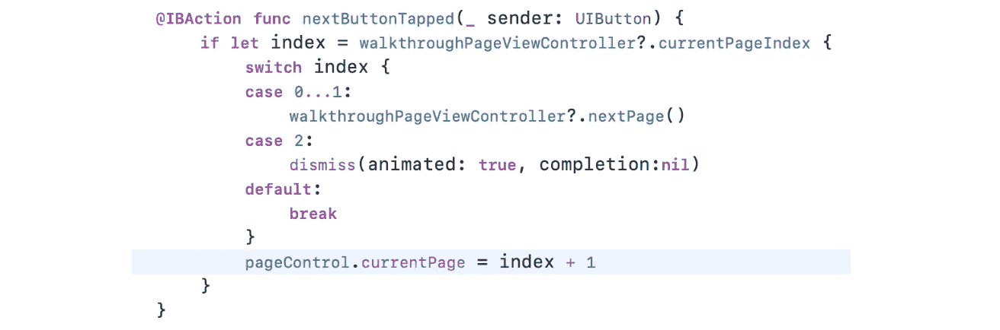

下一步按钮的操作

现在，所有的 UI 设计和控制器类都已完成，我们需要在应用程序加载时显示漫游屏幕。

**步骤 4:显示漫游屏幕**
在你的 app 的初始控制器的类中添加一个*viewdiappear()*方法，实例化并显示*walk through view controller*

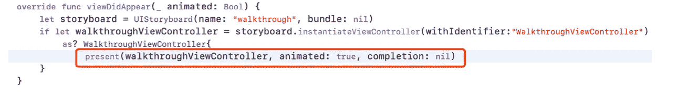

T76 现在编译并运行您的应用程序，将显示漫游屏幕！

## 进一步的工作

当用户第一次启动应用程序时，漫游屏幕应该只显示一次。但是现在，当用户启动应用程序时，漫游屏幕将总是显示，我们仍然需要存储漫游屏幕是否已经显示的状态，如果已经显示，它将不会再次出现。