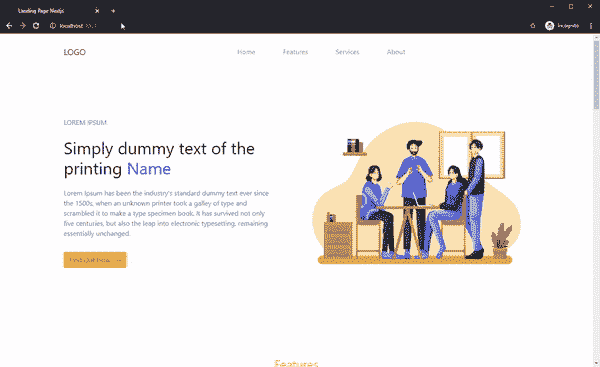
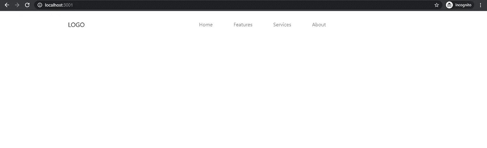
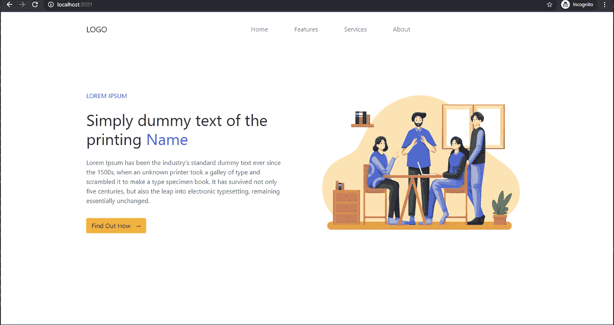

# 让我们用 Next.js 创建一个登录页面

> 原文：<https://levelup.gitconnected.com/create-landing-page-by-nextjs-re-ba37c2328aa8>

## 在本文中，我们将使用 Next.js 创建一个简单的登录页面


## 你会做什么

*   创建 Next.js 项目
*   安装 npm 包
*   创建反应组件
*   如何使用基本的反应陷阱和引导

我们的登录页面结果将如下所示:



显示登录页面

使用 create-next-app 命令创建 Next.js 应用程序的最简单方法。在您的终端中使用以下命令安装该软件包。

```
npx create-next-app next-landing-page
cd next-landing-page
npm run dev
```

**安装包**

首先创建项目后，安装包 ReactStrap 和 Bootstrap

```
npm i reactstrap bootstrap
```

**布局组件**

我们将用下面的代码创建一个新文件“components/Layout.js”并保存它。

**割台组件**

在文件夹组件中创建一个新文件“Header.js ”,并编写代码:

创建一个新文件“styles/header.css”

我们需要修改标题的样式:

接下来，我们要导入“header.css”，请找到“pages/_app.js”并更新代码

使用下面的代码为导入头组件编辑 pages/index.js

现在，打开你的浏览器并访问 localhost:3000，你应该看到如下。不要忘记运行命令`npm run dev`。



显示标题

**英雄组件**

用下面的代码创建一个新文件“components/Hero.js”并保存它。

向“styles/globals.css”添加一些代码

用下面的代码将“Hero”组件导入到“pages/index.js”中

再次查看我们的登录页面



显示标题和英雄组件

**特征组件**

我想你能理解我们的步骤。首先，创建一个组件。其次，将组件导入到“pages/index.js”

但是我今天有很多工作，我会创建更多的组件，稍后再导入它们。

转到创建“components/Feature.js”

**服务组件**

创建一个新组件“components/Service.js”

**关于组件**

" components/About.js "

**页脚组件**

本文的最后一个组件“components/Footer.js”

打开“pages/index.js”并导入我们所有的组件

打开您的浏览器访问:localhost:3000，您应该会看到如下所示的登录页面

## 结论

搞定了。在下一篇文章中，我将带您导出并上传这个登录页面到 AWS S3

我们的代号[https://github.com/easywebsify/next-landing-page](https://github.com/easywebsify/next-landing-page)