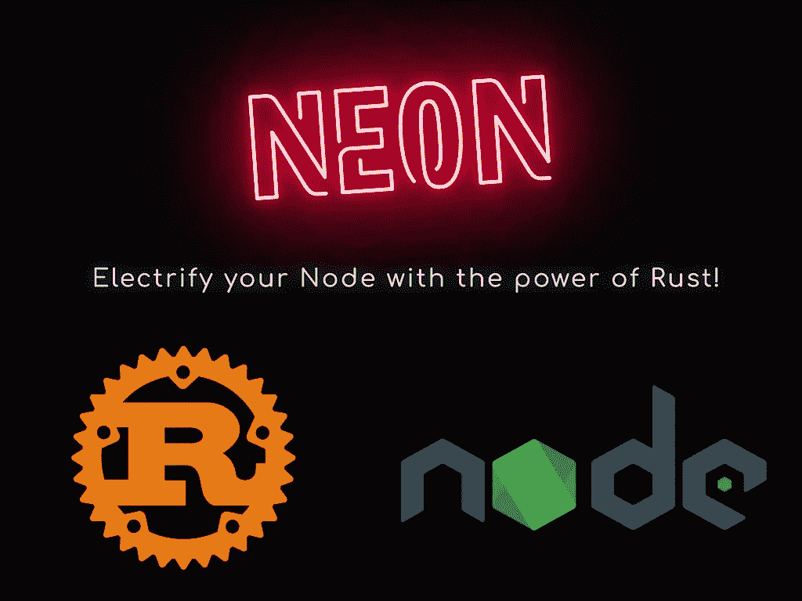
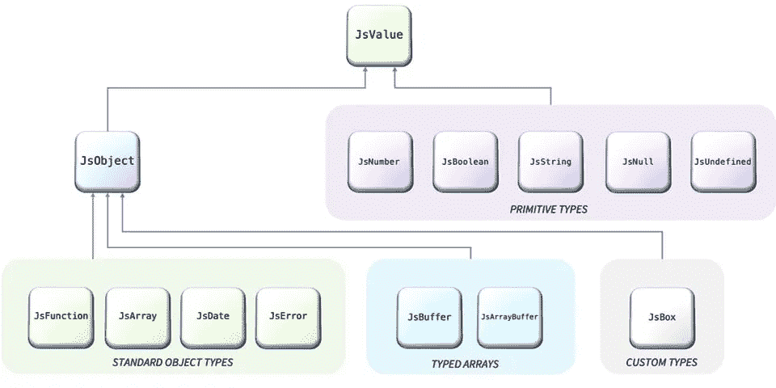
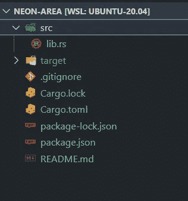
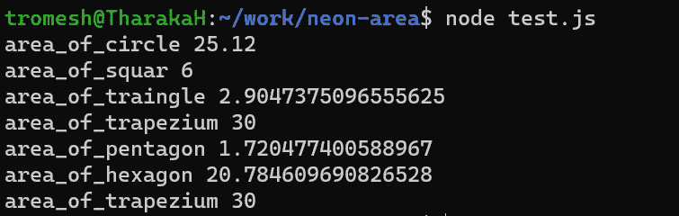

# 用 Rust 创建内存和类型安全的 Node.js 模块

> 原文：<https://levelup.gitconnected.com/create-memory-and-type-safe-node-js-modules-with-rust-2c10bba92013>



Node 是开发应用程序最著名的平台之一，它运行在 [V8](https://v8.dev/) 引擎上，在 web 浏览器之外执行 JavaScript 代码。尽管 Nodejs 很受欢迎，也有异步或非阻塞行为等很酷的特性，但与 Go 和 Rust 等语言或框架相比，Nodejs 并没有那么快。

另一方面，Rust 是一种强类型的编译语言，它有很多优秀的特性，比如闭包和匿名函数、丰富的[标准库(std)](https://doc.rust-lang.org/std/) 、强类型、多态性、出色的构建系统以及包管理器 [Cargo](https://doc.rust-lang.org/cargo/) 。Rust 也是一种内存安全语言，因为它在编译时会进行内存检查。有了 Rust 的这些优点，你有没有想过，你能不能写 JavaScript，但是要有 Rust 的类型和内存安全？。这就是霓虹灯发挥作用的地方。Neon 允许你用 Rust 写 JavaScript。

# 氖是什么

Neon 是一个库和工具链，用于将 [Rust](https://www.rust-lang.org/en-US/) 嵌入到你的 [Node.js](https://nodejs.org/) 应用和库中。Neon 允许你编写类型安全、内存安全、无崩溃的本地节点模块，保证 Rust 的并行性和线程安全性。

# 使用氖的好处

除了内存和类型安全之外，还有更多原因让你应该在 Node 中使用 Rust 嵌入。

*   并行编程和线程
*   表演
*   访问特定于本机操作系统的库
*   通过货物进入 Rust 的生态系统

Neon 还提供了一个命令行界面和与约定绑定的工作流，消除了构建原生节点模块的麻烦。

# 探索 Neon API

让我们探索 Neon 的 API，看看如何用 Rust 编写一个原生节点模块。首先，让我们看看 howlet 的句柄类型。



Neon 中的 JavaScript 类型层次结构

*   **JsValue** 位于类型层次的顶端，可以引用任何 JavaScript 值。
*   **JsObject** 位于对象类型层次的顶端。对象类型都实现了 Object trait，它允许获取和设置属性。像 **JsFunction** 、 **JsArray** 、 **JsDate** 和 **JsError** 这样的类型都属于本节**的范畴。**
*   **JsNumber** 、 **JsBoolean** 、 **JsString** 、 **JsNull** 和 **JsUndefined** 是内置的 JavaScript 数据类型，不是对象类型(原语类型)

接下来，让我们继续看入口点`**src/lib.rs**`文件。它将由 main 函数组成，main 函数有一个名为`[**#[neon::main]**](https://docs.rs/neon/0.9.1/neon/attr.main.html)`的特殊 neon 注释，在模块加载时执行(在 Neon 模块中初始化)。只要保留这个注释，您可以根据需要重命名该函数。它将是您的模块的入口点。

```
**#[neon::main]**
fn **main**(mut cx: **ModuleContext**) -> **NeonResult**<()> {
    cx.export_function("hello", hello)**?**;
    Ok(())
}fn **hello**(mut cx: **FunctionContext**) -> **JsResult**<**JsString**> {
    Ok(cx.string("hello node"))
}
```

由 main 方法导出的 hello 函数将接受一个名为`[**FunctionContext**](https://docs.rs/neon/0.9.1/neon/context/type.FunctionContext.html)`的参数(它为 Neon 函数提供了对 JavaScript 运行时的访问)并返回一个 JavaScript 字符串。你会注意到所有的 neon 函数都会返回一个名为`[**JsResult**](https://docs.rs/neon/0.9.1/neon/result/type.JsResult.html)`的类型，这是因为所有的 Neon 函数都有可能抛出一个 JavaScript 异常。

# 构建 Nodejs 模块

让我们通过构建一个节点模块来深入了解 Neon。在这个例子中，让我们创建一个模块，它提供生成形状(正方形、圆形、三角形等)面积的函数。).但在我们开始之前，我们有一些先决条件，你需要 Nodejs 和 Rust 的最新版本或 LTS 版本( [visual studio 构建工具](http://visual studio build tools)如果你使用的是 windows)。安装完所有的先决条件后，让我们继续初始化项目。

```
npm init **neon** neon-area
```

以上命令将使用 Cargo.toml 和 package.json 文件初始化项目，这些文件包含 Rust 和 Nodejs 的包详细信息(依赖项、模块详细信息)。你会注意到在项目根目录下有一个名为`**src/**`、**、**的新目录，它由一个名为 lib.rs 的文件组成，Rust 的神奇之处就在这里。



霓虹灯项目结构

这个`**src/lib.rs**`最初会是这样的。

```
use neon::prelude::*;fn **hello**(mut cx: FunctionContext) -> JsResult<JsString> {
  Ok(cx.string("hello"))
}#[neon::main]
fn main(mut cx: ModuleContext) -> NeonResult<()> {
 cx.export_function("hello", **hello**)?;
 Ok(())
}
```

在上面的代码中，您将导出一个函数，该函数返回一个字符串(在 JavaScript 中)作为一个名为“hello”的模块属性，稍后您可以通过 javaScript 导入该模块来访问它。要首先创建一个节点模块，您必须使用下面的命令构建上面的代码。

```
npm run build -- --release
```

这将编译 Rust 代码，并在项目的根目录下创建一个名为 index.node 的本地节点模块。这些。节点文件是节点插件(二进制模块)，您应该能够使用 JavaScript 对它们使用“require()”来访问模块。

```
const {**hello**} = require("./index.node");console.log(**hello**()); // logs "hello" to the console
```

现在让我们继续使用 Neon 构建我们的区域模块。首先，让我们创建一个名为 Area 的结构，然后继续实现这些方法。

```
struct Area {
 pub pi: f64,
}impl Area {

 fn circle(&self, radius: f64) -> f64 {
   return 2.00 * self.pi * radius;
 } fn squar(&self, length: f64, width: f64) -> f64 {
   return length * width;
 } fn traingle(&self, length: f64, width: f64, height: f64) -> f64 {
  let s: f64 = (length + width + height) / 2.0;
  let area: f64 = s * (s - length) * (s - width) * (s - height);
  return area.sqrt();
 } fn pentagon(&self, length: f64) -> f64 {
  return ((f64::sqrt(5.00 * (5.00 + (2.00 * f64::sqrt(5.00))))) /   4.00) * (length * length);
 } fn hexagon(&self, length: f64) -> f64 {
  return (3.00 * f64::sqrt(3.00)) / 2.00 * length;
 } fn trapezium(&self, length: f64, base: f64, height: f64) -> f64 {
  return (length * base) / 2.00 * height;
 }}
```

现在，让我们通过 main 方法将这些函数导出为一个模块。让我们看看`**src/lib.rc**`文件的最终代码。

现在，是时候再次构建模块并在 JavaScript 应用程序中使用生成的模块了。

执行上面的代码会在终端中产生类似这样的结果。



执行上述代码的输出

你可以通过这个 [Github repo](https://github.com/TRomesh/neon-area) 找到上面的源代码。如果你想要更多关于 neon 用法的例子，也可以通过这个[链接](https://github.com/neon-bindings/examples/tree/main/examples)。

# 结论

由于 Rust 带来的类型和内存安全，Neon 是编写原生节点模块的最佳方式之一。Neon 还公开了用于调度异步事件的 JavaScript 事件循环，因此您可以在后台线程中运行昂贵或长时间的计算，而不会阻塞 JavaScript 线程。Neon 在 slack 有一个很好的活跃的社区，在这里你可以分享和学习 neon 社区。你可以用 Neon 做更酷的东西，确保你浏览了他们的文档以获得更多信息。最后，感谢您花时间阅读本文。我想看看你下面的问题和评论。

干杯！

# 了解更多信息

[](/lets-go-and-build-an-application-with-grpc-c5b754400f64) [## 让我们开始用 gRPC 构建一个应用程序

### REST(表述性状态转移)架构让我们“结合”这种方法来构建像 web…

levelup.gitconnected.com](/lets-go-and-build-an-application-with-grpc-c5b754400f64) [](/lets-go-and-build-graphql-api-with-gqlgen-bfea2f346ea1) [## 让我们开始用 gqlgen 构建 Graphql API

### Golang 是过去十年中最受欢迎的编程语言之一，主要是因为它的快速…

levelup.gitconnected.com](/lets-go-and-build-graphql-api-with-gqlgen-bfea2f346ea1) [](/build-your-own-self-hosted-ci-cd-workflow-with-github-actions-ec9ee1dcd800) [## 使用 GitHub 操作构建您自己的自托管 CI/CD 工作流

### GitHub 引入了 GitHub Actions，使开发人员能够直接从他们的 GitHub 库自动化工作流…

levelup.gitconnected.com](/build-your-own-self-hosted-ci-cd-workflow-with-github-actions-ec9ee1dcd800) [](/hookstate-the-simplest-state-management-tool-b02f7d3b01a4) [## 最简单的状态管理工具

### 小型、最小、简洁、可扩展、基于钩子的状态管理库

levelup.gitconnected.com](/hookstate-the-simplest-state-management-tool-b02f7d3b01a4)