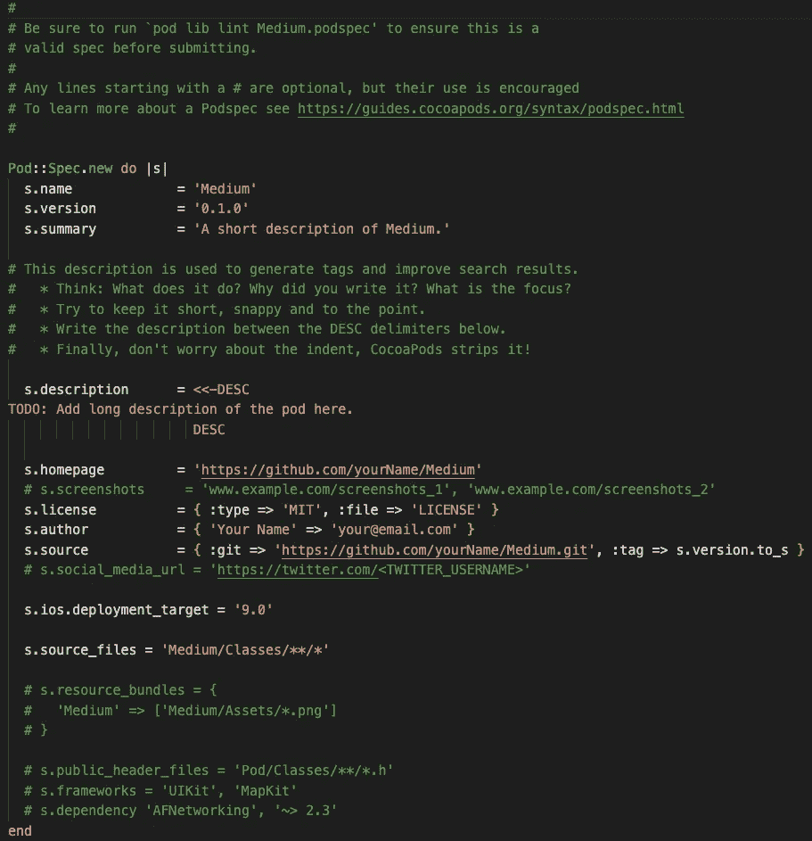

# 使用 CocoaPods 创建模块

> 原文：<https://levelup.gitconnected.com/create-modules-using-cocoapods-9483e5ccb00c>

# 开始前的简介

不管你是初级、中级、高级还是 iOS 开发专家，我们都使用 Cocoapods 来管理我们的外部依赖，如果你从未听说过，我会给你一个上下文！！

> [CocoaPods 是 Swift 和 Objective-C Cocoa 项目的依赖关系经理。它有超过 89，000 个库，在超过 300 万个应用程序中使用。CocoaPods 可以帮助你优雅地扩展你的项目。](https://cocoapods.org)

你可能会问我们为什么要使用这个依赖管理器…这个问题很容易回答！

有了 CocoaPods，我们可以重用一些开发人员或公司已经使用过的代码，因此开发变得更加容易和快速。一个简单的例子是网络层，使用 CocoaPods 可以更容易地执行 API 请求。

但是在另一方面，协同概念在你的项目中可能是复杂的，比如:

*   如果团队没有相同版本的椰子恐龙。
*   一些外部库已经过时，其中一些不再支持，所以如果你想在 pod 中加入新的东西，你必须手动扩展 pod。
*   如果你添加许多外部库，你的应用程序会变得更大更重。

# 所以让我们来看看实际情况。

为了让你更好地理解，我将把话题分开！

1.  如何创造
2.  如何配置 Pod

# 1.如何创造

*   要创建新的 CocoaPods (pod ),首先必须打开终端，转到保存 pod 的文件夹，然后运行以下命令

```
pod lib create PodName
```

*   这样做时，终端会询问您一些问题，以便为您配置 pod，例如:

```
What platform do you want to use?? [ iOS / macOS ]
> iOSWhat language do you want to use?? [ Swift / ObjC ]
> SwiftWould you like to include a demo application with your library? [ Yes / No ]
> YesWhich testing frameworks will you use? [ Quick / None ]
> NoneWould you like to do view based testing? [ Yes / No ]
> No
```

*   我在上面的例子中给出的答案就是我将在本教程中介绍的答案！！

如果一切顺利，xcode 将打开您的示例应用程序，您的 pod 已经成功创建。

# 2.如何配置 Pod

## **2.1。Xcode 配置**

*   正如你在下图中看到的，打开项目后，我们有一个警告标志。如果你点击它，Xcode 会显示警告。
*   修复起来超级简单，只需点击“问题”，Xcode 就会引导你。


## 2.2.Podspec

*   PodSpec 是关于您正在创建的 pod 的规范，第一眼看上去，您的 podspec 将如下图所示。

> [“一个规范描述了一个版本的 Pod 库。它包括有关应该从哪里获取源代码、使用什么文件、要应用的构建设置以及其他常规元数据(如名称、版本和描述)的详细信息。](https://guides.cocoapods.org/syntax/podspec.html)



## 定制

1.  我喜欢把|s|改成|spec|
2.  使用以下命令`spec.swift_version = '5.0'`设置您希望 pod 使用的 Swift 版本
3.  用下面的命令`spec.ios.deployment_target = '13.0'`为你的 pod 设置你想要的最低 iOS 开发目标(记住苹果建议在最后一个版本下最多使用 2 个 iOS 版本)

*   上面的定制很简单，对吗？现在我们要做一些更高级的事情，这是我个人在使用 pod 时喜欢做的事情…我们要配置子空间！

## 2.2.1.1 亚种

*   我喜欢使用 subspecs，因为它们允许我们的 pod 有一个以上的配置……我个人更喜欢使用两个配置，即`Debug`和`Release`，所以当我们在 pod 中创建功能或任何其他内容时，我们使用`Debug`，当我们与**主应用程序**集成时，我们使用`Release`，这样我们正在处理的文件就不会显示在应用程序中，也不会弄乱 lint 或我们在**主应用程序中配置的内容。**

1.  为你的 pod 设置默认的子空间:`spec.default_subspecs = 'Release'`，正如你所看到的，我选择了 Release 作为我的默认，但是你可以有多个默认子空间！
2.  现在我们将配置两个子空间。
    **调试** 为了创建我们的`Debug`子空间，我们使用以下命令:

```
spec.subspec 'Debug' do |debug|
    1   debug.source_files = 'Medium/Classes/**/*.{swift, h, m}', 'Medium/Information.swift'
    2   debug.resources = 'Medium/Assets/**/*.{json, xml, storyboard, xib}', 'Medium/Information.swift'
end
```

*   如您所见，我已经设置了文件和资产的路径，现在让我解释一下。
    数字 **1** 负责设置我们的源文件的存放位置。编号
    2 负责设置我们的资源文件的存放位置。在`Debug`子空间上还有一个步骤，我想做的是启用单元测试。为此，我们必须稍微修改一下上面的代码:

```
spec.subspec 'Debug' do |debug|
      debug.source_files = 'Medium/Classes/**/*.{swift, h, m}', 'Medium/Information.swift'
      debug.resources = 'Medium/Assets/**/*.{json, xml, storyboard, xib}', 'Medium/Information.swift'
   3   debug.test_spec 'Tests' do |test_spec|
   4         test_spec.source_files = 'Medium/Tests/**/*.{swift, h, m}', 'Medium/Information.swift'
      end
end
```

*   编号 **3** 负责创建我们的测试规范
    编号 **4** 负责设置我们的测试源文件的存储位置。
*   **发布** 为了创建我们的`Release`子空间，我们使用以下命令:

```
spec.subspec 'Release' do |release|
   release.vendored_frameworks = 'Framework/Medium.framework'
end
```

*   比`Debug`容易多了吧？

最后，我们的 podspec 应该是这样的


最后一步是配置 Podfile 和文件夹结构

*   第一眼看到你的 Podfile，它是这样的


要执行我们在 podspec 上进行的配置，我们必须更改:

1.  `platform :ios, '9.0'`到`plataform :ios, '13.0'`。
2.  以及`pod 'Medium', :path => '../'`到`pod 'Medium/Debug', :path => '../', testspecs => ['Tests']`。
3.  我也喜欢输入的一个东西是`install 'cocoapods', :deterministic_uuids => false`，使用这个命令**uuid**将不会重复。

*   更改后，您的 Podfile 应该看起来像下图。


*   **文件夹结构** 第一眼看上去你的文件夹是这样的


要执行我们在 podspec 上进行的配置，我们必须更改:

1.  创建测试文件夹
2.  创建 **Information.swift** 文件

更改后，您的文件夹应该是这样的


我也喜欢把一些文件放在文件夹里，只是为了看看里面的 Xcode……完成后，你可以在终端上运行命令`pod install`和`open NameOffYorApp.xcworkspace`


现在，您可以看到，在中型文件夹中，我们有`Debug`假文件夹，在该文件夹中，我们有所有文件夹。我们确实有一个假的`Tests`文件夹，请记住，我们必须在“真实”文件夹中创建文件和文件夹……“真实”文件夹是左下角没有`arrow`的文件夹，如下图所示。


参考:[https://guides.cocoapods.org](https://guides.cocoapods.org)

下一步: [**创建通用框架**](https://medium.com/@danielgrisof/create-universal-framework-49039224dea1)

# 就这些了，谢谢！😁