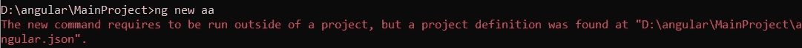
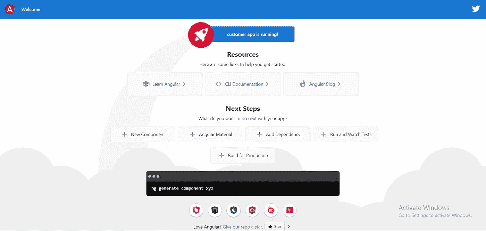
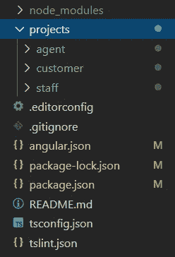

# 在一个项目下创建多个角度应用程序

> 原文：<https://levelup.gitconnected.com/create-multiple-angular-apps-under-one-project-ff44541a259b>

在一个工作空间下管理多个应用。


照片由 [Eric Prouzet](https://unsplash.com/@eprouzet?utm_source=medium&utm_medium=referral) 在 [Unsplash](https://unsplash.com?utm_source=medium&utm_medium=referral) 上拍摄

在这篇文章中，我们将学习如何在一个项目或工作空间下组织多个应用程序。此功能创建了一个多项目工作空间来管理多个应用程序，从 Angular CLI 版本 6 开始启用。我们将首先创建一个空的工作空间，它是 Angular 应用程序、项目或库的集合。然后，我们可以向工作区添加多个项目。

# 优势

以下是在一个项目中拥有多个 Angular 应用程序的一些优势。

1.  单一的源代码控制库(例如 git)。
2.  耗时—无需为每个应用运行`npm install`。
3.  通过为所有应用程序共享一个`node_modules`文件夹来节省磁盘空间。
4.  易于更新到所有应用程序的下一个版本。

# 创建一个空工作区

执行以下命令创建一个名为 **MainProject 的新工作空间。**

```
ng new MainProject --createApplication="false"
cd MainProject
```

`createApplication="false"`选项停止创建初始应用程序。它只创建工作空间。

# 将新项目添加到工作区

现在，运行`ng generate application`命令，在工作区下创建一个新的 app。第一个创建的应用程序被视为默认应用程序。

```
ng generate application staff
```

如果您在工作区内使用`ng new`命令，将会出现以下错误。



# 运行应用程序

有 3 种方式运行应用程序。

1.  `ng serve staff`
2.  使用项目标志。`ng serve --project="staff"`
3.  打开 **angular.json** 并将`defaultProject`定位在底部。将其设置为`staff`并运行`ng serve`。

# 将另一个项目添加到工作区

这里我们将创建另外两个项目，分别叫做**代理商**和**客户**。

```
ng generate application agent
ng generate application customer
```

要运行**客户**应用程序，只需运行`ng serve --project="customer"`。



客户应用程序

# 文件夹结构

这是我们工作区中的文件夹结构。所有应用程序都放在**项目**文件夹中。每个应用程序都有自己的 **src** 和 **dist** 文件夹。



# 为生产构建应用程序

要构建用于生产的应用程序，我们可以使用带有`project`标志的`ng build`命令。

```
ng build --prod --project="agent"
ng build --prod --project="staff"
ng build --prod --project="customer"
```

# 参考

1.  [角度工作空间和项目文件结构](https://angular.io/guide/file-structure)