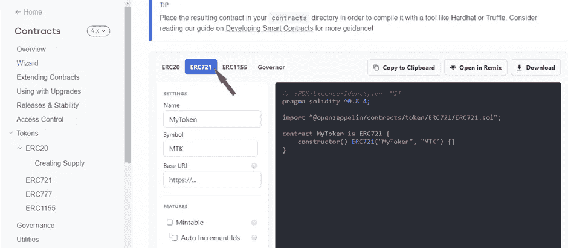
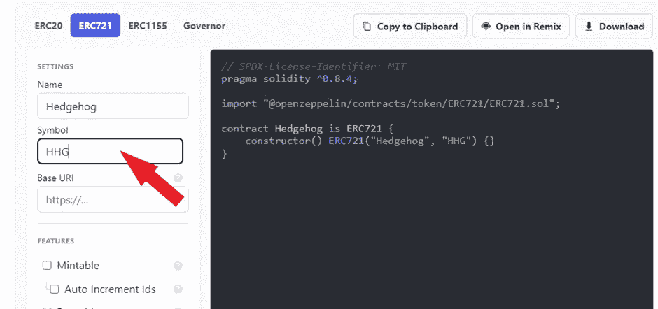
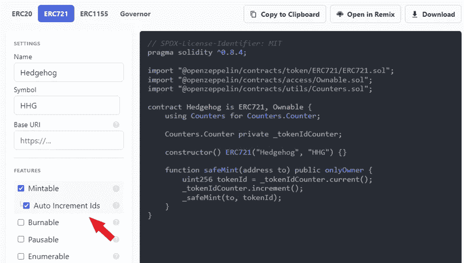
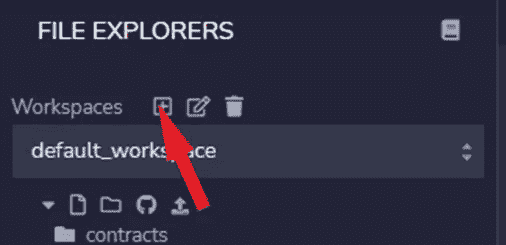
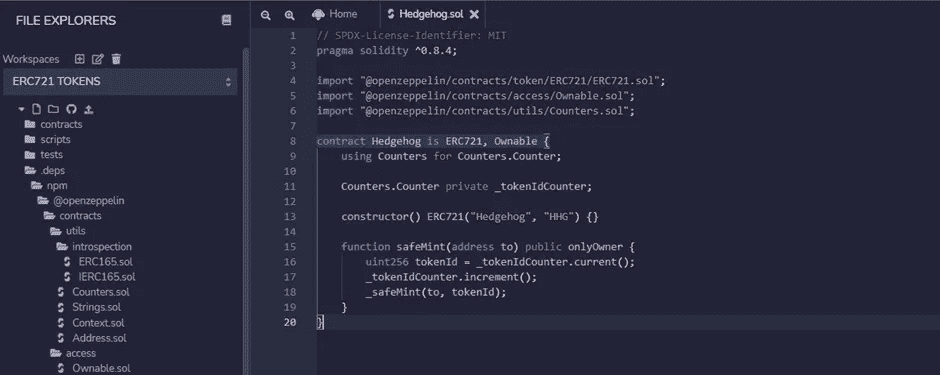
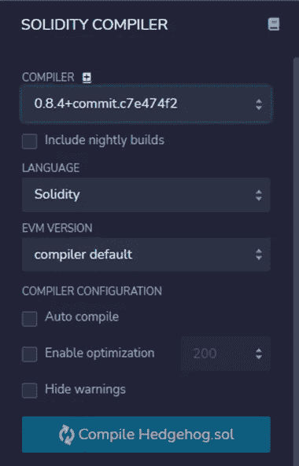
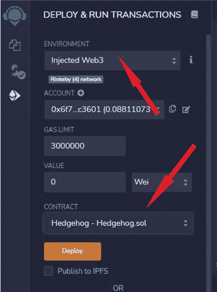
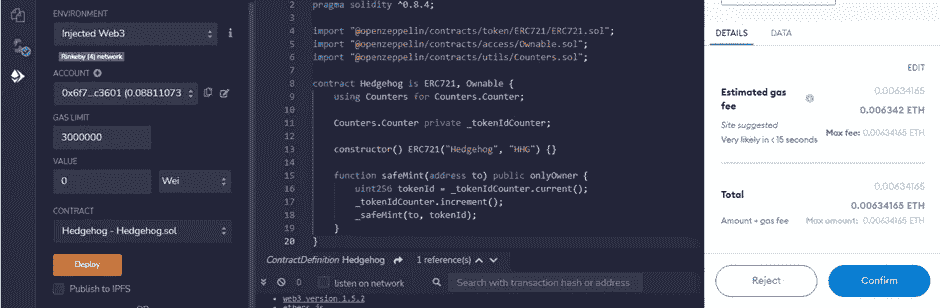
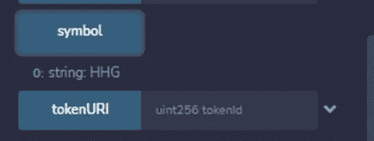
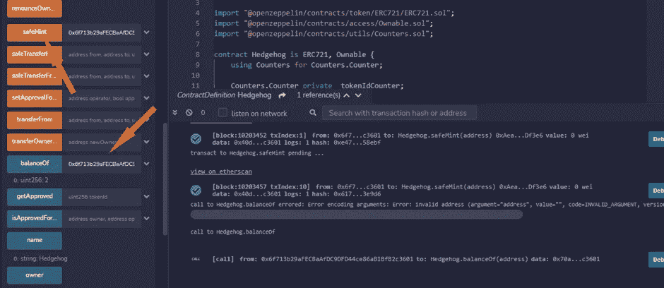

# 使用 Openzeppelin ERC721 智能合约创建 NFT

> 原文：<https://levelup.gitconnected.com/create-nfts-with-openzeppelin-erc721-smart-contract-d4a64324ad47>

如果您希望更熟悉 ERC721 契约，以及如何使用这个智能契约标准来使用 OpenZeppelin 生成 NFT，那么您来对地方了。

顺便说一下，为了能够遵循本教程并创建一个 ERC721 令牌，您可能需要查看一些[以前的文章](/deploy-your-first-erc20-token-in-5-min-17c1333d8434):

🤖[**5 分钟后部署您的首个智能合约**](/deploy-your-first-smart-contract-in-5-minutes-67361699ae03)

🚀 [**在 5 分钟内部署您的第一个 ERC20 令牌**](/deploy-your-first-erc20-token-in-5-min-17c1333d8434)

🐶 [**今天就在以太坊上创建您自己的柴犬-伊努代币吧！**](https://medium.com/datadriveninvestor/create-your-own-shiba-inu-token-on-ethereum-today-7e0c28d4f682)

此外，请查看此智能合同主课程，了解如何创建 ERC20、ERC721 和 ERC1155:

**👾** [**创建 NFT、令牌和 DAOs 智能合约主类**](https://www.udemy.com/course/create-nfts-tokens-and-daos-smart-contracts-masterclass/?referralCode=39A122B4B0FA4780826A)

菲利普·霍达斯的 NFT 艺术作品—[https://superrare.com/artwork-v2/gmi-10000-29120](https://superrare.com/artwork-v2/gmi-10000-29120)

**🎞️** [**Crypto 亨利**](https://www.youtube.com/@cryptohenri)

# 如何将您的 OpenZepellin ERC721 智能合约部署到 mint NFTs？

好的，同样，这篇文章假设你有一些基础，你有一个元蒙版和一些[测试以太](https://youtu.be/Ni3XocoNaDI)，你知道如何使用 Remix。如果你需要更多这方面的背景资料，请查看上面的链接。

## **进入 OpenZeppeline ERC721 部署**

1.进入[open zeppelin 向导](https://docs.openzeppelin.com/contracts/4.x/wizard)并选择 **ERC721** 的选项，如下图所示

2.命名您的令牌并指定其符号。在这个演示中，我们的 ERC721 令牌是**刺猬、**，符号是 **HHG** 。

**BaseURI** 用于指定元数据的 URI，元数据基本上是链接到我们的 NFT 和附加 NFT 特征的图像。在本演示中，我们将该槽留空，我们主要关心的是创建令牌的机制。然而，如果你对创建元数据感兴趣，你可以遵循[这些元数据标准](https://docs.opensea.io/docs/metadata-standards)，并在 IPFS 上将元数据文件存储为 json 文件。

3.接下来，在**功能部分**选择几个选项。**可铸造**确保新令牌可铸造。**自动增加 id**为每个令牌创建一个序列标识符。这些是我们在本次演示中包括的选项。

4.继续复制你的代码，去我们的在线 IDE， [Remix](http://remix.ethereum.org/) 。创建一个新的工作区如果您一直在关注本系列，并且只创建了 ERC20 令牌，那么 ERC721 智能合约必须**位于不同的工作区**中。我将把我的工作空间命名为 **ERC721。**点击创建新工作区的按钮，如下图所示。

5.为您的智能契约创建一个新文件，最好将其命名为您命名的令牌。我的是 **Hedgehog.sol.** 继续从向导中粘贴您的代码。

6.接下来，进入编译器，选择**编译器**0 . 8 . 4，，编译你的代码。确保编译器版本与智能合约的 pragma solidity 版本相同。

7.接下来转到 deploy 部分，选择 **Injected Web 3** 环境，并选择您想要部署的契约。

8.点击**部署**，它应该会提示你的元掩码。继续操作，单击浏览器扩展部分中的元掩码图标将其激活，然后再次部署。您应该看到以下内容:

耶！🚀部署后，您应该会看到以下内容:

**一些演示:**

符号选项显示我们在开始时指定的符号， **HHG** 。tokenURI 将为空，因为我们没有指定它。

接下来我要演示一下 **Safemint()** 函数。当你铸造一个新的 NFT 时，它基本上和你在 NFT 网站上看到的功能一样。首先，去 Metamask 复制你的地址，然后粘贴到字段中。继续点击 safemint 并确认；您可以多次这样做，将多个 NFT 存入您的钱包。

现在我们可以探索一个不同的函数，的**balance。使用此函数时，您需要复制并粘贴您的钱包地址以获得结果，它会返回我们铸造的令牌数，如下所示:**

在我的例子中，来自 **balanceOf()** 的结果是 **2** ，因为我铸造了两次令牌。应该显示您铸造的次数。还有，注意终端。这就是过程，我希望它像它们一样简单和相关，查看我的下一篇关于如何部署 ERC1155 合同的文章！

**如果你对加密、元宇宙和 NFTs 感兴趣，别忘了看看这些:**

**🚀** [**以太坊合并升级大师级**](https://www.udemy.com/course/the-ethereum-merge-upgrades-masterclass/?referralCode=732F453B5B228B789846)

**👾** [**创建 NFT、令牌和 DAOs 智能合约大师班**](https://www.udemy.com/course/create-nfts-tokens-and-daos-smart-contracts-masterclass/?referralCode=39A122B4B0FA4780826A)

**😍** [**元宇宙的商业—如何从元宇宙**](https://www.udemy.com/course/metaverse-for-businesses-how-to-benefit-from-the-metaverse/?referralCode=4B3DF285FE8F0CDC8143) 中获益

**🦄** [**元宇宙大师班——了解元宇宙的一切**](https://www.udemy.com/course/metaverse-masterclass-learn-everything-about-the-metaverse/?referralCode=4795AA478A4B496F3BC5)

**⭐** [**NFT 投资大师班——关于 NFT 投资的亲招**](https://www.udemy.com/course/nft-investing-masterclass-pro-tips-about-nft-investing/?referralCode=32FD108E41BB3959925F)

**🎞️** [**Crypto 亨利**](https://www.youtube.com/@cryptohenri)

# 分级编码

感谢您成为我们社区的一员！在你离开之前:

*   👏为故事鼓掌，跟着作者走👉
*   📰查看[升级编码出版物](https://levelup.gitconnected.com/?utm_source=pub&utm_medium=post)中的更多内容
*   🔔关注我们:[Twitter](https://twitter.com/gitconnected)|[LinkedIn](https://www.linkedin.com/company/gitconnected)|[时事通讯](https://newsletter.levelup.dev)

🚀👉 [**加入升级达人集体，找到一份惊艳的工作**](https://jobs.levelup.dev/talent/welcome?referral=true)