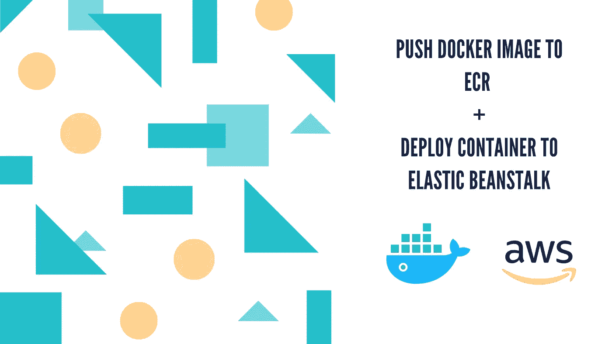
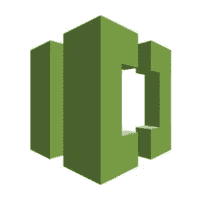
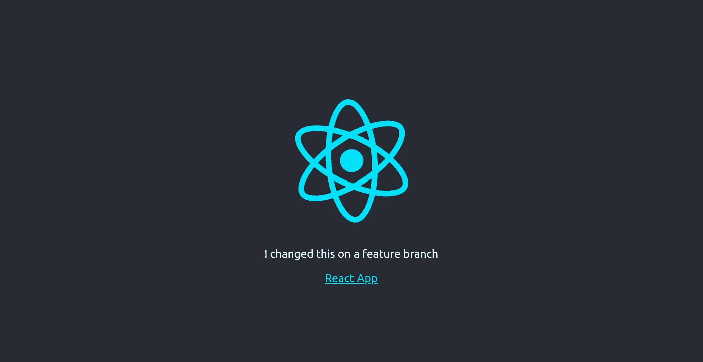
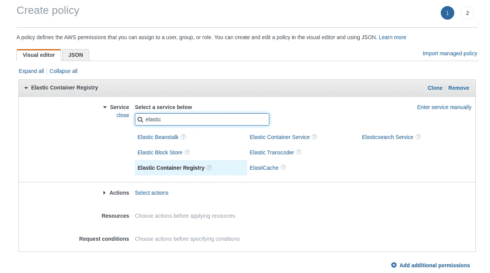
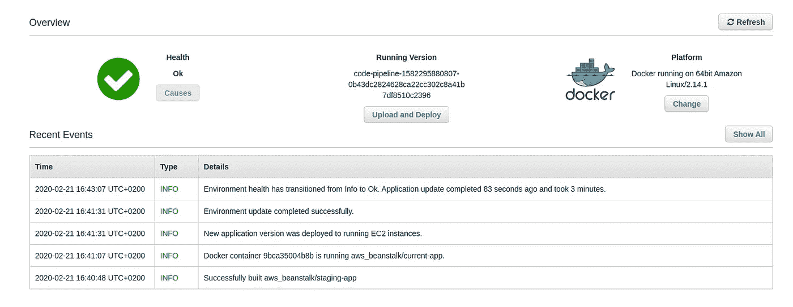

# 创建将 Docker 映像推送到 ECR 的管道，并将一个集装箱化的应用程序部署到 Elastic Beanstalk

> 原文：<https://levelup.gitconnected.com/create-pipeline-to-push-docker-image-to-ecr-deploy-containerised-app-to-elastic-beanstalk-e721af796f33>



我最近[发表了一篇关于使用 AWS 工具创建 CI/CD 管道以简化 Node.js 应用程序交付的文章](/build-test-deploy-node-js-app-with-codecommit-codepipeline-codebuild-elastic-beanstalk-c6d89f971ef2)。如果你已经通读了它，我希望它有助于你熟悉这些有用的服务，即代码提交、代码构建和代码管道。CodeCommit 不一定是一个 CI/CD 工具，但非常适合这个空间或讨论，因为它是一个提供通过我们管道的源代码的服务。

在本文中，我将再次使用这些服务，包括用于部署的 Elastic Beanstalk，但这一次我将交付一个容器化的应用程序。正如我通常所做的那样，我们将部署的实际应用程序将是最基本的，因为这不是本文的重点。我们将使用的另一个 AWS 服务是 ECR(弹性容器注册)。ECR 本质上相当于 AWS 的 [Docker Hub](https://hub.docker.com/) ，除了它是一个专有的 Docker 图像库，而 [Docker Hub](https://hub.docker.com/) 允许你存储公共图像。

这篇文章的目的是演示如何创建一个管道，允许您构建和测试应用程序的 Docker 映像，如果它成功地通过了构建阶段，就将它推送到 ECR。之后，我们的容器化应用程序将被部署到 Elastic Beanstalk。

最后一点，本文假设您对 Docker 有所了解，并且能够熟练使用 CLI 在本地构建映像和运行容器。

如果你喜欢这篇文章，请在这里给我买杯咖啡[☕️](https://www.buymeacoffee.com/lukemwila)😃。

# AWS 服务快速概述


亚马逊网络服务

## 代码提交

这是一个像 GitHub 和 Bitbucket 一样的源代码控制服务，它允许你托管基于 git 的存储库(仅限私有存储库)。

## electroniccashregister 电子现金出纳机

如上所述，它是一个私有的 Docker 图像库。具体来说，它是一个完全托管的 Docker 容器注册中心，使开发人员可以轻松地存储、管理和部署 Docker 容器映像。

## 代码构建

这是一个 CI(持续集成)服务，它编译源代码，运行测试，并生成可以部署的软件包。

## 代码管道

这是一项 CD(连续交付)服务，允许我们自动化整个部署和发布周期。

## 弹性豆茎

这是一种编排服务，通过编排各种 AWS 服务来安全、可预测地部署应用程序。

我们将手动(或使用基于点击的方法)构建我们的管道，而不是通过使用 CloudFormation 或 Terraform 的 IaC(基础设施即代码)方法自动构建。这确实是一个有点乏味的过程，但我认为如果你只是被介绍到这些服务中，从长远来看，它可以很好地为你服务。然而，我确实打算发布关于用上述(CloudFormation 和 Terraform)自动化这个过程的帖子，但是现在，你必须满足于使用好的旧 AWS 控制台。

# 我们的代码提交库



正如我已经提到的，我将使用 [AWS CodeCommit](https://aws.amazon.com/codecommit/) 作为该项目的源代码库，以及我们的管道将用来构建和部署我们的应用程序的源代码。CodeCommit 存储库是私有的，因此只能由 IAM 策略和组中设置的用户访问。然而，源代码也可以在一个公共的 GitHub 存储库中获得。

这些是我们将要遵循的简单步骤:

## 步骤 1:创建存储库

使用 IAM 登录到 AWS 控制台，然后转到 CodeCommit。记住，根据你所在的地区，检查你是否在适当的地区创建了回购。接下来的步骤非常简单，所以您可以直接完成呈现给您的表单。

我已经把我的库叫做 **dockerized-nginx-react** 。

## 步骤 2:为 IAM 帐户上的 CodeCommit 生成 Git 凭据

一旦您创建了 repo，您应该能够在 CodeCommit 上的 repositories 下面看到它。但是，您还不能克隆它(除非您已经获得了 IAM 帐户的 Git 凭证)。接下来，转到 IAM，创建或选择您希望向其提供凭据的用户。在选中的用户上，点击安全凭证选项卡，滚动到标题为“**AWS 代码提交的 HTTPS Git 凭证**”的部分。

点击**生成凭证**并将凭证保存在安全的地方🔒。

## 步骤 3:克隆创建的回购协议

获得 IAM 用户的 Git 凭证后，返回 CodeCommit 并单击您几分钟前创建的存储库。在那里，使用 CLI 将 repo 克隆到您机器上的本地目录中。然后会提示您输入用户名和密码，请确保使用为您选择的 IAM 用户生成的 Git 凭据，而不是您的 AWS 控制台凭据。

这应该会成功地将 **dockerized-nginx-react** 库克隆到您的机器上。

# 我们的 ECR 存储库


接下来，转到 AWS 控制台中的 ECR(弹性容器注册中心),创建一个存储库来存储您的图像。您会注意到，您正在创建的存储库的名称空间将以您的 **AWS 帐户 ID** 为前缀，并且还应该包含存储您的存储库的**区域**。确保在过渡期间将这些值保存在安全的地方，因为稍后我们将在我们的 *buildspec* 文件中使用它们。

`**AWS_ACCOUNT_ID**.dkr.ecr.**AWS_REGION**.amazonaws.com/**REPO_NAME**`

# 我们的备案申请



这一次，我们不打算部署 Node.js 应用程序，而是部署 dockerized React 应用程序。我通常使用 *create-react-app* 来初始化我的 react 应用程序，所以请转到您从 CodeCommit 克隆到您的机器上的空 git 存储库，并运行以下命令(假设您已经安装了相关的 CLI):

```
npx create-react-app .
Or create-react-app .
```

我通常把 *yarn* 换成 *npm* 作为我的包管理器，所以我假设你在这种情况下也会这么做。React 应用程序安装完成后，您可以继续运行 *npm start* 来确保一切正常运行。如果你愿意，可以随意修改这个应用程序。我将有两个 Docker 文件，一个配置用于开发环境以及管道构建阶段的测试目的，另一个用于生产级容器。两者之间的主要区别是后者将是一个多阶段的 Docker 文件，它将有一个 [nginx](https://www.nginx.com/) 网络服务器来服务我们的网站内容。

下面是我的两个 Docker 文件，你可以继续测试它们的构建和运行。

**Dockerfile.dev**

```
FROM node:alpineWORKDIR '/app'COPY package.json .
RUN npm installCOPY . .CMD ["npm", "run", "start"]
```

**Dockerfile**

```
FROM node:alpine as build 
WORKDIR /app
COPY package*.json ./
RUN npm install 
COPY . .
RUN npm run buildFROM nginx 
EXPOSE 80
COPY --from=build /app/build /usr/share/nginx/html
```

要构建开发 docker 映像:

`docker build -t **yourImageTag** -f Dockerfile.dev .`

要构建 prod docker 映像:

`docker build -t **yourImageTag** .`

要启动和运行容器并设置端口转发:

`docker run -d -p 3000:3000 **yourImageTag**`

要访问正在运行的容器:

`docker exec -it **containerId** bash`或`docker exec -it **containerId** sh`

一旦进入 React app 容器，就可以运行 *npm 运行测试*。

我们的 nginx 服务器默认监听端口 80，所以当您测试 Dockerfile 映像(产品)的容器实例时，请记住这一点。

一旦完成，我们就可以转移到 **buildspec.yml** 文件。正如我在以前的帖子中提到的，这个文件将指定代表 CodeBuild 在构建的每个阶段运行的命令的阶段。你可以在这里阅读关于 buildspec 文件[的更多细节。](https://docs.aws.amazon.com/codebuild/latest/userguide/build-spec-ref.html)

*安装*:安装构建
*pre_build* 可能需要的依赖项:构建
*build* 之前要执行的最终命令:实际构建命令
*post_build* :收尾工作

在我们的 buildspec 文件中，我们希望执行以下操作:

*   登录到 ECR
*   构建我们的 Dockerfile.dev 映像，从中创建一个实例(容器)并运行测试
*   从 Dockerfile 构建生产级映像并推送到 ECR

**buildspec.yml**

```
version: 0.2
phases:
  install:
    runtime-versions:
      docker: 18
  pre_build:
    commands:
      - echo Logging in to Amazon ECR...
      - $(aws ecr get-login --no-include-email --region $AWS_DEFAULT_REGION)
  build:
    commands:
      - echo Build started on `date`
      - echo Building Docker test image...
      - docker build -t $IMAGE_REPO_NAME:$TEST_IMAGE_TAG -f Dockerfile.dev .
      - docker run -e CI=true $IMAGE_REPO_NAME:$TEST_IMAGE_TAG npm run test
      - echo Build started on `date`
      - echo Building the Docker image...
      - docker build -t $IMAGE_REPO_NAME:$IMAGE_TAG .
      - docker tag $IMAGE_REPO_NAME:$IMAGE_TAG $AWS_ACCOUNT_ID.dkr.ecr.$AWS_DEFAULT_REGION.amazonaws.com/$IMAGE_REPO_NAME:$IMAGE_TAG
  post_build:
    commands:
      - echo Build completed on `date`
      - echo Pushing the Docker image...
      - docker push $AWS_ACCOUNT_ID.dkr.ecr.$AWS_DEFAULT_REGION.amazonaws.com/$IMAGE_REPO_NAME:$IMAGE_TAG
```

这就把应用方面的事情都做完了。在我们继续在控制台中创建 CodeBuild 项目之前，请确保将您的更改提交到您的存储库的主分支。

```
$ git add .
$ git commit -m "type: commit message"
$ git push -u origin master
```

# 我们的代码构建项目

这一步非常简单。前往 CodeBuild 并点击“创建项目”。为项目命名，也可以选择描述。欢迎您继续进行自己的环境配置，只是要确保将 AWS CodeCommit 设置为源代码提供者。CodeBuild 项目的其他设置如下:

*   环境映像—托管映像
*   操作系统— Ubuntu
*   运行时—标准
*   图像— aws/codebuild/standard:2.0
*   映像版本—始终使用最新的映像
*   环境类型— Linux
*   **特权(如果您想要构建 Docker 映像或想要您的构建获得提升的特权，请启用此标志)—是(复选框)**
*   服务角色—新的服务角色
*   构建规范—使用构建规范文件

# 我们服务角色的策略

在创建 CodeBuild 项目时，我们选择在流程中创建一个新的服务角色。默认情况下，我们的代码构建项目没有访问 ECR 以及将图像推送到我们创建的存储库的必要权限。因此，我们将创建一个具有这些权限的策略，并将该策略附加到为 CodeBuild 项目创建的服务角色。在 AWS 中，策略定义了可以分配给用户、组或角色的 AWS 权限。

转到 IAM 并单击角色。您可能想知道如何才能找到已经创建的服务角色。服务角色是使用以下命名约定创建的:

`codebuild-**YourCodeBuildProjectName**-service-role`

我将我的代码构建项目命名为'**dockerized-nginx-react-build**'，因此我的服务角色被保存为**code build-dockerized-nginx-react-build-service-role**。

一旦您确定了您的服务角色，您就可以前往**策略**并开始创建新策略的过程。



创建策略

当出现要为其创建策略的服务列表时，选择**弹性容器注册表**。您也可以在搜索输入字段中输入此信息，以加快选择过程。选择 ECR 后，您可以转到服务选择部分下的“Actions”。您可以通过单击该部分右侧的“全部展开”链接来查看所有访问级别。我们将为我们的策略授予以下权限:

*   **BatchCheckLayerAvailability**(Read)-授予检查指定注册表和存储库中多个图像层可用性的权限
*   **GetAuthoizationToken** (读取)—授予检索令牌的权限，该令牌对指定的注册表在 12 小时内有效
*   **InitiateLayerUpload**(Write)-授予通知 Amazon ECR 您打算上传图像层的权限
*   **PutImage** (写)—授予创建或更新与映像相关联的映像清单的权限
*   **CompleteLayerUpload** (写)—授予通知 Amazon ECR 指定注册表、存储库名称和上传 ID 的图像层上传已完成的权限
*   **UploadLayerPart** (写)—授予将图像层部件上传到 Amazon ECR 的权限

然后，您可以转到下面的资源部分，我们将选择这次的所有资源，但更安全的方法是通过列出其 *ARN(亚马逊资源名称)*，将该策略专门应用于将要使用它的资源。之后，您可以单击屏幕右下方的“审查政策”按钮，这应该会将您重定向到命名政策的最后一步。我将我的策略命名为 **CodeBuildToECR** 。欢迎你效仿😄。

最后，我们可以回到角色，单击您之前确定的服务角色。这将带您进入一个页面，该页面允许您将其他策略附加到该角色。我们希望附加我们刚刚创建的策略，因此继续操作并单击“Attach Policy ”,然后搜索您刚刚创建的策略并将其附加到您的服务角色。您可以查看您的 **CodeBuildToECR** 策略版本，并确保当您选择 JSON 查看器模式时，它看起来像这样:

```
{
    "Version": "2012-10-17",
    "Statement": [
        {
            "Sid": "VisualEditor0",
            "Effect": "Allow",
            "Action": [
                "ecr:CompleteLayerUpload",
                "ecr:GetAuthorizationToken",
                "ecr:UploadLayerPart",
                "ecr:InitiateLayerUpload",
                "ecr:BatchCheckLayerAvailability",
                "ecr:PutImage"
            ],
            "Resource": "*"
        }
    ]
}
```

我们快完成了。剩下的就是创建我们的弹性 Beanstalk 环境，然后创建并触发我们的管道。

# 我们的应用环境

[AWS Elastic Beanstalk](https://aws.amazon.com/elasticbeanstalk/) 是轻松部署应用程序的绝佳工具。使用 Beanstalk 是免费的，但是，您需要为获得的底层资源付费。

切换回 AWS 控制台，前往弹性豆茎。在本节中，我们将遵循以下简单步骤:

## 步骤 1:创建新的应用程序

在右上角，您应该会看到一个蓝色标签，上面写着“**创建新应用程序**”，请点击它。然后，您可以随意命名应用程序，除非您愿意，否则不必填写描述字段。我们不会包括任何标签，所以也不用担心。

## 步骤 2:创建和选择环境层

接下来，我们必须创建并选择希望 Beanstalk 为我们设置的环境类型。继续为您的应用程序创建一个新环境。因为我们正在设置一个标准的 web API，所以您可以继续默认选择 **Web 服务器环境**。

## 步骤 3:配置环境

在这最后一步，我们真的不需要改变太多。如果愿意，您可以更新应用程序的环境名，但是我将保留我的环境名不变。这里重要的一步是在基本配置部分选择一个预配置的平台。您必须选择 Docker 容器选项，因为我们正在部署一个容器化应用程序。

这就是弹性豆茎😃，继续保存环境，Beanstalk 将根据我们的选择供应和配置底层资源。一旦 Beanstalk 完成，环境应该是健康的，并且所有设置都有一个到示例应用程序的链接(见下图)。在您的情况下，**运行版本**应该有“**示例应用程序**”。

# 我们的构建管道

让我们把注意力转向 [AWS CodePipeline](https://aws.amazon.com/codepipeline/) ，这是一种完全托管的 CD(连续交付)服务，有助于自动化发布管道。我们现在要创建一个新的管道。以下是我们将要遵循的步骤:

## 步骤 1:选择管道设置

首先为您的管道起一个名字和一个新的服务角色

## 步骤 2:添加源

接下来，让我们为我们的应用程序选择源代码，即 CodeCommit。确保选择相关的存储库和分支。至于'**变化检测'**选项，我们将保留默认设置 [Amazon CloudWatch](https://aws.amazon.com/cloudwatch/) 。

## 步骤 3:添加构建阶段

现在我们来到构建阶段。因为我们已经创建了 CodeBuild 项目，所以我们只需在输入字段中搜索它，并在它出现在建议中时选择它。

## 步骤 4:添加部署阶段

最后，我们到了最后一个主要步骤——部署阶段。如果您想知道弹性 Beanstalk 应用程序的目的是什么，现在就需要它了。我们将使用 Elastic Beanstalk 作为我们的部署提供商。记得选择相关的应用程序和环境。

## 步骤 5:审核和创建管道

一旦我们完成了这些，剩下的就是检查管道并继续创建它。

# 触发新版本

我们的管道已经准备好了🚀。在这个阶段，您需要做的就是提交一个更新的变更，并将其推送到您的远程存储库，以测试 CI/CD 管道。

如果每个阶段都是成功的，那么您可以前往 Elastic Beanstalk 查看您的应用程序环境的健康状况，并转到提供的链接查看您的 Dockerized React 应用程序的运行情况。



你可以在这里找到这个基础项目[的源代码](https://github.com/LukeMwila/dockerized-nginx-react-app)😃，快乐编码！