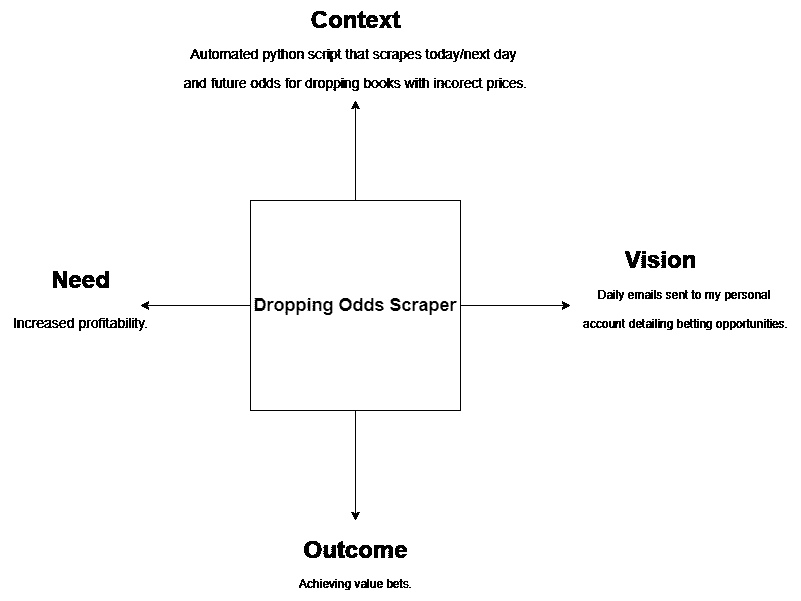
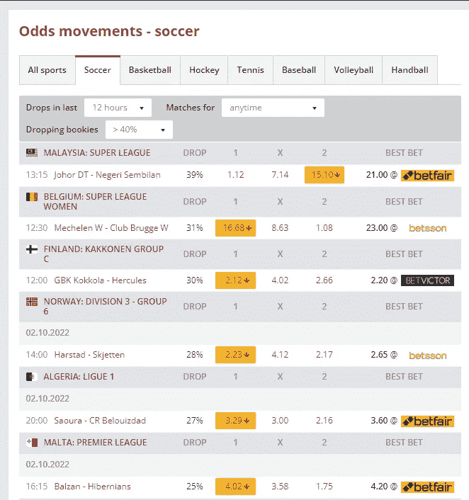
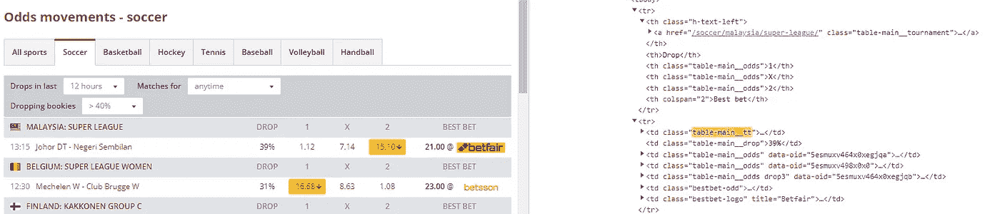
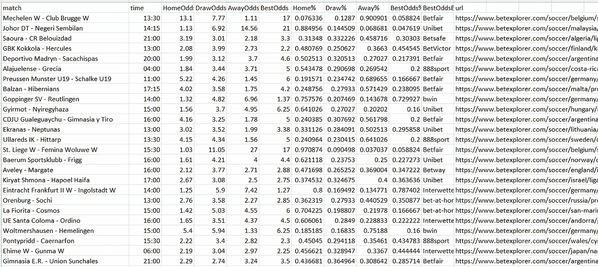

# 用 BeautifulSoup 和 Python 创造积极的预期保证金下注机会第 1 部分

> 原文：<https://levelup.gitconnected.com/create-positive-expected-margin-betting-opportunities-with-beautifulsoup-and-python-bed1b4164183>

这篇文章在 2022 年 5 月 10 日更新了新的功能。

我已经删除了这篇文章之前的大部分代码，如果你想了解更多，包括购买整个项目，包括在你的机器上本地运行的应用程序，请通过电子邮件联系 paulcorcoran1992@gmail.com

博彩公司非常擅长为足球比赛定价，理论上，保证金的存在意味着随着时间的推移，他们“应该”不会输。自然数学方差意味着，随着时间的推移，如果客户支持包含 5%保证金(也称为 vig、overround 或 juice)的选择，那么博彩公司应该至少占其总赌注的 5%。

如果我们可以使用 python 和一些网络抓取来发现下降的可能性，并突出显示没有调整的书籍，这意味着我们可以将优势转化为我们的优势，那会怎么样。这可以通过一些网络抓取和多个 book maker 帐户来实现。

来源:http://inspiring-speaker.com/10-ways-help-beat-odds/

有许多 oddschecking 网站取消博彩公司的赔率，并作为比较网站发布，如 [Oddschecker](https://www.oddschecker.com/) 、 [Oddsportal](https://www.oddsportal.com/) 、Oddsjam(如果你在美国，尽管我相信这已经消失了！)

但有一个网站在页面上为多种运动提供了“赔率运动”标签。Betexplorer 提供多个联赛和运动的结果/表格/表单和收盘价格。足球(或英式足球)是人们感兴趣的运动，它们迎合了良好的刮擦可能性，我称之为“下降刮擦”或简称 DOS。在我深入研究该网站及其可用于抓取的关键属性之前，我将强调这是一项正在进行的工作，最终的 DOS 应用程序将必须更加复杂，以便提供更强的下注机会。

在我开始这个项目之前，我强调了一些关键的项目目标。承担这一任务的理由背后的原因、内容和方式。Max Shron (Shron 2014)在《用数据思考》一书中为数据分析项目提供了一个很好的框架。他陈述了在开始任何项目之前要遵循的 4 个关键过程。我浏览了下面图 1 中的每个过程，将它们与这个项目联系起来。

*在上下文中，您定义了您试图实现的目标，以及哪些利益相关方对该问题感兴趣。定义更高层次的目标。*

需求是你陈述如果成功，项目将增加什么价值的地方。在实践层面上理解这个问题的关键。

*设想，结果是什么样的？还要定义解决方案逻辑。*

*胜负，最重要。结果将如何使用。*

作者创建的图像。

在这一点上，路线图和目标是明确的，现在对网站的实际刮。文章末尾提供了完整的代码。下面的图 1 提供了目标 url。可以观察到，该网站提供了一个 api，该 API 从博彩公司获取并返回 1x2 的平均价格，也就是每场比赛的主场、平局和客场获胜概率。最佳赌注部分突出了哪本书太高，他们提供的赔率是多少。这些都是关键信息，通过提取该页面及其主要数据点，我们可以创建一个数据框架，显示哪家博彩公司的报价高于市场价格。

图 1:目标 URL。

通过使用谷歌 Chrome 网站开发工具和检查页面，可以观察到大多数数据都在这个“table-main__tt”表下，如比赛文本、比赛时间和赔率/最佳赌注登记经纪人。

现在我们开始编码！加载的默认页面用于最近 12 小时内的投递，并且在任何时间日期范围内匹配。

1.  库是进口的，熊猫，请求和 beautifulsoup 都是需要的。
2.  指定 url 并初始化，以获取目标页面的内容。
3.  我使用 bs4 找到每个匹配的所有 url 链接，并设置为变量 matches
4.  为了最好的赌注，我也这样做
5.  为了检索具有最佳赔率的博彩公司的名称，我搜索 bestbet-logo 类。
6.  我也搜索了日期，但是在我写作的时候还没有添加到最终的 df 中。
7.  设置一个空列表来存储数据，我使用一个 for 循环来选择与 table-main__tt 相关的所有数据，然后添加匹配名称、时间和赔率的文本，最初作为 3xnumofmatcheslist 返回。

第二段代码创建了 best odds/bookietitle 变量，并将 url 链接附加到一个新列表中。然后我继续用熊猫创建数据框架。为了分离赔率列表并提取每个元素，我使用了 lambda 函数。例如，odds[0]与主队获胜赔率相关联，并遵循平局和客场的逻辑。然后，我用 1 除以概率，将概率转换成不同观点的百分比。

总的来说，最终的数据帧看起来像这样一个 csv。

使用这个例子，我们可以看到 Betfair 为 Mechelen 女子俱乐部对布鲁日女子俱乐部提供的赔率为 17.0，高于市场平均水平 13.1。

编辑:2022 年 5 月 10 日。我修正了原始帖子中提到的斜体改进。数据框现在包含一个预期保证金列，它是最高赔率相对于选择所指赔率的差值。我还添加了哪些赌注与哪些选择相关。

# 后续步骤/改进

目前，项目正处于一个良好的起点，为了提高监督事务司的效率，必须指出以下几点。

*   它是静态的，这意味着它只在本地运行，基于云的服务将有助于实现自动化。
*   代码中没有电子邮件/电报功能来自动将这些结果发送给用户。
*   绝不是一个保证赚钱的人，但通过获得高于平均水平的赔率，它可以帮助增加利润。
*   市场波动相当大，尤其是在价格信心较低的低级别足球上。在以色列联赛中，一支球队前一天被逼到 1.67，但在比赛前却变得飘忽不定，这是很常见的。应该考虑游戏时间和市场移动百分比有多远。
*   与这一点相关，Betexplorer 有一个延迟，所以它可能是陈旧的价格显示已经移动。这确实是一个迅速行动的问题。
*   *目前的准则没有提供哪种选择与最佳赔率相关，因此需要敏锐的眼光和对赔率的理解。此外，脚本中没有计算预期利润，它在雷达上等待添加。*
*   selenium 和 webdriver 的使用被吹捧为通过在抓取时提供所有博彩公司单独行的更多细节来改善这一点，以提供更多的洞察力。这将是 DOS 的自然发展。

我希望你喜欢阅读，并且这个项目可能会启发你做一些你自己的网络搜集！代码提供如下。任何想法或问题都是受欢迎的，并一如既往地关注我更多的内容和这个项目的持续进展。

**编辑:我已经添加了关于体育/国家/联盟数据的细节，并修复了时间栏，它比格林尼治时间提前了一个小时，因为我在爱尔兰，这意味着数据提前了一个小时。**

第二部分可用[此处](https://medium.com/p/b6734cfe3f25)。

# 参考

史隆麦克斯。2014.*用数据思考:如何将信息转化为洞察*。