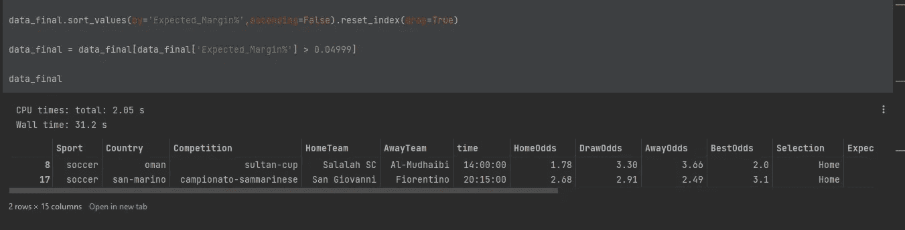
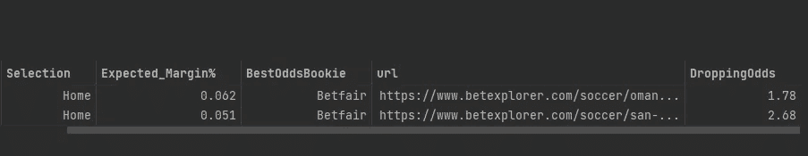
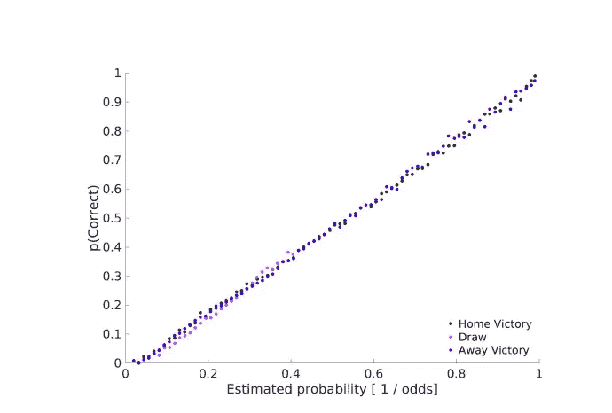
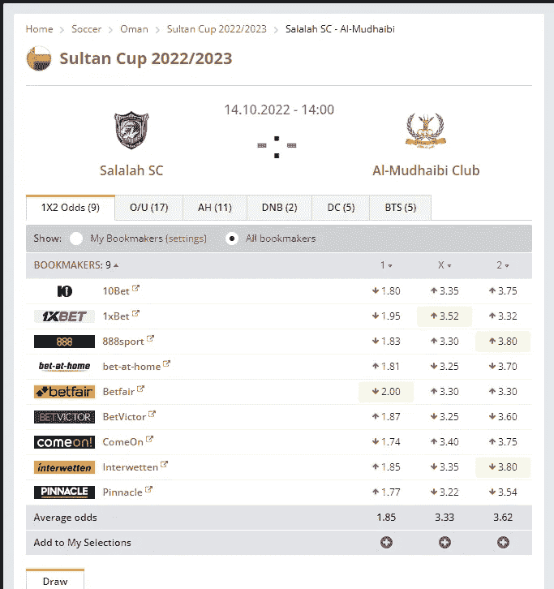
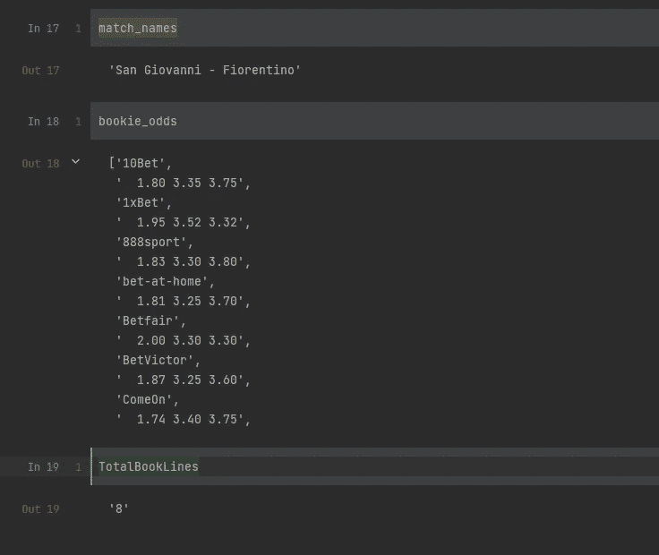
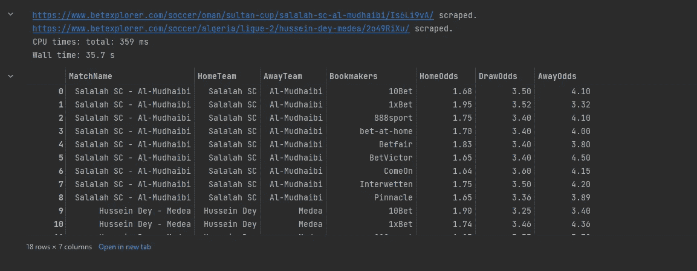

# 利用 BeautifulSoup 和 Python 创造积极的预期保证金下注机会第 2 部分

> 原文：<https://levelup.gitconnected.com/create-positive-expected-margin-betting-opportunities-with-beautifulsoup-and-python-part-2-b6734cfe3f25>

在[第一部分](https://medium.com/p/bed1b4164183)中，我创建了带有漂亮汤的刮刀，从一个流行的赌注比较网站刮出一个赔率运动网站。现在事情变得有趣了，因为我利用 selenium 来找出一本书超出 5%或更多的顶级匹配。选择这个阈值是因为结果的数量很少，这减轻了使用第 1 部分中的 URL 的第二个脚本的负载，并减少了 Betexplorer.com 上的博彩公司提供的匹配几率。如果你有兴趣了解更多，我已经编辑了这篇文章，删除了大部分代码。请伸出手。

回顾一下项目在第 1 部分中的位置。刮刀寻找下降的足球赔率与 5%或以上的标准不一致。我把它命名为 DroppingOddsScraper 或 DOS。

代码出现在第 1 部分，除了下图中的过滤器。



磁盘操作系统

结果分别退回了 6%和 5%的两局出界。这里的关键是我提取了我将在第二阶段使用的 URL。



DOS 结果。

在我开始第二阶段的代码演示之前，我想强调一下闭幕线作为足球比赛真实赔率的代表的重要性。(考尼茨、钟和 Kreiner，2017 年)的一篇论文验证了收盘赔率在创建有利可图的下注策略方面的有效性。他们研究的一个关键点在这里详述。



图 1:博彩公司的预测能力:(考尼茨，钟，和 Kreiner 2017)

作者研究了跨越 10 年的 479，440 场足球比赛的收盘赔率，并可视化了博彩公司预测(即他们的赔率)与比赛的实际结果。(考尼茨、钟和 Kreiner，2017 年)引用如下:

*“博彩公司估计的概率(由各博彩公司平均收盘赔率的倒数反映)与足球比赛结果的真实概率高度相关，主队获胜(黑点)、平局(洋红色点)和客队获胜(蓝点)。”*

对于他们研究的一个简单定义，它本质上意味着博彩公司已经控制的模型是真实赔率的很好的标记。也就是说，采取利用不利因素的策略，随着时间的推移，将会产生正回报。

**严重警告——你将被限制时间。*

现在来看编码。我进口硒。并提取足球/之后的字符串段。如阿曼/苏丹杯/萨拉赫-sc-al-穆德海比/Is6Li9vA/。这允许我使用一个 f 字符串，URL 在其中循环，目标结果在我清理和连接的地方追加。

目标 url 如图 2 所示，我想要比赛名称(显示在黑色文本中)和每个书签及其赔率。我通过右键单击我的目标变量并复制 xpath 来使用 inspect page。



图 2:目标 URL。

match_names 捕获比赛名称，bookie_odds 捕获所有 1X2 的赔率，TotalBooklines 捕获博彩公司的数量:在这个例子中是 9，我将在后面使用。睡眠功能确保铲运机在继续之前等待 8 秒钟。任何铲运机的关键要求。

# 清洁

未挂起的结果看起来是这样的，一些在列表中，而另一些作为简单的字符串返回。



我将这些转化为数据框架，并在适当的地方使用列表理解来提取欲望的元素。

该行使用博彩公司的数量来复制匹配名称行。稍后你会明白为什么。

```
scraped_match_names.loc[scraped_match_names.index.repeat(bookLines['NumBookie'])].reset_index(drop=True)
```

除此之外，它只是清理信息并将其转换为更清晰的表示。Lambda 函数的使用允许赔率被 1X2 分割。

最终的数据帧如下所示。booklines 变量允许我重复博彩公司提供的第一场比赛赔率为 9 的比赛名称。然后在第二次匹配中使用值 8，通过 Betexplorer 给我们一个完整的市场视图。



DOS v2。

总的来说，它有 165 行代码！。我真的很喜欢这个项目，并在这个过程中学到了很多关于网络抓取的知识。我希望你喜欢这个项目的独特性，并一如既往地关注我更多的编程和足球内容。再次重申这一点，我已经删除了这篇文章中的大部分代码，如果你有兴趣了解更多，包括购买完整的脚本，包括在您的本地机器上运行它的应用程序，请联系。你可以在 paulcorcoran1992@gmail.com 联系我

# 参考

*   、利桑德罗、钟和贾维尔·克莱纳。2017."用他们自己的数字击败博彩公司——以及在线体育博彩市场是如何被操纵的."ArXiv [Stat。AP] 。arXiv。【http://arxiv.org/abs/1710.02824\. 号