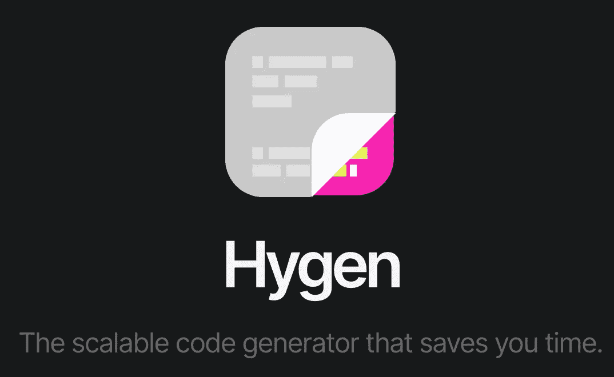
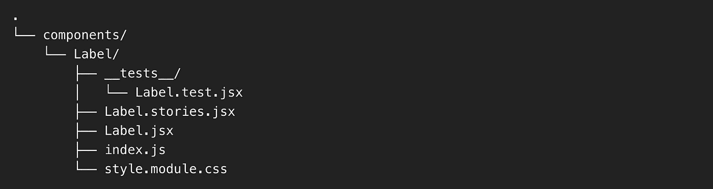

# 使用 Hygen 代码生成器创建 ReactJS 组件

> 原文：<https://levelup.gitconnected.com/create-reactjs-components-using-hygen-code-generator-2bf72f88a026>

## 您是否厌倦了在 React 中不断复制/粘贴组件？使用 Hygen 为您自动生成组件



[**Hygen 代码生成器**](https://www.hygen.io/)

最近，我研究了 Hygen 代码生成器，发现它很有趣，也很有帮助。

主要原因是当我们的 React 应用程序的项目规模由于许多特性而急剧增加，并且在我们的组件中有许多文件时。我们总是不得不复制第一个组件的整个结构，并将其粘贴到根目录中以添加新的组件，这使得它如此成问题和耗时，因为我们还必须修改新粘贴的组件中的所有代码。

例如，如果您正在 React 中开发一个应用程序，并且一个组件包含各种文件，比如 JavaScript 文件、测试用例、样式表模块和故事书文件。每当你需要一个新的组件时，你就很难一次又一次地创建所有这些文件。

现在，让我们看看，你经常在项目中复制和粘贴的一个组件的结构，并相应地进行代码调整。下面是代码结构:



**应用的组件—标签文件结构**

为了使您的生活更容易，更有效率，并且在将代码从一个组件复制/粘贴到另一个组件时有更少的错误代码。试试 [**Hygen**](https://www.hygen.io/) —这是一个代码生成器，允许你通过运行一个命令来自动化代码。

在本文中，我们将介绍 Hygen 的配置以及如何有效地生成组件。

## 1.安装 Hygen

首先，我们已经有了一个正在运行的基于 React 的应用程序。

现在让我们使用`yarn`包管理器安装`Hygen`,如下所示:

```
yarn add -D hygen
```

> ***注意:*** *你也可以使用* `*npm*` *软件包管理器进行安装。*

## 2.配置 Hygen

在这一步，我们将在`Hygen`中创建模板文件来生成 React 组件。Hygen 的默认文件夹是我们可以使用的`_templates`，但是我们将用我们的自定义文件夹替换它，为了做到这一点，我们需要在应用程序的根目录下创建一个`.hygen.js`文件，并在文件中添加以下内容:

```
module.exports = {
  templates: `${__dirname}/.hygen`,
}
```

这个脚本将用我们的`.hygen`目录替换默认路径。现在，在`.hygen`文件夹中添加`new/component`文件夹，如下所示:

```
.
└── .hygen
    └── new
        └── component
```

## 3.构建模板文件

这一节有点长，我们将为所有想要从一个组件复制到另一个组件的文件创建模板。

让我们从 index.js 文件开始。

**index.js**

我们为`index.js`文件创建一个模板，该模板导出文件夹中的所有相关文件。

在`.hygen/new/component`中创建一个文件`index.js.ejs.t`类似这样:

如果你想了解更多关于 Hygen 模板文件格式属性的信息，请参考 [Frontmatter 文档](http://www.hygen.io/docs/templates/#frontmatter)。

**React 组件文件**

其次，我们将为 React 组件创建一个模板。为此，在`.hygen/new/component`文件夹中添加一个名为`component.jsx.ejs.t`的文件:

**故事书文件**

第三，我们将通过在`.hygen/new/component`中创建一个新文件来为我们的故事书添加一个文件，文件名必须像这样`stories.jsx.ejs.t`

**测试文件**

接下来，在`.hygen/new/component`中为我们的测试模板添加一个文件`test.jsx.ejs.t`。

**CSS 模块**

我们需要为 CSS 模块创建的最后一个模板。因此，在`.hygen/new/component`中添加一个名为`style.module.css.ejs.t`的文件:

## 4.设置提示选项

模板文件准备好之后，我们需要设置提示选项来使用这些模板文件。

让我们在`.hygen/new/component`中创建`index.js`并粘贴以下代码:

当 Hygen 添加组件脚本执行时，该文件将显示问题列表。您还可以根据需要定制这个配置文件。

一条高级信息可以在 [Hygen Github](https://github.com/jondot/hygen/blob/404e2350d153e3e1364c443aaa060b68f6212fc7/hygen.io/docs/generators.md) 上看到。

## 5.通过 Hygen 生成组件

最后一步是在`package.json`文件中添加一个脚本来执行生成文件夹的`Hygen`命令。在`package.json`中添加以下脚本

```
"scripts": {
  ...,
  ...,

  "create:component": "hygen new component"
}
```

现在，执行`yarn`命令创建一个`Input`组件，并回答以下问题:

```
yarn create:component
```

执行上述`yarn`命令后，如果您回答了所有提示问题，那么在您的`src/components`文件夹中生成的文件将如下所示:

```
├── components
│   └── atoms
│       └── Input
│           ├── Input.stories.jsx
│           ├── Input.jsx
│           ├── __tests__
│           │   └── Input.test.jsx
│           ├── index.js
│           └── style.module.css
```

正如你在上面看到的，我们还有`atoms`，它是我们在模板中设置的一个`category`，第一个提示问题也是关于`category`。如果不想保留`category`，那么修改上面的阶段，`Hygen`将在`components`文件夹中生成`Input`组件。

*在…*[*Twitter*](https://twitter.com/m_adeel91)*，*[*LinkedIn*](https://www.linkedin.com/in/muhammad-adeel-9ba19951/)*，或者* [*GitHub*](https://github.com/Adeel91)

如果你喜欢阅读这样的故事，并想支持我成为一名作家，可以考虑[报名成为一名媒体成员](https://medium.com/@muhammad-adeel-91/membership)。每月 5 美元，你可以无限制地阅读媒体上的故事。如果你注册使用我的链接，我会赚一小笔佣金。

[](https://medium.com/@muhammad-adeel-91/membership) [## 通过我的推荐链接加入媒体-穆罕默德·阿德勒

### 阅读默罕默德·阿德勒(以及媒体上成千上万的其他作家)的每一个故事。您的会员费直接支持…

medium.com](https://medium.com/@muhammad-adeel-91/membership) 

[***给我买杯咖啡***](https://www.buymeacoffee.com/muhammadadeel)***☕***