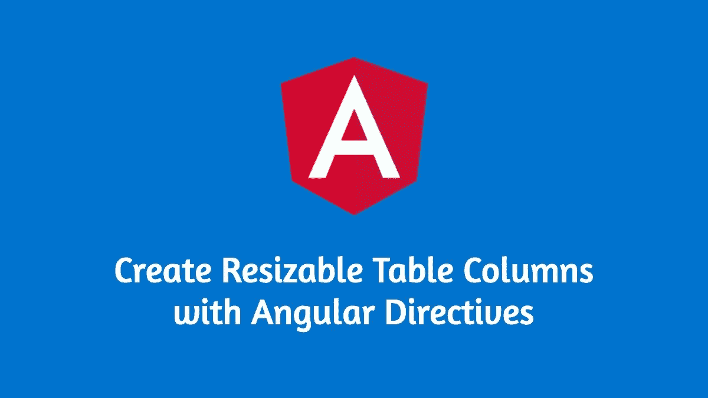

# 使用角度指令创建可调整大小的表列

> 原文：<https://levelup.gitconnected.com/create-resizable-table-columns-with-angular-directives-a9e0f5c1cbf7>

## 增压您的角度应用自定义可调整大小的表格指令！



> 简单是效率的灵魂—奥斯汀·弗里曼

Twitter 开发者社区是我遇到的最好的开发者聚集地之一。我最近开始变得更加活跃，我发现这很有趣，学习和灵感。

亚历克斯·因金的以下推文启发了我写这篇文章。

亚历克斯·因金发推文

上面的代码片段是一个角度指令，可用于调整任何表格列的大小。我个人认为这非常有用，并将为学习角度指令和`rxjs`基础知识树立一个很好的榜样。

让我们开始吧

## 这个计划

这里的基本思想并不简单。为此，我们将采取以下步骤。

> **注意:**表格列的宽度实际上是相应标题单元格的宽度(`<th>`)。

1.  通过创建一个新的组件向`<th>`元素引入更多的模板。
2.  设置这些模板的样式以反映表格边框样式。
3.  沿着边框拖动时，增加/减少`<th>`元素的宽度。

## 创建组件

这里的要点是在表头单元格中有伪模板。出于这个原因，我们需要引入一个带有模板的新组件。

```
ng generate component resizable
```

让我们向它介绍我们的模板

你可以看到我们在这里使用了内容投影，有趣的是，我们在`.bar`元素上还有一个名为`resizable`的自定义事件。

实现控制器

值得注意的是，组件选择器是`th[resizable]`，它将使用`[resizable]`指令选择所有的`<th>`元素。

你可以在下面我写的文章中读到更多关于上述选择器方法的内容。

[](https://bharathravi.com/posts/learn-angular-component-design-patterns-from-material-components) [## 从材料组件中学习角度组件设计模式

### 有哪些材料组件可以教给我们组件设计模式！巴拉瑟拉维 8 月 6 日 3 分钟读“使它…

bharathravi.com](https://bharathravi.com/posts/learn-angular-component-design-patterns-from-material-components) 

我们还使用`@HostBinding`将主机的宽度(`th`)绑定到属性`width`。元素的宽度现在用`onResize(width)`函数动态更新。该事件稍后将由`resizable`指令触发。

我们还需要一些 CSS 样式来模仿表格的边框。这里可以找到[。](https://gist.github.com/BharathRavi27/ef37204793618bc4d89c718e7b058214)

这就是组件实现的全部内容。

## 创建指令

现在让我们创建`resizable`指令。

```
ng generate directive resizable
```

我们的`resizable`指令的唯一目的是在拖动列边框时发出一个事件(`resizable`)。然后，`resizable`组件使用该事件来操作表格单元格宽度属性。

我们在`constructor`中注入`DOCUMENT`和`ElementRef`来间接访问各自的 API。

然后我们还有使用指令发出的`readonly` `@Output`事件。我们在`rxjs operators`的帮助下创建一个可观察值，并将值转换成期望的形式。

让我们将上面的代码实现分解成下面这些较小的步骤。

1.  使用`rxjs`的`fromEvent()`函数在主机组件上创建一个来自本机`mousedown`事件的可观察对象(在我们的例子中，这是我们引入到`<th>`中的自定义模板)。
2.  使用`pipe()`方法组合多个`rxjs`运算符。
3.  使用`tap`操作器执行`preventdefault()`功能，这对于避免任何不良副作用非常重要。
4.  应用`switchMap`操作符，确保我们在`mousemove`期间取消任何`mousedown`事件，以避免多次发射。
5.  获取最近的`th`(宿主元素)的信息(在 DOM 中的宽度和位置)。
6.  计算标题单元格右边界的新位置。
7.  使用`distinctUntilChanged()`过滤掉与先前值相同的值(将鼠标放在相同的位置)
8.  在`mouseup`事件时停止发射数值。

就这些了！我们现在有了一个角度指令，可以在整个应用程序中使用它来赋予表格列调整大小的超级能力😃。

## 测试它

让我们看看如何在组件上使用它。

像那样优雅！

更多类似的文章👇

[](http://bharathravi.com/) [## Bharath Ravi | javaScript 文章

### 有能力的文章来提升你的网络技能。javaScript 全栈开发者 Bharath Ravi 的个人博客

bharathravi.com](http://bharathravi.com/) 

在 twitter 上找到我[这里](https://twitter.com/_bharath_ravi)。

黑客快乐！