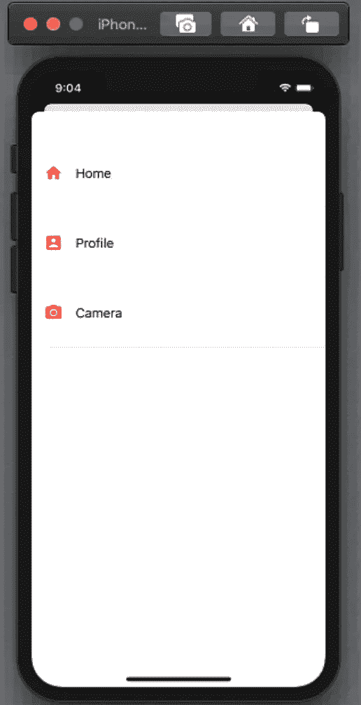
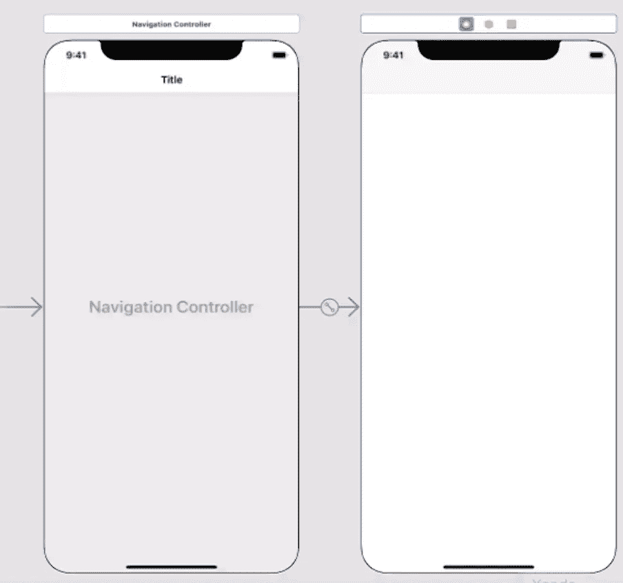
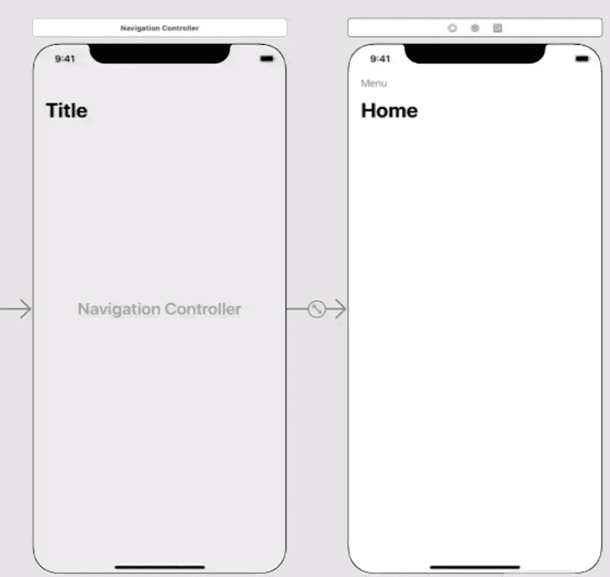
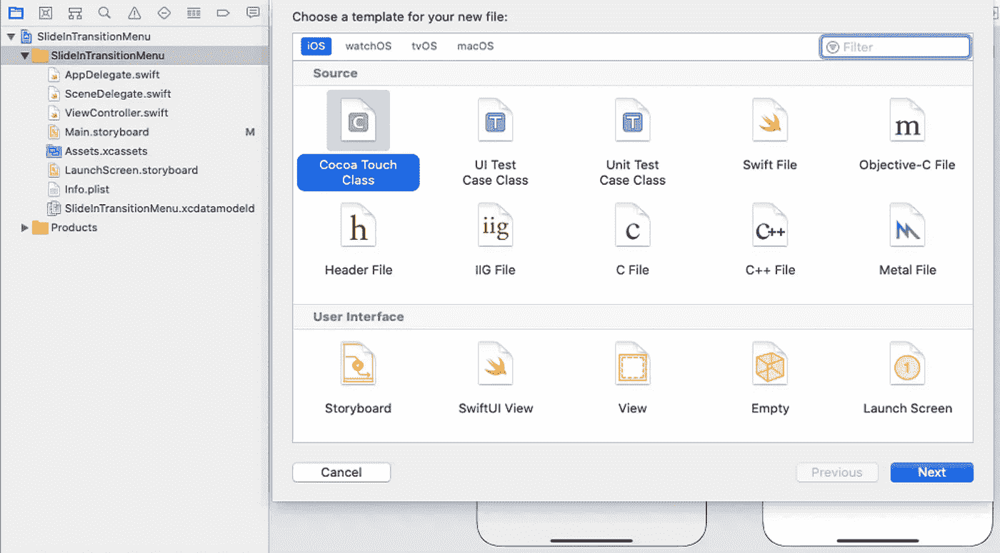
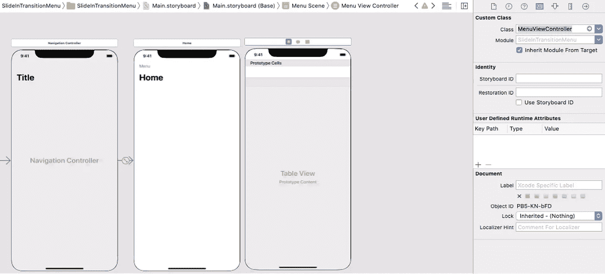
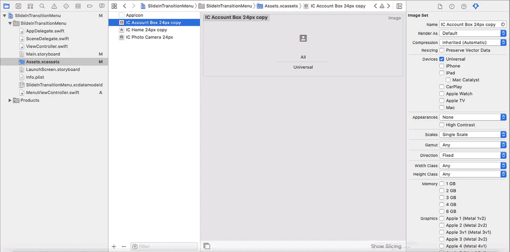
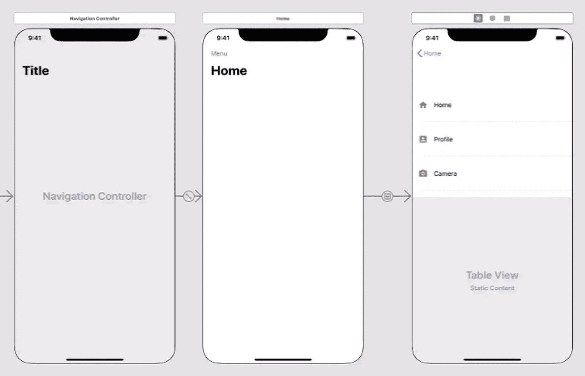
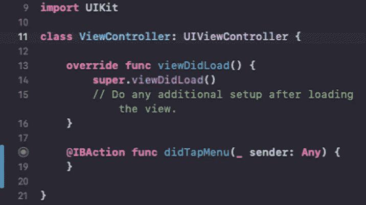
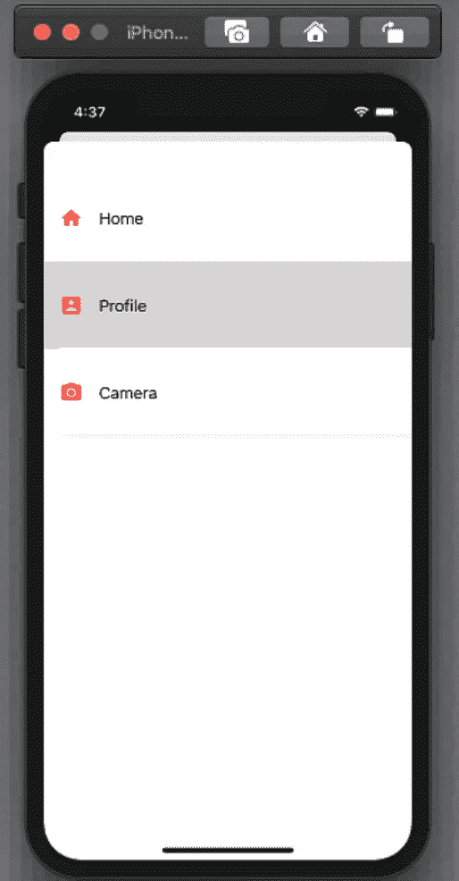
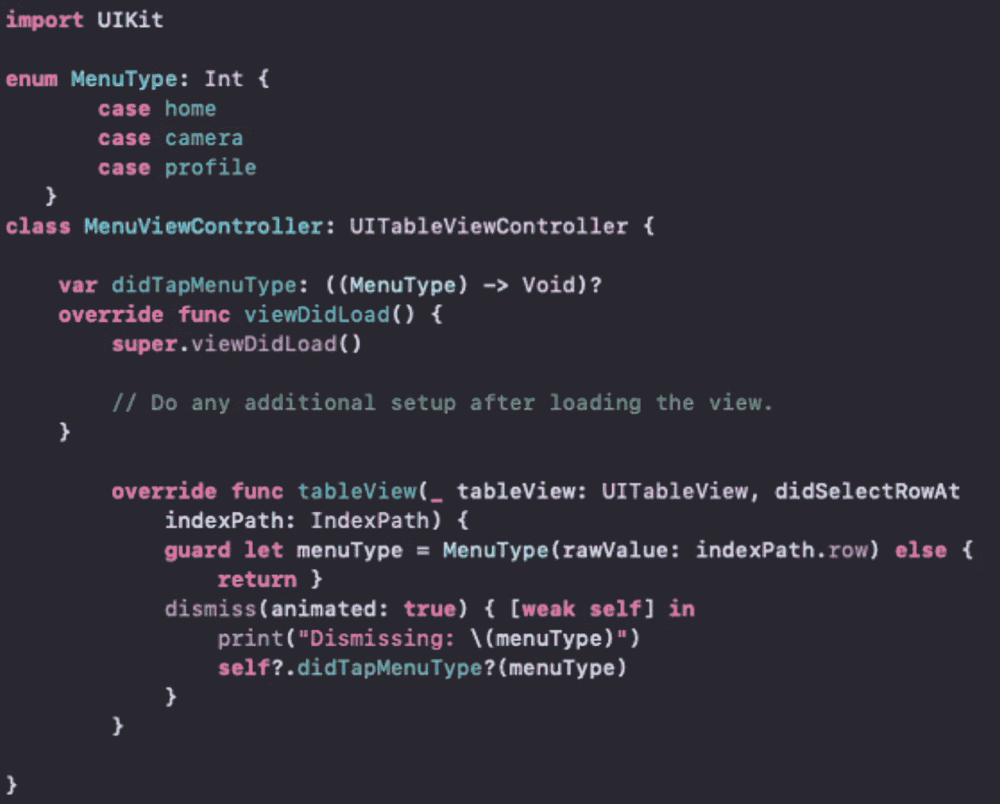

# 在 Xcode 中创建滑入过渡菜单

> 原文：<https://levelup.gitconnected.com/create-slide-in-transition-menu-in-xcode-4f504d735f00>

## 介绍

本文将介绍如何通过简单的 6 个步骤为你的 iOS 应用程序创建一个滑入式过渡菜单。

滑入式过渡菜单演示

**第一步:添加视图控制器**

打开 Xcode，创建一个单视图应用程序，将产品名称命名为 SlideInTransitionMenu，选择任何您想要保存应用程序的位置。

转到主故事板，选择“编辑器”>“嵌入”>“导航控制器”。

**第二步:添加菜单栏按钮**

单击导航控制器，打开“检查器”选项卡，并选择“首选大标题”。转到主视图控制器，在屏幕上添加一个大标题。

将一个 UI 栏按钮项目拖动到导航栏，将其重命名为“Menu”。

**第三步:创建 MenuViewController**

转到项目导航器，右键单击，然后单击“创建新文件”。选择 Cocoa Touch class 并将其命名为 MenuViewController。

将一个 UI 表格视图控制器拖到我们的主视图控制器中。将自定义类设置为“MenuViewController”。

**第四步:创建菜单列表**

转到资产，添加您可以在菜单栏中用于显示“主页”、“个人资料”和“相机”的图像。单击每个图像，并选择比例作为单一比例。

转到表格视图控制器，将一个图像视图、一个标签和一个 UI 视图拖到单元格中。根据需要添加约束。重复创建配置文件和地址单元格。

右键单击导航栏中的菜单，并将其拖动到第二个视图控制器的表格视图中，然后选择一个显示片段。现在运行应用程序，我们可以选择该菜单，它应该会显示菜单选项。

它正在显示要返回的导航控件，我们将把它更改为滑入式过渡菜单。

**步骤 5:创建 didTapMenu 动作**

删除这个段落，因为我们不再使用它了。单击主视图控制器并将菜单拖动到视图控制器，创建一个动作，并将其命名为 didTapMenu。

**第六步:完成 didTapMenu 功能**

通过在 didTapMenu 函数内部编写一个名为 MenuViewController 的标识符来创建一个标识符。

转到主故事板，将菜单视图控制器的 StoryBoardID 设置为“menu view controller”。现在运行应用程序，点击菜单，你会看到菜单视图控制器。

在菜单视图控制器中，我们覆盖 didSelectedRowAt indexpath 并为每个单元格创建 enum。我创建了一个菜单类型，并将原始值作为 indexpath.row 传递。

搞定了！现在，如果我们运行应用程序并点击菜单列表，它将返回到主页。您还可以为不同的菜单项添加不同的视图控制器。