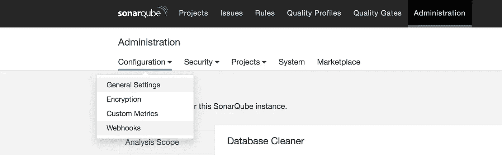
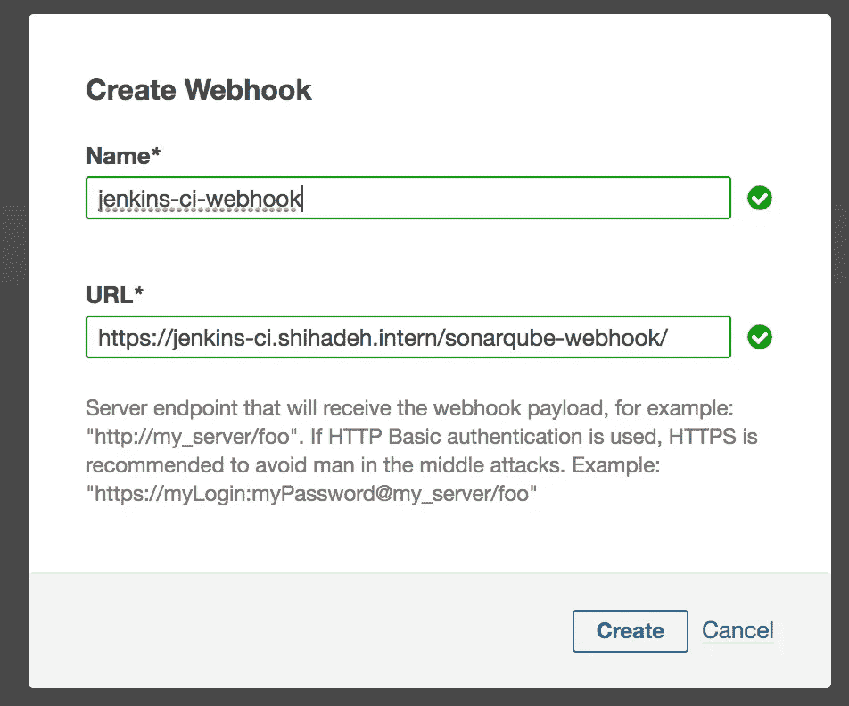

# 创建一个 SonarQube Jenkins Webhook

> 原文：<https://levelup.gitconnected.com/create-sonarqube-jenkins-webhook-8f4c6cce3920>

## 通过 webhook 回调将 Jenkins 与 SonarQube 集成


在 [Unsplash](https://unsplash.com?utm_source=medium&utm_medium=referral) 上由[Milan de grave](https://unsplash.com/@milandegraeve?utm_source=medium&utm_medium=referral)拍摄的照片

> SonarQube 是一个开源平台，用于持续检查代码质量，通过静态分析代码来执行自动审查，以检测 bug、代码气味和安全漏洞。

在 SonarQube 中添加 webhook 非常简单明了。这项任务可以通过 SonarQube 用户界面本身来完成。然而，如果您试图添加一个带有自签名 SSL 证书的 **HTTPS** webhook，您需要执行额外的步骤😃。在这篇文章中，我将展示如何给 SonarQube 添加一个 Jenkins `https` webhook。

不幸的是，SonarQube 没有提供禁用自签名证书的 SSL 验证的选项。因此，由于我们想要添加一个使用自签名 SSL 证书运行的 **HTTPS** webhook，我们需要确保 SonarQube 信任自签名证书。这项任务可以通过在运行 SonarQube 的主机上执行以下命令来完成

```
$> sudo cp self-signed-ssl.crt /usr/local/share/ca-certificates/
$> sudo update-ca-certificates
```

如果您使用 docker 来运行 SonarQube，您可以使用下面的 docker 文件来构建信任您的自签名证书的 docker 映像

下一步是从 SonarQube 接口创建 webhook，为此，您可以执行以下步骤

*   以管理员用户身份登录 SonarQube
*   导航到 webhooks 页面:`Administration->Configurations->webhooks`



*   创建一个新的网页挂钩:点击创建新的网页挂钩，然后填写下面的表格，点击`create`按钮。webhook URL 应该遵循以下形式`[https://${jenkins_domain}/sonarqube-webhook/](https://${jenkins_domain}/sonarqube-webhook/.)` [。](https://${jenkins_domain}/sonarqube-webhook/.)用户末端的`/`非常重要，没有它，你可能会遇到一些触发 webhooks 的错误。



## **结论**

在 sonar cube 中添加一个 Jenkins webhook 来报告分析报告的状态是一项简单的任务，可以从 sonar cube 界面中完成。webhook 工作的唯一要求是允许 SonarQube 和 Jenkins 之间的连接