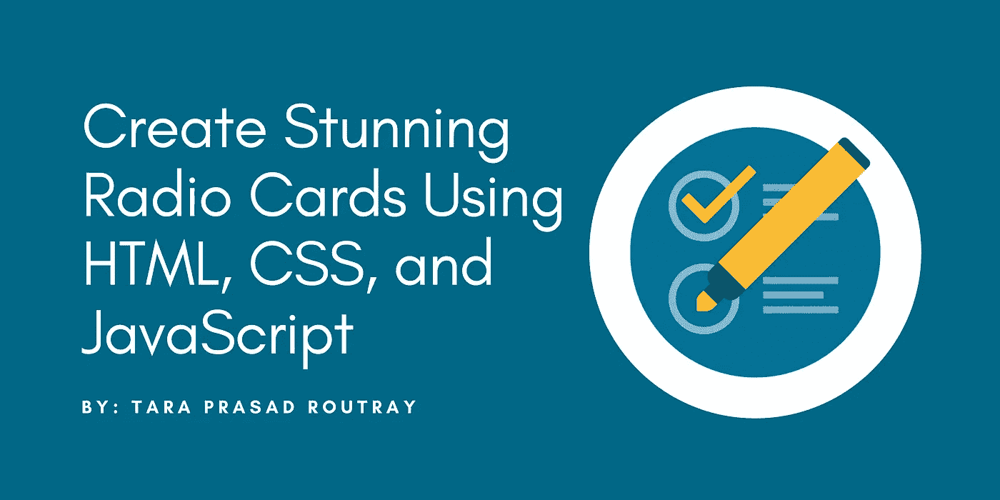
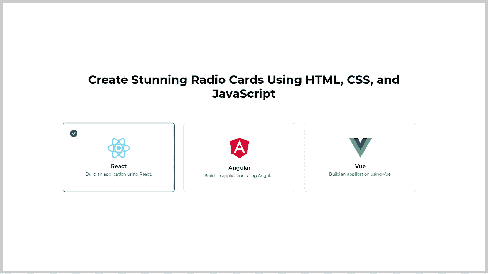
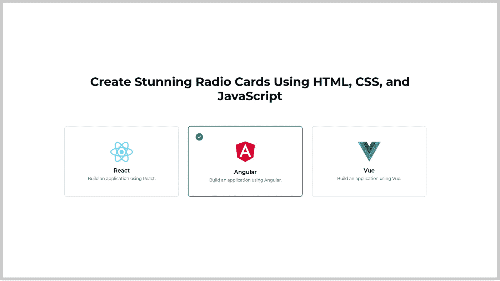
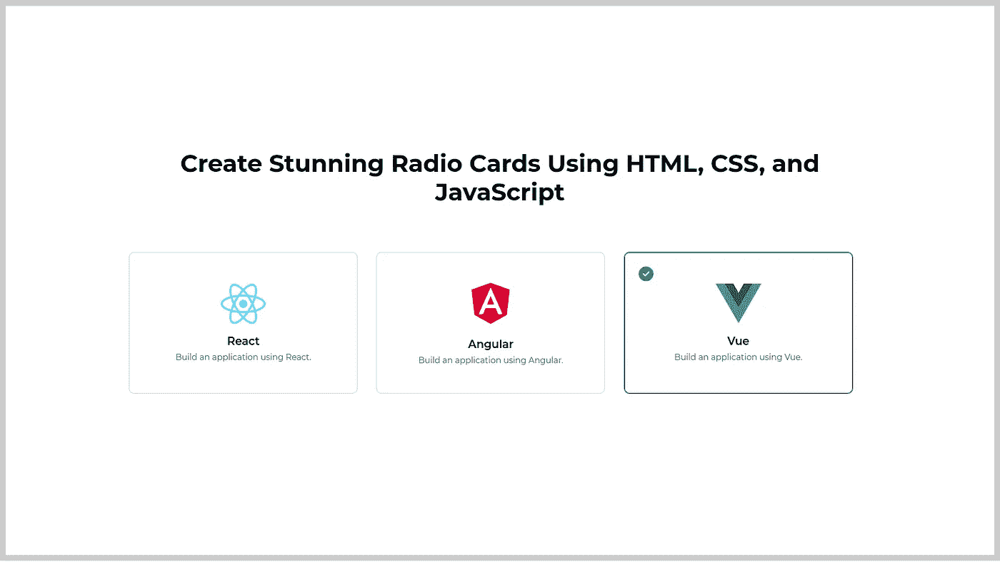

# 使用 HTML、CSS 和 JavaScript 创建令人惊叹的广播卡

> 原文：<https://levelup.gitconnected.com/create-stunning-radio-cards-using-html-css-and-javascript-170f792a3bf3>

## 学习在网络技术的帮助下将旧的单选按钮转换成现代外观的单选卡。

单选按钮是表单的重要元素之一。如果使用方法正确，这些功能会非常神奇，因为它们简化了从给定的列表中选择一个选项的任务。但是默认的单选按钮不好看。我们需要改变它，使它看起来令人震惊的用户，这将大大改善网站的用户体验。

在本文中，我将为您提供一个在 web 应用程序中实现定制广播卡的分步演练。在这里，我们将把旧的单选按钮转换成漂亮的 CSS 卡片。每个卡片都有一个勾号图标，默认情况下是隐藏的，只有当用户点击卡片时才会出现。

# 通过 3 个简单的步骤制作出令人惊叹的无线电卡

1.  使用 HTML 创建无线电卡的布局。
2.  使用 JavaScript 使无线电卡起作用。
3.  用 CSS 设计无线电卡。

# 步骤 1:使用 HTML 创建无线电卡的布局

让我们为我们的广播卡设置一个基本的 HTML 布局。它将包括一个装卡片的容器。在它的内部，我们将添加三张卡片，每张卡片都有一个复选(打勾)图标、一个卡片图标(图片)、一个卡片标签(标题)和一个卡片标签描述(附加内容)。每个无线电卡都有一个名为`radio-card`的公共类，为了使它起作用，我们需要为每个卡添加另一个独特的类，如`radio-card-1`、`radio-card-2`、`radio-card-3`等等。这些卡片将有一个`onclick`属性，该属性将调用一个名为`selectRadioCard()`的函数。像`1, 2 or 3`一样，在参数中传递卡号。我们将在下一步编写逻辑来使卡正常工作。

将下面的代码片段添加到您想要实现自定义无线电卡的部分。

# 步骤 2:使用 JavaScript 使无线电卡起作用

现在，我们需要实现当用户触发卡片上的点击事件时使无线电卡起作用的逻辑。添加一个名为`selectRadioCard`的函数，它将接受一个名为`cardNo`的参数。它将首先找到所有的无线电卡，然后遍历每一个卡，并删除类`selected`。之后，它会像`radio-card-1, radio-card-2, or radio-card-3`一样找到具有指定卡号的元素，并将类`selected`添加到其中。

在页面的`script`元素中添加以下代码片段。或者，您可以创建一个外部 JavaScript 文件并使用它。

# 步骤 3:使用 CSS 设计无线电卡

既然我们已经完成了自定义广播卡的实现，我们需要添加一些 CSS 片段来设计 HTML 内容的布局。

将以下代码片段添加到页面上的一个`style`元素中。或者，您可以创建一个外部 CSS 文件并使用它。

# 结果

# GitHub 资源库链接

访问下面的 GitHub 库下载文件。

 [## GitHub-tararoutray/无线电卡-使用网络技术-演示

### 此时您不能执行该操作。您已使用另一个标签页或窗口登录。您已在另一个选项卡中注销，或者…

github.com](https://github.com/tararoutray/radio-card-using-web-technologies-demo) 

太棒了。您已经完成了如何使用纯 HTML、CSS 和 JavaScript 创建令人惊叹的广播卡的学习。

> 如果你喜欢阅读这篇文章，并发现它对你有用，那么请鼓掌，与你的朋友分享，并关注我以获得我即将发布的文章的更新。你可以在 [LinkedIn](https://www.linkedin.com/in/tararoutray/) 上和我联系。