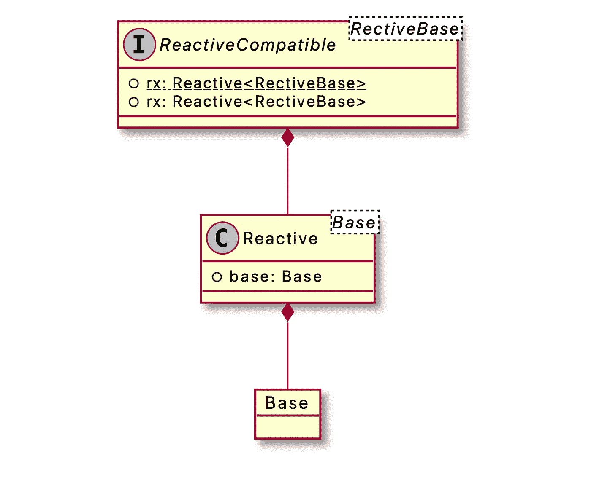

# 像流行的开源库一样创建 Swift 扩展

> 原文：<https://levelup.gitconnected.com/create-swift-extensions-like-popular-open-source-libraries-dee3e38dbe9d>


[https://www . xda-developers . com/download-iphone-se-3-2022-wallpapers/](https://www.xda-developers.com/download-iphone-se-3-2022-wallpapers/)

# 介绍

**Swift Extension** 比其他任何语言的扩展都更加灵活和强大。但如果因为自由度高而乱用扩展函数，极有可能成为意大利面代码。

在这篇文章中，我将介绍如何使用 **Swift 协议**和**扩展**实现像一个著名开源库那样的扩展功能。

# 动机

我有一个习惯，就是看制作精良的开源库的内部实现。在查看 **RxSwift** 内部时，我对 **Reactive** 和 **ReactiveCompatible** 的实现印象深刻。起初，我以为这是 **RxSwift** 的独特实现，但这种实现在著名的开源库中很常见，就像模式一样。例如:翠鸟

# RxSwift 代码

RxSwift/Reactive.swift

上面的实现被绘制成一个类图。针对雨燕语言的特点，没有一个工具可以完美的绘制，所以先把不能完美绘制的放在一边。



反应和反应相容的类图

它是一个简单的结构，ReactiveCompatible protocol 合成 Reactive class，ReactiveBase 声明为 **generic** 类型。反应类合成基地成**通用**型。

光看这个很难确切知道会做出什么样的行动。让我们仔细看看下面的实现。

啊哈！看看上面的实现，就更清楚了。当 **ReactiveCompatible** 协议创建一个 **Reactive** 类实例时，它注入**自身**作为**基础**。

因此， **ReactiveCompatible** 的任何实现都会将 **Reactive** 类的实例 **rx** 作为属性作为**基**注入。

读者会说，“那又怎样？它有什么作用？”你可以想不要心急，还是再专注一点吧。从现在开始，我们可以看到这一切的神奇之处。

**n 对象**实现**反应兼容**。如你所知， **UIKit 的** **UIButton** 和 **UIView** 大部分都是**n object**的子类。因此， **UIButton** 也是 **ReactiveCompatible** 的实现。

如第 3 行所示，`extension Reactive where Base: UIButton`通过实现这一点，您可以编写一个**反应型**类扩展函数，该函数只应用于 **UIButton** 。

如下图所示， **rx** 扩展功能只能提供给特定的实现。

```
let button = UIButton()
button.rx.tap
  .bind { print("tapped") }
  .disposed(by: disposeBag)
```

这个简单的原则允许我们编写干净的代码，“对扩展开放，对变化封闭”。此外，由于 **Reactive** 是一个**结构**，每当调用 **rx** 属性时，就会创建并传递一个新实例，因此您可以利用**的不变性**。

# 申请

你可能对 **UIAlertController** 比较熟悉，它对于 iOS 应用开发是必不可少的。让我们将逻辑扩展到与**反应式**相同的结构。

Alert.swift

以与 RxSwift 的**反应**和**反应兼容**相同的方式，创建**警报**和**警报兼容**，并将**警报**属性声明为**警报**实例。

声明 **AlertCompatible** **扩展**，通过将自身注入 **alert** 属性的 getter 中，实现逻辑创建 **Alert** 实例。

UIViewController+Alert.swift

在扩展 **UIViewController** 实现 **AlertCompatible** 后，增加了必要的功能。现在， **UIViewController** 有了一个扩展功能，可以简单的呈现 **UIAlertController** 。

你可以像这样简单地使用它:

MyViewController.swift

如果在另一个类中需要 **Alert** 函数，那么在相关类中实现 **AlertCompatible** 并只添加必要的函数就足够了。

# 结论

不知道通过实现示例是否已经充分传达了优点。我使用这个方法已经有一段时间了，它非常有用，在结构上也非常令人满意。我希望您也将今天介绍的扩展函数实现方法引入到您的项目中。这肯定会是比现在更好的实现扩展的方式。

仅仅通过阅读写得好的、受欢迎的开源代码，你就可以取得很大的进步。作为奖励，你可能会在里面找到宝石。