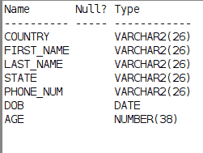
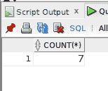
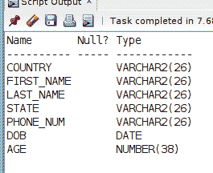
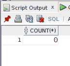

# 从 Oracle SQL 中的现有表创建表结构

> 原文：<https://levelup.gitconnected.com/create-table-structure-from-existing-table-in-oracle-sql-980cf5111189>

您是否需要与数据库中现有表相同的表结构，但没有行？Oracle SQL 的 **CREATE TABLE AS** 语句很容易实现这一点。继续阅读，并通过一个简单的例子了解如何…

自我推销:

如果你喜欢这里写的内容，尽一切办法，把这个博客和你最喜欢的帖子分享给其他可能从中受益或喜欢它的人。[因为咖啡是我最喜欢的饮料，如果你愿意，你甚至可以给我买一杯！](http://ko-fi.com/joshlovescoffee)

我有这张**朋友**表，我想*复制*:

然而，**朋友**表有 7 行数据，我希望*克隆*表为空。

我每周写一封关于我正在学习并感兴趣的 SQL/PHP 的邮件。如果这听起来像是你想参与的事情，[点击这里](https://digitalowlsprose.ck.page/1b35a06295)了解更多。谢谢大家！

## 创建表格为

在 **CREATE TABLE AS** 命令中使用**SELECT ***——或显式列出您需要的各个列，该命令带有一个 **WHERE** 子句谓词，其计算结果为 **FALSE** ，基于 **SELECT** 语句的子句表中的**创建一个表，但不会用行*填充*:**

查看新创建的 **SAME_FRIENDS** 表描述，我们可以看到它与它所基于的 **FRIENDS** 表具有相同的结构:

你是[中](http://medium.com/)成员吗？如果是这样的话，[我每次在那里发表博客文章都会收到电子邮件通知](https://parabollus.medium.com/subscribe)如果你喜欢那个平台的话。不是会员？别担心！使用[我的注册链接](https://parabollus.medium.com/membership)(我会向你收取佣金，无需额外费用)并加入。我真的很喜欢阅读所有伟大的内容，我知道你也会！！！

查询 **SAME_FRIENDS** 表显示表中没有行:

这是一个快速简单的方法，你可以从本质上*复制*一个表的精确结构，而不用填充任何行。

一如既往，如果你有任何问题或看到代码中的任何错误，请通过评论让我知道。建设性的意见有助于我提供准确的博客帖子，我非常感激。

喜欢你读过的？看到什么不正确的吗？请在下面评论，感谢阅读！！！

# 行动的号召！

感谢你花时间阅读这篇文章。我真心希望你发现了一些有趣和有启发性的东西。请在这里与你认识的其他人分享你的发现，他们也会从中获得同样的价值。

访问 [Portfolio-Projects 页面](https://wp.me/P28ctb-3KD)查看我为客户完成的博客帖子/技术写作。

[**我喝了很多咖啡。如果你喜欢我的博客帖子，给我一个吧！**](https://ko-fi.com/joshlovescoffee)

要在最新的博客文章发表时收到来自本博客(“数字猫头鹰散文”)的电子邮件通知(绝不是垃圾邮件)，请点击“点击订阅！”按钮在首页的侧边栏！(如有任何问题，请随时查看 [Digital Owl 的散文隐私政策页面](https://wp.me/P28ctb-3gI):电子邮件更新、选择加入、选择退出、联系表格等……)

请务必访问[“最佳”](https://joshuaotwell.com/where-blog_post-in-digital-owls-prose-best-of/)页面，收集我的最佳博客文章。

[Josh Otwell](https://joshuaotwell.com/about/) 作为一名 SQL 开发人员和博客作者，他热衷于学习和成长。其他最喜欢的活动是让他埋头于一本好书、一篇文章或 Linux 命令行。其中，他喜欢桌面 RPG 游戏，阅读奇幻小说，并与妻子和两个女儿共度时光。

免责声明:本文中的例子是关于如何实现类似结果的假设。它们不是最好的解决方案。所提供的大多数(如果不是全部)示例都是在个人发展/学习工作站环境中执行的，不应被视为生产质量或就绪。您的特定目标和需求可能会有所不同。使用那些最有利于你的需求和目标的实践。观点是我自己的。

*原载于 2021 年 9 月 1 日 https://joshuaotwell.com***。**