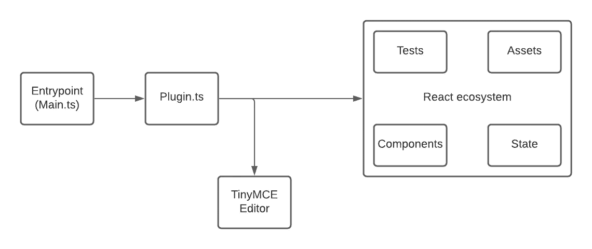
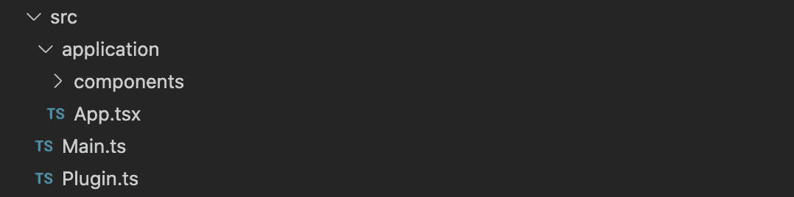
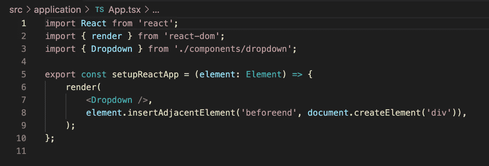
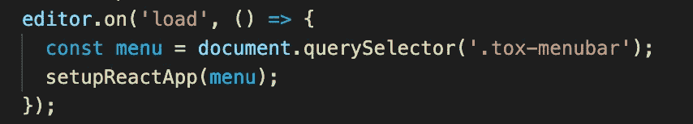
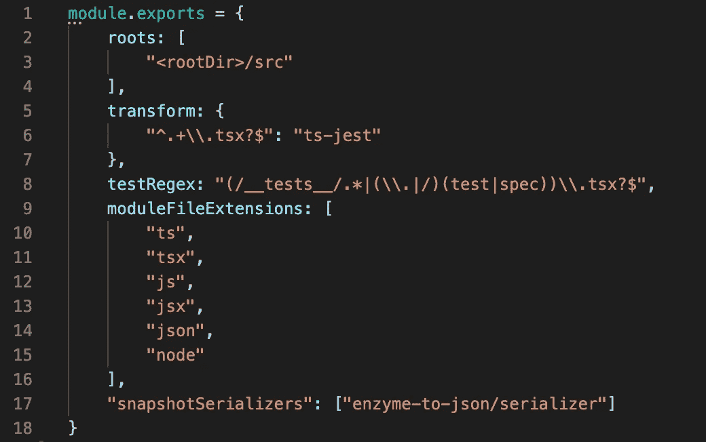
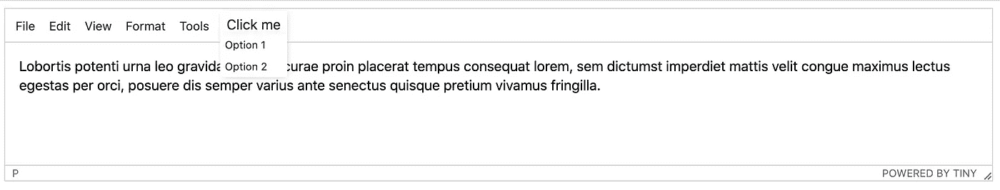

# 使用 React、Typescript、Jest 和 Webpack 创建 TinyMCE 插件

> 原文：<https://levelup.gitconnected.com/create-tinymce-plugins-with-react-typescript-jest-and-webpack-6edd19ac378f>

TinyMCE 是一个所见即所得的 HTML 编辑器，你可以把它免费添加到你的个人和商业网站上。他们的[网站](https://www.tiny.cloud/)上的文档非常简单，你可以很容易地理解如何将它添加到你的应用程序中。构建在编辑器之上的是插件，其中一些是由官方项目创建的，另一些是由社区创建的。无论如何，有两种类型的插件你可以使用:免费和高级。总而言之，这是一个充满可能性的领域。

拥有这些自定义插件来为你的编辑器添加功能是很棒的，但是想象一下免费插件对你来说还不够好，因为让我们面对它，高级插件要花你钱，你可能不想这么做。

**你希望在你的编辑器中有更复杂的逻辑，并且能够定制它。你怎么能这样做？**

在一些搜索之后，你会发现关于使用 [Yeoman generator](https://www.tiny.cloud/docs/advanced/yeoman-generator/) 创建新插件的文档，如果你想在创建插件时快速上手，这是非常酷的。按照文档中的步骤，您将得到一个新生成的模板插件。生成的项目使用预构建的 [TinyMCE UI 组件](https://www.tiny.cloud/docs/ui-components)来创建插件，这意味着您受限于 TinyMCE 提供的组件，并且很可能，这对您来说还不够。现在，我将向您展示如何在它上面添加一个自定义的 React 组件(也将使用 Typescript 和 Jest 进行测试)。



React 插件架构

分析我们的项目源文件，我们知道插件入口点将是 *Main.ts，*从这里我们可以调用一个默认的文件函数，它负责在编辑器中创建围绕插件的逻辑。打开文件，我们已经有了一个自定义命令，允许我们将新插件添加到 TinyMCE 编辑器中。

```
tinymce.PluginManager.add('plugin-name', setup);
```

在*设置*功能中，您可以添加默认的 TinyMCE UI 组件及其逻辑来定制您的插件，但是我们不要这样做。相反，让我们稍微改变一下文件夹结构来准备 React 集成，并在 *src* 文件夹下添加以下内容:



应用程序文件夹将包含我们所有的自定义 React 相关组件，而 *App.tsx* 就是神奇的地方。让我们在这个文件中创建一个函数，并将其命名为 *setupReactApp。在里面，我们将添加一个简单的代码块，稍后我们将详细介绍。*



为了能够在没有任何导入错误的情况下实现这一点，您必须安装一些依赖项(因为我们使用的是 typescript，所以让我们为每个依赖项添加类型模块——如果您想要自定义 Typescript 配置，只需在项目的根上创建一个 *tsconfig.json* )。

```
react
react-dom
@types/react
@types/react-dom
```

在本例中，自定义组件将是一个简单的下拉列表，正如您所看到的，我们将收到一个 HTML 元素作为参数，我们将使用它来插入呈现的 React 组件。这个元素可以在编辑器中的任何地方。解释完这些之后，让我们回到 *Plugin.ts* 文件，从编辑器实例*中添加一个对 *load* 事件的回调，它将在编辑器加载时被触发。*



由于我们想要创建一个下拉组件，我们需要将它添加到编辑器的标题菜单中。为此，我们需要查询正确的元素并调用我们新创建的 *setupReactApp* 。就是这样！现在，您可以在 TinyMCE 中自定义 React 组件。多简单啊！由于我喜欢遵循良好的代码实践，我们也必须将测试库集成到我们的项目中。就我个人而言，我是 Jest 的忠实粉丝，它使用简单，运行速度快。让我们开始讨论如何将 Jest 添加到您的项目中。

第一步是安装这个依赖项:

```
jest
ts-jest
```

下一步是在您的项目中配置 jest。为此，在项目的根目录下创建一个名为 *jest.config.js* 的文件，并在其中添加必要的配置来检测测试文件。你现在可以用*规范*或*测试*扩展名创建任何你想要的测试文件(例如。 *dropdown.spec.ts* )。



> 额外收获:如果你还愿意的话，我还有最后一个发现要分享。如果您需要更多的自由来编辑和添加我们的定制插件和其他模块，您可以通过从 Grunt 文件中删除逻辑并添加一个定制软件包(Webpack)来完成，该软件包具有针对不同环境的配置

在本文中，我只关注如何将我们的项目设置为使用 React，而不是实现本身。但是如果你想查看一个完整的工作示例，我的 Github 账户上有一个模板——[React TinyMCE 模板](https://github.com/thealmarques/tinymce-react-plugin)。

一旦克隆了回购，要运行它，只需:

```
yarn
yarn start
(using VSCode and Live Server plugin)
Open /demo/html/index.html with Live server
```



仅此而已。希望你喜欢它，并很快见到你。