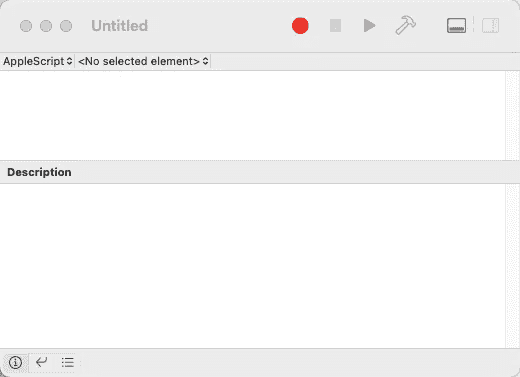
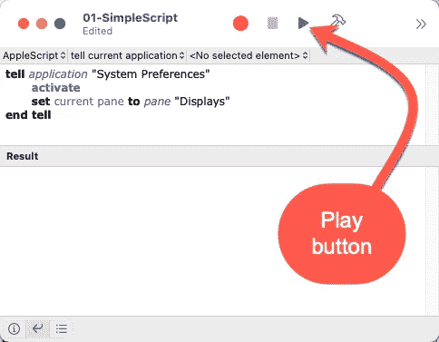
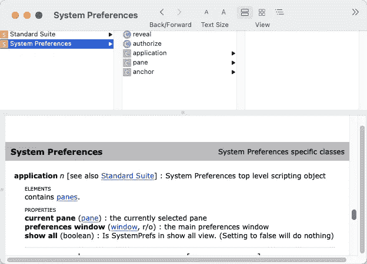
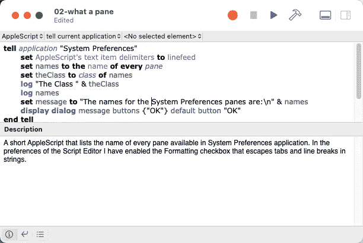
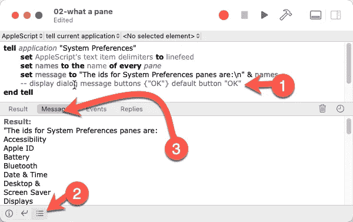

# 创建工具以更好地理解 AppleScript 第 1 部分

> 原文：<https://levelup.gitconnected.com/create-tooling-to-understand-applescript-better-part-1-2727d6dbac83>

## [AppleScript 课程](https://gentille.us/applescript-articles-7f82c319d46?sk=0ad4bf43fb9356f9e647c970cb12c31f)

## 了解一些工具和一些简单的脚本后，您会发现使用 AppleScript 并不一定是令人沮丧的体验。

合适的工具可以让大工程变得简单

*本文显示的所有代码都可以通过* [*关联的 GitHub repo*](https://github.com/Rolias/discover-applescript/tree/main/01-Tooling) *获得。*

学习 AppleScript 可能会令人沮丧。我看过的大部分教程都没有解释如何**自己探索**或者**如何寻找更多帮助**，而那是我的两个主要目标。看起来你需要知道很多神奇的字符串、关键词和咒语才能完成任何事情。虽然你确实需要知道很多，但你可以采取系统的方法，用一点知识和一些工具发现你需要的很多东西。

*我的那些工具之一*s*the*[*AppleScript 语言指南*](https://developer.apple.com/library/archive/documentation/AppleScript/Conceptual/AppleScriptLangGuide/introduction/ASLR_intro.html#//apple_ref/doc/uid/TP40000983-CH208-SW1) *。在整篇文章中，我大量地提供了该文档的链接。我的意图是***这篇文章不需要阅读其中的任何链接就可以完全理解，但在你继续自学的过程中，它们会证明是有价值的。**

# *脚本编辑器*

*让我们从`Script Editor`号开始我们的航行。它在你的`Applications`文件夹里的`Utilities`文件夹里，但是你可以点击⌘-space 并输入“脚本编辑器”来启动它。*

**

*基本脚本编辑器*

*这看起来像一个非常简约的编辑器，但我们可以从中学习到很多东西。*

**🔥提示——如果你想用 VS 代码写脚本，我强烈推荐使用* `*AppleScript*` *扩展。**

# *我们的第一个剧本*

*让我们从一个功能完整的脚本开始。在编辑器中输入下面的代码，当你点击`Play`按钮时，系统偏好设置应用程序将会启动，然后`Displays`面板将会显示。如果没有，检查你的拼写:`Displays`是复数。AppleScript 会因为你的小拼写错误而惩罚你。*

**

*用于打开“系统偏好设置显示”面板的“简单”Applescript*

*这个脚本将命令指向顶层容器`application “System Preferences”`。它使用[命令](https://developer.apple.com/library/archive/documentation/AppleScript/Conceptual/AppleScriptLangGuide/reference/ASLR_cmds.html#//apple_ref/doc/uid/TP40000983-CH216-SW60) `activate`发射并将`System Preferences`带到最前面。最后，它告诉首选项应用程序打开`Displays`首选项窗格。虽然这个脚本本身并不那么有用，但是它的内部有很多值得详细研究的地方。*

*首先，我们在[复合语句表](https://developer.apple.com/library/archive/documentation/AppleScript/Conceptual/AppleScriptLangGuide/reference/ASLR_control_statements.html#//apple_ref/doc/uid/TP40000983-CH6g-158020)中使用[保留关键字](https://developer.apple.com/library/archive/documentation/AppleScript/Conceptual/AppleScriptLangGuide/conceptual/ASLR_lexical_conventions.html#//apple_ref/doc/uid/TP40000983-CH214-SW7) `tell`将我们的命令指向所需的容器。在关键字`tell`之后，我们需要引用一个对象。在这种情况下，我们使用名为`application`的内置[类引用](https://developer.apple.com/library/archive/documentation/AppleScript/Conceptual/AppleScriptLangGuide/reference/ASLR_classes.html#//apple_ref/doc/uid/TP40000983-CH1g-246384)以及应用程序的名称。*

# *在字典中查找条目*

*我是不是听到你问你怎么知道一个应用程序的名字？好问题。一种方法是使用脚本编辑器的`File→Open Dictionary...`菜单，在出现的字典窗口  中向下滚动，选择`System Preferences`。在这种情况下，您在浏览器中看到的名称和您在字典左上角导航窗格中看到的名称是相同的。情况并不总是这样，当有疑问时，打开应用程序的字典，快速浏览一下。*

**

*系统偏好设置的字典*

*字典还可以帮助我们发现更多可脚本化的元素。在这种情况下，如果您点击左上方导航窗格中的`System Preferences`，您将跳过细节窗格中的`Standard Suite`。你会立即在`Elements`下面看到短语`contains panes`。这是我们的关键，当我们将窗格设置为相当直观的“显示”时，你会经常看到使用`ids`而不是名字。我试着保持简单，但是如果你在非英语版本的 macOS 上，id 会更适合你，但是不要计划去猜测它们。*

# *使用 AppleScript 本身查找项目*

*让我们再写一个脚本，并利用 AppleScript 本身来探索。当我们在 AppleScript 的洞穴中探索黑暗、曲折、迷宫般的通道时，这个脚本将作为我们的灯笼，使我们免于被 grue 吃掉。*

**

*获取所有窗格的名称*

*这里我们使用了 [set 命令](https://developer.apple.com/library/archive/documentation/AppleScript/Conceptual/AppleScriptLangGuide/reference/ASLR_cmds.html#//apple_ref/doc/uid/TP40000983-CH216-SW52)来使我们的脚本及其输出更容易理解。我们首先将 AppleScript **全局**常量`[text item delimiters](https://developer.apple.com/library/archive/documentation/AppleScript/Conceptual/AppleScriptLangGuide/conceptual/ASLR_fundamentals.html#//apple_ref/doc/uid/TP40000983-CH218-SW38)`设置为[换行](https://developer.apple.com/library/archive/documentation/AppleScript/Conceptual/AppleScriptLangGuide/reference/ASLR_classes.html#//apple_ref/doc/uid/TP40000983-CH1g-SW7)。然后我们声明并设置变量`names`来保存每个`pane`的`name`。*

**🔥提示——这种从集合中的每个对象中提取属性的技术是一个有价值且可重用的概念。**

*然后我们创建另一个变量`message`，它有一个小标题文本(后面是指定换行符的另一种方式),我们使用[文本连接操作符&](https://developer.apple.com/library/archive/documentation/AppleScript/Conceptual/AppleScriptLangGuide/reference/ASLR_operators.html#//apple_ref/doc/uid/TP40000983-CH5g-BAJEGEEC) 来追加换行符分隔的窗格名称列表。然后我们使用命令`[display dialog](https://developer.apple.com/library/archive/documentation/AppleScript/Conceptual/AppleScriptLangGuide/reference/ASLR_cmds.html#//apple_ref/doc/uid/TP40000983-CH216-SW12)`来显示`message`和一个`OK`按钮。*

*当你运行这个脚本时，不要忘记用`OK`按钮关闭产生的模态对话框。脚本编辑器中的“停止”按钮不会为您终止脚本。*

*再看一下“系统偏好设置”面板的字典条目。窗格还有其他属性，试着用上面脚本中的`name`替换`id`。也可以试试`localized name.`*

*请记住，当您将一个全局常量设置为一个新值时，您实际上是在全局范围内更改它。这可能会让其他脚本感到惊讶。默认情况下,`text item delimiters`被设置为`""`,因此如果您担心它会影响其他脚本，您可以添加一行来将其恢复到该值。*

# *探索脚本编辑器*

*最后，我想指出`Script Editor`的一些好的特性。您可以切换页脚中的`Show or Hide the Log`按钮来查看脚本的附加输出。*

1.  *使用[行尾注释](https://developer.apple.com/library/archive/documentation/AppleScript/Conceptual/AppleScriptLangGuide/conceptual/ASLR_lexical_conventions.html#//apple_ref/doc/uid/TP40000983-CH214-DontLinkElementID_404)禁用对话框*
2.  *通过单击显示的图标显示日志*
3.  *运行脚本，结果将显示在多个窗格中，在本例中，我切换到了 messages 选项卡*

**

*使用日志*

**🔥提示——苹果有一篇关于* [*了解脚本编辑*](https://developer.apple.com/library/archive/documentation/LanguagesUtilities/Conceptual/MacAutomationScriptingGuide/GettoKnowScriptEditor.html#//apple_ref/doc/uid/TP40016239-CH5-SW1) *的非常可读的文章。**

*在[未来的文章](https://gentille.us/7f82c319d46?sk=0ad4bf43fb9356f9e647c970cb12c31f)中，当我们在 AppleScript 的水域中航行得更深时，我们将起锚，发现 UI 元素，并制作日志条目。*

*如果您对字典的布局和术语感兴趣，请参见 Mac Automation Scripting Guide 条目— [导航脚本字典](https://developer.apple.com/library/archive/documentation/LanguagesUtilities/Conceptual/MacAutomationScriptingGuide/NavigateaScriptingDictionary.html#//apple_ref/doc/uid/TP40016239-CH77-SW1)。*