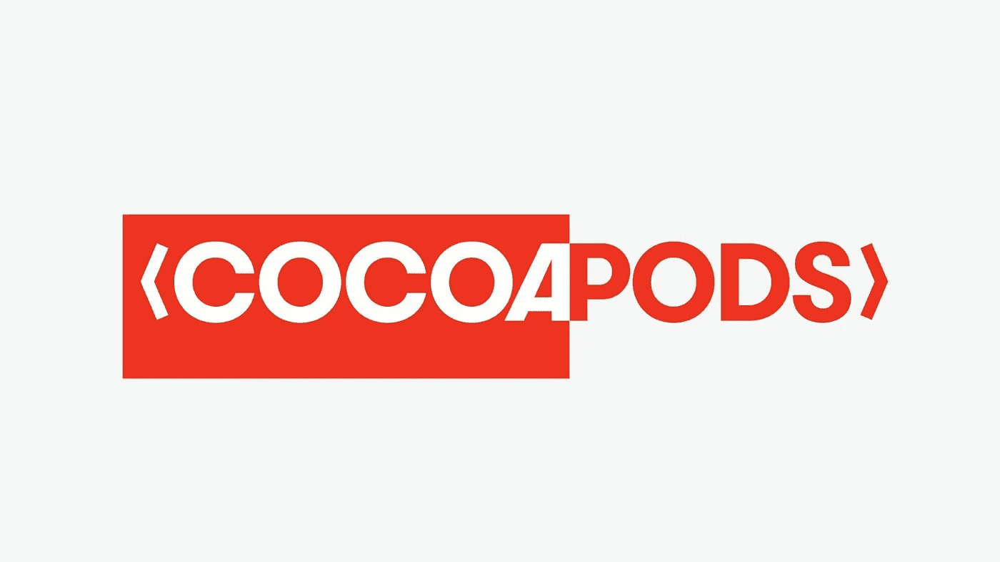
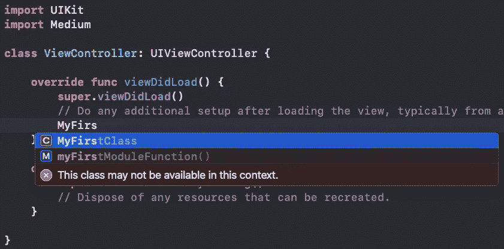
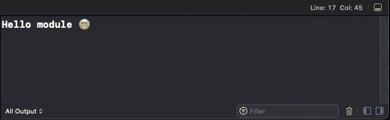
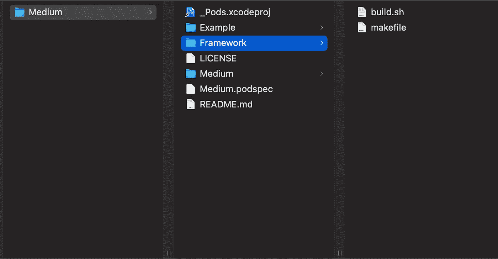
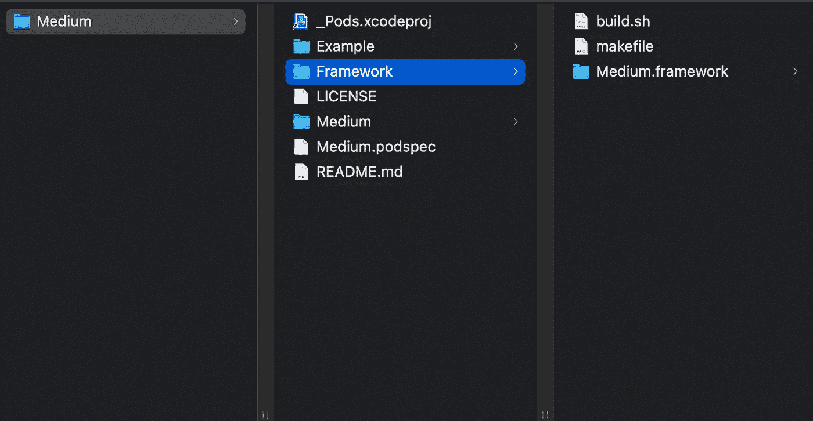

# 创建通用框架

> 原文：<https://levelup.gitconnected.com/create-universal-framework-49039224dea1>



# 开始前的简介

在最后一个故事中，我们使用 Cocoapods 创建了一个框架，如果你没有读过的话，这里有链接— [**使用 Cocoapods**](/create-modules-using-cocoapods-9483e5ccb00c) 创建模块。我们将继续使用同一个吊舱。

# 我们的目标是什么。

1.  在当前模块中创建一个类，并与示例项目集成。
2.  创建脚本来处理框架创建。
3.  更改`Podfile`以使用框架。

# 1.在当前模块中创建一个类，并与示例项目集成

## 1.1 在我们的模块中创建一个类

在本教程中，我将在`ReplaceMe1.swift`中创建这个类。

```
import UIKitclass MyFirstClass {

    static func myFirstModuleFunction() {
        print("Hello module 😁")
    }
}
```

如你所见，我创建了一个静态函数，原因是静态函数是由类本身调用的，而不是由实例调用的。这使得调用函数变得简单，而不必管理一个对象来为您完成这项工作。

## 1.2 与示例项目集成

*   导入`ViewController.swift`里面的模块。
*   在`viewDidLoad`函数上，我们可以调用我们的模块函数。



*   如上图所示，我们的类和函数不可用😢
*   原因如下:

> [Swift 为您代码中的实体提供了五种不同的访问级别。这些访问级别与定义实体的源文件相关，也与源文件所属的模块相关。](https://docs.swift.org/swift-book/LanguageGuide/AccessControl.html)

*   五个访问级别是:
    1。开放和公开
    2。内部
    3。文件私有
    4。私人的

为此，我们必须更新模块内部的类和函数，在`class`和`static`之前添加 public。

```
import UIKitpublic class MyFirstClass {

    public static func myFirstModuleFunction() {
        print("Hello module 😁")
    }
}
```

完成这些更改后，错误消失了，类和函数将可供您使用。如果您运行该示例，您将在控制台上看到消息。



# 2.创建脚本来处理框架创建。

在这一部分，我们将分为两步。第一个是创建一个文件来管理我们想要的框架类型，`Debug`或`Release`，第二个是构建框架，将两个文件保存到**框架文件夹**。

1.创建一个单独的文件，我称他为`makefile`，并添加以下代码:

```
BUILD_DIR = ${HOME}/Developer/Study/CocoaPods/Medium/Example
BUILD = [@sh](http://twitter.com/sh) build.sh ${BUILD_DIR}debug:
 [@echo](http://twitter.com/echo) Build Debug framework
 ${BUILD} Medium Debugrelease:
 [@echo](http://twitter.com/echo) Build Release framework
 ${BUILD} Medium Release
```

*   BUILD_DIR:保存项目的目录。
*   BUILD:负责保存我们将要创建的第二个文件的实例，并传递一些信息。
*   调试/发布:类型是否超出了我们想要的框架
*   @echo:负责将消息打印到终端

2.创建构建文件，我称他为`build.sh`，并添加以下代码:

```
# # Merge Script# # 1
# # Set bash script to exit immediately if any commands fail.
set -e# 2
# Setup some constants for use later on.
BUILD_DIR=$1
SCHEME=$2
CONFIGURATION=$3
WORKSPACE=$1/Medium.xcworkspace
FRAMEWORK_PATH=${HOME}/Developer/Study/CocoaPods/Medium/Framework
FRAMEWORK_NAME=$2.framework
DERIVED_DATA_PATH=$BUILD_DIR/DerivedData
IPHONEOS="generic/platform=iOS"
IPHONESIMULATOR="platform=iOS Simulator,name=iPhone 13"# # 3
# # If remnants from a previous build exist, delete them.
if [ -d "${FRAMEWORK_PATH}/${FRAMEWORK_NAME}" ]; then
    echo "There was a previous build and it will be deleted"
    rm -rf "${FRAMEWORK_PATH}/${FRAMEWORK_NAME}"
fi
if [ -d "${DERIVED_DATA_PATH}" ]; then
    echo "There was a previous delivered data and it will be deleted"
    rm -rf "${DERIVED_DATA_PATH}"
fi# # 4
# # Perform a pod install to be sure that everything is ok and build # # the framework for device and for simulator.
cd $BUILD_DIR
pod install
if [ $CONFIGURATION = "Release" ]; then
    xcodebuild -quiet -showBuildTimingSummary -workspace $WORKSPACE -configuration $CONFIGURATION -scheme $SCHEME -derivedDataPath $DERIVED_DATA_PATH -destination "${IPHONEOS}"
else
    xcodebuild -quiet -showBuildTimingSummary -workspace $WORKSPACE -configuration $CONFIGURATION -scheme $SCHEME -derivedDataPath $DERIVED_DATA_PATH -destination "${IPHONEOS}" -destination "${IPHONESIMULATOR}"
fi# # 5
# # Copy the device version of framework to Framework Path.
cp -r "${DERIVED_DATA_PATH}/Build/Products/${CONFIGURATION}-iphoneos/${SCHEME}/${FRAMEWORK_NAME}" "${FRAMEWORK_PATH}/${FRAMEWORK_NAME}"# # 6
# # If the configuration is Debug replace the framework executable 
# # within the framework with a new version created by merging the 
# # device and simulator frameworks’ executables with lipo, and 
# # merge the architecture between simulator and real device.
if [ $CONFIGURATION = "Debug" ]; then
    lipo -create -output "${FRAMEWORK_PATH}/${FRAMEWORK_NAME}/${SCHEME}" "${DERIVED_DATA_PATH}/Build/Products/${CONFIGURATION}-iphoneos/${SCHEME}/${FRAMEWORK_NAME}/${SCHEME}" "${DERIVED_DATA_PATH}/Build/Products/${CONFIGURATION}-iphonesimulator/${SCHEME}/${FRAMEWORK_NAME}/${SCHEME}"
    ditto -V "${DERIVED_DATA_PATH}/Build/Products/${CONFIGURATION}-iphonesimulator/${SCHEME}/${FRAMEWORK_NAME}/Modules" "${FRAMEWORK_PATH}/${FRAMEWORK_NAME}/Modules"
fi# # 7
# Delete the most recent Delivered Data Path.
if [ -d "${DERIVED_DATA_PATH}" ]; then
rm -rf "${DERIVED_DATA_PATH}"
fi# # 8
# Open folder
echo "Build Success"
open $FRAMEWORK_PATH
```

# 1:如果任何命令失败，设置 bash 脚本立即退出。
# 2:设置一些常量以备后用。
# 3:如果存在先前构建的残余，删除它们。
#4:执行 pod 安装以确保一切正常，并为设备和模拟器建立框架。
#5:将框架的设备版本复制到框架路径。
#6:如果配置为`Debug`将框架内的框架可执行文件替换为通过用 lipo 合并设备和模拟器框架的可执行文件而创建的新版本，并合并模拟器和真实设备之间的架构。
#7:删除最近发送的数据路径。
#8:打开文件夹。

创建这些文件后，你的框架文件夹应该看起来像下图。



*   现在，跳到终端。
*   转到框架文件夹，运行下面的命令`make debug`或`make release`
*   如果一切顺利，创建成功，应该打开框架文件夹，应该在终端`Build Success`出现这条消息，你的框架应该如下图所示。



# 3.更改`Podfile`以使用框架。

现在是时候改变 Podfile 以在`Release`模式下使用我们的框架了。

要在示例应用程序中做到这一点，我们只需在 Podfile 中添加/替换一行。

```
pod 'Medium/Debug', :path => '../', :testspecs => ['Tests'] -> remove
pod 'Medium', :path => '../' -> add
```

或者

```
# pod 'Medium/Debug', :path => '../', :testspecs => ['Tests']
  pod 'Medium', :path => '../'
```

我更喜欢第二种方法，因为允许我们在`Debud and Release`之间轻松转换。

要在主应用程序中实现这一点，我们必须通过创建 pod 的路径。

```
RELEASEpod 'Medium', :path => 'Pods Path'DEBUGpod 'Medium/Debug', :path => 'Pods Path', :testspecs => ['Tests']
```

您也可以在您的主应用程序中使用`Debug`目标，但是测试、检查集成和构建您的应用程序和模块需要更多的时间。

好的，还有一件事我们必须在这里讨论…如果你在一个有很大团队的公司工作，你需要使用其他团队的 pod，我们该怎么做？

```
pod 'Medium', :git => '[https://github.com/yourName/Y](https://github.com/yourName/Medium)ourPod', :branch => 'master'
```

使用`:branch => '...'`你可以选择任何你想要的分支，你也可以切换到`:tag => 1.0`来选择你创建到存储库中的发布标签。您还可以创建一个特定的存储库来存储您的所有框架！

# 就这些，谢谢！😁

参考资料:
[https://docs . swift . org/swift-book/language guide/access control . html](https://docs.swift.org/swift-book/LanguageGuide/AccessControl.html)T3【https://www.manpagez.com/man/1/xcodebuild/】T4T6[https://stackoverflow.com](https://stackoverflow.com)