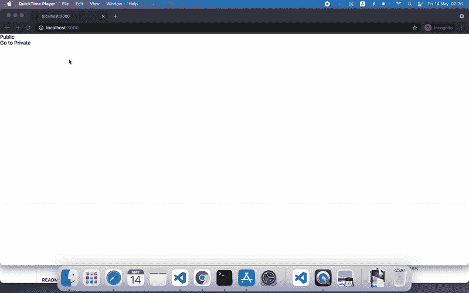
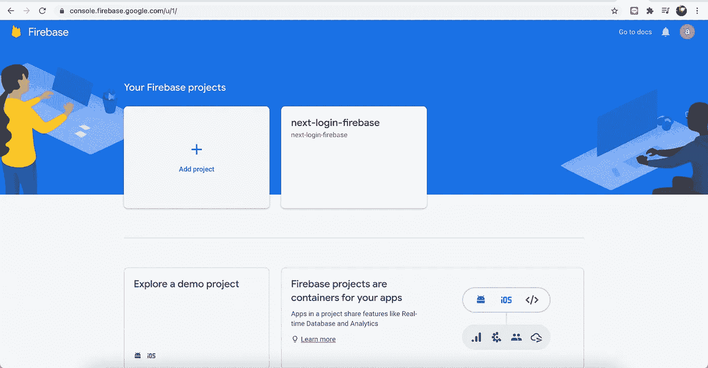
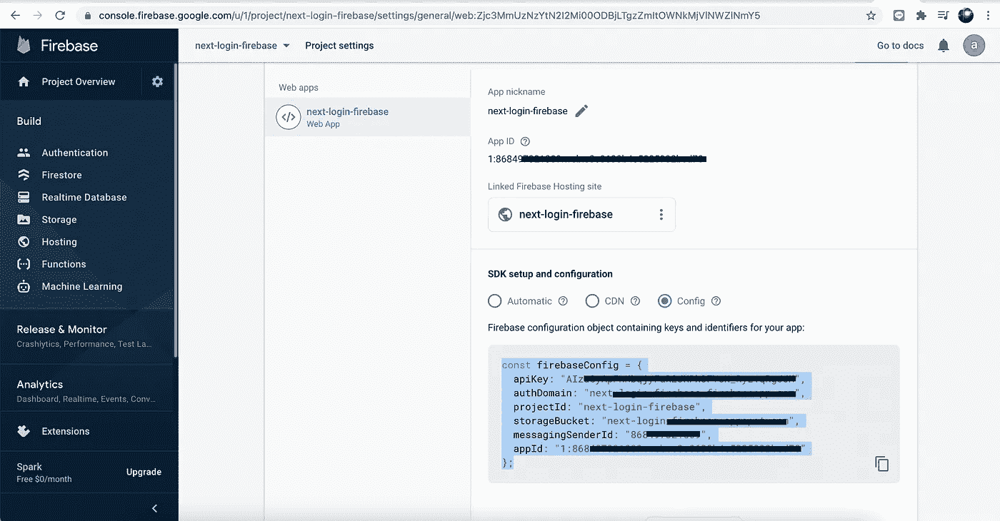
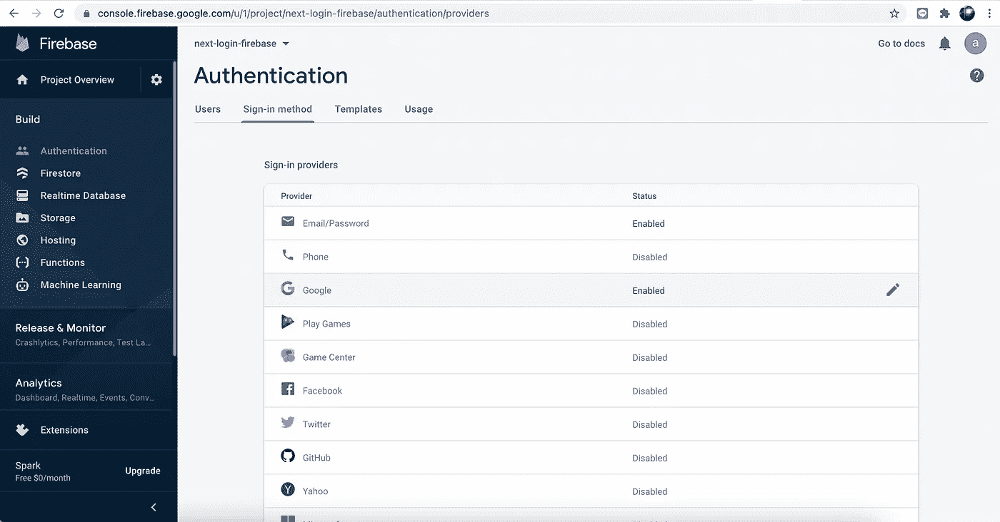

# 用 Firebase 和 Next.js 钩子在 5 分钟内创建用户登录

> 原文：<https://levelup.gitconnected.com/create-user-login-with-firebase-and-nextjs-hook-in-5-minutes-d8044f08403d>

在本文中，我们将使用 Next.js 和 React 钩子创建一个用户登录。我们将使用 Firebase 身份验证特性来保护我们的应用程序，该特性只允许授权用户访问个人页面



我们的结果

我们将在本文中关注的要点列表:

*   Next.js 设置
*   反应组分
*   反应钩
*   Firebase 认证
*   谷歌的第三方认证

***注意:*** *为此，我们必须在我们的系统中安装 Node.js 和 NPM*

## Next.js 设置

在创建 Next.js 项目时，我们需要安装`create-next-app`模块，它提供初始和默认设置。通过命令安装`create-next-app`:

```
npm install -g create-next-app
```

安装完成后，在您的本地目录中启动 Next.js 项目，我们需要通过以下命令创建该项目:

```
npx create-next-app next-login-firebase
```

安装完成后，转到我们创建的文件夹:

```
cd next-login-firebase
```

现在，我们已经完成了 Next.js 项目的设置。

下一步是安装 Firebase 包和 react-firebaseui。

```
npm i firebase react-firebaseui --save
```

## 用于身份验证的 Firebase 配置

Firebase 通过提供多重身份验证方法，如电子邮件/密码、谷歌、脸书、Twitter 等，帮助我们安全登录。

去[https://firebase.google.com/](https://firebase.google.com/)用你的凭证登录

成功登录 Firebase 控制台后，我们将通过单击“添加项目”按钮创建项目，填写表单项目名称，然后按照向导表单进行操作:



要将我们的 Firebase 项目集成到我们的 Next.js 项目中，请转到项目设置并找到“SDK 设置和配置”，选择 radio Config。我们将需要复制必须添加到我们的项目代码片段。



SDK 设置和配置

创建项目后，单击左侧部分的“身份验证”。我们将通过电子邮件/密码和谷歌启用提供商的身份验证:



启用登录方法

## 写代码

在根文件夹中，用下面的代码创建一个新文件“config.js ”,并保存它。

打开文件 pages/index.js，使用下面的代码进行编辑。

对于下一步，通过以下命令安装软件包“js-cookie ”:

```
npm i js-cookie
```

创建一个新文件' auth/userCookie.js '，编写以下代码:

接下来，我们必须创建' auth/useUser.js '来处理用户状态，编写以下代码:

创建一个名为“auth/withAuth.js”的文件来处理身份验证状态更改并重定向到签名页面:

创建一个名为“pages/private.js”的新私人页面，如果用户登录，该页面将呈现一个电子邮件和注销按钮。

最后一步，创建一个新文件‘pages/sign in . js’来渲染登录通道。这是一个使用“react-firebaseui”的示例。

我们的准则:

[](https://github.com/easywebsify/next-login-firebase) [## easywebsify/下一次登录-firebase

### 在 GitHub 上创建一个帐户，为 easywebsify/next-log in-firebase 的开发做出贡献。

github.com](https://github.com/easywebsify/next-login-firebase) 

*更多内容尽在*[*plain English . io*](http://plainenglish.io/)